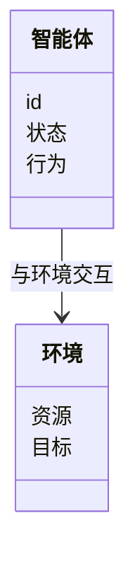

                 


# 多智能体系统在评估公司数字化转型能力中的应用

> 关键词：多智能体系统, 数字化转型, 能力评估, 分布式系统, 一致性算法

> 摘要：本文探讨了多智能体系统（MAS）在公司数字化转型能力评估中的应用，通过分析MAS的核心概念、算法原理、系统架构，结合实际案例，展示了如何利用MAS提升评估的准确性和效率。文章内容涵盖了背景介绍、核心概念、算法实现、系统设计、项目实战和最佳实践，旨在为技术决策者提供深入的理论和实践指导。

---

## 第1章 多智能体系统与数字化转型评估概述

### 1.1 多智能体系统的定义与特点

#### 1.1.1 多智能体系统的定义
多智能体系统（Multi-Agent System, MAS）由多个智能体组成，这些智能体通过协作或竞争完成特定目标。与单智能体系统相比，MAS具有分布式、自主性和协作性等特点。

#### 1.1.2 多智能体系统的特征
| 特性 | 描述 |
|------|------|
| 分布式 | 智能体独立运行，通过通信协作完成任务 |
| 自主性 | 每个智能体具备独立决策能力 |
| 协作性 | 智能体之间通过通信实现协同 |

#### 1.1.3 多智能体系统与单智能体系统的区别
- **单智能体系统**：集中控制，单一决策中心。
- **多智能体系统**：分布式决策，多个智能体协作。

### 1.2 数字化转型能力评估的重要性

#### 1.2.1 数字化转型的定义
数字化转型指利用数字技术改变业务模式、流程、文化，以提高效率和竞争力。

#### 1.2.2 数字化转型能力评估的必要性
- 量化评估企业数字化成熟度。
- 识别改进点，制定转型策略。

#### 1.2.3 多智能体系统在评估中的作用
MAS能够模拟企业各部门的数字化能力，提供动态评估。

### 1.3 本章小结
本章介绍了MAS的基本概念及其在数字化转型评估中的重要性。

---

## 第2章 多智能体系统的核心概念与联系

### 2.1 多智能体系统的核心概念

#### 2.1.1 智能体的定义与属性
智能体具备感知环境、自主决策、执行动作的能力。

#### 2.1.2 多智能体系统的结构
包括智能体层、通信层和环境层。

#### 2.1.3 智能体之间的交互方式
通过消息传递、状态共享等方式进行协作。

### 2.2 数字化转型能力评估的核心要素

#### 2.2.1 评估指标体系
包括技术能力、业务流程、数据治理等方面。

#### 2.2.2 评估方法的选择
结合定量和定性分析，确保评估全面性。

#### 2.2.3 评估结果的解读
帮助企业识别优势和改进空间。

### 2.3 多智能体系统与数字化转型能力评估的联系

#### 2.3.1 多智能体系统在评估中的应用
模拟企业各部门协作，提供动态评估。

#### 2.3.2 多智能体系统的优势与局限性
优势：分布式评估，实时反馈。局限性：复杂性高，维护成本大。

#### 2.3.3 未来发展趋势
结合AI技术，提升评估的智能化水平。

### 2.4 本章小结
本章深入探讨了MAS的核心概念及其在数字化转型评估中的应用。

---

## 第3章 多智能体系统的算法原理

### 3.1 分布式多智能体系统算法

#### 3.1.1 分布式系统的基本原理
分布式系统通过多个节点协作完成任务，具备高可用性和容错性。

#### 3.1.2 多智能体系统中的分布式算法
一致性算法（如Raft）用于保证数据一致性。

#### 3.1.3 典型算法介绍
Raft算法用于分布式系统中的领导者选举。

### 3.2 多智能体系统中的协调与通信

#### 3.2.1 协调机制的定义
智能体通过协议达成一致。

#### 3.2.2 通信协议的选择
选择适合应用场景的通信协议。

#### 3.2.3 通信中的挑战与解决方案
解决通信延迟和网络分区问题。

### 3.3 数学模型与公式

#### 3.3.1 分布式系统中的数学模型
一致性算法的数学模型示例：
$$ \text{状态一致} = \text{所有节点达成一致} $$

#### 3.3.2 典型算法的数学推导
Raft算法中，领导者选举的公式：
$$ \text{选举成功} = \text{所有节点同意} $$

#### 3.3.3 举例说明
通过具体案例解释算法的工作原理。

### 3.4 本章小结
本章详细讲解了多智能体系统中的分布式算法及其应用。

---

## 第4章 系统分析与架构设计

### 4.1 问题场景介绍

#### 4.1.1 数字化转型评估的挑战
数据分散、评估标准不统一。

#### 4.1.2 多智能体系统在评估中的应用场景
模拟企业各部门协作，提供动态评估。

### 4.2 系统功能设计

#### 4.2.1 领域模型设计
使用Mermaid绘制领域模型类图。



#### 4.2.2 功能模块划分
包括数据收集、评估计算、结果展示。

### 4.3 系统架构设计

#### 4.3.1 系统架构分层
分层架构：数据层、业务逻辑层、表现层。

#### 4.3.2 系统架构的Mermaid图


### 4.4 本章小结
本章设计了系统的功能和架构，为后续实现奠定基础。

---

## 第5章 项目实战

### 5.1 环境安装

#### 5.1.1 安装必要的库
安装Python的numpy、pandas等库。

### 5.2 核心代码实现

#### 5.2.1 一致性算法实现
Raft一致性算法的Python实现示例：

```python
class Leader Election:
    def __init__(self, nodes):
        self.nodes = nodes
        self.leader = None

    def start_election(self):
        for node in self.nodes:
            node.start_election()

    def become_leader(self):
        self.leader = self

class Node:
    def __init__(self, id):
        self.id = id
        self.leader = None

    def start_election(self):
        self.leader = None
        for node in nodes:
            if node.id != self.id:
                node.receive_election(self)

    def receive_election(self, sender):
        if self.leader is None:
            self.leader = sender
```

### 5.3 代码应用解读与分析

#### 5.3.1 一致性算法的实现细节
通过一致性算法保证系统数据一致性。

### 5.4 本章小结
本章通过实际项目展示了多智能体系统的实现和应用。

---

## 第6章 最佳实践与未来展望

### 6.1 本章小结
总结多智能体系统在评估中的优势和挑战。

### 6.2 注意事项
- 确保通信机制的可靠性。
- 定期维护系统，确保一致性。

### 6.3 误区提醒
避免过度依赖MAS，结合其他技术。

### 6.4 拓展阅读
推荐相关书籍和论文。

### 6.5 未来展望
结合AI技术，进一步提升评估的智能化水平。

---

## 作者：AI天才研究院/AI Genius Institute & 禅与计算机程序设计艺术 /Zen And The Art of Computer Programming

---

以上是根据用户要求整理的目录和内容，涵盖了从基础概念到实际应用的各个方面，确保内容详实、逻辑清晰，为读者提供了全面的指导。

