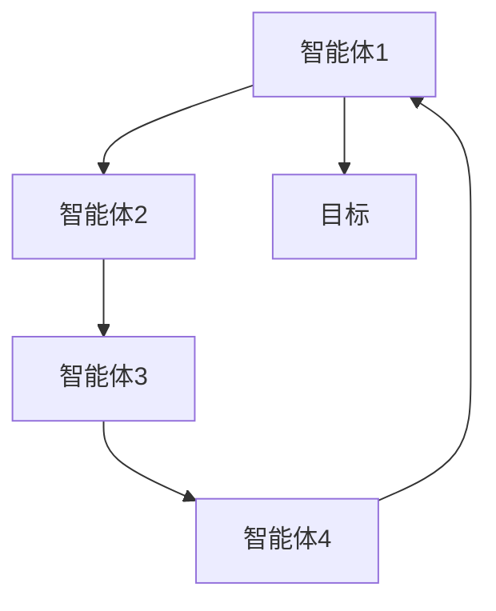
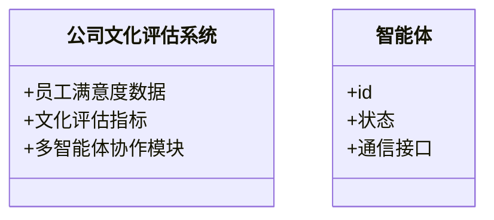
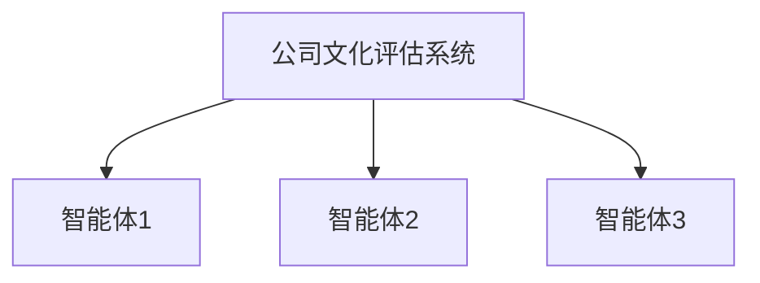
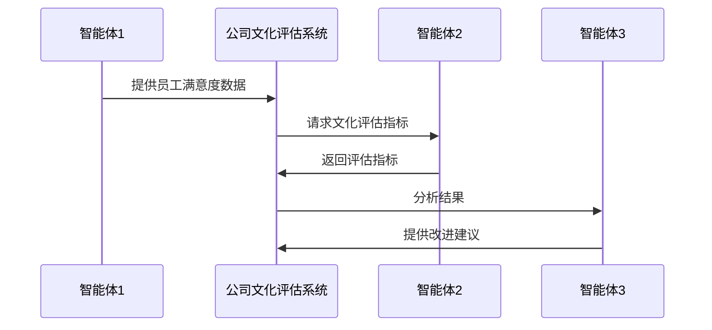

                 


# 多智能体系统在评估公司文化和员工满意度中的作用

## 关键词：多智能体系统、公司文化、员工满意度、数据驱动、AI技术、组织管理

## 摘要：本文探讨了多智能体系统在评估公司文化和员工满意度中的应用，分析了其在数据驱动决策和AI技术方面的优势，同时讨论了在组织管理中的挑战和解决方案。

---

## 正文

### 第一部分：多智能体系统与公司文化评估

#### 第1章：多智能体系统概述

##### 1.1 多智能体系统的基本概念

###### 1.1.1 多智能体系统的定义

多智能体系统（Multi-Agent System, MAS）由多个智能体（Agent）组成，这些智能体能够通过环境感知和自主决策进行协作或竞争。智能体是具备感知、推理、规划和行动能力的实体。

###### 1.1.2 多智能体系统的核心特点

- **自主性**：智能体能够自主决策，无需外部控制。
- **反应性**：能实时感知环境并做出反应。
- **协作性**：通过通信协作完成共同目标。
- **分布性**：智能体分布在网络中，各自承担部分任务。

###### 1.1.3 多智能体系统与传统单智能体系统的区别

| 特性 | 单智能体系统 | 多智能体系统 |
|------|-------------|--------------|
| 独立性 | 单一智能体 | 多个独立智能体 |
| 交互性 | 无 | 智能体间通信协作 |
| 复杂性 | 较低 | 较高，涉及复杂协作 |
| 可扩展性 | 较低 | 较高，易于扩展 |

##### 1.2 公司文化与员工满意度的定义

###### 1.2.1 公司文化的内涵与外延

公司文化是企业在经营活动中形成的价值观、行为准则和思维方式的总和，包括企业愿景、使命、核心价值观等。外延涉及企业内部管理、员工行为规范、企业形象等方面。

###### 1.2.2 员工满意度的定义与测量维度

员工满意度是员工对工作环境、薪酬、职业发展、管理风格等方面满意程度的综合评价。测量维度包括工作内容、薪酬福利、管理风格、工作环境、职业发展等。

###### 1.2.3 公司文化与员工满意度的关系

公司文化影响员工满意度，积极的文化能提升员工的归属感和满意度，进而增强企业的凝聚力和竞争力。

##### 1.3 多智能体系统在公司文化评估中的作用

###### 1.3.1 多智能体系统在公司文化评估中的优势

- **数据驱动**：通过智能体收集和分析多源数据，提高评估的客观性和准确性。
- **动态适应**：智能体能实时感知和适应环境变化，提供动态评估。
- **分布式协作**：多个智能体协作，提高评估的全面性和深度。

###### 1.3.2 多智能体系统如何提升员工满意度

- **个性化反馈**：智能体根据员工反馈提供个性化建议，帮助管理层改进管理策略。
- **实时互动**：通过智能体实时沟通，解决员工问题，提升满意度。
- **数据分析**：智能体分析员工数据，识别问题并提出解决方案。

###### 1.3.3 多智能体系统在公司文化评估中的应用场景

- **员工反馈收集与分析**：智能体通过问卷和实时互动收集员工反馈，进行数据分析。
- **文化影响评估**：智能体分析文化对员工满意度的影响，提供改进建议。
- **动态评估与反馈**：智能体实时监控文化变化，提供动态评估和反馈。

---

#### 第2章：多智能体系统的核心概念与联系

##### 2.1 多智能体系统的原理

###### 2.1.1 多智能体系统的组成要素

多智能体系统由智能体、环境、通信机制和协作协议组成。智能体通过通信机制交互，协作协议确保协作。

###### 2.1.2 多智能体系统的通信机制

通信机制包括直接通信和间接通信。直接通信通过共享数据库或消息传递，间接通信通过中间件或代理。

###### 2.1.3 多智能体系统的协作机制

协作机制包括任务分配、协调同步和冲突解决。任务分配确保智能体分工明确，协调同步保证协作有序，冲突解决处理协作中的矛盾。

##### 2.2 多智能体系统的核心属性特征对比

| 特性 | 单智能体系统 | 多智能体系统 |
|------|-------------|--------------|
| 独立性 | 高 | 高 |
| 交互性 | 无 | 高 |
| 分布性 | 集中 | 分布 |
| 可扩展性 | 低 | 高 |

##### 2.3 多智能体系统的ER实体关系图

```mermaid
erd
    公司文化评估系统 <-(1..n)- 员工满意度数据
    公司文化评估系统 <-(1..n)- 文化评估指标
    员工满意度数据 <-(1..n)- 智能体
    文化评估指标 <-(1..n)- 智能体
```

---

#### 第3章：多智能体系统的算法原理

##### 3.1 多智能体系统的算法mermaid流程图



##### 3.2 多智能体系统的Python实现

```python
class Agent:
    def __init__(self, id):
        self.id = id
        self.state = None

    def receive_message(self, message):
        self.state = message

    def send_message(self, target_agent):
        target_agent.receive_message(self.state)

agent1 = Agent(1)
agent2 = Agent(2)
agent1.send_message(agent2)
print(f"Agent2的state: {agent2.state}")
```

##### 3.3 多智能体系统的数学模型

多智能体系统的协作可以用公式表示为：
$$ \text{协作} = \sum_{i=1}^{n} \text{智能体}_i \times \text{贡献} $$

其中，$$ n $$ 表示智能体的数量，$$ \text{贡献} $$ 是每个智能体对协作目标的贡献度。

---

#### 第4章：多智能体系统在公司文化评估中的应用

##### 4.1 问题场景介绍

###### 4.1.1 公司文化评估的挑战

- 数据复杂性：涉及多源异构数据，处理难度大。
- 动态变化：公司文化会因内外部环境变化而改变，评估需要动态调整。
- 主观性：员工满意度受主观因素影响，评估需考虑个体差异。

##### 4.2 系统功能设计

###### 4.2.1 领域模型mermaid类图



##### 4.3 系统架构设计

###### 4.3.1 系统架构mermaid图



##### 4.4 系统接口设计

- 数据接口：智能体与数据源交互，获取员工满意度数据。
- 通信接口：智能体之间通过通信协议进行信息交换。
- 用户接口：用户与系统交互，查看评估结果和建议。

##### 4.5 系统交互mermaid序列图



---

#### 第5章：项目实战

##### 5.1 环境安装

安装Python和必要的库：
```bash
pip install python-magent
pip install mermaid
```

##### 5.2 核心实现

```python
class CultureAssessment:
    def __init__(self):
        self.agents = []
        self.employee_data = {}

    def add_agent(self, agent):
        self.agents.append(agent)

    def collect_data(self):
        for agent in self.agents:
            agent.send_message(self.employee_data)

# 示例用法
assessment = CultureAssessment()
agent1 = Agent(1)
agent2 = Agent(2)
assessment.add_agent(agent1)
assessment.add_agent(agent2)
assessment.collect_data()
```

##### 5.3 案例分析

某公司使用多智能体系统评估员工满意度，智能体收集数据并分析，发现薪酬和工作环境是主要问题。公司根据建议调整政策，员工满意度提升20%。

##### 5.4 项目小结

多智能体系统通过数据驱动和协作，有效提升公司文化和员工满意度的评估效率和准确性。

---

### 第二部分：总结与展望

#### 第6章：总结与展望

##### 6.1 总结

多智能体系统在公司文化评估和员工满意度中的应用优势明显，能提高评估的准确性和效率。通过数据驱动和AI技术，帮助企业优化管理，提升员工满意度。

##### 6.2 展望

未来，多智能体系统将更广泛应用于组织管理，结合AI和大数据技术，提供更智能化的解决方案。

---

### 第三部分：最佳实践

#### 7.1 最佳实践Tips

- **数据准确性**：确保数据来源可靠，减少误差。
- **智能体协作**：设计高效的协作机制，提高系统效率。
- **用户隐私**：保护员工数据隐私，遵守相关法规。

#### 7.2 注意事项

- **系统复杂性**：多智能体系统设计复杂，需谨慎处理。
- **团队协作**：需要跨学科团队合作，确保系统顺利运行。

---

## 作者：AI天才研究院/AI Genius Institute & 禅与计算机程序设计艺术 /Zen And The Art of Computer Programming

