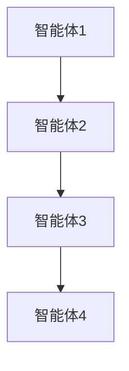
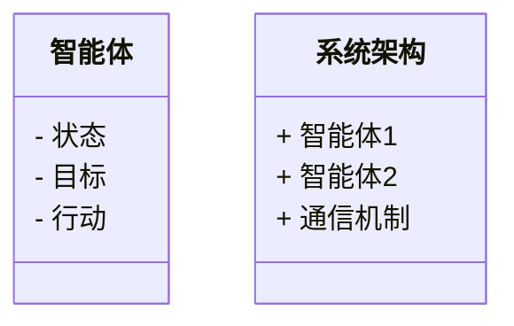

                 


# 多智能体系统在评估公司治理和ESG因素中的应用

## 关键词：多智能体系统，公司治理，ESG评估，分布式计算，智能体协作

## 摘要：本文探讨多智能体系统在公司治理和ESG评估中的应用，分析其背景、核心概念、算法原理、系统架构及实际案例，旨在为技术与管理领域提供创新思路。

---

## 第一部分：背景介绍

### 第1章：多智能体系统与企业治理概述

#### 1.1 多智能体系统的定义与特点

- **1.1.1 多智能体系统的定义**  
  多智能体系统（Multi-Agent System, MAS）由多个智能体（Agent）组成，这些智能体能够自主决策、协作完成任务。智能体具备感知、推理、规划和行动的能力，能够适应动态环境。

- **1.1.2 多智能体系统的五大核心特点**  
  1. **自主性**：智能体自主决策，无需外部干预。  
  2. **反应性**：实时感知环境变化并调整行为。  
  3. **协作性**：通过通信协作完成共同目标。  
  4. **分布式性**：智能体分布于不同位置，任务分解。  
  5. **社会性**：智能体之间存在社会关系，需解决冲突。

- **1.1.3 多智能体系统与传统单智能体系统的对比**  
  | 特性             | 单智能体系统           | 多智能体系统           |
  |------------------|-----------------------|-----------------------|
  | 决策中心化       | 单一中心决策           | 分布式决策             |
  | 协作性           | 无                     | 强                     |
  | 效率             | 高                    | 较低，依赖协作           |

#### 1.2 企业治理中的多智能体系统应用背景

- **1.2.1 企业治理的基本概念**  
  企业治理涉及股东、董事会、高管和利益相关者之间的关系管理，确保公司长期目标的实现。

- **1.2.2 多智能体系统在企业治理中的优势**  
  1. 提供分布式决策支持，避免权力集中。  
  2. 促进部门间协作，提升整体效率。  
  3. 实现实时监控，优化资源配置。

- **1.2.3 当前企业治理中的挑战与机遇**  
  - 挑战：信息孤岛、决策延迟、利益冲突。  
  - 机遇：通过MAS实现智能化、分布式治理。

---

## 第二部分：核心概念与联系

### 第2章：多智能体系统的核心概念与联系

#### 2.1 多智能体系统的核心原理

- **智能体的属性**  
  每个智能体具备以下属性：  
  - **标识**：唯一标识符。  
  - **目标**：明确的目标函数。  
  - **知识库**：存储领域知识。  
  - **行动能力**：执行操作的能力。

- **智能体之间的通信机制**  
  采用基于消息传递的通信方式，定义了通信协议和数据结构，确保信息传递的准确性和实时性。

- **智能体的协作机制**  
  通过协商算法分配任务，智能体之间达成共识，确保协作高效。

#### 2.2 智能体的属性对比分析

| 智能体属性       | 描述                         |
|------------------|------------------------------|
| 标识             | 唯一标识符                   |
| 目标             | 明确的目标函数               |
| 知识库           | 专业知识库                   |
| 行动能力         | 执行特定操作的能力           |

#### 2.3 用Mermaid图展示多智能体系统的核心概念



---

## 第三部分：算法原理

### 第3章：多智能体系统的算法原理

#### 3.1 分布式计算与协商算法

- **一致性算法**  
  一致性算法确保所有智能体状态一致，常用算法包括Paxos和Raft。  
  一致性模型：  
  $$ \text{状态一致} = \bigcap_{i=1}^{n} \text{智能体i的状态} $$

- **协商算法**  
  协商算法用于任务分配，常用算法如分布式协商（Distributed Negotiation）。  
  协商过程：  
  1. 智能体提出请求。  
  2. 其他智能体反馈意见。  
  3. 达成共识，分配任务。

#### 3.2 协商算法的实现步骤

- **步骤1：初始化**  
  每个智能体设定初始状态。  
  ```python
  def initialize():
      for agent in agents:
          agent.state = initial_state
  ```

- **步骤2：协商请求**  
  智能体发送协商请求。  
  ```python
  def negotiate_request(agent):
      for neighbor in neighbors:
          send_request(agent, neighbor)
  ```

- **步骤3：达成共识**  
  所有智能体达成一致，分配任务。  
  ```python
  def reach_consensus(agents):
      while not all_agents_agree(agents):
          for agent in agents:
              update_state(agent)
  ```

#### 3.3 用Mermaid图展示协商过程


---

## 第四部分：系统分析与架构设计

### 第4章：系统架构与设计

#### 4.1 系统应用场景

- **场景1：实时监控与反馈**  
  智能体实时收集数据，反馈给相关部门。  
  ```python
  def monitor_system():
      while True:
          data = collect_data()
          analyze_data(data)
  ```

- **场景2：决策支持**  
  智能体协作生成决策建议。  
  ```python
  def generate_recommendations():
      for agent in decision_agents:
          rec = agent.recommend()
          add_to_recommendations(rec)
  ```

#### 4.2 系统功能设计

- **功能1：数据采集与处理**  
  智能体采集环境数据，进行初步处理。  
  ```python
  class DataAgent:
      def collect_data(self):
          # 采集数据
      def process_data(self, data):
          # 处理数据
  ```

- **功能2：决策与反馈**  
  智能体协作制定决策，提供反馈。  
  ```python
  class DecisionAgent:
      def make_decision(self, data):
          # 制定决策
      def provide_feedback(self, decision):
          # 提供反馈
  ```

#### 4.3 用Mermaid图展示系统架构



---

## 第五部分：项目实战

### 第5章：项目实现与案例分析

#### 5.1 环境安装与配置

- **安装依赖**  
  ```bash
  pip install multiagent
  ```

- **运行环境**  
  ```bash
  python3 app.py
  ```

#### 5.2 核心代码实现

- **智能体类实现**  
  ```python
  class Agent:
      def __init__(self, name):
          self.name = name
          self.state = None
  ```

- **通信机制实现**  
  ```python
  class Communicator:
      def send(self, sender, receiver, message):
          # 实现通信逻辑
  ```

#### 5.3 案例分析与结果解读

- **案例1：公司治理中的MAS应用**  
  某公司采用MAS优化治理结构，通过智能体实时监控各部门数据，提升决策效率。

---

## 第六部分：最佳实践

### 第6章：总结与展望

#### 6.1 总结

- **核心总结**  
  多智能体系统在公司治理和ESG评估中的应用，通过智能化、分布式的方式，提升治理效率和透明度。

#### 6.2 最佳实践

- **建议**  
  1. 在实施MAS前，明确目标和需求。  
  2. 选择合适的MAS框架，确保系统的可扩展性。  
  3. 定期维护和优化系统，确保其高效运行。

#### 6.3 未来展望

- **技术发展**  
  随着AI和分布式计算的进步，MAS在企业治理中的应用将更加广泛，智能化程度更高。

---

## 结语

通过本文的详细分析，多智能体系统在公司治理和ESG评估中的应用展现出巨大潜力，为现代企业治理提供了创新思路。

---

## 作者：AI天才研究院 & 禅与计算机程序设计艺术

---

**关键词**：多智能体系统，公司治理，ESG评估，分布式计算，智能体协作

