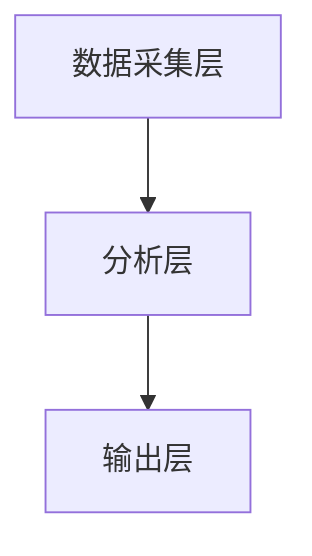
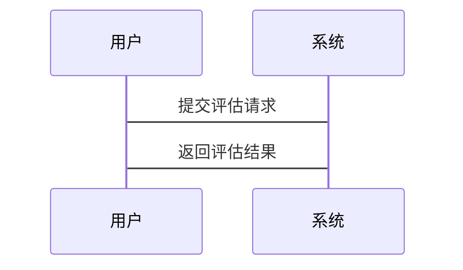

                 


# 多智能体系统在评估公司知识产权价值中的应用

> 关键词：多智能体系统，知识产权评估，人工智能，系统架构，算法原理

> 摘要：随着知识产权在现代商业中的重要性日益增加，评估其价值变得越来越复杂。本文探讨了多智能体系统（MAS）在知识产权价值评估中的应用，分析了MAS的核心概念、算法原理、系统架构，并通过实际案例展示了其在知识产权评估中的优势和挑战。

---

# 第1章 多智能体系统与知识产权评估概述

## 1.1 多智能体系统的定义与特点

### 1.1.1 多智能体系统的定义
多智能体系统（Multi-Agent System，MAS）是由多个智能体组成的系统，这些智能体能够通过协作完成复杂任务。智能体具有自主性、反应性和社会性等特点。

### 1.1.2 多智能体系统的核心特点
1. **自主性**：智能体能够独立决策。
2. **反应性**：智能体能感知环境并做出反应。
3. **协作性**：智能体之间可以协作完成任务。
4. **分布式性**：智能体分布在不同的位置，通过通信完成任务。

### 1.1.3 多智能体系统在知识产权评估中的应用潜力
多智能体系统可以用于分析专利、商标等知识产权的价值，通过分布式计算和协作提高评估的准确性和效率。

## 1.2 知识产权评估的背景与挑战

### 1.2.1 知识产权的基本概念
知识产权包括专利、商标、版权等，是企业的重要资产。评估其价值对于企业决策至关重要。

### 1.2.2 知识产权评估的复杂性
知识产权的价值受到多种因素影响，如技术先进性、市场竞争力、法律风险等，评估过程复杂且需要多学科知识。

### 1.2.3 知识产权评估的常见方法
1. **收益法**：基于未来收益预测价值。
2. **市场法**：参考市场交易价格。
3. **成本法**：基于开发成本评估价值。

## 1.3 多智能体系统在知识产权评估中的作用

### 1.3.1 多智能体系统的优势
1. **分布式计算**：能够处理大规模数据。
2. **协作能力**：多个智能体可以分工协作，提高评估效率。
3. **实时性**：能够实时更新评估结果。

### 1.3.2 多智能体系统在知识产权评估中的应用潜力
通过MAS，可以实现知识产权数据的实时分析、多维度评估和动态调整。

### 1.3.3 本章小结
本章介绍了MAS的基本概念、特点以及在知识产权评估中的潜力，为后续内容奠定了基础。

---

# 第2章 多智能体系统的核心概念与联系

## 2.1 多智能体系统的原理

### 2.1.1 智能体的定义与结构
智能体是一个能够感知环境并采取行动的实体，通常包括感知、决策和行动三个部分。

### 2.1.2 多智能体系统的通信机制
智能体之间通过消息传递进行通信，通信机制包括发布-订阅模型和点对点模型。

### 2.1.3 多智能体系统的协作与协调
协作是指智能体之间为了共同目标而合作，协调是指智能体在协作过程中保持一致。

## 2.2 知识产权评估中的多智能体系统模型

### 2.2.1 知识产权评估的实体关系
通过ER图可以清晰展示知识产权评估中的实体关系，如专利、商标、评估指标等。

### 2.2.2 多智能体系统与知识产权评估的结合
通过MAS，可以将知识产权评估过程分解为多个子任务，由不同的智能体分别完成。

### 2.2.3 知识产权评估中的多智能体系统架构
MAS架构包括感知层、协作层和决策层，能够实现知识产权数据的高效处理和评估。

## 2.3 多智能体系统与知识产权评估的联系

### 2.3.1 多智能体系统在知识产权评估中的优势
1. **分布式计算能力**：能够处理海量数据。
2. **协作能力**：能够从多个角度评估知识产权价值。
3. **实时性**：能够快速响应变化。

### 2.3.2 多智能体系统与传统评估方法的对比
MAS在知识产权评估中的优势在于其分布式计算和协作能力，能够提高评估的准确性和效率。

### 2.3.3 本章小结
本章详细讲解了多智能体系统的核心概念及其在知识产权评估中的应用，为后续章节奠定了理论基础。

---

# 第3章 多智能体系统在知识产权评估中的算法原理

## 3.1 多智能体系统的核心算法

### 3.1.1 分布式计算算法
分布式计算算法通过将任务分解到多个节点完成，能够提高计算效率。

### 3.1.2 博弈论算法
博弈论算法用于模拟智能体之间的竞争与合作，能够帮助评估知识产权的市场价值。

### 3.1.3 协作算法
协作算法用于智能体之间的协作，能够提高评估结果的准确性。

## 3.2 知识产权评估中的算法实现

### 3.2.1 知识产权价值评估的数学模型
$$ V = \sum_{i=1}^{n} w_i x_i $$
其中，\( V \) 是知识产权价值，\( w_i \) 是权重，\( x_i \) 是评估指标。

### 3.2.2 算法的实现步骤
1. **数据采集**：收集知识产权相关数据。
2. **特征提取**：提取关键评估指标。
3. **模型训练**：训练评估模型。
4. **结果输出**：输出评估结果。

### 3.2.3 算法的优化与改进
通过引入机器学习算法，可以进一步提高评估的准确性和效率。

## 3.3 算法的数学模型与公式

### 3.3.1 知识产权价值的计算公式
$$ V = \sum_{i=1}^{n} w_i x_i $$
其中，\( w_i \) 是评估指标 \( x_i \) 的权重，\( n \) 是评估指标的数量。

### 3.3.2 博弈论模型的数学表达
$$ U_i = \sum_{j=1}^{m} p_j x_j $$
其中，\( U_i \) 是智能体 \( i \) 的效用函数，\( p_j \) 是概率，\( x_j \) 是决策变量。

---

# 第4章 系统分析与架构设计

## 4.1 问题场景介绍

### 4.1.1 知识产权评估的复杂性
知识产权评估需要考虑多种因素，如技术、法律、市场等。

### 4.1.2 系统的目标与需求
系统的目标是提供准确的知识产权评估结果，需求包括数据采集、分析、输出等。

## 4.2 系统功能设计

### 4.2.1 领域模型设计
通过领域模型可以清晰展示知识产权评估的核心要素和关系。

### 4.2.2 系统架构设计
系统架构包括数据采集层、分析层和输出层，各层之间通过接口进行通信。

## 4.3 系统架构设计

### 4.3.1 系统架构图


### 4.3.2 系统接口设计
系统接口包括数据输入接口、模型调用接口和结果输出接口。

## 4.4 系统交互设计

### 4.4.1 系统交互流程
1. **数据采集**：通过接口采集知识产权数据。
2. **模型调用**：调用评估模型进行分析。
3. **结果输出**：输出评估结果。

### 4.4.2 系统交互图


---

# 第5章 项目实战

## 5.1 环境安装

### 5.1.1 系统要求
需要安装Python、Java等编程语言，以及相关的开发工具。

### 5.1.2 环境配置
安装必要的库和框架，如TensorFlow、PyTorch等。

## 5.2 系统核心实现

### 5.2.1 核心代码实现
```python
def assess_value(data):
    # 数据预处理
    processed_data = preprocess(data)
    # 模型调用
    value = model.predict(processed_data)
    return value
```

### 5.2.2 代码解读与分析
代码实现包括数据预处理、模型调用和结果输出三个部分。

## 5.3 案例分析

### 5.3.1 案例背景
以某公司的一项专利为例，分析其市场价值。

### 5.3.2 案例分析过程
1. **数据采集**：收集专利的相关信息。
2. **模型调用**：调用评估模型进行分析。
3. **结果输出**：输出评估结果。

## 5.4 项目小结

### 5.4.1 项目总结
通过MAS实现知识产权评估，能够提高评估的准确性和效率。

### 5.4.2 项目经验
在实际应用中，需要考虑数据质量和模型的优化。

---

# 第6章 案例分析与最佳实践

## 6.1 案例分析

### 6.1.1 案例背景
以某公司的商标评估为例，分析MAS的应用效果。

### 6.1.2 案例分析过程
1. **数据采集**：收集商标的相关信息。
2. **模型调用**：调用评估模型进行分析。
3. **结果输出**：输出评估结果。

## 6.2 最佳实践

### 6.2.1 系统设计建议
1. **模块化设计**：提高系统的可维护性。
2. **容错设计**：确保系统的稳定性。

### 6.2.2 模型优化建议
1. **数据清洗**：提高数据质量。
2. **模型调优**：提高评估的准确性。

### 6.2.3 注意事项
在实际应用中，需要注意数据隐私和法律风险。

## 6.3 本章小结
本章通过实际案例分析了MAS在知识产权评估中的应用效果，并总结了最佳实践。

---

# 第7章 总结与展望

## 7.1 总结

### 7.1.1 核心内容回顾
本文详细介绍了MAS在知识产权评估中的应用，包括核心概念、算法原理和系统设计。

### 7.1.2 主要结论
通过MAS实现知识产权评估，能够提高评估的准确性和效率。

## 7.2 展望

### 7.2.1 未来研究方向
1. **算法优化**：进一步提高评估的准确性。
2. **系统扩展**：扩展系统功能，支持更多类型的知识产权评估。

### 7.2.2 技术发展趋势
随着人工智能技术的发展，MAS在知识产权评估中的应用将更加广泛。

## 7.3 本章小结
本章总结了全文，并展望了未来的研究方向和技术发展趋势。

---

# 作者：AI天才研究院 & 禅与计算机程序设计艺术

---

这篇文章详细探讨了多智能体系统在知识产权评估中的应用，通过理论分析和实际案例，展示了MAS在知识产权评估中的优势和潜力。希望本文能为相关领域的研究和实践提供有价值的参考。

