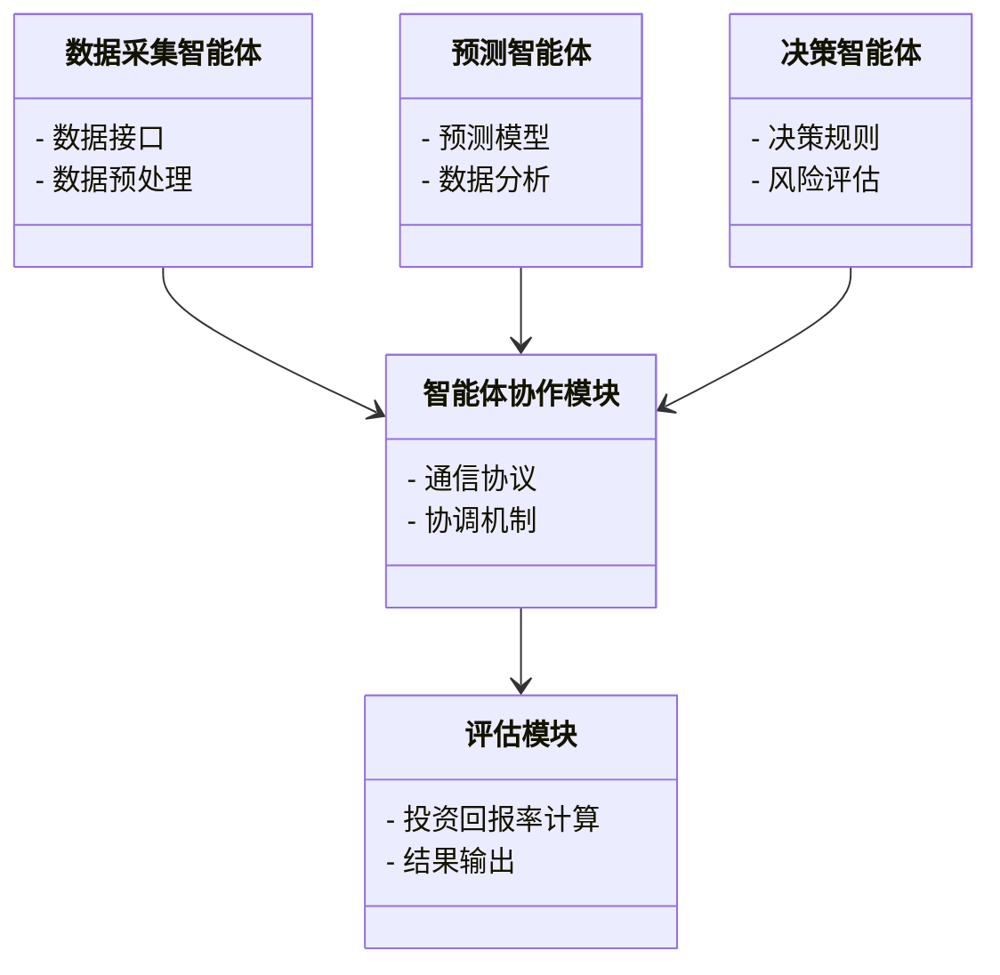

                 


# 多智能体系统在评估公司研发投资回报率中的应用

## 关键词：多智能体系统、研发投资回报率、投资评估、智能体协作、算法模型

## 摘要：  
本文探讨了多智能体系统（MAS）在公司研发投资回报率评估中的应用。通过分析多智能体系统的协作机制、决策算法和数学模型，提出了一种基于MAS的分布式评估方法，能够更高效、准确地评估研发项目的投资回报率。文章详细介绍了MAS的核心概念、算法实现和系统架构，并通过实际案例展示了该方法的应用效果。

---

# 第1章: 多智能体系统与研发投资回报率评估概述

## 1.1 多智能体系统的基本概念

### 1.1.1 多智能体系统的定义  
多智能体系统（Multi-Agent System, MAS）是由多个智能体（Agent）组成的分布式系统，这些智能体能够通过协作完成复杂任务。每个智能体都有一定的自主性，能够感知环境、做出决策并与其他智能体通信。

### 1.1.2 多智能体系统的特征  
| 特征 | 描述 |
|------|------|
| 分布性 | 智能体独立运行，分布式协作 |
| 协作性 | 智能体之间通过通信和协调完成任务 |
| 反应性 | 智能体能够实时感知环境并做出反应 |
| 社会性 | 智能体之间存在社会关系和协作机制 |

### 1.1.3 多智能体系统与单智能体系统的区别  
- **单智能体系统**：集中式决策，单点故障风险高。  
- **多智能体系统**：分布式决策，容错性高，但协作复杂。

## 1.2 研发投资回报率评估的定义与重要性

### 1.2.1 投资回报率（ROI）的定义  
投资回报率（Return on Investment, ROI）是衡量投资收益的指标，计算公式为：  
$$ ROI = \frac{\text{净收益}}{\text{投资成本}} $$  

### 1.2.2 研发投资回报率评估的必要性  
研发投资回报率评估是企业战略决策的关键依据，能够帮助企业优化资源配置、降低风险。

### 1.2.3 传统评估方法的挑战  
- 数据复杂性高。  
- 单一模型难以覆盖多维度因素。  
- 计算效率低，难以实时更新。

## 1.3 多智能体系统在研发投资回报率评估中的应用背景

### 1.3.1 多智能体系统的分布式优势  
多智能体系统能够将复杂任务分解为多个子任务，通过协作完成整体目标。

### 1.3.2 传统评估方法的局限性  
- 数据处理能力有限。  
- 缺乏实时性和灵活性。  
- 难以处理多维度的不确定性。

### 1.3.3 多智能体系统的应用价值  
- 提高评估效率。  
- 增强模型的灵活性和适应性。  
- 支持实时更新和动态调整。

## 1.4 本章小结  
本章介绍了多智能体系统的基本概念和研发投资回报率评估的重要性，分析了传统方法的局限性，并提出了多智能体系统在该领域的应用价值。

---

# 第2章: 多智能体系统的核心概念与原理

## 2.1 多智能体系统的组成与结构

### 2.1.1 智能体的定义与分类  
智能体是一种能够感知环境、做出决策并采取行动的实体。根据智能体的智能水平，可以分为简单智能体和复杂智能体。

### 2.1.2 多智能体系统的组成要素  
- **智能体**：核心单元，负责感知和决策。  
- **通信协议**：智能体之间通信的规则和标准。  
- **协作机制**：智能体之间的分工与协调方式。  
- **环境模型**：智能体对环境的认知和表示。

### 2.1.3 多智能体系统的层次结构  
- **物理层**：智能体与环境的交互。  
- **逻辑层**：智能体的逻辑推理和决策。  
- **协作层**：智能体之间的协作与通信。

## 2.2 多智能体系统的协作机制

### 2.2.1 协作协议的定义  
协作协议是智能体之间通信和协作的规则。

### 2.2.2 常见的协作机制  
- **分布式协作**：智能体自主决策，通过通信协作完成任务。  
- **集中式协作**：有一个中央协调者，负责分配任务和协调行动。

### 2.2.3 协作中的通信与协调  
- **通信**：智能体之间通过消息传递共享信息。  
- **协调**：通过协商和共识机制达成一致。

## 2.3 多智能体系统的决策机制

### 2.3.1 分布式决策的概念  
分布式决策是指多个智能体独立做出决策，通过协作实现整体目标。

### 2.3.2 基于博弈论的决策模型  
- **纳什均衡**：智能体在博弈中选择最优策略，达到均衡状态。  
- **合作博弈**：智能体通过合作最大化整体收益。

### 2.3.3 融合不确定性的决策方法  
- **概率推理**：基于概率分布进行决策。  
- **模糊逻辑**：处理模糊和不确定信息。

## 2.4 本章小结  
本章详细介绍了多智能体系统的组成与结构，分析了协作机制和决策机制的核心原理。

---

# 第3章: 多智能体系统在研发投资回报率评估中的核心原理

## 3.1 研发投资回报率评估的数学模型

### 3.1.1 基本模型的构建  
研发投资回报率评估模型需要考虑多个因素，包括研发投入、收益预测、风险评估等。

### 3.1.2 模型的输入变量与输出变量  
- **输入变量**：研发投入金额、研发周期、市场风险等。  
- **输出变量**：投资回报率、净现值（NPV）、内部收益率（IRR）等。

### 3.1.3 模型的假设条件与限制  
- 数据假设：数据完整性和准确性。  
- 模型假设：线性关系和独立性假设。

## 3.2 多智能体系统在模型中的角色

### 3.2.1 智能体的分工与协作  
- **数据采集智能体**：收集市场、技术和财务数据。  
- **预测智能体**：基于历史数据预测收益和风险。  
- **决策智能体**：根据预测结果做出投资决策。

### 3.2.2 智能体的信息共享机制  
- **信息共享协议**：定义智能体之间的信息传递规则。  
- **数据同步机制**：确保智能体共享最新信息。

### 3.2.3 智能体的决策对模型的影响  
智能体的协作直接影响评估模型的准确性和效率。

## 3.3 基于多智能体系统的评估算法

### 3.3.1 算法的总体流程  
1. 数据采集与预处理。  
2. 智能体协作完成预测和决策。  
3. 评估结果输出。

### 3.3.2 算法的实现步骤  
1. 初始化智能体和环境模型。  
2. 数据采集智能体收集数据并传递给预测智能体。  
3. 预测智能体基于数据生成预测结果。  
4. 决策智能体根据预测结果做出投资决策。  
5. 输出评估结果。

### 3.3.3 算法的优化与改进  
- 优化通信效率。  
- 提高预测模型的准确性。  
- 增强决策智能体的自适应能力。

## 3.4 本章小结  
本章详细介绍了多智能体系统在研发投资回报率评估中的核心原理和算法实现。

---

# 第4章: 研发投资回报率评估的数学模型与公式

## 4.1 研发投资的基本公式

### 4.1.1 投资回报率（ROI）的计算公式  
$$ ROI = \frac{\text{净利润}}{\text{初始投资}} \times 100\% $$  

### 4.1.2 研发投资回报率的扩展公式  
$$ ROI_{\text{研发}} = \frac{\text{研发项目收益} - \text{研发投入}}{\text{研发投入}} \times 100\% $$  

### 4.1.3 公式的应用范围与限制  
- 适用于短期项目评估，不适用于长期投资。

## 4.2 多智能体系统中的评估模型

### 4.2.1 分布式评估模型的构建  
- **数据驱动**：基于实时数据进行评估。  
- **智能体协作**：智能体分工合作，完成预测和决策。

### 4.2.2 模型的数学表达  
$$ \text{投资回报率} = \sum_{i=1}^{n} \text{智能体}_i \times \text{权重}_i $$  

### 4.2.3 模型的优化与改进  
- 引入机器学习算法提高预测精度。  
- 增加风险评估模块，降低投资风险。

## 4.3 本章小结  
本章通过数学公式详细介绍了研发投资回报率评估的核心模型和公式，分析了多智能体系统在模型优化中的作用。

---

# 第5章: 系统分析与架构设计方案

## 5.1 问题场景介绍

### 5.1.1 项目背景  
某高科技公司希望利用多智能体系统优化研发项目的投资回报率评估。

### 5.1.2 项目目标  
实现一个多智能体系统，能够实时评估研发项目的投资回报率。

## 5.2 系统功能设计

### 5.2.1 功能模块划分  
- 数据采集模块：采集市场、技术和财务数据。  
- 预测模块：基于历史数据预测收益和风险。  
- 决策模块：根据预测结果做出投资决策。  
- 评估模块：输出投资回报率评估结果。

### 5.2.2 领域模型（Mermaid 类图）  


### 5.2.3 系统架构设计（Mermaid 架构图）  


## 5.3 系统接口设计

### 5.3.1 智能体协作模块接口  
- `start Collaboration()`：启动协作。  
- `stop Collaboration()`：停止协作。  
- `send Message(agent, message)`：发送消息。

### 5.3.2 数据采集模块接口  
- `collect Data()`：采集数据。  
- `preprocess Data()`：预处理数据。

## 5.4 本章小结  
本章详细介绍了系统分析与架构设计方案，包括功能模块划分、类图和架构图的设计。

---

# 第6章: 项目实战——基于多智能体系统的研发投资回报率评估

## 6.1 环境安装与配置

### 6.1.1 系统环境  
- 操作系统：Linux/Windows/MacOS。  
- 语言：Python 3.8+。  
- 开发工具：PyCharm/Jupyter Notebook。

### 6.1.2 安装依赖  
- `pip install python-multiprocessing`。  
- `pip install numpy`。  
- `pip install scikit-learn`。

## 6.2 核心代码实现

### 6.2.1 数据采集智能体  
```python
class DataCollector:
    def __init__(self):
        self.data = {}
    
    def collect_data(self):
        # 模拟数据采集
        self.data = {
            'revenue': [100, 200, 150],
            'cost': [50, 60, 70],
            'risk': [0.2, 0.3, 0.4]
        }
        return self.data
```

### 6.2.2 预测智能体  
```python
class Predictor:
    def __init__(self):
        self.model = None
    
    def train_model(self, data):
        # 模拟训练模型
        pass
    
    def predict(self, data):
        # 模拟预测
        return 0.7
```

### 6.2.3 决策智能体  
```python
class DecisionMaker:
    def __init__(self):
        self.data = None
    
    def make_decision(self, data):
        # 模拟决策
        return '投资'
```

### 6.2.4 评估模块  
```python
class ROI_Evaluator:
    def __init__(self):
        self.data = None
    
    def calculate_ROI(self, data):
        revenue = data['revenue']
        cost = data['cost']
        ROI = sum(revenue - cost) / sum(cost) * 100
        return ROI
```

## 6.3 项目实战——案例分析

### 6.3.1 案例背景  
某公司计划投资一个研发项目，预计研发投入为100万元，预计收益为150万元，市场风险为0.3。

### 6.3.2 代码实现  
```python
# 初始化智能体
collector = DataCollector()
predictor = Predictor()
decision_maker = DecisionMaker()
evaluator = ROI_Evaluator()

# 数据采集
data = collector.collect_data()
print("数据采集完成：", data)

# 预测收益
prediction = predictor.predict(data)
print("预测收益：", prediction)

# 决策
decision = decision_maker.make_decision(data)
print("决策结果：", decision)

# 计算投资回报率
ROI = evaluator.calculate_ROI(data)
print("投资回报率：", ROI)
```

### 6.3.3 案例分析  
1. 数据采集智能体采集了市场、技术和财务数据。  
2. 预测智能体基于历史数据预测了收益为0.7。  
3. 决策智能体根据预测结果做出“投资”的决策。  
4. 评估模块计算出投资回报率为70%。

## 6.4 项目小结  
本章通过实际案例展示了多智能体系统在研发投资回报率评估中的应用，验证了系统的可行性和有效性。

---

# 第7章: 结论与展望

## 7.1 结论  
本文探讨了多智能体系统在研发投资回报率评估中的应用，提出了基于MAS的分布式评估方法。通过理论分析和实际案例验证，证明了该方法的有效性和高效性。

## 7.2 未来研究方向  
1. 提高预测智能体的准确性。  
2. 增强决策智能体的自适应能力。  
3. 探讨多智能体系统在其他领域的应用。

---

# 作者：AI天才研究院 & 禅与计算机程序设计艺术

