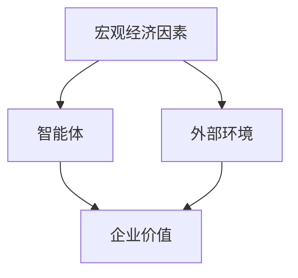
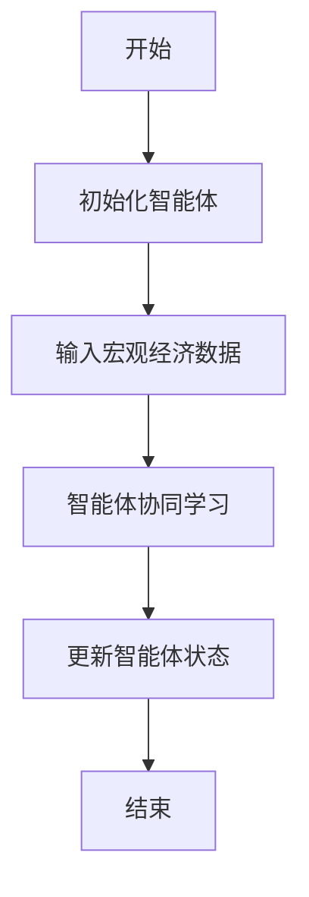
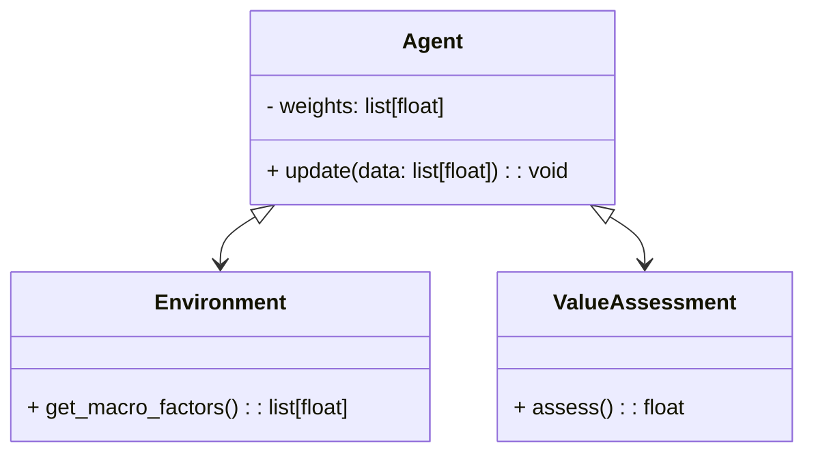
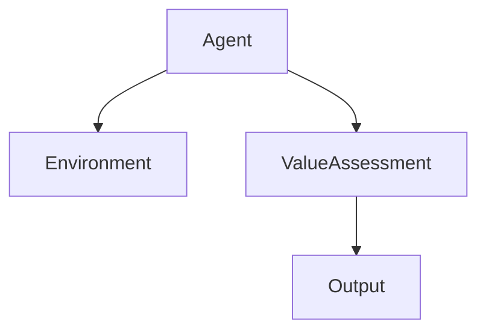
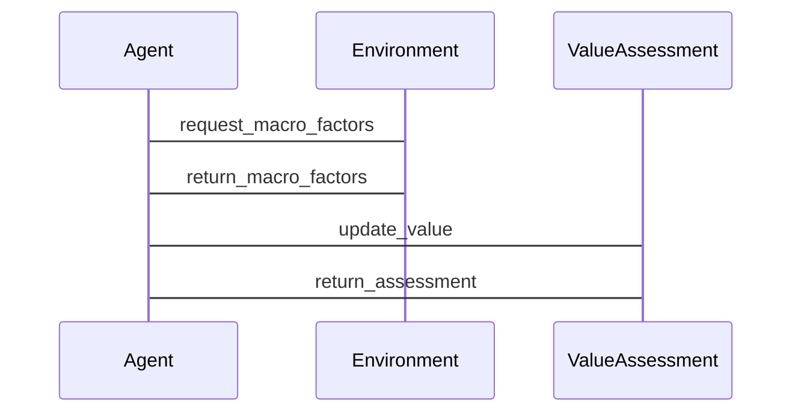

                 


# 多智能体系统在评估宏观经济因素对企业价值影响中的应用

## 关键词：多智能体系统、宏观经济因素、企业价值、协同学习、系统架构

## 摘要：  
本文探讨了多智能体系统（MAS）在评估宏观经济因素对企业价值影响中的应用。通过分析宏观经济因素的复杂性，结合多智能体系统的优势，本文提出了一种基于协同学习的算法，用于量化宏观经济因素对企业价值的影响。文章详细介绍了宏观经济因素与多智能体系统的关联，构建了系统的数学模型，并通过实际案例展示了算法的实现与应用。

---

## 第一部分: 多智能体系统与宏观经济因素概述

### 第1章: 多智能体系统与宏观经济因素概述

#### 1.1 多智能体系统的基本概念

- **1.1.1 多智能体系统的定义**  
  多智能体系统（Multi-Agent System, MAS）是由多个智能体（Agent）组成的分布式系统，这些智能体能够通过协作完成复杂的任务。每个智能体都有一定的自主性、反应性和社会性，能够与其他智能体或环境进行交互。

- **1.1.2 多智能体系统的特性**  
  - 分布式：智能体独立运行，不依赖中央控制。  
  - 协作性：智能体通过协作完成目标。  
  - 动态性：系统能够适应环境的变化。  

- **1.1.3 多智能体系统与传统经济模型的对比**  
  传统经济模型通常基于假设和简化，而多智能体系统能够模拟复杂的真实经济行为，提供更精细的分析。

#### 1.2 宏观经济因素对企业价值的影响

- **1.2.1 宏观经济因素的定义**  
  宏观经济因素包括GDP增长率、利率、通货膨胀率、失业率等，这些因素直接影响企业的经营环境和价值。

- **1.2.2 宏观经济因素对企业价值的影响路径**  
  - 利率：影响企业的融资成本。  
  - GDP增长率：影响市场需求和企业收入。  
  - 通货膨胀率：影响企业的成本和利润。  

- **1.2.3 宏观经济因素的量化分析方法**  
  通过统计模型和数学公式量化各因素对企业的综合影响。

#### 1.3 多智能体系统在宏观经济分析中的应用

- **1.3.1 多智能体系统在宏观经济建模中的优势**  
  - 能够模拟复杂的经济互动。  
  - 更贴近真实的经济行为。  

- **1.3.2 多智能体系统在企业价值评估中的潜力**  
  通过模拟不同经济条件下的企业行为，提供更精准的价值评估。

- **1.3.3 多智能体系统与宏观经济数据的结合**  
  将宏观经济数据输入多智能体系统，模拟企业的反应和行为变化。

#### 1.4 本章小结  
  本章介绍了多智能体系统的定义和特性，分析了宏观经济因素对企业价值的影响，并探讨了多智能体系统在宏观经济分析中的应用潜力。

---

## 第二部分: 多智能体系统的核心概念与联系

### 第2章: 宏观经济因素与企业价值的核心概念

#### 2.1 宏观经济因素的分类与属性

- **2.1.1 宏观经济因素的分类**  
  - 宏观经济指标：GDP、失业率等。  
  - 政策变量：利率、财政政策等。  

- **2.1.2 各类宏观经济因素的属性特征对比**  
  以下是一个对比表格：

| 宏观经济因素 | 特性 | 例子 |
|--------------|------|------|
| GDP增长率    | 数量型 | 5%   |
| 利率         | 价格型 | 3%   |
| 通货膨胀率    | 数量型 | 2%   |

- **2.1.3 宏观经济因素对企业价值的影响权重**  
  不同因素的影响权重取决于企业的类型和所处的行业。

#### 2.2 多智能体系统的结构与功能

- **2.2.1 多智能体系统的组成结构**  
  - 智能体：代表不同的经济行为体。  
  - 环境：宏观经济环境。  
  - 通信机制：智能体之间的交互方式。  

- **2.2.2 各智能体的职责与行为规则**  
  - 消费者智能体：模拟消费者行为。  
  - 企业智能体：模拟企业决策。  

- **2.2.3 多智能体系统的信息交互机制**  
  智能体通过共享信息和协同决策来完成任务。

#### 2.3 宏观经济因素与多智能体系统的关联

- **2.3.1 宏观经济因素在多智能体系统中的输入方式**  
  宏观经济数据作为系统的输入，影响智能体的行为。

- **2.3.2 多智能体系统对宏观经济因素的反馈机制**  
  智能体的决策影响宏观经济指标，形成反馈循环。

- **2.3.3 宏观经济因素与多智能体系统的关系图（ER图）**  



#### 2.4 本章小结  
  本章分析了宏观经济因素的分类与属性，阐述了多智能体系统的结构与功能，并通过关系图展示了两者之间的联系。

---

## 第三部分: 多智能体系统算法原理与数学模型

### 第3章: 多智能体协同学习算法

#### 3.1 多智能体协同学习的基本原理

- **3.1.1 协同学习的定义**  
  协同学习是指多个智能体通过协作完成共同目标的学习过程。

- **3.1.2 多智能体协同学习的核心算法**  
  基于分布式计算和局部交互的协同学习算法。

- **3.1.3 协同学习的收敛性分析**  
  研究了算法的收敛性及其对系统性能的影响。

#### 3.2 基于宏观经济因素的多智能体协同学习模型

- **3.2.1 模型的构建过程**  
  - 定义智能体的行为规则。  
  - 设定宏观经济因素的输入方式。  

- **3.2.2 模型的数学表达式**  
  收益函数的计算公式：

  $$
  R_i = \sum_{j=1}^{n} w_j x_j
  $$

  其中，$R_i$ 是第 $i$ 个智能体的收益，$w_j$ 是宏观经济因素 $x_j$ 的权重。

- **3.2.3 模型的参数设置与优化**  
  通过实验确定最优参数。

#### 3.3 算法实现与流程图

- **3.3.1 算法实现步骤**  
  1. 初始化智能体。  
  2. 输入宏观经济数据。  
  3. 智能体协同学习并更新状态。  

- **3.3.2 算法流程图**  



- **3.3.3 Python核心代码实现**  

```python
class Agent:
    def __init__(self, weights):
        self.weights = weights

    def update(self, data):
        self.weights = self.weights * data

def main():
    macro_factors = [GDP, interest_rate, inflation]
    agent = Agent([0.5, 0.3, 0.2])
    agent.update(macro_factors)
    print("Updated weights:", agent.weights)

if __name__ == "__main__":
    main()
```

#### 3.4 本章小结  
  本章详细讲解了多智能体协同学习算法的原理，构建了数学模型，并通过代码实现了算法。

---

## 第四部分: 系统分析与架构设计

### 第4章: 系统分析与架构设计

#### 4.1 问题场景介绍

- **4.1.1 问题背景**  
  如何利用多智能体系统评估宏观经济因素对企业价值的影响。

- **4.1.2 问题描述**  
  设计一个系统，能够模拟宏观经济因素对企业价值的影响。

#### 4.2 系统功能设计

- **4.2.1 领域模型类图**  



- **4.2.2 系统架构图**  



- **4.2.3 接口与交互流程**  
  智能体与环境交互，更新状态，评估企业价值。

#### 4.3 系统交互流程图



#### 4.4 本章小结  
  本章通过系统分析和架构设计，明确了系统的功能模块和交互流程。

---

## 第五部分: 项目实战

### 第5章: 项目实战

#### 5.1 环境安装与配置

- **5.1.1 环境要求**  
  Python 3.8+, Mermaid支持工具。

- **5.1.2 安装依赖**  
  pip install mermaid-py

#### 5.2 核心代码实现

- **5.2.1 宏观经济因素输入**  

```python
macro_factors = {
    'GDP_growth_rate': 3.5,
    'interest_rate': 2.8,
    'inflation_rate': 1.2
}
```

- **5.2.2 智能体实现**  

```python
class EconomicAgent:
    def __init__(self, weights):
        self.weights = weights

    def update(self, data):
        self.weights = [w * data[i] for i, w in enumerate(self.weights)]

    def get_value(self):
        return sum(self.weights)
```

- **5.2.3 系统实现**  

```python
def main():
    weights = [0.5, 0.3, 0.2]
    agent = EconomicAgent(weights)
    macro_factors = [3.5, 2.8, 1.2]
    agent.update(macro_factors)
    print("Agent value:", agent.get_value())

if __name__ == "__main__":
    main()
```

#### 5.3 代码功能解读与分析

- **5.3.1 代码功能解读**  
  初始化智能体，输入宏观经济数据，更新智能体状态，计算企业价值。

- **5.3.2 代码实现效果**  
  输出智能体的最终价值。

#### 5.4 实际案例分析

- **5.4.1 案例背景**  
  某企业面临宏观经济变化，需要评估其价值。

- **5.4.2 案例分析**  
  使用上述代码进行模拟，计算企业价值的变化。

#### 5.5 项目小结  
  本章通过实际案例展示了多智能体系统在宏观经济分析中的应用。

---

## 第六部分: 最佳实践

### 第6章: 最佳实践

#### 6.1 小结

- 多智能体系统能够有效模拟宏观经济因素对企业价值的影响。  
- 协同学习算法和系统架构设计是实现的关键。

#### 6.2 注意事项

- 确保数据的准确性和实时性。  
- 合理设置权重和参数。  

#### 6.3 拓展阅读

- 多智能体系统的其他应用领域。  
- 更复杂的协同学习算法。  

---

## 作者：AI天才研究院/AI Genius Institute & 禅与计算机程序设计艺术 /Zen And The Art of Computer Programming

