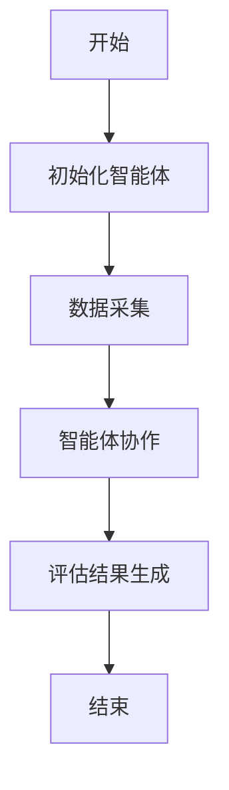
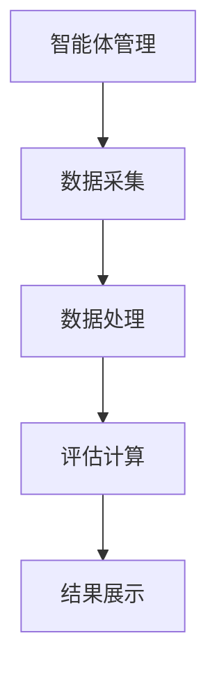

                 


```markdown
# 第三章: 多智能体系统在品牌价值评估中的算法原理

## 3.1 多智能体协同算法
### 3.1.1 分布式计算与协作机制
### 3.1.2 多智能体之间的信息交换
### 3.1.3 算法的收敛性分析

## 3.2 品牌价值评估的数学模型
### 3.2.1 基于多智能体的评估模型
### 3.2.2 模型的数学表达
$$ V = \sum_{i=1}^{n} w_i x_i $$
其中，$V$ 是品牌价值，$w_i$ 是权重，$x_i$ 是评估指标

## 3.3 算法实现流程


## 3.4 本章小结

# 第四章: 系统分析与架构设计方案

## 4.1 问题场景介绍
### 4.1.1 品牌价值评估的复杂性
### 4.1.2 多智能体系统的应用需求
### 4.1.3 系统的目标与范围

## 4.2 系统功能设计
### 4.2.1 领域模型类图
```mermaid
er
actor(评估者) --> 多智能体系统
actor(数据源) --> 多智能体系统
多智能体系统 --> 评估结果
```

## 4.3 系统架构设计


## 4.4 系统接口设计
### 4.4.1 数据接口
### 4.4.2 智能体通信接口
### 4.4.3 评估结果输出接口

## 4.5 本章小结

# 第五章: 项目实战与案例分析

## 5.1 环境安装与配置
### 5.1.1 安装Python
### 5.1.2 安装必要的库
### 5.1.3 配置开发环境

## 5.2 系统核心实现
### 5.2.1 数据采集模块
### 5.2.2 智能体协作模块
### 5.2.3 评估结果生成模块

## 5.3 代码实现与解读
```python
# 数据采集模块
import requests

def fetch_data(url):
    response = requests.get(url)
    return response.json()

# 智能体协作模块
class Agent:
    def __init__(self, data):
        self.data = data

    def process(self):
        # 处理数据并返回结果
        return self.data * 2

# 评估结果生成模块
def generate_report(results):
    return sum(results)

# 主程序
if __name__ == "__main__":
    data = fetch_data("http://example.com/data")
    agent = Agent(data)
    result = agent.process()
    report = generate_report([result])
    print(report)
```

## 5.4 案例分析与解读
### 5.4.1 案例背景
### 5.4.2 数据分析过程
### 5.4.3 结果解读

## 5.5 本章小结

# 第六章: 最佳实践与拓展阅读

## 6.1 最佳实践 tips
### 6.1.1 系统设计中的注意事项
### 6.1.2 开发中的常见问题及解决方案
### 6.1.3 部署与维护建议

## 6.2 小结
### 6.2.1 知识回顾
### 6.2.2 未来展望

## 6.3 注意事项
### 6.3.1 数据安全
### 6.3.2 系统性能优化
### 6.3.3 智能体协作中的伦理问题

## 6.4 拓展阅读
### 6.4.1 多智能体系统相关书籍
### 6.4.2 品牌价值评估领域的最新研究
### 6.4.3 人工智能与金融结合的应用案例

# 作者：AI天才研究院/AI Genius Institute & 禅与计算机程序设计艺术 /Zen And The Art of Computer Programming
```

