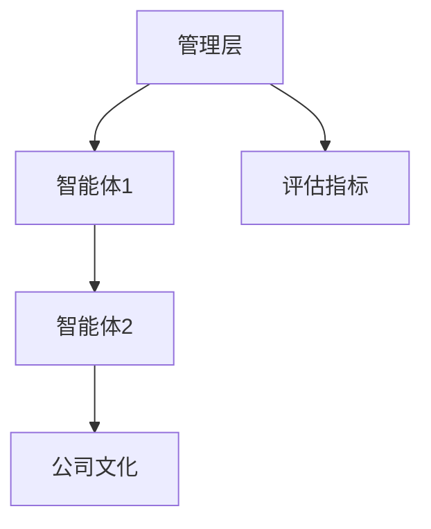
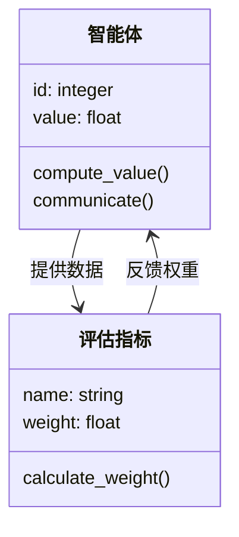
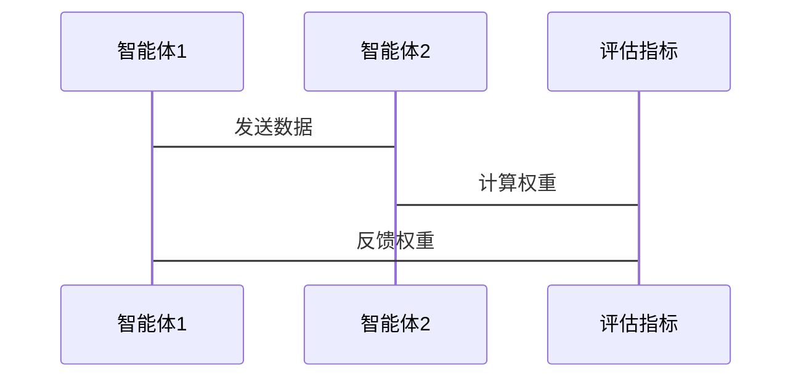

                 


# 多智能体系统在评估管理层质量和公司文化中的应用

> 关键词：多智能体系统, 管理层质量, 公司文化, 评估模型, 智能体协作, 算法原理

> 摘要：本文探讨了多智能体系统在评估管理层质量和公司文化中的应用。通过分析多智能体系统的概念、算法原理、系统架构以及实际项目案例，本文展示了如何利用MAS技术提升企业管理和文化评估的效率与准确性。

---

# 第一部分: 多智能体系统与管理评估概述

## 第1章: 多智能体系统概述

### 1.1 多智能体系统的基本概念
#### 1.1.1 智能体的定义与分类
- 智能体的定义：智能体是指能够感知环境、自主决策并采取行动的实体。
- 智能体的分类：
  - 单智能体：独立运行，不与其他智能体协作。
  - 多智能体：多个智能体协同工作，完成复杂任务。

#### 1.1.2 多智能体系统的特征与优势
- 特征：
  - 分布式：智能体独立运行，通过通信协作完成任务。
  - 协作性：智能体之间通过通信和协商实现协作。
  - 动态性：系统能够适应环境变化。
- 优势：
  - 提高效率：通过协作完成复杂任务。
  - 增强鲁棒性：单个智能体故障不影响整体系统。

#### 1.1.3 多智能体系统在管理中的应用前景
- 应用领域：企业资源管理、供应链优化、组织行为分析等。

### 1.2 管理层质量与公司文化评估的重要性
#### 1.2.1 管理层质量的核心维度
- 战略决策能力：管理层制定和执行战略的能力。
- 领导力：激励团队、指导方向的能力。
- 适应性：应对变化和挑战的能力。

#### 1.2.2 公司文化的关键要素
- 价值观：企业的核心信念和原则。
- 使命和愿景：企业的目标和长期方向。
- 行为规范：员工的行为准则和工作方式。

#### 1.2.3 传统评估方法的局限性
- 主观性：依赖个人判断，结果可能不准确。
- 静态性：无法动态跟踪变化。
- 难以量化：难以用具体指标衡量。

### 1.3 多智能体系统在管理评估中的优势
#### 1.3.1 提高评估效率
- 通过智能体协作快速收集和分析数据。
#### 1.3.2 增强评估准确性
- 多个智能体协同工作，减少单一决策的偏差。
#### 1.3.3 促进动态优化
- 系统能够实时调整评估策略，适应变化。

---

## 第二部分: 多智能体系统的核心原理

## 第2章: 多智能体系统的核心概念与联系

### 2.1 多智能体系统的核心原理
#### 2.1.1 智能体的自主性与协作性
- 自主性：智能体能够独立决策和行动。
- 协作性：智能体之间通过通信和协商实现协作。

#### 2.1.2 多智能体系统的通信机制
- 通信方式：智能体之间通过消息传递进行通信。
- 协商机制：智能体通过协商达成一致行动。

#### 2.1.3 系统的动态性与适应性
- 动态性：系统能够实时调整以适应环境变化。
- 适应性：智能体能够根据反馈优化行为。

### 2.2 核心概念对比分析
#### 2.2.1 智能体与传统管理工具的对比
| 特性 | 智能体 | 传统管理工具 |
|------|--------|--------------|
| 自主性 | 高     | 低           |
| 协作性 | 高     | 低           |
| 灵活性 | 高     | 低           |

#### 2.2.2 多智能体系统与传统管理系统的对比
| 特性 | 多智能体系统 | 传统管理系统 |
|------|--------------|---------------|
| 分布式 | 是          | 否            |
| 协作性 | 强          | 弱            |
| 动态性 | 高          | 中            |

#### 2.2.3 评估模型的属性特征对比表
| 属性 | 分布式评估模型 | 集中式评估模型 |
|------|----------------|----------------|
| 精度 | 高            | 中            |
| 效率 | 中            | 高            |
| 灵活性 | 高           | 低            |

### 2.3 实体关系图


---

## 第三部分: 多智能体系统评估模型的算法原理

## 第3章: 算法原理与数学模型

### 3.1 算法原理
#### 3.1.1 分布式计算与协作机制
- 分布式计算：智能体在不同节点上独立计算，通过通信协作完成任务。
- 协作机制：智能体之间通过协商和通信实现协作。

#### 3.1.2 博弈论模型在决策中的应用
- 博弈论模型：模拟智能体之间的互动，优化决策过程。
- 应用场景：资源分配、任务协作。

#### 3.1.3 动态优化算法
- 动态优化算法：实时调整策略，适应环境变化。

### 3.2 数学模型与公式
#### 3.2.1 智能体协作模型
$$ V = \sum_{i=1}^{n} v_i $$
- $V$ 表示系统总价值。
- $v_i$ 表示第 $i$ 个智能体的贡献。

#### 3.2.2 评估指标权重分配
$$ w_i = \frac{v_i}{\sum_{j=1}^{n} v_j} $$
- $w_i$ 表示第 $i$ 个智能体的权重。
- $\sum_{j=1}^{n} v_j$ 表示总价值。

#### 3.2.3 动态优化公式
$$ x_{k+1} = x_k + \alpha \cdot f(x_k) $$
- $x_k$ 表示第 $k$ 步的状态。
- $\alpha$ 表示学习率。
- $f(x_k)$ 表示目标函数。

### 3.3 算法实现
```python
class Agent:
    def __init__(self, id):
        self.id = id
        self.value = 0

    def compute_value(self):
        # 计算智能体的贡献值
        pass

    def communicate(self, other_agent):
        # 与其他智能体通信
        pass

# 初始化智能体
agents = [Agent(i) for i in range(n)]

# 分布式计算
for agent in agents:
    agent.compute_value()

# 协作机制
for i in range(len(agents)):
    agents[i].communicate(agents[(i+1)%n])

# 动态优化
for agent in agents:
    agent.value = agent.value + alpha * (target - agent.value)
```

### 3.4 实例分析
- 示例：评估公司文化中的团队协作能力。
- 步骤：
  1. 初始化智能体，每个智能体代表一个团队成员。
  2. 智能体通过通信收集数据。
  3. 使用博弈论模型优化决策。
  4. 动态调整评估策略。

---

## 第四部分: 系统分析与架构设计

## 第4章: 系统分析与架构设计方案

### 4.1 问题场景介绍
- 场景：公司管理层和员工之间的互动影响公司文化。
- 问题：如何动态评估管理层质量和公司文化。

### 4.2 项目介绍
- 项目目标：开发一个多智能体系统，评估管理层质量和公司文化。
- 项目范围：覆盖公司内部所有管理层和员工。

### 4.3 系统功能设计
#### 4.3.1 领域模型


#### 4.3.2 系统架构设计


### 4.4 系统架构设计
- 分层架构：
  - 数据层：存储评估数据。
  - 业务层：处理智能体协作和评估计算。
  - 表示层：展示评估结果。

### 4.5 系统接口设计
- 接口1：智能体通信接口。
- 接口2：评估指标计算接口。

### 4.6 系统交互设计


---

## 第五部分: 项目实战

## 第5章: 项目实战

### 5.1 环境安装
- 安装Python和相关库。
- 配置开发环境。

### 5.2 系统核心实现
```python
class EvaluationSystem:
    def __init__(self, agents):
        self.agents = agents

    def evaluate(self):
        for agent in self.agents:
            agent.compute_value()
        for i in range(len(self.agents)):
            self.agents[i].communicate(self.agents[(i+1)%len(self.agents)])
        # 动态优化
        for agent in self.agents:
            agent.value += alpha * (target - agent.value)
        return [agent.value for agent in self.agents]
```

### 5.3 代码应用解读与分析
- 代码功能：初始化智能体，计算贡献值，通信协作，动态优化。
- 实际应用：评估公司管理层和员工的协作能力。

### 5.4 实际案例分析
- 案例：某公司管理层评估。
- 分析步骤：
  1. 收集数据。
  2. 初始化智能体。
  3. 计算贡献值。
  4. 通信协作。
  5. 动态优化。

### 5.5 项目小结
- 成果：成功开发一个多智能体系统，用于评估公司管理层质量和公司文化。
- 经验：智能体协作和动态优化是关键。

---

## 第六部分: 最佳实践

## 第6章: 最佳实践

### 6.1 小结
- 本文介绍了多智能体系统在评估管理层质量和公司文化中的应用。
- 突出了MAS的优势和实际应用价值。

### 6.2 注意事项
- 系统设计时要考虑智能体的通信效率。
- 动态优化算法需要实时调整，避免过时。

### 6.3 拓展阅读
- 推荐阅读《多智能体系统》（书籍）。
- 参考文献：相关论文和研究报告。

---

# 作者：AI天才研究院/AI Genius Institute & 禅与计算机程序设计艺术 /Zen And The Art of Computer Programming

