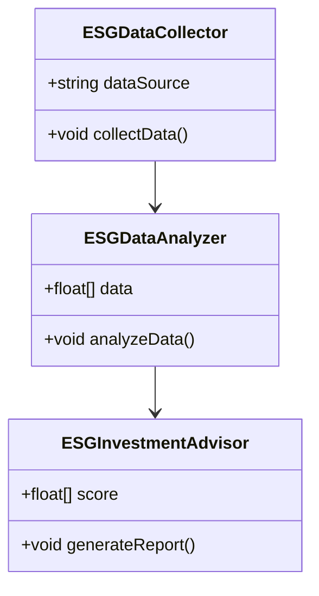
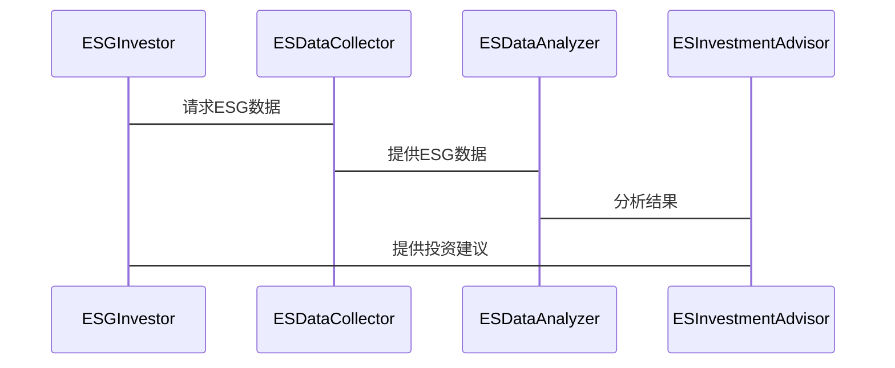

                 


```markdown
# 多智能体系统在识别和评估ESG投资机会中的作用

> 关键词：多智能体系统，ESG投资，投资机会，环境、社会、治理，人工智能，分布式计算

> 摘要：本文探讨了多智能体系统（MAS）在识别和评估ESG投资机会中的应用。通过分析MAS的核心概念、算法原理、系统架构以及实际案例，展示了MAS如何在复杂多变的ESG投资环境中优化决策过程，帮助投资者发现和评估高质量的ESG投资机会。

---

## 第一部分：多智能体系统与ESG投资背景

### 第1章：多智能体系统与ESG投资背景

#### 1.1 多智能体系统（MAS）概述

##### 1.1.1 多智能体系统的定义
多智能体系统（Multi-Agent System，MAS）是由多个智能体（Agent）组成的分布式系统，这些智能体能够通过协作完成复杂的任务。每个智能体都有自己的目标、知识和行为规则，能够自主决策并与其他智能体进行通信和协作。

##### 1.1.2 多智能体系统的特征
- **分布式性**：智能体分布在网络中，独立运行。
- **自主性**：智能体能够自主决策，无需中央控制。
- **协作性**：智能体之间通过通信协作，共同完成任务。
- **反应性**：智能体能够感知环境并实时调整行为。

##### 1.1.3 多智能体系统在投资领域的应用
- **投资决策支持**：通过MAS分析市场数据，优化投资组合。
- **风险评估**：利用MAS进行实时风险监控和预警。
- **多目标优化**：MAS能够同时考虑多个投资目标，如收益、风险、ESG因素等。

#### 1.2 ESG投资的基本概念

##### 1.2.1 环境（E）、社会（S）、治理（G）的定义
- **环境（E）**：关注企业的环保表现，如碳排放、能源使用等。
- **社会（S）**：关注企业对社会的影响，如员工权益、社会责任等。
- **治理（G）**：关注企业的治理结构，如董事会构成、透明度等。

##### 1.2.2 ESG投资的重要性
随着全球可持续发展目标的推进，投资者越来越关注企业的ESG表现，ESG投资已成为衡量企业价值的重要指标。

##### 1.2.3 ESG投资与传统投资的区别
- **传统投资**：主要关注财务指标，如收益、市盈率等。
- **ESG投资**：在财务指标的基础上，额外关注环境、社会和治理因素。

#### 1.3 多智能体系统与ESG投资的结合

##### 1.3.1 ESG投资中的信息处理需求
ESG数据具有多样性、复杂性和动态性，传统的单点处理方式难以满足需求。

##### 1.3.2 多智能体系统在ESG投资中的优势
- **分布式计算**：MAS能够高效处理海量ESG数据。
- **协作决策**：多个智能体协作，提供更全面的分析结果。
- **动态适应**：MAS能够实时响应市场变化和数据更新。

##### 1.3.3 ESG投资中的多智能体系统应用场景
- **数据采集与处理**：智能体负责采集和清洗ESG数据。
- **数据分析与评估**：智能体协作分析数据，评估企业ESG表现。
- **投资决策支持**：基于分析结果，智能体提供投资建议。

---

## 第二部分：多智能体系统的核心概念与联系

### 第2章：多智能体系统的核心概念与联系

#### 2.1 多智能体系统的原理

##### 2.1.1 多智能体系统的组成
- **智能体（Agent）**：具有自主性、反应性、目标导向的实体。
- **通信机制**：智能体之间的信息交换方式。
- **协作机制**：智能体协作完成任务的方式。

##### 2.1.2 智能体之间的通信与协作
- **通信协议**：定义智能体之间如何交换信息。
- **协作协议**：定义智能体如何分工合作。

##### 2.1.3 多智能体系统的任务分配与协调
- **任务分配**：根据智能体的能力分配任务。
- **协调机制**：确保智能体协作完成任务。

#### 2.2 ESG数据的特征与处理

##### 2.2.1 ESG数据的多样性
- 数据来源多样：包括企业报告、新闻媒体、政府数据等。
- 数据格式多样：结构化数据和非结构化数据。

##### 2.2.2 ESG数据的复杂性
- 数据量大：涉及全球多家企业的ESG信息。
- 数据关联性强：不同因素之间相互影响。

##### 2.2.3 ESG数据的标准化与处理
- **标准化**：统一数据格式和指标。
- **数据清洗**：去除噪声数据，确保数据质量。

#### 2.3 多智能体系统与ESG数据的关系

##### 2.3.1 多智能体系统如何处理ESG数据
- **分布式处理**：多个智能体协同处理海量数据。
- **实时更新**：智能体实时更新数据，保持信息的时效性。

##### 2.3.2 ESG数据对多智能体系统的影响
- **数据驱动决策**：ESG数据为智能体提供决策依据。
- **数据复杂性挑战**：复杂的ESG数据对智能体的处理能力提出更高要求。

##### 2.3.3 多智能体系统在ESG数据中的应用
- **数据采集与整合**：智能体负责采集和整合不同来源的ESG数据。
- **数据分析与挖掘**：智能体协作分析数据，提取有用信息。
- **数据可视化**：智能体生成可视化报告，帮助投资者理解数据。

---

## 第三部分：多智能体系统在ESG投资中的算法原理

### 第3章：多智能体系统在ESG投资中的算法原理

#### 3.1 多智能体协作算法

##### 3.1.1 分布式计算与协作机制
- **分布式计算**：智能体在分布式网络中独立计算。
- **协作机制**：智能体之间通过通信协作，共同完成任务。

##### 3.1.2 智能体之间的信息交换与决策
- **信息共享**：智能体共享数据和计算结果。
- **分布式决策**：基于共享信息，智能体做出决策。

##### 3.1.3 多智能体系统的优化算法
- **分布式优化算法**：如分布式梯度下降。
- **协作优化算法**：如分布式强化学习。

#### 3.2 ESG投资中的数学模型

##### 3.2.1 投资组合优化模型
$$
\min_{w} \sum_{i=1}^{n} w_i r_i \\
\text{subject to} \quad \sum_{i=1}^{n} w_i = 1, \quad w_i \geq 0
$$
其中，\( w_i \) 是资产 \( i \) 的权重，\( r_i \) 是资产 \( i \) 的预期收益。

##### 3.2.2 基于ESG的评分模型
$$
S = \sum_{i=1}^{m} a_i \cdot s_i
$$
其中，\( a_i \) 是智能体 \( i \) 的权重，\( s_i \) 是智能体 \( i \) 评估的ESG评分。

##### 3.2.3 基于多智能体的动态优化模型
$$
\min_{w} \sum_{i=1}^{n} w_i r_i + \lambda \sum_{i=1}^{n} w_i s_i \\
\text{subject to} \quad \sum_{i=1}^{n} w_i = 1, \quad w_i \geq 0
$$
其中，\( \lambda \) 是调节参数，平衡收益和ESG评分的影响。

#### 3.3 多智能体系统与ESG投资的数学公式

##### 3.3.1 投资组合优化公式
$$
\min_{w} \sum_{i=1}^{n} w_i r_i + \lambda \sum_{i=1}^{n} w_i s_i \\
\text{subject to} \quad \sum_{i=1}^{n} w_i = 1, \quad w_i \geq 0
$$

##### 3.3.2 基于多智能体的评分公式
$$
S = \sum_{i=1}^{m} a_i \cdot s_i
$$
其中，\( a_i \) 是智能体 \( i \) 的权重，\( s_i \) 是智能体 \( i \) 评估的ESG评分。

---

## 第四部分：多智能体系统与ESG投资的系统架构设计

### 第4章：多智能体系统与ESG投资的系统架构设计

#### 4.1 问题场景介绍
- **数据来源**：多源异构的ESG数据，包括企业报告、新闻媒体、政府数据等。
- **数据处理**：需要实时采集、清洗和分析ESG数据。
- **决策支持**：基于分析结果，为投资者提供ESG投资建议。

#### 4.2 系统功能设计

##### 4.2.1 领域模型（Mermaid 类图）


##### 4.2.2 系统架构设计（Mermaid 架构图）
```mermaid
docker
    server ESDataCollector runs on ESDataCollector
    server ESDataAnalyzer runs on ESDataAnalyzer
    server ESInvestmentAdvisor runs on ESInvestmentAdvisor
    client ESGInvestor connects to ESDataCollector
    client ESGInvestor connects to ESDataAnalyzer
    client ESGInvestor connects to ESInvestmentAdvisor
```

##### 4.2.3 系统接口设计
- **数据接口**：智能体之间的数据交互接口。
- **通信接口**：智能体之间的通信接口。
- **用户接口**：投资者与系统的交互界面。

##### 4.2.4 系统交互流程（Mermaid 序列图）


---

## 第五部分：多智能体系统与ESG投资的项目实战

### 第5章：多智能体系统与ESG投资的项目实战

#### 5.1 环境安装

##### 5.1.1 系统需求
- **硬件需求**：推荐使用多核处理器，8GB及以上内存。
- **软件需求**：
  - Python 3.8及以上版本
  - 网络通信库（如socket、ZMQ）
  - 分布式计算框架（如Dask、Spark）

##### 5.1.2 环境配置
- **安装Python库**：
  ```bash
  pip install zmq python-zmq dask distributed
  ```

#### 5.2 系统核心实现源代码

##### 5.2.1 ESG数据采集智能体（ESGDataCollector）
```python
import zmq

class ESGDataCollector:
    def __init__(self, port):
        self.port = port
        self.context = zmq.Context()
        self.socket = self.context.socket(zmq.PULL)
        self.socket.bind(f"tcp://*:{self.port}")

    def collect_data(self):
        while True:
            message = self.socket.recv()
            print(f"Received: {message.decode()}")
```

##### 5.2.2 ESG数据分析智能体（ESGDataAnalyzer）
```python
import zmq

class ESGDataAnalyzer:
    def __init__(self, port_in, port_out):
        self.port_in = port_in
        self.port_out = port_out
        self.context = zmq.Context()
        self.socket_in = self.context.socket(zmq.PULL)
        self.socket_in.bind(f"tcp://*:{self.port_in}")
        self.socket_out = self.context.socket(zmq.PUSH)
        self.socket_out.bind(f"tcp://*:{self.port_out}")

    def analyze_data(self):
        while True:
            message = self.socket_in.recv()
            data = message.decode()
            # 数据分析逻辑
            score = self.calculate_score(data)
            self.socket_out.send(f"Score: {score}")
    
    def calculate_score(self, data):
        # 示例计算逻辑
        return sum(int(c) for c in data) % 100
```

##### 5.2.3 ESG投资顾问智能体（ESGInvestmentAdvisor）
```python
import zmq

class ESGInvestmentAdvisor:
    def __init__(self, port_in):
        self.port_in = port_in
        self.context = zmq.Context()
        self.socket = self.context.socket(zmq.PULL)
        self.socket.bind(f"tcp://*:{self.port_in}")

    def give_advice(self):
        while True:
            message = self.socket.recv()
            advice = f"投资建议：{message.decode()}"
            print(advice)

if __name__ == "__main__":
    collector = ESGDataCollector(5555)
    analyzer = ESGDataAnalyzer(5556, 5557)
    advisor = ESGInvestmentAdvisor(5557)
    
    collector_thread = Thread(target=collector.collect_data)
    analyzer_thread = Thread(target=analyzer.analyze_data)
    advisor_thread = Thread(target=advisor.give_advice)
    
    collector_thread.start()
    analyzer_thread.start()
    advisor_thread.start()
```

#### 5.3 代码应用解读与分析
- **通信机制**：使用ZeroMQ实现智能体之间的通信。
- **协作机制**：智能体通过消息队列协作完成数据采集、分析和投资建议生成。

#### 5.4 实际案例分析
- **案例背景**：假设我们有一个ESG投资顾问系统，需要实时采集、分析并给出投资建议。
- **案例实现**：
  1. ESGDataCollector智能体从多个数据源采集ESG数据。
  2. ESGDataAnalyzer智能体分析数据，计算企业ESG评分。
  3. ESGInvestmentAdvisor智能体根据评分给出投资建议。

#### 5.5 项目小结
- **项目总结**：通过MAS实现了一个高效的ESG投资顾问系统，能够实时处理海量数据，提供精准的投资建议。
- **经验总结**：MAS在ESG投资中的应用潜力巨大，但需要克服数据标准化、智能体协作效率等问题。

---

## 第六部分：总结与展望

### 第6章：总结与展望

#### 6.1 最佳实践 tips
- **数据标准化**：在MAS中，数据标准化是关键，确保智能体之间的数据兼容性。
- **协作效率**：优化智能体之间的通信机制，提高协作效率。
- **动态适应**：MAS需要具备动态适应能力，以应对市场变化和数据更新。

#### 6.2 小结
本文详细探讨了多智能体系统在识别和评估ESG投资机会中的作用，从理论到实践，展示了MAS在ESG投资中的巨大潜力。

#### 6.3 注意事项
- **数据隐私**：在处理ESG数据时，需要注意数据隐私和合规性。
- **系统安全性**：MAS需要具备良好的安全性，防止数据泄露和系统攻击。

#### 6.4 拓展阅读
- **多智能体系统**：深入学习MAS的理论和应用。
- **ESG投资**：研究更多的ESG投资策略和方法。
- **分布式计算**：学习分布式计算的技术和工具。

---

## 作者信息

作者：AI天才研究院/AI Genius Institute & 禅与计算机程序设计艺术 /Zen And The Art of Computer Programming

---

本文通过详细分析多智能体系统在ESG投资中的应用，展示了MAS在处理复杂数据和优化投资决策中的优势。通过理论与实践的结合，为投资者提供了新的思路和方法。
```

