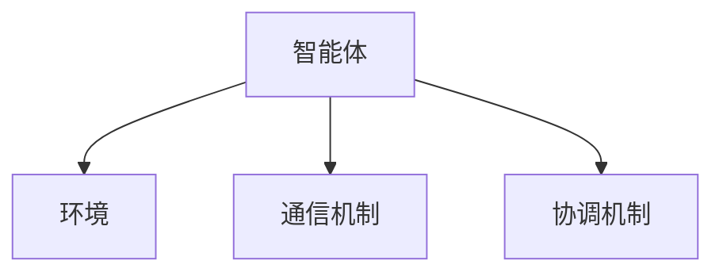
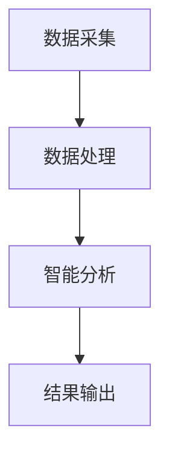
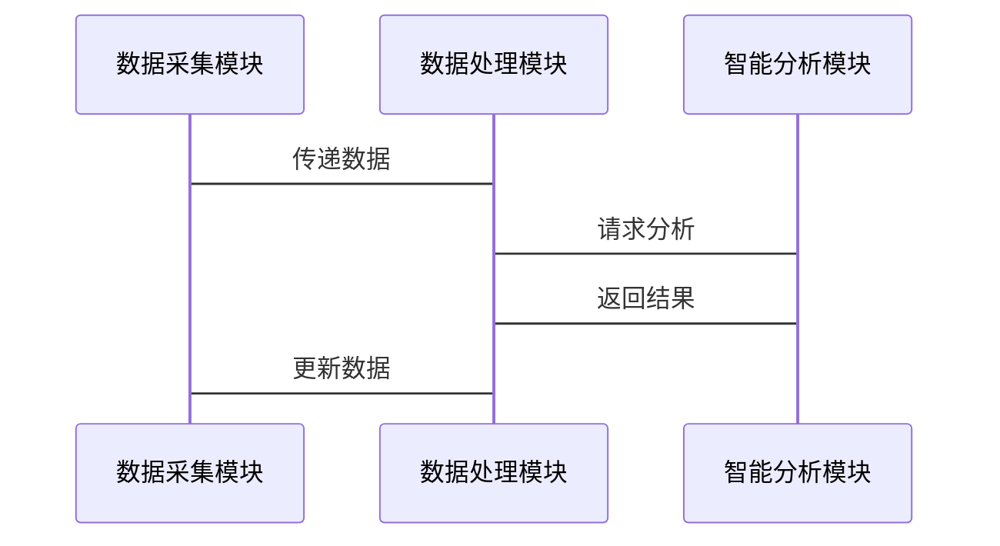

                 


# 多智能体系统在识别和评估经济护城河中的作用

> 关键词：多智能体系统，经济护城河，分布式计算，博弈论，强化学习，系统架构

> 摘要：  
多智能体系统在识别和评估经济护城河中发挥着越来越重要的作用。本文从多智能体系统的原理出发，结合经济护城河的核心概念，详细探讨了多智能体系统在经济护城河识别与评估中的应用场景、算法实现和系统架构设计。通过实际案例分析，展示了多智能体系统在经济护城河动态评估中的优势，并提出了未来的研究方向。

---

# 第1章: 多智能体系统与经济护城河的背景与基础

## 1.1 多智能体系统的基本概念

### 1.1.1 多智能体系统的定义  
多智能体系统（Multi-Agent System, MAS）是由多个相互作用的智能体组成的分布式系统。每个智能体都是一个能够感知环境、自主决策的实体，它们通过通信和协作完成复杂任务。

### 1.1.2 多智能体系统的特征  
- **自主性**：智能体能够自主决策，无需外部干预。  
- **反应性**：智能体能够实时感知环境并做出反应。  
- **分布式性**：智能体之间通过分布式计算协同工作。  
- **社会性**：智能体之间存在协作与竞争关系。  

### 1.1.3 多智能体系统与单智能体系统的区别  
| 特性 | 单智能体系统 | 多智能体系统 |
|------|--------------|--------------|
| 决策 | 中央决策     | 分布式决策   |
| 通信 | 无          | 有          |
| 协作 | 无          | 有          |

---

## 1.2 经济护城河的核心概念

### 1.2.1 经济护城河的定义  
经济护城河是指企业在市场上建立的竞争优势，使竞争对手难以复制或超越。常见的经济护城河包括成本优势、网络效应、品牌忠诚度等。

### 1.2.2 经济护城河的类型  
- **成本优势**：企业通过规模效应降低成本，形成价格优势。  
- **网络效应**：用户数量增加时，平台价值呈指数级增长。  
- **品牌忠诚度**：强大的品牌形象使消费者更倾向于选择该品牌。  

### 1.2.3 经济护城河的构建与评估  
构建经济护城河需要从市场定位、资源整合、技术创新等多个维度入手。评估经济护城河的关键指标包括市场占有率、客户忠诚度、利润率等。

---

## 1.3 多智能体系统在经济分析中的作用

### 1.3.1 多智能体系统的应用场景  
- **市场分析**：通过多智能体模拟市场行为，预测市场趋势。  
- **竞争分析**：分析竞争对手的策略，制定应对方案。  
- **风险评估**：评估市场波动对企业经济护城河的影响。  

### 1.3.2 多智能体系统的优势  
- **分布式计算能力**：能够处理大规模数据和复杂场景。  
- **实时性**：能够实时响应市场变化。  
- **灵活性**：适用于多种经济场景。  

---

## 1.4 本章小结  
本章介绍了多智能体系统的定义、特征及其在经济分析中的作用，为后续章节奠定了理论基础。

---

# 第2章: 多智能体系统的原理与实现

## 2.1 多智能体系统的结构与通信

### 2.1.1 多智能体系统的组成结构  
多智能体系统由智能体、环境、通信机制和协调机制组成。  



### 2.1.2 智能体之间的通信机制  
通信机制包括消息传递、状态共享和事件通知。  

### 2.1.3 分布式计算与协同工作  
分布式计算通过并行处理提高系统效率，而协同工作则通过智能体之间的协作实现目标。

---

## 2.2 多智能体系统的决策机制

### 2.2.1 分布式决策的基本原理  
分布式决策通过局部信息做出全局决策，避免了单点故障。  

### 2.2.2 博弈论在多智能体决策中的应用  
博弈论通过分析智能体之间的互动，帮助智能体做出最优决策。  

### 2.2.3 强化学习在多智能体决策中的应用  
强化学习通过奖励机制训练智能体，使其在复杂环境中做出最优决策。  

---

## 2.3 多智能体系统的实现技术

### 2.3.1 分布式计算框架的选择  
常见的分布式计算框架包括MapReduce、Spark和Docker。  

### 2.3.2 智能体行为建模与编程  
智能体行为建模可以通过状态机或规则引擎实现。  

### 2.3.3 智能体之间的协调与冲突解决  
通过协商机制和仲裁机制解决智能体之间的冲突。  

---

## 2.4 本章小结  
本章详细介绍了多智能体系统的结构、通信机制和决策机制，为后续章节的应用提供了技术基础。

---

# 第3章: 经济护城河的识别与评估方法

## 3.1 经济护城河的识别方法

### 3.1.1 基于市场结构的识别方法  
通过分析市场结构，识别企业的竞争优势。  

### 3.1.2 基于竞争分析的识别方法  
通过分析竞争对手的策略，识别企业的护城河。  

### 3.1.3 基于价值链的识别方法  
通过分析企业价值链，识别关键环节的优势。  

---

## 3.2 经济护城河的评估指标

### 3.2.1 市场进入壁垒的评估  
市场进入壁垒越高，企业的护城河越强。  

### 3.2.2 成本优势的评估  
通过比较成本和价格，评估企业的成本优势。  

### 3.2.3 资源优势的评估  
通过分析企业的资源储备，评估资源优势。  

---

## 3.3 经济护城河的动态变化分析

### 3.3.1 经济护城河的动态评估方法  
通过实时数据更新，动态评估护城河的变化。  

### 3.3.2 竞争对手行为对经济护城河的影响  
竞争对手的策略变化会影响护城河的稳定性。  

### 3.3.3 市场环境变化对经济护城河的影响  
市场环境的变化（如政策变化）会影响护城河的价值。  

---

## 3.4 本章小结  
本章介绍了经济护城河的识别方法和评估指标，并分析了其动态变化，为后续章节的应用提供了方法论支持。

---

# 第4章: 多智能体系统在经济护城河识别中的应用

## 4.1 多智能体系统在经济护城河信息收集中的应用

### 4.1.1 数据采集与处理  
通过多智能体系统采集市场数据，进行清洗和预处理。  

### 4.1.2 多源数据融合  
将来自不同来源的数据进行融合，提高信息的准确性。  

### 4.1.3 数据分析与挖掘  
通过数据分析挖掘出潜在的市场规律和竞争优势。  

---

## 4.2 多智能体系统在经济护城河分析中的应用

### 4.2.1 市场结构分析  
通过多智能体系统模拟市场结构，分析企业的竞争优势。  

### 4.2.2 竞争对手行为预测  
通过博弈论模型预测竞争对手的策略。  

### 4.2.3 市场进入壁垒评估  
通过强化学习模型评估市场进入壁垒。  

---

## 4.3 多智能体系统在经济护城河动态评估中的应用

### 4.3.1 动态数据更新  
通过实时数据更新，动态评估护城河的变化。  

### 4.3.2 实时监控与预警  
通过多智能体系统实时监控市场变化，发出预警信号。  

### 4.3.3 智能决策支持  
通过多智能体系统提供智能决策支持，帮助企业优化护城河。  

---

## 4.4 本章小结  
本章展示了多智能体系统在经济护城河识别中的广泛应用，证明了其在实际中的价值。

---

# 第5章: 多智能体系统在经济护城河评估中的算法实现

## 5.1 分布式计算算法

### 5.1.1 分布式计算的基本原理  
分布式计算通过并行处理提高计算效率。  

### 5.1.2 分布式计算的实现  
通过消息传递接口（MPI）实现分布式计算。  

## 5.2 博弈论算法

### 5.2.1 博弈论的基本原理  
博弈论通过分析智能体之间的互动，帮助智能体做出最优决策。  

### 5.2.2 博弈论的实现  
通过Nash均衡模型实现博弈论算法。  

## 5.3 强化学习算法

### 5.3.1 强化学习的基本原理  
强化学习通过奖励机制训练智能体，使其在复杂环境中做出最优决策。  

### 5.3.2 强化学习的实现  
通过Q-learning算法实现强化学习。  

---

## 5.4 本章小结  
本章详细介绍了多智能体系统在经济护城河评估中的算法实现，为实际应用提供了技术支撑。

---

# 第6章: 系统分析与架构设计方案

## 6.1 系统功能设计

### 6.1.1 系统功能模块  
- 数据采集模块  
- 数据处理模块  
- 智能分析模块  

### 6.1.2 系统功能流程  


## 6.2 系统架构设计

### 6.2.1 系统架构图  


### 6.2.2 系统接口设计  
- 数据采集接口：用于采集市场数据。  
- 数据处理接口：用于处理数据并生成分析结果。  

### 6.2.3 系统交互流程  


---

## 6.3 本章小结  
本章详细设计了系统的功能模块和架构，为实际实现提供了指导。

---

# 第7章: 项目实战与案例分析

## 7.1 项目环境配置

### 7.1.1 系统需求  
- 操作系统：Linux  
- 开发工具：Python、Docker  
- 依赖库：numpy、pandas、scikit-learn  

## 7.2 系统核心实现

### 7.2.1 数据采集模块  
```python
import requests
def collect_data(url):
    response = requests.get(url)
    return response.json()
```

### 7.2.2 数据处理模块  
```python
import pandas as pd
def process_data(data):
    df = pd.DataFrame(data)
    return df
```

### 7.2.3 智能分析模块  
```python
from sklearn import svm
def analyze_data(data):
    model = svm.SVC()
    model.fit(data)
    return model.predict(data)
```

---

## 7.3 案例分析与结果解读

### 7.3.1 案例背景  
某企业希望通过多智能体系统评估其经济护城河。  

### 7.3.2 数据分析结果  
通过数据分析发现，该企业的成本优势显著，但品牌忠诚度较低。  

### 7.3.3 结果解读  
企业应加强品牌建设，以进一步巩固其经济护城河。  

---

## 7.4 本章小结  
本章通过实际案例展示了多智能体系统在经济护城河评估中的应用，证明了其有效性和实用性。

---

# 第8章: 总结与展望

## 8.1 本章总结  
本文详细探讨了多智能体系统在经济护城河识别与评估中的作用，介绍了其原理、算法和系统架构设计，并通过实际案例展示了其应用价值。

## 8.2 最佳实践 tips  
- 在实际应用中，应根据具体需求选择合适的算法。  
- 系统设计时，应注重模块化和可扩展性。  

## 8.3 未来展望  
未来，随着人工智能技术的不断发展，多智能体系统在经济护城河评估中的应用将更加广泛和深入。

---

# 作者信息

作者：AI天才研究院/AI Genius Institute & 禅与计算机程序设计艺术 /Zen And The Art of Computer Programming

---

以上是根据用户提供的思考过程逐步构建的文章框架和内容。如果需要进一步扩展或调整，请随时告知！

