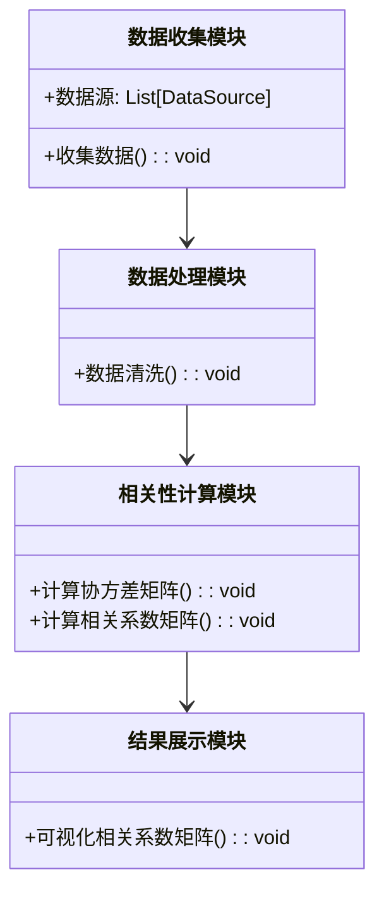
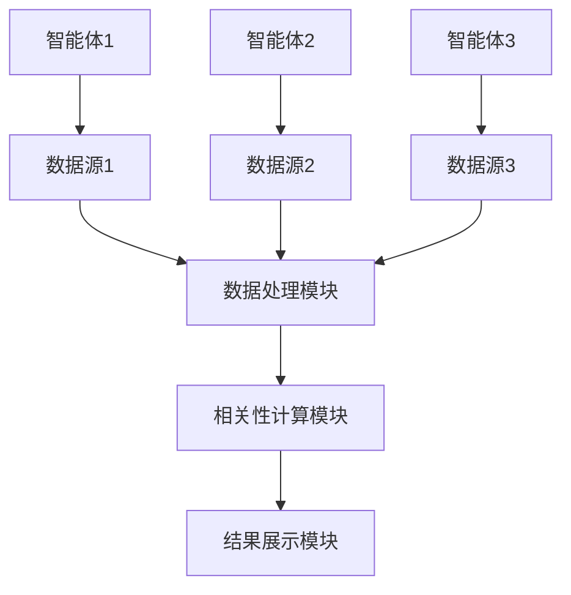
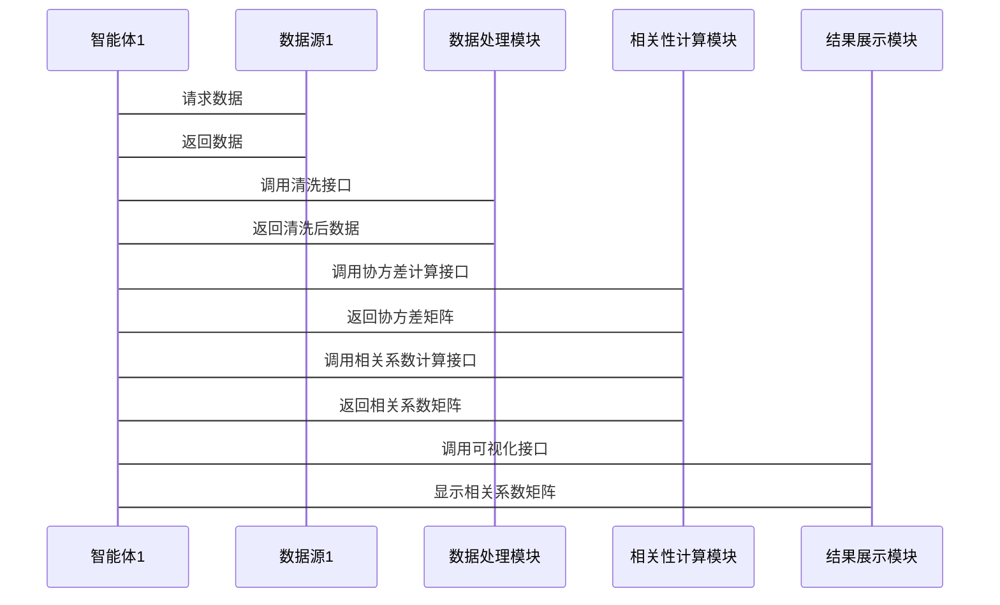

                 


# 多智能体系统在跨市场相关性分析中的应用

**关键词**：多智能体系统、跨市场相关性分析、金融市场、智能体协同、算法实现、相关性度量

**摘要**：  
本文探讨多智能体系统在跨市场相关性分析中的应用，分析其优势与挑战。通过详细讲解核心概念、算法原理、系统架构，并结合实际案例，展示了多智能体系统在金融市场中的潜力和应用场景。

---

## 第1章 多智能体系统与跨市场相关性分析的背景与概述

### 1.1 多智能体系统的基本概念

#### 1.1.1 多智能体系统的定义与特点
多智能体系统（Multi-Agent Systems，MAS）是由多个智能体（Agent）组成的系统，这些智能体能够自主决策、协作并适应环境。其特点包括分布式、自主性、反应性和协作性。

#### 1.1.2 多智能体系统的核心要素
- **智能体**：具有感知和行动能力的实体。
- **通信机制**：智能体之间通过消息传递进行协作。
- **协调机制**：确保智能体协同工作。
- **环境**：智能体所处的外部世界。

#### 1.1.3 多智能体系统在金融领域的应用
- **金融市场分析**：多智能体模拟市场行为。
- **风险控制**：通过协作智能体实时监控风险。
- **投资决策**：基于智能体的分析做出投资决策。

### 1.2 跨市场相关性分析的基本概念

#### 1.2.1 跨市场相关性的定义
跨市场相关性分析研究不同市场之间资产价格波动的关系，帮助理解市场间的相互影响。

#### 1.2.2 跨市场相关性分析的重要性
- **风险分散**：识别相关资产以优化投资组合。
- **市场预测**：通过相关性分析预测市场走势。
- **资产定价**：评估资产价格的相互影响。

#### 1.2.3 跨市场相关性分析的挑战
- **数据复杂性**：多市场数据获取困难。
- **动态变化**：市场相关性随时间变化。
- **计算复杂度**：高维数据处理复杂。

### 1.3 多智能体系统与跨市场相关性分析的结合

#### 1.3.1 多智能体系统在金融领域的应用
- **市场模拟**：模拟多市场环境，分析智能体行为。
- **实时监控**：智能体实时收集和分析市场数据。
- **决策支持**：基于多智能体分析提供投资建议。

#### 1.3.2 跨市场相关性分析的多智能体实现
- **分布式计算**：多智能体协同处理高维数据。
- **动态适应**：智能体根据市场变化调整分析。
- **协作学习**：智能体通过协作提升分析精度。

#### 1.3.3 多智能体系统的优势与局限性

优势：
- **分布式计算**：提高处理能力。
- **自主性**：智能体独立处理数据。
- **协作性**：提升分析精度。

局限性：
- **通信开销**：智能体间通信可能增加计算成本。
- **协调复杂性**：协调多个智能体行动复杂。

### 1.4 本章小结
本章介绍了多智能体系统和跨市场相关性分析的基本概念，以及它们结合的应用。多智能体系统在金融市场中的潜力巨大，但需要克服通信和协调的挑战。

---

## 第2章 多智能体系统的核心概念与相关性分析的联系

### 2.1 多智能体系统的原理与机制

#### 2.1.1 智能体的行为模型
智能体通过感知环境、制定策略和执行行动来实现目标。行为模型包括反应式和规划式模型。

#### 2.1.2 多智能体系统的通信机制
智能体通过消息传递进行协作，通信机制包括发布-订阅模型和点对点通信。

#### 2.1.3 多智能体系统的协调与协作
通过协调机制确保智能体协作，包括一致性协议和冲突解决机制。

### 2.2 跨市场相关性分析的数学模型与方法

#### 2.2.1 相关性分析的基本方法
常用协方差和相关系数来度量资产之间的相关性。协方差衡量资产收益的联动性，相关系数标准化后的协方差。

公式：
$$ \text{协方差}(X,Y) = \frac{1}{n-1}\sum_{i=1}^{n}(X_i - \bar{X})(Y_i - \bar{Y}) $$
$$ \text{相关系数}(X,Y) = \frac{\text{协方差}(X,Y)}{\sigma_X \sigma_Y} $$

#### 2.2.2 跨市场相关性的度量指标
- **皮尔逊相关系数**：适用于线性关系。
- **斯皮尔曼相关系数**：适用于非线性关系。
- **动态相关系数**：考虑时间变化的相关性。

#### 2.2.3 跨市场相关性分析的挑战与解决方案
- **数据异质性**：不同市场数据标准化。
- **计算复杂性**：分布式计算优化。
- **模型选择**：选择合适的相关性度量方法。

### 2.3 多智能体系统与相关性分析的结合

#### 2.3.1 多智能体系统在相关性分析中的角色
- **数据收集**：智能体实时收集多市场数据。
- **数据处理**：分布式处理大数据集。
- **分析协作**：智能体协同计算相关性。

#### 2.3.2 相关性分析的多智能体实现
- **分布式计算**：智能体协同计算协方差和相关系数。
- **动态调整**：智能体根据市场变化调整分析模型。
- **结果汇总**：智能体将结果汇总并输出最终相关性矩阵。

#### 2.3.3 智能体协同的优势
- **并行计算**：提高计算效率。
- **局部计算**：减少数据传输需求。
- **自适应性**：智能体动态调整分析策略。

### 2.4 本章小结
本章详细讲解了多智能体系统和相关性分析的原理，并探讨了它们结合的优势。多智能体系统能够有效提升跨市场相关性分析的效率和精度。

---

## 第3章 多智能体系统在跨市场相关性分析中的算法实现

### 3.1 算法原理

#### 3.1.1 算法概述
跨市场相关性分析的多智能体算法包括数据收集、预处理、计算协方差矩阵和相关系数矩阵。

#### 3.1.2 算法步骤
1. **数据收集**：智能体从不同市场获取资产数据。
2. **数据预处理**：清洗数据，处理缺失值和异常值。
3. **计算协方差矩阵**：智能体计算资产收益的协方差。
4. **计算相关系数矩阵**：标准化协方差得到相关系数。

#### 3.1.3 算法实现的数学模型
协方差矩阵公式：
$$ \text{Cov}(X,Y) = \frac{1}{n-1}\sum_{i=1}^{n}(X_i - \bar{X})(Y_i - \bar{Y}) $$
相关系数矩阵公式：
$$ \text{Corr}(X,Y) = \frac{\text{Cov}(X,Y)}{\sigma_X \sigma_Y} $$

### 3.2 算法实现

#### 3.2.1 算法实现的代码
```python
import numpy as np

def covariance_matrix(data):
    n = data.shape[1]
    return np.cov(data.T, ddof=False)

def correlation_matrix(data):
    cov_matrix = covariance_matrix(data)
    variances = np.diag(cov_matrix)
    denominator = np.sqrt(variances[:, np.newaxis]) * np.sqrt(variances[np.newaxis, :])
    return cov_matrix / denominator
```

#### 3.2.2 算法实现的流程图
```mermaid
graph TD
    A[开始] -> B[数据收集]
    B -> C[数据预处理]
    C -> D[计算协方差矩阵]
    D -> E[计算相关系数矩阵]
    E -> F[结束]
```

### 3.3 算法实现的优化与扩展

#### 3.3.1 并行计算
利用多智能体的分布式计算能力，将数据分成块进行并行处理，提高计算效率。

#### 3.3.2 动态调整
根据市场变化动态调整相关性分析模型，确保结果的实时性和准确性。

### 3.4 本章小结
本章详细讲解了多智能体系统在跨市场相关性分析中的算法实现，包括算法原理、实现代码和流程图。通过优化和扩展，算法能够高效地处理大数据集。

---

## 第4章 系统分析与架构设计方案

### 4.1 问题场景介绍

#### 4.1.1 问题描述
跨市场相关性分析需要处理来自多个市场的大量数据，传统方法计算复杂，效率低。多智能体系统能够提供高效的解决方案。

#### 4.1.2 边界与外延
系统仅处理跨市场相关性分析，不涉及市场预测和投资决策。

### 4.2 系统功能设计

#### 4.2.1 功能需求
- 数据收集模块：实时收集多市场数据。
- 数据处理模块：清洗和预处理数据。
- 相关性计算模块：计算协方差和相关系数矩阵。
- 结果展示模块：可视化相关性结果。

#### 4.2.2 功能模块的类图


### 4.3 系统架构设计

#### 4.3.1 架构设计
采用分布式架构，多个智能体协同工作，分别负责数据收集、处理和计算。

#### 4.3.2 架构图


### 4.4 系统接口设计

#### 4.4.1 接口定义
- 数据收集模块提供数据接口。
- 数据处理模块提供清洗接口。
- 相关性计算模块提供计算接口。

#### 4.4.2 接口交互流程


### 4.5 本章小结
本章详细设计了跨市场相关性分析系统的架构，包括功能模块、接口设计和交互流程。系统采用分布式架构，多智能体协同工作，确保高效和准确的分析。

---

## 第5章 项目实战

### 5.1 环境安装与配置

#### 5.1.1 安装Python和相关库
安装Python 3.8及以上版本，安装numpy和pandas库：
```bash
pip install numpy pandas
```

### 5.2 系统核心实现

#### 5.2.1 数据收集模块实现
```python
import requests

def collect_data(market):
    url = f"https://api.marketdata.com/{market}"
    response = requests.get(url)
    return response.json()
```

#### 5.2.2 数据处理模块实现
```python
import pandas as pd

def data_cleaning(data):
    df = pd.DataFrame(data)
    df.dropna(inplace=True)
    return df
```

#### 5.2.3 相关性计算模块实现
```python
import numpy as np

def calculate_correlation(data):
    cleaned_data = data_cleaning(data)
    cov_matrix = np.cov(cleaned_data.T)
    variances = np.diag(cov_matrix)
    denominator = np.sqrt(variances[:, np.newaxis]) * np.sqrt(variances[np.newaxis, :])
    correlation_matrix = cov_matrix / denominator
    return correlation_matrix
```

### 5.3 代码应用解读与分析

#### 5.3.1 代码功能分析
- **数据收集**：从API获取市场数据。
- **数据清洗**：处理缺失值和异常值。
- **相关性计算**：计算协方差和相关系数矩阵。

#### 5.3.2 代码实现流程
1. 收集数据：智能体从不同市场API获取数据。
2. 数据清洗：处理数据，确保完整性。
3. 相关性计算：计算协方差和相关系数矩阵。
4. 结果展示：可视化相关系数矩阵。

### 5.4 实际案例分析

#### 5.4.1 数据来源
假设我们有三个市场：A、B、C，分别从它们的API获取数据。

#### 5.4.2 数据处理
收集数据后，清洗数据，去除缺失值和异常值。

#### 5.4.3 相关性计算
计算协方差矩阵和相关系数矩阵，展示市场间的相关性。

### 5.5 本章小结
本章通过实际案例展示了多智能体系统在跨市场相关性分析中的应用，详细讲解了环境安装、代码实现和案例分析。

---

## 第6章 总结与展望

### 6.1 总结
多智能体系统在跨市场相关性分析中具有巨大潜力，能够高效处理大数据和复杂场景。通过分布式计算和智能体协作，系统能够实时分析市场相关性，为投资决策提供支持。

### 6.2 未来研究方向

#### 6.2.1 智能体协同优化
研究更高效的智能体协作机制，进一步提升分析效率。

#### 6.2.2 动态相关性分析
开发动态相关性分析模型，适应市场变化。

#### 6.2.3 多模态数据融合
结合文本和图像等多模态数据，提升分析精度。

### 6.3 注意事项
- 数据隐私：确保数据收集和处理符合隐私保护法规。
- 系统稳定性：确保系统在高负载下的稳定性。
- 智能体安全：防止智能体间的通信被攻击。

### 6.4 拓展阅读
- 多智能体系统：Reynolds, C. W. (1994). Flocks, herds, and coordinated groups in a cluttered world.
- 相关性分析：Brych, C. A., &.Paramsivayi, M. (2019). A survey on time-series data mining algorithms.

### 6.5 本章小结
本文总结了多智能体系统在跨市场相关性分析中的应用，并展望了未来的研究方向。多智能体系统将继续在金融领域发挥重要作用，但需要克服数据隐私和系统安全等挑战。

---

**作者：AI天才研究院/AI Genius Institute & 禅与计算机程序设计艺术/Zen And The Art of Computer Programming**

---

以上是《多智能体系统在跨市场相关性分析中的应用》的技术博客文章的完整目录和内容框架，涵盖了从背景到实际应用的各个方面，结构清晰，内容详实。

