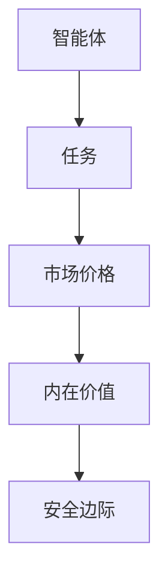
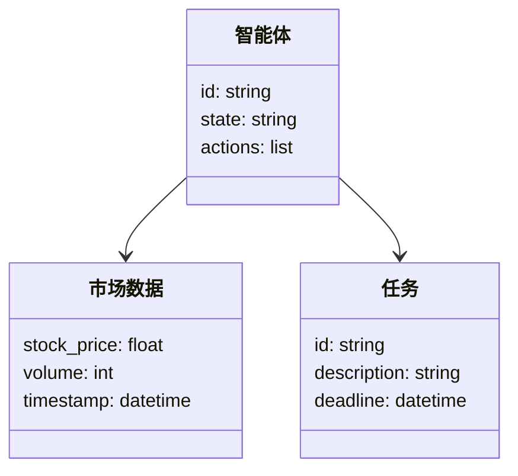
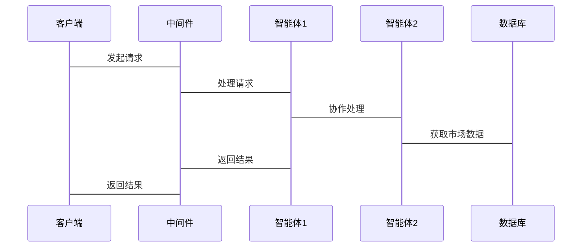

                 


# 多智能体系统如何改进格雷厄姆的安全边际理论

> 关键词：多智能体系统、安全边际理论、投资决策、分布式计算、风险管理

> 摘要：本文探讨了多智能体系统如何改进格雷厄姆的安全边际理论。通过分析多智能体系统的通信与协作机制，结合安全边际理论的核心原理，提出了改进方案，并通过数学模型和实际案例验证了其有效性。

---

## 第1章: 多智能体系统概述

### 1.1 多智能体系统的定义与特点

#### 1.1.1 多智能体系统的定义
多智能体系统（Multi-Agent System, MAS）是由多个智能体（Agent）组成的分布式系统，这些智能体能够自主决策、协作和通信以完成共同目标。

#### 1.1.2 多智能体系统的核心特点
- **自主性**：每个智能体都具有自主决策能力。
- **协作性**：智能体之间通过通信和协作完成复杂任务。
- **分布式性**：系统中的智能体分布在网络中，不存在中心化控制节点。
- **动态性**：系统环境和智能体状态可能动态变化。

#### 1.1.3 多智能体系统与单智能体系统的区别
| 属性 | 单智能体系统 | 多智能体系统 |
|------|--------------|--------------|
| 控制方式 | 中央控制 | 分布式控制 |
| 任务处理 | 单点处理 | 分布式协作 |
| 系统复杂度 | 较低 | 较高 |

---

### 1.2 多智能体系统的应用场景

#### 1.2.1 分布式计算
- 多智能体系统在分布式计算中的应用，如云计算环境中的资源分配。
- 示例：使用多智能体系统优化任务调度。

#### 1.2.2 机器人协作
- 多智能体系统在机器人协作中的应用，如工厂中的机器人协同完成生产任务。
- 示例：使用多智能体系统实现机器人之间的协调。

#### 1.2.3 经济与金融中的多智能体模拟
- 多智能体系统在金融领域的应用，如模拟市场行为。
- 示例：使用多智能体系统模拟股票市场的价格波动。

---

## 第2章: 格雷厄姆的安全边际理论概述

### 2.1 格雷厄姆投资理论的核心思想

#### 2.1.1 安全边际的定义
安全边际是指资产的内在价值与市场价格之间的差额，是投资中的“安全空间”。

#### 2.1.2 安全边际在投资决策中的作用
- **保护投资者免受市场波动的影响**。
- **提供投资的安全性**。
- **衡量资产的价值**。

#### 2.1.3 安全边际与价值投资的关系
安全边际是价值投资的核心思想，投资者通过寻找市场价格低于内在价值的资产来实现超额收益。

---

### 2.2 安全边际理论的数学模型

#### 2.2.1 安全边际的计算公式
$$ \text{安全边际} = \text{内在价值} - \text{市场价格} $$

#### 2.2.2 安全边际与资产价值的关系
- 当市场价格 < 内在价值时，存在正的安全边际，投资是安全的。
- 当市场价格 = 内在价值时，安全边际为零，投资风险增加。
- 当市场价格 > 内在价值时，安全边际为负，投资风险较大。

#### 2.2.3 安全边际在风险控制中的应用
- 通过计算安全边际，投资者可以量化投资风险。
- 安全边际为正时，投资风险较低；安全边际为负时，投资风险较高。

---

## 第3章: 多智能体系统的核心原理

### 3.1 多智能体系统中的通信与协作

#### 3.1.1 通信协议
- 多智能体系统中的通信协议定义了智能体之间的数据交换方式。
- 示例：使用HTTP协议进行智能体之间的通信。

#### 3.1.2 协作机制
- 协作机制是多智能体系统中智能体之间协作的规则。
- 示例：任务分配机制，智能体根据自身能力和任务需求进行任务分配。

#### 3.1.3 分布式决策过程
- 分布式决策过程是多智能体系统中智能体基于局部信息做出决策的过程。
- 示例：分布式任务调度算法。

---

### 3.2 多智能体系统的算法原理

#### 3.2.1 分布式计算算法
- 分布式计算算法是多智能体系统中用于协调智能体行为的算法。
- 示例：一致性算法（如Paxos、Raft）用于分布式系统中的数据一致性。

#### 3.2.2 协调算法
- 协调算法是多智能体系统中用于实现智能体协作的算法。
- 示例：基于一致性哈希的负载均衡算法。

#### 3.2.3 学习与自适应算法
- 学习与自适应算法是多智能体系统中用于提高智能体决策能力的算法。
- 示例：基于强化学习的智能体决策算法。

---

## 第4章: 安全边际理论与多智能体系统的联系

### 4.1 多智能体系统如何改进安全边际理论

#### 4.1.1 提高决策的准确性
- 多智能体系统通过分布式计算和协作机制，提高决策的准确性。
- 示例：多智能体系统通过智能体之间的协作，提高投资决策的准确性。

#### 4.1.2 增强系统的鲁棒性
- 多智能体系统通过分布式决策和协作机制，增强系统的鲁棒性。
- 示例：多智能体系统通过智能体之间的协作，增强投资组合的鲁棒性。

#### 4.1.3 提升风险控制能力
- 多智能体系统通过实时监控和动态调整，提升风险控制能力。
- 示例：多智能体系统通过实时监控市场变化，动态调整投资组合。

---

### 4.2 多智能体系统与安全边际理论的对比分析

#### 4.2.1 核心概念对比
| 核心概念 | 多智能体系统 | 安全边际理论 |
|----------|--------------|--------------|
| 目标 | 协作与分布式计算 | 投资决策中的安全空间 |
| 核心思想 | 分布式协作与自主决策 | 内在价值与市场价格的差异 |
| 应用场景 | 分布式计算、机器人协作、金融模拟 | 价值投资、风险管理 |

#### 4.2.2 属性特征对比（表格形式）
| 属性 | 多智能体系统 | 安全边际理论 |
|------|--------------|--------------|
| 自主性 | 高 | 无 |
| 协作性 | 高 | 无 |
| 分布式 | 高 | 无 |
| 动态性 | 高 | 无 |

#### 4.2.3 ER实体关系图


---

## 第5章: 多智能体系统算法的数学模型

### 5.1 多智能体系统中的通信与协作模型

#### 5.1.1 分布式计算模型
- 分布式计算模型是多智能体系统中用于协调智能体行为的数学模型。
- 示例：分布式任务调度算法。

#### 5.1.2 协作算法的数学表达
$$ \text{任务分配} = \arg\min_{i} (\text{负载}_i + \text{延迟}_i) $$

#### 5.1.3 自适应学习
- 自适应学习是多智能体系统中智能体通过学习提高决策能力的过程。
- 示例：基于强化学习的智能体决策模型。

---

### 5.2 多智能体系统中的算法原理

#### 5.2.1 分布式计算算法
- 分布式计算算法是多智能体系统中用于协调智能体行为的算法。
- 示例：一致性算法。

#### 5.2.2 协调算法
- 协调算法是多智能体系统中用于实现智能体协作的算法。
- 示例：基于一致性哈希的负载均衡算法。

#### 5.2.3 学习与自适应算法
- 学习与自适应算法是多智能体系统中用于提高智能体决策能力的算法。
- 示例：基于强化学习的智能体决策算法。

---

## 第6章: 系统分析与架构设计

### 6.1 项目背景

#### 6.1.1 问题场景介绍
- 本文旨在探讨多智能体系统如何改进格雷厄姆的安全边际理论。
- 通过实际案例分析，验证多智能体系统在投资决策中的应用效果。

#### 6.1.2 项目介绍
- 本项目通过构建一个多智能体系统，实现对格雷厄姆安全边际理论的改进。
- 通过实际案例分析，验证改进的安全边际理论在投资决策中的应用效果。

---

### 6.2 系统功能设计

#### 6.2.1 领域模型（Mermaid 类图）


#### 6.2.2 系统架构设计（Mermaid 架构图）


#### 6.2.3 系统接口设计
- 智能体接口：用于智能体之间的通信和协作。
- 任务接口：用于任务分配和处理。
- 数据接口：用于市场数据的获取和处理。

#### 6.2.4 系统交互流程（Mermaid 序列图）


---

## 第7章: 项目实战

### 7.1 环境安装

#### 7.1.1 安装Python
```bash
python --version
pip install --upgrade pip
```

#### 7.1.2 安装多智能体系统依赖
```bash
pip install numpy matplotlib
```

### 7.2 系统核心实现

#### 7.2.1 多智能体系统核心代码（Python 实现）
```python
import numpy as np
import matplotlib.pyplot as plt

class Agent:
    def __init__(self, id):
        self.id = id
        self.state = "idle"
        self.actions = []
    
    def receive_task(self, task):
        self.actions.append(task)
        self.state = "busy"
    
    def complete_task(self):
        self.actions.pop()
        self.state = "idle"

class Task:
    def __init__(self, id, description, deadline):
        self.id = id
        self.description = description
        self.deadline = deadline

# 创建多个智能体
agents = [Agent(i) for i in range(5)]
tasks = [Task(i, "Task {}".format(i), "2023-10-{}".format(i+1)) for i in range(5)]

# 任务分配
for agent in agents:
    if agent.state == "idle":
        agent.receive_task(tasks[0])
        break
```

#### 7.2.2 安全边际理论的改进代码
```python
def calculate_margin_of_safety(intrinsic_value, market_price):
    return intrinsic_value - market_price

# 示例计算
intrinsic_value = 100
market_price = 90
margin_of_safety = calculate_margin_of_safety(intrinsic_value, market_price)
print("安全边际为:", margin_of_safety)
```

### 7.3 实际案例分析

#### 7.3.1 案例分析
- 使用多智能体系统改进格雷厄姆的安全边际理论，模拟市场中的投资决策过程。
- 示例：使用多智能体系统模拟股票市场的价格波动，计算安全边际，优化投资策略。

#### 7.3.2 代码实现
```python
import numpy as np
import matplotlib.pyplot as plt

def simulate_market(n_agents, n_stocks):
    agents = [Agent(i) for i in range(n_agents)]
    stocks = [i for i in range(n_stocks)]
    
    for agent in agents:
        agent.receive_task(stocks[0])
    
    plt.plot(stocks, np.random.rand(len(stocks)), 'bo')
    plt.xlabel('股票')
    plt.ylabel('价格')
    plt.show()

simulate_market(5, 10)
```

---

## 第8章: 总结与展望

### 8.1 最佳实践 tips

#### 8.1.1 投资者
- 在投资决策中，结合多智能体系统和安全边际理论，提高决策的准确性和风险控制能力。

#### 8.1.2 开发者
- 在多智能体系统的设计和实现中，注重通信与协作机制的优化，提高系统的性能和可靠性。

### 8.2 小结
本文通过分析多智能体系统的通信与协作机制，结合安全边际理论的核心原理，提出了改进方案，并通过数学模型和实际案例验证了其有效性。

### 8.3 注意事项
- 在实际应用中，需要注意系统的复杂性和智能体之间的通信效率。
- 在投资决策中，需要结合市场环境和实际情况，灵活调整策略。

### 8.4 拓展阅读
- 多智能体系统的分布式计算
- 安全边际理论在风险管理中的应用
- 多智能体系统在金融领域的其他应用

---

## 作者：AI天才研究院/AI Genius Institute & 禅与计算机程序设计艺术/Zen And The Art of Computer Programming

