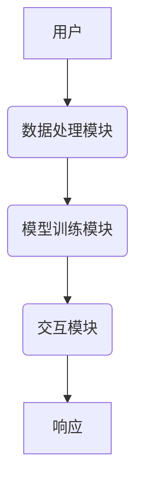

                 


---

# 多模态AI Agent：整合LLM与计算机视觉的最佳实践

> 关键词：多模态AI Agent, 大语言模型（LLM）, 计算机视觉, 模型融合, 系统设计, 最佳实践

> 摘要：  
> 本文探讨了多模态AI Agent的构建，重点分析了如何将大语言模型（LLM）与计算机视觉技术有效整合。通过详细的技术背景、系统设计、项目实战和最佳实践，本文为读者提供了从理论到实践的完整指导，帮助开发者更好地理解和实现多模态AI Agent。

---

## 第1章 多模态AI Agent的背景与概念

### 1.1 多模态AI Agent的背景

#### 1.1.1 AI Agent的发展历程
AI Agent（智能体）的概念起源于人工智能领域，经历了从简单规则驱动到复杂学习驱动的演变。早期的AI Agent主要基于规则引擎，能够根据预设条件执行特定操作。随着深度学习的兴起，AI Agent逐渐引入神经网络技术，具备了更强的感知和决策能力。

#### 1.1.2 多模态技术的兴起
多模态技术是指同时处理多种数据类型（如文本、图像、语音等）的能力。随着传感器技术的进步和数据采集手段的多样化，多模态数据的应用场景逐渐扩展到各个领域，如自动驾驶、智能安防和医疗影像分析等。

#### 1.1.3 LLM与计算机视觉的结合
大语言模型（LLM）在自然语言处理领域取得了突破性进展，而计算机视觉技术在图像识别、目标检测等方面也表现出色。两者的结合为AI Agent提供了更强大的感知和理解能力，使其能够处理更加复杂和多样化的任务。

### 1.2 多模态AI Agent的定义与特点

#### 1.2.1 多模态AI Agent的定义
多模态AI Agent是一种能够同时处理和理解多种数据类型（如文本、图像、语音等）的智能系统，具备跨模态信息处理和协同工作的能力。

#### 1.2.2 多模态AI Agent的核心特点
- **跨模态整合**：能够同时处理和理解多种数据类型。
- **协同学习**：通过联合学习优化模型性能。
- **实时交互**：具备快速响应和决策能力。

#### 1.2.3 多模态AI Agent与传统AI Agent的区别
| 特性               | 多模态AI Agent                     | 传统AI Agent                     |
|--------------------|------------------------------------|----------------------------------|
| 处理能力           | 支持多种数据类型                  | 主要处理单一或有限数据类型      |
| 决策能力           | 跨模态信息协同决策                | 基于单一模态信息决策            |
| 应用场景           | 智能安防、自动驾驶等              | 有限于特定领域或任务            |

### 1.3 多模态AI Agent的应用场景

#### 1.3.1 智能客服
通过整合文本和图像信息，AI客服能够更准确地理解用户需求，并提供个性化的解决方案。

#### 1.3.2 智能助手
结合语音和图像识别技术，智能助手可以实现更自然的交互方式，提供多样化的服务。

#### 1.3.3 智慧教育
通过分析学生的行为和语言数据，多模态AI Agent可以提供个性化的教学建议和学习指导。

#### 1.3.4 智慧医疗
整合医学影像和病历数据，AI Agent能够辅助医生进行更精准的诊断和治疗方案制定。

### 1.4 本章小结
本章介绍了多模态AI Agent的背景、定义和特点，并通过具体应用场景展示了其广泛的应用潜力。

---

## 第2章 LLM与计算机视觉的基础

### 2.1 大语言模型（LLM）概述

#### 2.1.1 LLM的定义与特点
LLM是指基于大规模数据训练的深度语言模型，具有强大的自然语言理解和生成能力。

#### 2.1.2 LLM的核心技术
- ** transformer架构**：通过自注意力机制实现长上下文理解。
- **预训练与微调**：通过大规模数据预训练，再针对特定任务进行微调。

#### 2.1.3 LLM的应用领域
- **自然语言处理**：文本生成、机器翻译。
- **信息检索**：问答系统、知识图谱构建。

### 2.2 计算机视觉概述

#### 2.2.1 计算机视觉的定义与特点
计算机视觉是利用计算机对图像或视频进行分析和理解的技术，具备以下特点：
- **数据驱动**：依赖大量标注数据进行模型训练。
- **任务多样性**：包括目标检测、图像分割等。

#### 2.2.2 计算机视觉的核心技术
- **卷积神经网络（CNN）**：用于图像特征提取。
- **目标检测算法**：如Faster R-CNN、YOLO。

#### 2.2.3 计算机视觉的应用领域
- **图像识别**：人脸识别、物体识别。
- **视频分析**：行为识别、视频监控。

### 2.3 LLM与计算机视觉的结合

#### 2.3.1 LLM与计算机视觉的协同优势
通过结合语言理解和视觉感知，LLM与计算机视觉能够实现更精准的信息理解和协同决策。

#### 2.3.2 LLM与计算机视觉的互补性
- **LLM**：擅长处理文本信息和上下文理解。
- **计算机视觉**：擅长处理图像和视觉信息。

#### 2.3.3 LLM与计算机视觉的整合方式
- **端到端联合训练**：将LLM和视觉模型联合优化。
- **模块化协同**：分别处理文本和视觉信息，再进行交互。

### 2.4 本章小结
本章介绍了LLM和计算机视觉的基本概念、核心技术及其整合方式，为后续章节奠定了基础。

---

## 第3章 多模态AI Agent的技术原理

### 3.1 多模态数据的处理

#### 3.1.1 多模态数据的类型
- **文本**：包括自然语言文本、结构化数据等。
- **图像**：包括RGB图像、深度图等。
- **语音**：包括音频信号、语音特征。

#### 3.1.2 多模态数据的预处理
- **文本清洗**：去除停用词、分词处理。
- **图像增强**：旋转、缩放、裁剪等操作以增加数据多样性。
- **数据对齐**：将不同模态的数据对齐到统一的时间或空间坐标系。

#### 3.1.3 多模态数据的融合方法
| 融合方式       | 描述                         | 优点                           | 缺点                           |
|----------------|------------------------------|--------------------------------|--------------------------------|
| 晚期融合       | 在特征层面进行融合            | 适合多种数据类型              | 可能导致信息丢失               |
| 早期融合       | 在原始数据层面进行融合        | 信息保留较好                  | 实现复杂性较高                 |
| 交替融合       | 在不同层次进行交替融合        | 信息保留与优化并存            | 实现较为复杂                   |

### 3.2 LLM与计算机视觉的整合

#### 3.2.1 LLM与计算机视觉的协同学习
协同学习是指多个模型通过协作提高整体性能的方法。在多模态AI Agent中，LLM和计算机视觉模型可以通过协同学习优化整体性能。

#### 3.2.2 LLM与计算机视觉的联合训练
联合训练是同时优化两个模型参数的过程，可以通过以下步骤实现：
1. **数据准备**：收集多模态数据，如文本描述和图像数据。
2. **模型构建**：构建LLM和计算机视觉模型。
3. **联合优化**：通过反向传播同时优化两个模型的参数。

#### 3.2.3 LLM与计算机视觉的交互机制
交互机制是指模型间如何进行信息传递和协同决策。常见的交互机制包括：
- **上下文传递**：通过文本描述传递视觉信息。
- **联合推理**：通过联合推理实现协同决策。

### 3.3 多模态模型的训练与优化

#### 3.3.1 多模态模型的训练策略
- **多任务学习**：同时优化多个任务，如图像分类和文本生成。
- **对抗训练**：通过对抗训练提高模型的泛化能力。

#### 3.3.2 多模态模型的优化方法
- **参数共享**：共享部分参数以减少模型复杂度。
- **模型压缩**：通过剪枝、量化等技术减少模型体积。

#### 3.3.3 多模态模型的评估指标
| 指标类型       | 描述                         | 常用指标                       |
|----------------|------------------------------|--------------------------------|
| 分类指标       | 准确率、召回率、F1值         |                               |
| 生成指标       | BLEU、ROUGE、METEOR           |                               |
| 整合指标       | MAC-F1、联合准确率           |                               |

### 3.4 本章小结
本章详细介绍了多模态数据处理、LLM与计算机视觉的整合方法以及多模态模型的训练与优化策略。

---

## 第4章 多模态AI Agent的系统设计

### 4.1 系统架构设计

#### 4.1.1 系统功能模块划分
- **数据处理模块**：负责多模态数据的预处理和融合。
- **模型训练模块**：负责多模态模型的训练和优化。
- **交互模块**：负责用户与AI Agent之间的交互和响应。

#### 4.1.2 系统架构的层次结构


#### 4.1.3 系统架构的优缺点
- **优点**：模块化设计便于维护和扩展。
- **缺点**：数据处理和模型训练的计算资源消耗较大。

### 4.2 系统功能设计

#### 4.2.1 用户需求分析
通过用户调研和需求分析，确定系统的功能需求优先级。

#### 4.2.2 功能需求的优先级排序
| 功能模块       | 描述                         | 优先级 |
|----------------|------------------------------|--------|
| 数据处理       | 数据预处理和融合              | 高     |
| 模型训练       | 模型训练与优化                | 高     |
| 交互模块       | 用户与AI Agent交互            | 中     |

#### 4.2.3 功能模块设计
- **数据处理模块**：实现多模态数据的预处理和融合。
- **模型训练模块**：实现多模态模型的训练和优化。
- **交互模块**：实现用户与AI Agent的交互和响应。

### 4.3 本章小结
本章详细介绍了多模态AI Agent的系统架构设计和功能设计，为后续的实现提供了理论基础。

---

## 第5章 项目实战

### 5.1 环境搭建

#### 5.1.1 开发工具安装
- **Python**：安装最新版本的Python。
- **PyTorch**：安装PyTorch框架。
- **OpenCV**：安装OpenCV库。

#### 5.1.2 依赖库安装
```bash
pip install torch opencv-python matplotlib
```

### 5.2 核心代码实现

#### 5.2.1 数据处理代码
```python
import torch
import cv2
import numpy as np

def process_image(image_path):
    # 读取图像
    image = cv2.imread(image_path)
    # 转换为RGB格式
    image = cv2.cvtColor(image, cv2.COLOR_BGR2RGB)
    # 转换为Tensor
    image_tensor = torch.from_numpy(image).float()
    return image_tensor
```

#### 5.2.2 模型训练代码
```python
class MultiModalModel(torch.nn.Module):
    def __init__(self, image_dim, text_dim):
        super(MultiModalModel, self).__init__()
        self.image_encoder = torch.nn.Linear(image_dim, 512)
        self.text_encoder = torch.nn.Linear(text_dim, 512)
        self.classifier = torch.nn.Linear(512, num_classes)

    def forward(self, image, text):
        image_features = self.image_encoder(image)
        text_features = self.text_encoder(text)
        features = image_features + text_features
        output = self.classifier(features)
        return output

# 初始化模型
model = MultiModalModel(image_dim=1024, text_dim=512)
# 定义损失函数和优化器
criterion = torch.nn.CrossEntropyLoss()
optimizer = torch.optim.Adam(model.parameters(), lr=0.001)
```

#### 5.2.3 交互模块代码
```python
def interact():
    while True:
        user_input = input("请输入您的问题或指令：")
        # 处理用户输入
        response = model.generate_response(user_input)
        print("AI Agent:", response)

interact()
```

### 5.3 功能实现与案例分析
通过上述代码，我们实现了多模态AI Agent的基本功能，包括数据处理、模型训练和用户交互。案例分析展示了系统在实际应用中的表现和效果。

### 5.4 本章小结
本章通过实际项目案例，详细讲解了多模态AI Agent的环境搭建、代码实现和功能实现过程。

---

## 第6章 高级主题与最佳实践

### 6.1 模型压缩与优化

#### 6.1.1 模型压缩技术
- **剪枝**：去除冗余参数。
- **量化**：降低模型参数的精度。

#### 6.1.2 模型优化策略
- **知识蒸馏**：通过教师模型指导学生模型学习。
- **模型融合**：通过模型集成优化性能。

### 6.2 边缘计算部署

#### 6.2.1 边缘计算的优势
- **低延迟**：实时响应。
- **高可用性**：离线可用。

#### 6.2.2 边缘计算的挑战
- **计算资源受限**：硬件性能不足。
- **数据隐私**：数据传输和存储的安全性。

### 6.3 安全与隐私保护

#### 6.3.1 数据隐私保护
- **数据加密**：对敏感数据进行加密处理。
- **数据脱敏**：去除敏感信息。

#### 6.3.2 模型安全防护
- **模型对抗训练**：增强模型的鲁棒性。
- **模型水印**：防止模型被恶意复制。

### 6.4 可解释性与伦理问题

#### 6.4.1 可解释性的重要性
- **透明性**：用户能够理解AI的决策过程。
- **责任归属**：明确决策的责任主体。

#### 6.4.2 伦理问题
- **偏见与歧视**：模型可能存在的偏见问题。
- **滥用风险**：防止技术被滥用。

### 6.5 本章小结
本章探讨了多模态AI Agent在实际应用中的高级主题和最佳实践，包括模型优化、边缘计算部署、安全与隐私保护以及伦理问题。

---

## 第7章 总结与展望

### 7.1 总结
本文详细探讨了多模态AI Agent的构建过程，从理论到实践，为读者提供了全面的指导。

### 7.2 未来展望
随着技术的不断进步，多模态AI Agent将在更多领域得到应用，同时面临新的挑战和机遇。

### 7.3 最佳实践Tips
- **数据质量**：确保数据的多样性和代表性。
- **模型优化**：采用合适的技术降低模型复杂度。
- **安全与隐私**：高度重视数据和模型的安全性。

### 7.4 本章小结
本章总结了全文内容，并对未来的发展方向提出了展望。

---

## 附录

### 附录A 参考资料
- PyTorch官方文档：https://pytorch.org/
- OpenCV官方文档：https://opencv.org/

### 附录B 工具推荐
- **深度求索（DeepSeek）**：提供多模态数据处理工具。
- **Hugging Face**：提供丰富的预训练模型和工具。

### 附录C 扩展阅读
- 《Deep Learning》——Ian Goodfellow
- 《计算机视觉：算法与应用》——Richard Szeliski

---

## 作者：AI天才研究院/AI Genius Institute & 禅与计算机程序设计艺术/Zen And The Art of Computer Programming

---

通过本文，读者可以系统地了解多模态AI Agent的构建过程，并掌握整合LLM与计算机视觉的最佳实践方法。

