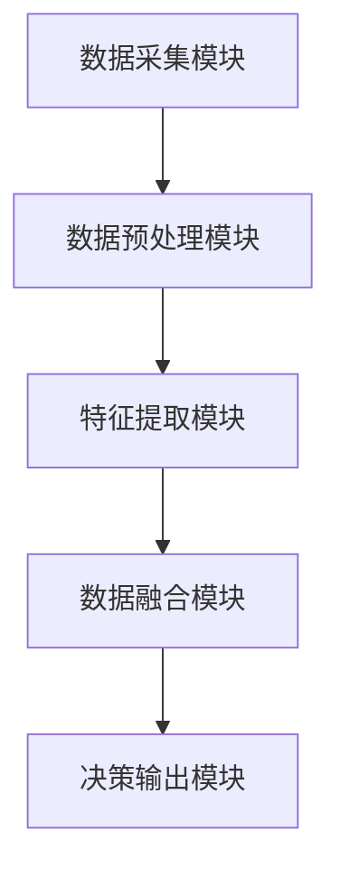
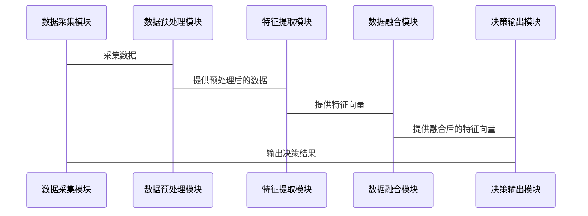

                 


# 多模态AI Agent：整合文本、图像和语音

> 关键词：多模态AI Agent、文本处理、图像处理、语音处理、数据融合、深度学习

> 摘要：多模态AI Agent是一种能够整合文本、图像和语音等多种数据模态的智能系统，通过先进的数据处理和融合技术，结合深度学习算法，实现对多源信息的协同分析和智能决策。本文将详细探讨多模态AI Agent的核心概念、数据处理技术、算法原理、系统架构设计以及实际应用案例，帮助读者全面理解这一前沿技术。

---

## 第1章: 多模态AI Agent的背景与概念

### 1.1 多模态AI Agent的背景

#### 1.1.1 多模态数据的定义与特点

多模态数据指的是来自不同感知渠道的数据形式，主要包括文本、图像和语音等。与单一模态数据相比，多模态数据具有以下特点：

- **丰富性**：多模态数据能够提供更全面的信息，帮助模型更好地理解复杂的场景。
- **互补性**：不同模态的数据可以相互补充，提高模型的准确性和鲁棒性。
- **复杂性**：多模态数据的处理需要综合多种技术，对算法和计算能力的要求较高。

#### 1.1.2 多模态AI Agent的起源与发展

多模态AI Agent的概念起源于人工智能领域的多模态学习研究。随着深度学习技术的发展，尤其是卷积神经网络（CNN）、循环神经网络（RNN）和transformer模型的广泛应用，多模态数据的处理能力得到了显著提升。近年来，多模态AI Agent在自然语言处理、计算机视觉和语音识别领域的交叉应用逐渐成为研究热点。

#### 1.1.3 多模态AI Agent的应用场景与优势

多模态AI Agent的应用场景包括但不限于智能客服、智能助手、自动驾驶、智能安防等。其主要优势在于能够同时处理多种数据模态，从而实现更智能、更高效的决策能力。

---

### 1.2 多模态AI Agent的核心概念

#### 1.2.1 多模态数据的整合与协同

多模态数据的整合是指将来自不同模态的数据进行融合，以提取更丰富的语义信息。协同处理是指在整合过程中，不同模态的数据能够互相补充，提高模型的性能。

#### 1.2.2 多模态AI Agent的功能架构

多模态AI Agent的功能架构通常包括数据采集、数据预处理、特征提取、融合计算和决策输出五个部分。其中，融合计算是核心，决定了系统的性能。

#### 1.2.3 多模态AI Agent与传统AI Agent的区别

与传统AI Agent相比，多模态AI Agent具有更强的感知能力和更高的智能化水平，能够同时处理多种数据模态，并通过协同分析提高决策的准确性和可靠性。

---

### 1.3 多模态AI Agent的边界与外延

#### 1.3.1 多模态AI Agent的应用边界

多模态AI Agent的应用边界主要体现在数据模态的数量和类型、系统的计算能力以及应用场景的复杂性等方面。目前，多模态AI Agent主要应用于中低复杂度的场景，而在超复杂场景下的应用仍需进一步研究。

#### 1.3.2 多模态AI Agent与其他技术的关系

多模态AI Agent与自然语言处理、计算机视觉和语音识别等技术密切相关。它是这些技术的综合应用，同时也为这些技术的发展提供了新的方向。

#### 1.3.3 多模态AI Agent的未来发展趋势

未来，多模态AI Agent将朝着更加智能化、个性化和场景化的方向发展，同时在算法和硬件技术上也将不断进步，以支持更复杂的多模态数据处理和决策任务。

---

## 第2章: 多模态数据的处理与融合技术

### 2.1 多模态数据的预处理

#### 2.1.1 文本数据的预处理

文本数据的预处理包括分词、去除停用词、词干提取等步骤。这些步骤有助于减少文本数据的冗余信息，提高特征提取的效率。

#### 2.1.2 图像数据的预处理

图像数据的预处理包括图像增强、归一化、裁剪等步骤。这些步骤有助于改善图像的质量，提高特征提取的效果。

#### 2.1.3 语音数据的预处理

语音数据的预处理包括降噪、分段、特征提取等步骤。这些步骤有助于提高语音识别的准确率，改善语音数据的质量。

---

### 2.2 多模态数据的特征提取

#### 2.2.1 文本特征提取方法

文本特征提取方法主要包括词袋模型、TF-IDF和基于深度学习的特征提取（如BERT模型）。这些方法能够从文本中提取出有用的语义信息。

#### 2.2.2 图像特征提取方法

图像特征提取方法主要包括基于CNN的特征提取和基于区域的特征提取（如RPN）。这些方法能够从图像中提取出物体的特征信息。

#### 2.2.3 语音特征提取方法

语音特征提取方法主要包括MFCC特征提取和基于深度学习的特征提取（如CTC模型）。这些方法能够从语音中提取出有用的语音特征。

---

### 2.3 多模态数据的融合策略

#### 2.3.1 基于特征融合的方法

基于特征融合的方法将不同模态的特征向量进行线性组合或非线性变换，以得到融合后的特征向量。这种方法简单易行，但可能无法充分利用模态之间的互补性。

#### 2.3.2 基于模型融合的方法

基于模型融合的方法将不同模态的数据分别输入到独立的模型中进行处理，然后将模型的输出结果进行融合。这种方法能够充分利用各模态数据的优势，但可能需要更多的计算资源。

#### 2.3.3 基于注意力机制的融合方法

基于注意力机制的融合方法通过引入注意力机制，动态地调整各模态数据的权重，以实现更加灵活的融合方式。这种方法能够更好地捕捉模态之间的关联性，提高融合效果。

---

## 第3章: 多模态AI Agent的核心算法原理

### 3.1 多模态注意力机制

#### 3.1.1 注意力机制的基本原理

注意力机制是一种基于权重分配的机制，能够帮助模型聚焦于重要的信息。在多模态数据中，注意力机制可以用于不同模态之间的信息交互和协同。

#### 3.1.2 多模态注意力机制的实现

多模态注意力机制的实现通常包括模态间的交叉注意力计算和自注意力计算。通过交叉注意力，模型可以同时关注不同模态的信息，从而实现多模态数据的协同处理。

#### 3.1.3 多模态注意力机制的应用案例

多模态注意力机制在图像描述生成、语音辅助翻译等任务中得到了广泛应用。通过注意力机制，模型能够更好地理解不同模态数据之间的关系，提高任务的性能。

---

### 3.2 多模态对比学习

#### 3.2.1 对比学习的基本原理

对比学习是一种基于相似性度量的无监督学习方法，通过最大化正样本的相似性和最小化负样本的相似性来实现特征学习。

#### 3.2.2 多模态对比学习的实现

多模态对比学习的实现通常包括模态间特征对齐和模态内特征对齐两个步骤。通过模态间特征对齐，模型可以实现不同模态数据的协同学习。

#### 3.2.3 多模态对比学习的应用案例

多模态对比学习在图像-文本匹配、语音-文本协同学习等任务中得到了广泛应用。通过对比学习，模型能够更好地理解不同模态数据之间的语义关系，提高任务的性能。

---

### 3.3 多模态生成模型

#### 3.3.1 生成模型的基本原理

生成模型是一种基于概率分布的模型，能够通过学习数据的分布特性生成新的数据样本。在多模态数据中，生成模型可以用于文本生成、图像生成等任务。

#### 3.3.2 多模态生成模型的实现

多模态生成模型的实现通常包括模态间特征融合和模态内特征生成两个步骤。通过模态间特征融合，模型可以实现不同模态数据的协同生成。

#### 3.3.3 多模态生成模型的应用案例

多模态生成模型在图像描述生成、语音辅助生成等任务中得到了广泛应用。通过生成模型，模型能够生成与输入模态数据相一致的高质量输出。

---

## 第4章: 多模态AI Agent的系统架构设计

### 4.1 系统功能设计

#### 4.1.1 多模态数据采集模块

多模态数据采集模块负责从不同模态的数据源中采集数据，包括文本、图像和语音等。

#### 4.1.2 数据预处理模块

数据预处理模块对采集到的多模态数据进行预处理，包括文本分词、图像增强、语音降噪等。

#### 4.1.3 特征提取模块

特征提取模块对预处理后的多模态数据进行特征提取，包括文本特征提取、图像特征提取和语音特征提取。

#### 4.1.4 数据融合模块

数据融合模块将不同模态的特征向量进行融合，通过注意力机制、对比学习等方法实现多模态数据的协同处理。

#### 4.1.5 决策输出模块

决策输出模块根据融合后的特征向量进行最终的决策输出，包括文本生成、图像识别和语音合成等任务。

---

### 4.2 系统架构设计

#### 4.2.1 系统功能模块设计

系统功能模块设计包括数据采集模块、数据预处理模块、特征提取模块、数据融合模块和决策输出模块五个部分。

#### 4.2.2 系统架构图



#### 4.2.3 系统交互流程



---

## 第5章: 项目实战——多模态AI Agent案例分析

### 5.1 项目介绍

#### 5.1.1 项目背景

本项目旨在开发一个多模态AI Agent系统，能够同时处理文本、图像和语音数据，实现多模态数据的协同分析和智能决策。

#### 5.1.2 项目目标

本项目的目标是通过多模态数据的整合与协同处理，实现对多源信息的高效分析和智能决策。

---

### 5.2 核心代码实现

#### 5.2.1 数据采集模块

```python
import speech_recognition as sr
import cv2
from transformers import BertTokenizer

# 文本数据采集
def text_data_capture():
    text = input("请输入文本数据：")
    return text

# 图像数据采集
def image_data_capture():
    cap = cv2.VideoCapture(0)
    ret, frame = cap.read()
    cap.release()
    return frame

# 语音数据采集
def audio_data_capture():
    r = sr.Recognizer()
    with sr.AudioFile("audio.wav") as source:
        audio = r.record(source)
    return audio
```

#### 5.2.2 数据预处理模块

```python
# 文本数据预处理
def text_preprocessing(text):
    tokenizer = BertTokenizer.from_pretrained('bert-base-uncased')
    tokens = tokenizer.encode(text)
    return tokens

# 图像数据预处理
def image_preprocessing(image):
    image = cv2.resize(image, (224, 224))
    image = image.astype(np.float32) / 255.0
    return image

# 语音数据预处理
def audio_preprocessing(audio):
    audio_data = audio.get_raw_data()
    audio_data = np.frombuffer(audio_data, dtype=np.int16)
    audio_data = audio_data.astype(np.float32) / 32768.0
    return audio_data
```

#### 5.2.3 特征提取模块

```python
# 文本特征提取
def text_feature_extraction(tokens):
    model = BertModel.from_pretrained('bert-base-uncased')
    with torch.no_grad():
        outputs = model(tokens)
        features = outputs.last_hidden_state[:, 0, :]
    return features

# 图像特征提取
def image_feature_extraction(image):
    model = ResNet50(weights='IMAGENET1K_V2')
    with torch.no_grad():
        features = model(image)
    return features

# 语音特征提取
def audio_feature_extraction(audio_data):
    model = CNN_Model()
    with torch.no_grad():
        features = model(audio_data)
    return features
```

---

### 5.3 项目小结

通过本项目的实现，我们能够理解多模态AI Agent的核心技术，包括数据采集、数据预处理、特征提取和数据融合等步骤。同时，我们也可以看到多模态AI Agent在实际应用中的巨大潜力。

---

## 第6章: 多模态AI Agent的未来展望与最佳实践

### 6.1 多模态AI Agent的未来发展趋势

#### 6.1.1 算法优化

未来，多模态AI Agent的算法优化将主要集中在注意力机制、对比学习和生成模型等关键技术的研究上。通过算法的优化，可以进一步提高多模态数据的处理能力。

#### 6.1.2 硬件支持

随着硬件技术的不断进步，多模态AI Agent的硬件支持将更加高效，能够处理更复杂的多模态数据。

#### 6.1.3 应用场景扩展

未来，多模态AI Agent的应用场景将进一步扩展，涵盖更多的领域，包括教育、医疗、娱乐等。

---

### 6.2 多模态AI Agent的最佳实践

#### 6.2.1 数据质量的重要性

在多模态AI Agent的开发中，数据质量至关重要。需要确保不同模态的数据之间具有较高的相关性和一致性。

#### 6.2.2 模型选择与优化

在模型选择上，需要根据具体任务的需求选择合适的模型，并通过实验进行模型优化。

#### 6.2.3 系统架构设计

系统架构设计需要充分考虑多模态数据的处理流程和计算效率，确保系统的可扩展性和可维护性。

---

## 作者信息

作者：AI天才研究院/AI Genius Institute & 禅与计算机程序设计艺术 /Zen And The Art of Computer Programming

---

以上是《多模态AI Agent：整合文本、图像和语音》的技术博客文章的完整内容，涵盖了从基础概念到实际应用的各个方面，旨在为读者提供全面而深入的技术解读。

