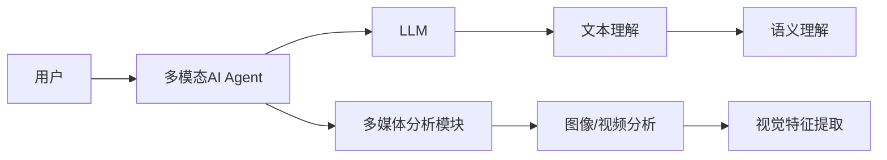
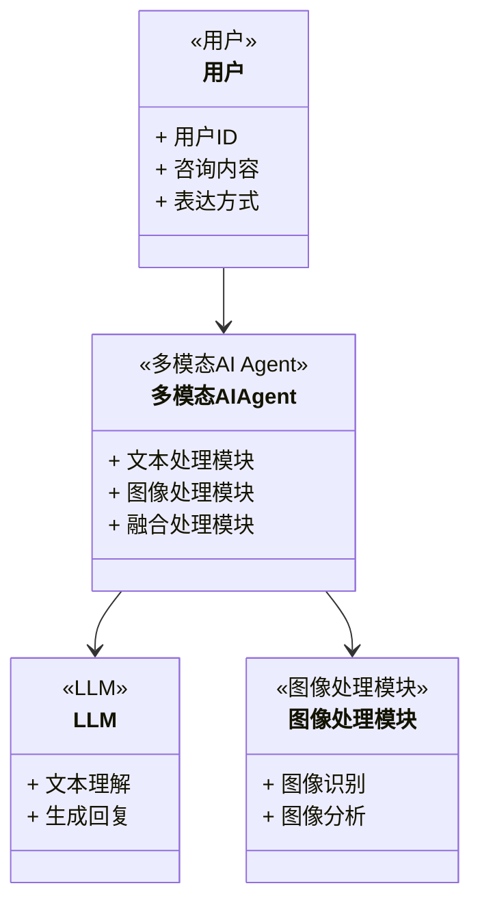
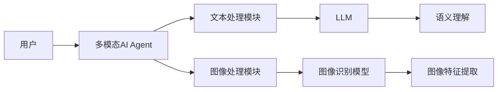

                 


# 多模态内容理解AI Agent：整合LLM与多媒体分析

> 关键词：多模态AI Agent, 大语言模型, 多媒体分析, 人工智能, 图像处理, 自然语言处理

> 摘要：本文详细探讨了多模态内容理解AI Agent的构建与应用，重点分析了如何整合大语言模型（LLM）与多媒体分析技术，以实现对复杂多模态数据的深度理解和智能处理。文章从背景、概念、算法、系统架构到项目实战，全面阐述了多模态AI Agent的技术细节与实现方案。

---

## 第一部分: 多模态内容理解AI Agent概述

### 第1章: 多模态内容理解AI Agent的背景与概念

#### 1.1 问题背景与问题描述

在当今的人工智能领域，单一模态的处理技术已经取得了显著进展，但实际应用场景中，数据往往是多模态的，例如文本、图像、视频、音频等多种形式的混合。传统的单一模态处理方法难以充分利用多模态数据中的互补信息，导致理解和处理效果受限。例如，在社交媒体分析中，一条信息可能包含文本、图片和视频等多种数据，单一模态的处理方式无法全面捕捉信息的深层含义。

#### 1.2 问题解决思路

为了克服单一模态处理的局限性，多模态内容理解AI Agent应运而生。通过整合大语言模型（LLM）与多媒体分析技术，AI Agent能够同时处理多种模态的数据，实现对复杂场景的深度理解。具体思路包括：

1. **数据整合**：将文本、图像、视频等多种模态数据进行统一处理和表示。
2. **模态协同**：通过跨模态学习，使不同模态的信息相互增强，提升整体理解能力。
3. **任务驱动**：针对具体任务（如问答、图像描述生成等），设计多模态数据的协同处理机制。

#### 1.3 多模态AI Agent的核心概念

多模态AI Agent是一种能够同时处理多种模态数据并进行智能决策的系统。其核心概念包括：

- **多模态数据**：文本、图像、视频、音频等多种形式的数据。
- **模态融合**：将不同模态的数据进行融合，以充分利用互补信息。
- **跨模态学习**：通过跨模态的信息交互，提升系统的理解和推理能力。

---

### 第2章: 多模态AI Agent的核心概念与联系

#### 2.1 核心概念原理

- **LLM的核心原理**：基于Transformer架构的大语言模型，通过自注意力机制捕捉文本中的语义信息。
- **多媒体分析的基本原理**：利用计算机视觉和语音处理技术，提取图像、视频和音频中的特征。
- **多模态数据融合的机制**：通过模态对齐、注意力机制等方式，将不同模态的特征进行融合。

#### 2.2 核心概念属性对比

| **技术**         | **LLM**             | **多媒体分析**       | **多模态数据融合** |
|------------------|--------------------|---------------------|-------------------|
| 数据输入         | 文本               | 图像、视频、音频     | 多模态数据        |
| 主要任务         | 语言理解           | 特征提取            | 数据融合          |
| 输出形式         | 文本、概率分布      | 特征向量            | 融合特征向量       |
| 优势             | 高语义理解能力       | 强大的特征提取能力   | 充分利用互补信息   |

#### 2.3 ER实体关系图



---

## 第二部分: 多模态AI Agent的算法原理

### 第3章: 多模态模型的算法原理

#### 3.1 多模态模型的训练流程

1. **数据预处理**：对多模态数据进行清洗、格式转换和标注。
2. **特征提取**：分别对文本、图像、视频等数据进行特征提取，得到对应的特征向量。
3. **模态融合**：通过模态对齐或注意力机制，将不同模态的特征进行融合。
4. **模型训练**：基于融合的特征，训练多模态模型，使其能够进行跨模态理解和推理。

#### 3.2 多模态模型的算法实现

##### 3.2.1 模态对齐算法


##### 3.2.2 注意力机制

跨模态注意力机制的数学公式如下：

$$
\alpha_i = \frac{\exp(s_i)}{\sum_j \exp(s_j)}
$$

其中，$\alpha_i$ 是第$i$个模态的注意力权重，$s_i$ 是对应的相似度分数。

---

## 第三部分: 多模态AI Agent的系统架构设计

### 第4章: 系统分析与架构设计方案

#### 4.1 问题场景介绍

在实际应用中，多模态AI Agent需要处理复杂的场景，例如智能客服、智能监控等。以智能客服为例，系统需要同时处理用户的文本咨询、表情符号和背景图片等多种模态数据。

#### 4.2 系统功能设计

##### 4.2.1 领域模型



#### 4.3 系统架构设计



---

## 第四部分: 项目实战

### 第5章: 项目实战与案例分析

#### 5.1 环境安装

```bash
pip install transformers torch numpy matplotlib
```

#### 5.2 核心代码实现

##### 5.2.1 数据预处理代码

```python
import torch
import numpy as np

def preprocess_image(image):
    # 假设image是PyTorch的Tensor
    return image.resize_(1, 3, 224, 224)  # 示例代码
```

##### 5.2.2 融合处理代码

```python
def multimodal_fusion(text_features, image_features):
    # 假设text_features和image_features都是Tensor
    fused_features = torch.cat((text_features, image_features), dim=1)
    return fused_features
```

#### 5.3 案例分析

以智能客服为例，系统需要同时分析用户的文本咨询和表情图片。通过多模态数据的融合，AI Agent能够更准确地理解用户的需求，并生成更合适的回复。

---

## 第五部分: 总结与展望

### 第6章: 总结与展望

#### 6.1 小结

本文详细探讨了多模态内容理解AI Agent的构建与应用，重点分析了如何整合大语言模型（LLM）与多媒体分析技术，以实现对复杂多模态数据的深度理解和智能处理。

#### 6.2 注意事项

在实际应用中，需要注意以下几点：

1. **数据隐私**：多模态数据的处理需要遵守相关隐私保护法规。
2. **模型性能**：多模态模型的训练和推理需要高性能计算资源。
3. **用户体验**：多模态交互的设计需要注重用户体验，确保系统的易用性和高效性。

#### 6.3 未来研究方向

1. **更高效的模态融合方法**：探索更高效的模态对齐和融合算法。
2. **多模态实时处理**：研究如何实现多模态数据的实时处理。
3. **多模态知识图谱**：构建多模态知识图谱，提升系统的推理能力。

---

## 作者

作者：AI天才研究院/AI Genius Institute & 禅与计算机程序设计艺术/Zen And The Art of Computer Programming

