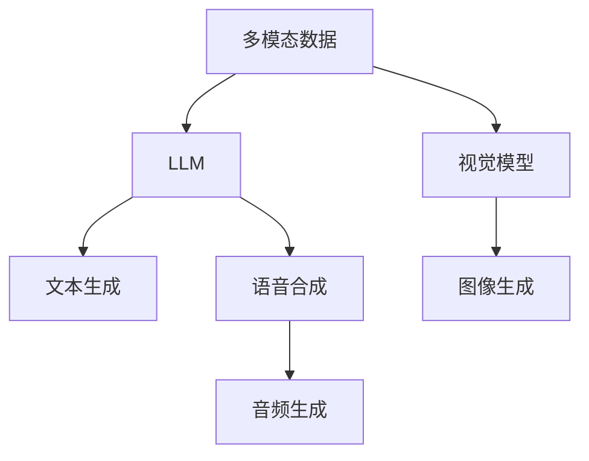
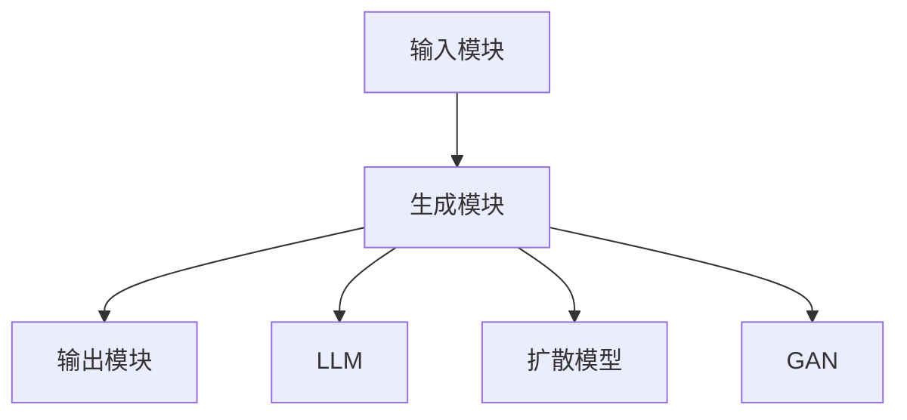

                 


# 多模态内容生成AI Agent：整合LLM与其他生成模型

## 关键词：多模态生成，AI Agent，LLM，生成模型，扩散模型，GAN，系统架构

## 摘要：本文深入探讨了多模态内容生成AI Agent的设计与实现，重点分析了如何整合大型语言模型（LLM）与其他生成模型（如扩散模型、生成对抗网络等）来提升生成内容的质量和多样性。文章从背景、核心概念、算法原理、系统架构到项目实战，全面解析了多模态生成AI Agent的构建过程，为读者提供了从理论到实践的完整指导。

---

# 第一部分：多模态内容生成AI Agent概述

## 第1章：多模态内容生成与AI Agent背景介绍

### 1.1 多模态内容生成的定义与特点

#### 1.1.1 多模态数据的定义

多模态数据指的是整合了多种数据类型的输入信息，例如文本、图像、语音、视频等。与单模态数据（仅包含一种类型的信息）相比，多模态数据能够提供更丰富的语义信息和上下文信息。

**关键概念：**

- **模态（Modality）**：数据的不同形式或类型，例如文本、图像、语音等。
- **多模态数据**：整合了多种模态的数据，例如一段同时包含文本描述和对应图像的数据。

#### 1.1.2 多模态内容生成的核心特点

多模态内容生成是指基于多模态输入生成多样化的输出内容，例如根据文本描述生成图像，或者根据图像生成描述性文本。其核心特点包括：

1. **跨模态融合**：能够同时理解和处理多种模态的数据。
2. **生成多样性**：生成的内容不仅包含单一模态的信息，还包括与其他模态的关联信息。
3. **语义一致性**：生成的内容在不同模态之间保持语义一致性和逻辑性。

#### 1.1.3 多模态生成与单模态生成的对比

| 特性                | 单模态生成          | 多模态生成          |
|---------------------|---------------------|---------------------|
| 输入数据            | 单一模态（如文本）   | 多种模态（如文本+图像）|
| 输出内容            | 单一模态（如文本）   | 多种模态（如文本+图像）|
| 语义关联性          | 较低                | 较高                |
| 应用场景            | 简单生成任务        | 复杂生成任务        |

---

### 1.2 AI Agent的基本概念与功能

#### 1.2.1 AI Agent的定义

AI Agent（人工智能代理）是指能够感知环境、执行任务并做出决策的智能实体。AI Agent可以是软件程序，也可以是硬件设备，其核心目标是通过智能化的处理和生成能力，为用户提供高效的服务。

#### 1.2.2 AI Agent的核心功能

1. **感知环境**：通过多种模态的传感器或数据源获取输入信息。
2. **理解与推理**：对输入信息进行语义理解和逻辑推理。
3. **生成与决策**：基于理解和推理结果，生成多样化的输出内容或做出决策。
4. **自适应与优化**：根据用户反馈或环境变化，优化自身的生成或决策能力。

#### 1.2.3 AI Agent与传统生成模型的区别

| 特性                | 传统生成模型        | AI Agent             |
|---------------------|---------------------|-----------------------|
| 功能                | 专注于生成单一模态内容| 能够整合多种模态生成内容|
| 智能性              | 基于固定算法生成内容| 具备感知和决策能力     |
| 应用场景            | 单一任务生成        | 复杂场景下的生成与决策|

---

### 1.3 多模态内容生成AI Agent的应用场景

#### 1.3.1 多模态生成在自然语言处理中的应用

- **文本到图像生成**：根据输入的文本描述生成对应的图像或图形。
- **对话生成**：在多轮对话中结合上下文和情感信息生成更自然的回复。
- **跨语言生成**：在多语言环境下生成准确且符合语境的文本内容。

#### 1.3.2 多模态生成在计算机视觉中的应用

- **图像描述生成**：根据输入的图像生成描述性文本。
- **视频摘要生成**：从视频内容中提取关键帧并生成对应的文本摘要。
- **图像风格迁移**：根据输入的图像生成不同风格的图像内容。

#### 1.3.3 多模态生成在跨领域应用中的潜力

- **教育领域**：根据学习者的知识水平和学习目标生成个性化的学习内容。
- **医疗领域**：根据患者的病历和症状生成诊断建议和治疗方案。
- **娱乐领域**：根据用户的兴趣生成个性化的内容推荐和互动体验。

---

## 第2章：多模态内容生成的核心概念与联系

### 2.1 多模态数据的整合与处理

#### 2.1.1 多模态数据的整合方式

多模态数据的整合方式包括以下几种：

1. **并行处理**：同时处理多种模态的数据，例如同时处理文本和图像。
2. **序列处理**：按照时间顺序处理多种模态的数据，例如视频中逐帧处理图像和音频。
3. **特征融合**：将不同模态的数据转换为特征向量后进行融合处理。

#### 2.1.2 多模态数据的特征提取方法

- **基于深度学习的特征提取**：利用卷积神经网络（CNN）提取图像特征，利用循环神经网络（RNN）提取文本特征。
- **跨模态对齐**：通过将不同模态的特征对齐，消除模态之间的语义差异。

#### 2.1.3 多模态数据的对齐与融合

**对齐**：将不同模态的数据在语义上对齐，例如将文本中的“猫”与图像中的猫图像对齐。

**融合**：将对齐后的数据进行融合，例如通过加权融合的方式生成最终的特征向量。

---

### 2.2 LLM与其他生成模型的对比分析

#### 2.2.1 LLM的定义与特点

- **定义**：LLM（Large Language Model）是指经过大规模文本数据训练的生成模型，例如GPT系列、BERT系列等。
- **特点**：
  - 基于Transformer架构。
  - 具备强大的上下文理解和生成能力。
  - 适用于多种自然语言处理任务。

#### 2.2.2 其他生成模型（如扩散模型、GAN等）的原理

- **扩散模型**：通过逐步添加噪声并逐步去噪的过程生成高质量的图像内容。
- **生成对抗网络（GAN）**：由生成器和判别器组成，通过对抗训练生成逼真的数据。
- **变体自编码器（VAE）**：通过编码器和解码器的组合，生成多样化的数据。

#### 2.2.3 不同生成模型的优缺点对比

| 模型类型       | 优点                           | 缺点                           |
|----------------|--------------------------------|---------------------------------|
| LLM           | 强大的文本生成能力               | 不适用于图像等其他模态的生成     |
| 扩散模型       | 高质量的图像生成能力             | 训练时间长，推理速度较慢         |
| GAN            | 生成逼真数据                   | �易受模式坍缩问题影响               |
| VAE            | 生成多样化数据                   | 生成质量较低                     |

---

### 2.3 多模态生成模型的实体关系图



---

## 第3章：多模态内容生成AI Agent的算法原理

### 3.1 LLM的训练与推理过程

#### 3.1.1 LLM的训练流程

1. **数据准备**：收集大规模的文本数据，进行预处理和清洗。
2. **模型构建**：基于Transformer架构构建模型。
3. **损失函数优化**：使用交叉熵损失函数，通过梯度下降优化模型参数。
4. **预训练**：在大规模数据上进行无监督或有监督预训练。

#### 3.1.2 LLM的推理机制

- **解码过程**：基于输入的上下文，逐步生成下一个词。
- **注意力机制**：通过自注意力机制捕捉文本中的长程依赖关系。

#### 3.1.3 LLM的数学模型与公式

$$P(\text{output} | \text{input}) = \prod_{i=1}^{n} P(w_i | w_{i-1}, ..., w_{i-k})$$

---

### 3.2 其他生成模型的算法原理

#### 3.2.1 扩散模型的生成过程

1. **噪声添加**：从输入数据开始，逐步添加噪声。
2. **噪声去除**：逐步学习如何从带噪声的数据中恢复原始数据。

#### 3.2.2 GAN的生成对抗过程

1. **生成器**：生成逼真的数据。
2. **判别器**：判别生成数据与真实数据的区别。
3. **对抗训练**：通过最小化判别器的损失函数优化生成器。

#### 3.2.3 VAE的变体自编码器过程

1. **编码器**：将输入数据映射到潜在空间。
2. **解码器**：从潜在空间生成多样化的数据。

---

### 3.3 多模态生成模型的融合方法

#### 3.3.1 跨模态對齊

- **方法**：通过将不同模态的特征向量对齐，消除模态之间的语义差异。
- **实现**：使用对比学习或相似性度量的方法进行对齐。

#### 3.3.2 跨模态生成

- **方法**：基于对齐后的特征向量，生成目标模态的内容。
- **实现**：通过条件生成模型或联合生成模型实现跨模态生成。

---

## 第4章：多模态内容生成AI Agent的系统架构

### 4.1 系统功能设计

- **输入模块**：接收多模态的输入数据。
- **生成模块**：整合LLM和其他生成模型，生成多样化的输出内容。
- **输出模块**：将生成的内容输出给用户或下游系统。

### 4.2 系统架构设计



---

## 第5章：多模态内容生成AI Agent的项目实战

### 5.1 项目环境安装

```bash
pip install numpy tensorflow keras matplotlib
```

### 5.2 系统核心实现源代码

```python
import numpy as np
import tensorflow as tf

class MultiModalGenerator:
    def __init__(self):
        self.llm = LLMModel()
        self.diffusion = DiffusionModel()
        self.gan = GANModel()

    def generate_content(self, input_data):
        # 对齐模态数据
        aligned_data = self.align_modalities(input_data)
        # 调用生成模型
        generated_output = self.generate(aligned_data)
        return generated_output

    def generate(self, aligned_data):
        # 使用LLM生成文本
        text_output = self.llm.generate(aligned_data['text'])
        # 使用扩散模型生成图像
        image_output = self.diffusion.generate(aligned_data['image'])
        return {'text': text_output, 'image': image_output}
```

---

## 第6章：最佳实践与小结

### 6.1 最佳实践

- **模型选择**：根据具体任务选择合适的生成模型。
- **数据预处理**：确保多模态数据的对齐和融合。
- **性能优化**：通过并行计算和模型剪枝优化生成速度。

### 6.2 小结

多模态内容生成AI Agent的整合与应用为AI技术带来了新的可能性。通过将LLM与其他生成模型结合，可以生成更高质量和多样化的多模态内容，推动AI技术在多个领域的深入应用。

---

## 作者：AI天才研究院 & 禅与计算机程序设计艺术

