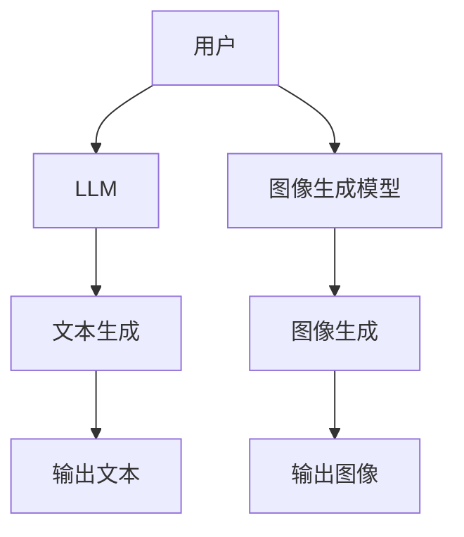
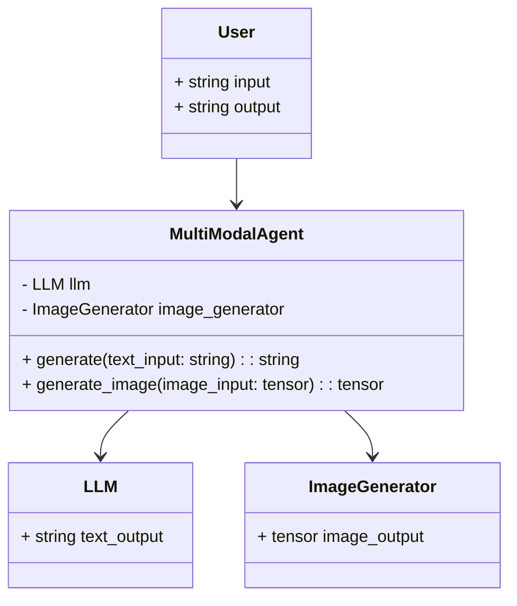
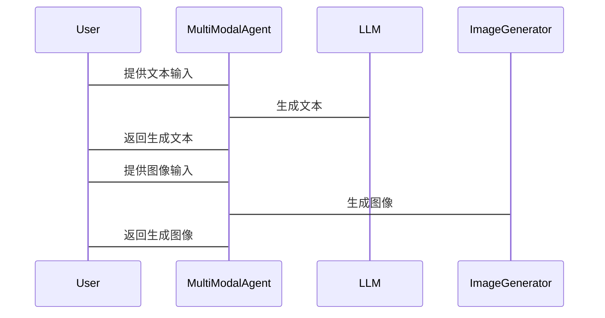

                 


# 多模态创作AI Agent：整合LLM与图像生成技术

> 关键词：多模态创作、LLM、图像生成、AI Agent、协同机制

> 摘要：本文探讨了多模态创作AI Agent的核心概念，详细分析了如何将大语言模型（LLM）与图像生成技术相结合，构建一个能够同时处理文本和图像创作的智能系统。文章从背景介绍、核心概念、算法原理、系统架构、项目实战到总结，全面解析了多模态创作AI Agent的技术细节与应用场景。

---

# 第一部分: 多模态创作AI Agent基础

---

## 第1章: 多模态创作AI Agent概述

### 1.1 多模态创作AI Agent的定义与背景

#### 1.1.1 多模态创作的定义
多模态创作是指在同一创作过程中结合多种模态（如文本、图像、语音等）的能力，通过融合不同模态的信息，实现更丰富、更智能的创作体验。多模态创作AI Agent是一种能够同时理解和生成多种模态内容的智能系统。

#### 1.1.2 AI Agent的基本概念
AI Agent（智能代理）是指能够感知环境、执行任务并做出决策的智能系统。AI Agent可以是软件程序，也可以是机器人，其核心目标是通过与环境交互，实现特定的任务目标。

#### 1.1.3 多模态创作AI Agent的整合意义
多模态创作AI Agent的整合意义在于将大语言模型（LLM）的文本生成能力与图像生成技术相结合，形成一个能够同时处理文本和图像创作的智能系统。这种整合可以提升创作效率、丰富创作内容，并为用户提供更灵活的创作方式。

### 1.2 LLM与图像生成技术的背景

#### 1.2.1 大语言模型（LLM）的发展历程
大语言模型（LLM）的发展经历了从简单的关键词匹配到复杂的深度学习模型的演变。近年来，以GPT系列为代表的模型在自然语言处理领域取得了突破性进展，具备了强大的文本生成能力。

#### 1.2.2 图像生成技术的演进
图像生成技术从早期的简单算法（如随机噪声生成）发展到基于GAN（生成对抗网络）和Diffusion模型的复杂生成方法。这些技术的进步使得生成高质量图像成为可能。

#### 1.2.3 LLM与图像生成技术的结合趋势
随着技术的进步，LLM与图像生成技术的结合成为趋势。通过将文本生成与图像生成结合起来，可以实现更智能、更个性化的创作体验。

### 1.3 多模态创作AI Agent的应用场景

#### 1.3.1 文本生成与图像生成的结合
多模态创作AI Agent可以通过文本生成和图像生成的结合，实现从文本描述生成图像、从图像生成文本等多种创作方式。

#### 1.3.2 多模态创作在艺术、设计与教育中的应用
在艺术领域，多模态创作AI Agent可以帮助艺术家快速生成灵感草图；在设计领域，它可以辅助设计师优化设计方案；在教育领域，它可以为学生提供个性化的学习资源。

#### 1.3.3 企业级应用的潜力与挑战
企业可以通过多模态创作AI Agent提升内容生成效率，降低内容创作成本。然而，技术实现复杂性和数据隐私问题也带来了挑战。

### 1.4 本章小结
本章介绍了多模态创作AI Agent的基本概念、背景和应用场景，为后续内容奠定了基础。

---

## 第2章: 多模态创作AI Agent的核心概念与联系

### 2.1 大语言模型（LLM）的原理

#### 2.1.1 LLM的基本原理
大语言模型（LLM）通过深度学习技术，从大量的文本数据中学习语言规律，并通过生成模型生成符合语法规则的文本。

#### 2.1.2 LLM的训练与推理过程
1. **训练过程**：通过监督学习和无监督学习，模型学习文本数据中的语言规律。
2. **推理过程**：根据输入的上下文，生成符合语境的文本。

#### 2.1.3 LLM的优缺点分析
- **优点**：生成能力强，能够处理复杂语言任务。
- **缺点**：对计算资源要求高，生成结果可能存在偏差。

### 2.2 图像生成技术的原理

#### 2.2.1 基于GAN的图像生成
1. **生成器**：通过生成对抗网络生成图像。
2. **判别器**：判别生成图像是否为真实图像。

#### 2.2.2 基于Diffusion模型的图像生成
Diffusion模型通过逐步添加噪声到数据，最终生成高质量图像。

#### 2.2.3 图像生成技术的优缺点分析
- **优点**：生成图像质量高，多样化。
- **缺点**：生成过程计算量大，需要大量训练数据。

### 2.3 多模态模型的结构与协同机制

#### 2.3.1 多模态模型的基本结构
多模态模型通常由文本处理模块和图像生成模块组成，通过协同机制实现模态间的交互与协调。

#### 2.3.2 LLM与图像生成模型的协同方式
1. **基于文本的图像生成**：根据输入文本生成图像。
2. **图像辅助的文本生成**：根据输入图像生成描述性文本。

#### 2.3.3 多模态模型的训练策略
- **联合训练**：同时训练模型处理文本和图像。
- **交替训练**：分别优化文本和图像处理能力。

### 2.4 核心概念对比分析

#### 2.4.1 LLM与图像生成模型的对比表格

| 特性                | LLM                          | 图像生成模型                 |
|---------------------|------------------------------|-----------------------------|
| 输入               | 文本                          | 图像或噪声                  |
| 输出               | 文本                          | 图像                        |
| 优势               | 强大的文本生成能力            | 高质量的图像生成能力        |
| 挑战               | 对计算资源要求高              | 需要大量训练数据            |

#### 2.4.2 多模态模型的ER实体关系图


---

## 第3章: 多模态创作AI Agent的算法原理

### 3.1 大语言模型（LLM）的算法流程

#### 3.1.1 LLM的训练流程

1. **数据准备**：收集和预处理文本数据。
2. **模型构建**：搭建深度学习模型。
3. **训练过程**：通过反向传播优化模型参数。
4. **评估与优化**：通过验证集评估模型性能并进行优化。

#### 3.1.2 LLM的推理流程

1. **输入处理**：接收用户输入的文本。
2. **生成文本**：根据输入生成输出文本。
3. **输出结果**：返回生成的文本。

#### 3.1.3 LLM的数学模型与公式
- **损失函数**：交叉熵损失
  $$ L = -\frac{1}{N}\sum_{i=1}^{N} \sum_{j=1}^{M} y_{i,j} \log p(y_{i,j}|y_{i,1}, ..., y_{i,j-1})) $$
- **生成过程**：基于条件概率的生成
  $$ P(y|x) = \argmax_{y} P(y|x) $$

#### 3.1.4 代码实现示例
```python
import torch
import torch.nn as nn
import torch.optim as optim

class LLM(nn.Module):
    def __init__(self, vocab_size):
        super().__init__()
        self.embedding = nn.Embedding(vocab_size, 512)
        self.decoder = nn.Linear(512, vocab_size)

    def forward(self, x):
        embed = self.embedding(x)
        output = self.decoder(embed)
        return output

# 初始化模型和优化器
model = LLM(vocab_size=10000)
optimizer = optim.Adam(model.parameters(), lr=0.001)

# 训练过程
for epoch in range(num_epochs):
    for batch in train_loader:
        optimizer.zero_grad()
        inputs, labels = batch
        outputs = model(inputs)
        loss = nn.CrossEntropyLoss()(outputs, labels)
        loss.backward()
        optimizer.step()
```

### 3.2 图像生成模型的算法流程

#### 3.2.1 GAN模型的算法流程

1. **生成器**：通过卷积层生成图像。
2. **判别器**：通过反卷积层判断图像是否为真实图像。
3. **交替训练**：生成器和判别器交替优化。

#### 3.2.2 Diffusion模型的算法流程

1. **噪声添加**：逐步向数据添加噪声。
2. **去噪过程**：逐步去除噪声，生成高质量图像。

#### 3.2.3 图像生成模型的优缺点分析
- **优点**：生成图像质量高，多样化。
- **缺点**：训练过程计算量大，生成速度较慢。

### 3.3 多模态模型的协同算法

#### 3.3.1 文本到图像的协同生成
1. **文本输入**：用户输入描述性文本。
2. **图像生成**：根据文本生成图像。

#### 3.3.2 图像到文本的协同生成
1. **图像输入**：用户上传图像。
2. **文本生成**：根据图像生成描述性文本。

#### 3.3.3 协同算法的代码实现
```python
import torch
import torch.nn as nn
import torch.optim as optim

class MultiModalModel(nn.Module):
    def __init__(self):
        super().__init__()
        self.llm = LLM(vocab_size=10000)
        self.image_generator = ImageGenerator()

    def forward(self, text_input, image_input):
        text_output = self.llm(text_input)
        image_output = self.image_generator(image_input)
        return text_output, image_output

# 初始化模型和优化器
model = MultiModalModel()
optimizer = optim.Adam(model.parameters(), lr=0.001)

# 训练过程
for epoch in range(num_epochs):
    for batch in train_loader:
        optimizer.zero_grad()
        text_input, image_input = batch
        outputs = model(text_input, image_input)
        loss = nn.CrossEntropyLoss()(outputs[0], text_labels) + \
               nn.MSELoss()(outputs[1], image_labels)
        loss.backward()
        optimizer.step()
```

---

## 第4章: 多模态创作AI Agent的系统分析与架构设计

### 4.1 系统分析

#### 4.1.1 问题场景介绍
多模态创作AI Agent需要在多种模态之间协同工作，满足用户的创作需求。

#### 4.1.2 项目介绍
本项目旨在开发一个多模态创作AI Agent，能够同时处理文本和图像的创作任务。

### 4.2 系统功能设计

#### 4.2.1 领域模型Mermaid类图


#### 4.2.2 系统架构设计Mermaid架构图
```mermaid
architectural
    数据层
    [
        LLM,
        ImageGenerator
    ]
    业务逻辑层
    [
        MultiModalAgent
    ]
    表现层
    [
        User
    ]
```

#### 4.2.3 系统接口设计
- **文本生成接口**：`generate(text_input: string) -> string`
- **图像生成接口**：`generate_image(image_input: tensor) -> tensor`

#### 4.2.4 系统交互Mermaid序列图


---

## 第5章: 多模态创作AI Agent的项目实战

### 5.1 环境搭建

#### 5.1.1 安装依赖
```bash
pip install torch
pip install torchvision
```

#### 5.1.2 硬件要求
- CPU或GPU（推荐使用GPU加速）
- 足够的内存（至少8GB）

### 5.2 系统核心实现

#### 5.2.1 LLM的实现
```python
class LLM(nn.Module):
    def __init__(self, vocab_size):
        super().__init__()
        self.embedding = nn.Embedding(vocab_size, 512)
        self.decoder = nn.Linear(512, vocab_size)

    def forward(self, x):
        embed = self.embedding(x)
        output = self.decoder(embed)
        return output
```

#### 5.2.2 图像生成模型的实现
```python
class ImageGenerator(nn.Module):
    def __init__(self, latent_dim=100):
        super().__init__()
        self.latent_dim = latent_dim
        self.layers = nn.Sequential(
            nn.ConvTranspose2d(latent_dim, 512, 4, 2, 1),
            nn.ReLU(),
            nn.ConvTranspose2d(512, 256, 4, 2, 1),
            nn.ReLU(),
            nn.ConvTranspose2d(256, 128, 4, 2, 1),
            nn.ReLU(),
            nn.ConvTranspose2d(128, 3, 4, 2, 1),
        )

    def forward(self, z):
        z = z.view(-1, self.latent_dim, 1, 1)
        output = self.layers(z)
        return output
```

#### 5.2.3 多模态模型的实现
```python
class MultiModalAgent(nn.Module):
    def __init__(self, vocab_size=10000, latent_dim=100):
        super().__init__()
        self.llm = LLM(vocab_size)
        self.image_generator = ImageGenerator(latent_dim)

    def forward(self, text_input, z):
        text_output = self.llm(text_input)
        image_output = self.image_generator(z)
        return text_output, image_output
```

### 5.3 代码实现与应用解读

#### 5.3.1 训练过程
```python
# 训练文本生成模型
optimizer = optim.Adam(llm.parameters(), lr=0.001)
criterion = nn.CrossEntropyLoss()

for epoch in range(num_epochs):
    for batch in text_train_loader:
        optimizer.zero_grad()
        inputs, labels = batch
        outputs = llm(inputs)
        loss = criterion(outputs, labels)
        loss.backward()
        optimizer.step()
```

#### 5.3.2 图像生成过程
```python
# 生成随机噪声
z = torch.randn(batch_size, latent_dim, 1, 1)

# 生成图像
with torch.no_grad():
    generated_images = image_generator(z)
```

#### 5.3.3 文本生成过程
```python
# 生成文本
with torch.no_grad():
    generated_texts = multi_modal_agent(text_input)
```

### 5.4 实际案例分析

#### 5.4.1 文本到图像的生成
用户输入描述性文本：“一只猫坐在窗台上”，生成相应的图像。

#### 5.4.2 图像到文本的生成
用户上传一张图片，生成描述性文本：“一只黑白相间的猫坐在窗台上”。

### 5.5 项目小结
通过本项目，我们实现了多模态创作AI Agent，能够同时处理文本和图像的创作任务。通过实际案例分析，验证了模型的有效性和实用性。

---

## 第6章: 最佳实践与小结

### 6.1 最佳实践

#### 6.1.1 环境配置
- 使用高性能硬件加速训练过程。
- 优化代码，减少计算开销。

#### 6.1.2 模型优化
- 使用数据增强技术提高模型的泛化能力。
- 采用早停法防止过拟合。

### 6.2 小结

#### 6.2.1 核心内容回顾
- 多模态创作AI Agent的核心概念。
- LLM与图像生成技术的协同机制。
- 系统架构设计与实现。

#### 6.2.2 问题解决与边界
- 解决了多模态创作中的文本与图像协同生成问题。
- 明确了系统的边界与外延。

#### 6.2.3 拓展思考
- 探索更多模态的整合，如语音、视频等。
- 提升模型的生成效率与生成质量。

---

## 第7章: 总结与展望

### 7.1 总结

#### 7.1.1 核心内容回顾
- 多模态创作AI Agent的基本概念与应用场景。
- LLM与图像生成技术的协同机制。
- 系统设计与实现。

#### 7.1.2 问题解决与创新
- 提供了一种全新的多模态创作方式。
- 实现了LLM与图像生成技术的协同生成。

### 7.2 展望

#### 7.2.1 未来研究方向
- 探索更多模态的整合。
- 提升模型的生成效率与质量。

#### 7.2.2 技术进步与挑战
- 计算资源的限制。
- 数据隐私与安全问题。

---

## 附录: 参考文献与工具资源

### 附录A: 参考文献
1. Radford, A., et al. "Language models are few-shot learners." arXiv preprint arXiv:1909.08692 (2019).
2. Goodfellow, I., et al. "Generative adversarial nets." Advances in neural information processing systems (2014).

### 附录B: 工具资源
1. PyTorch官方文档：https://pytorch.org/
2. Hugging Face Transformers库：https://huggingface.co/transformers/

---

## 作者：AI天才研究院/AI Genius Institute & 禅与计算机程序设计艺术 /Zen And The Art of Computer Programming

---

**全文完**

