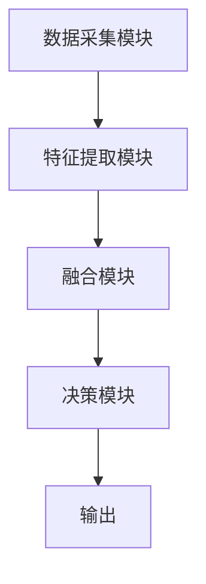

                 


# 多模态融合技术：增强AI Agent的感知与理解能力

> 关键词：多模态融合，AI Agent，感知能力，理解能力，数据融合，多模态技术

> 摘要：  
多模态融合技术是当前人工智能领域的重要研究方向之一。通过整合多种模态的数据（如图像、文本、语音等），AI Agent能够更好地感知和理解复杂的环境信息。本文将从多模态融合技术的基本概念、核心算法、系统架构设计到实际应用场景进行深入探讨，旨在为读者提供一个全面的技术视角，帮助其理解如何通过多模态融合技术提升AI Agent的感知与理解能力。

---

# 第一部分: 多模态融合技术概述

## 第1章: 多模态数据的特征与分类

### 1.1 多模态数据的定义与特征

#### 1.1.1 多模态数据的定义
多模态数据是指来自不同感官渠道（如视觉、听觉、触觉等）的数据形式，通常包括图像、文本、语音、视频等多种类型。这些数据具有不同的特征和语义信息，能够提供更全面的环境描述。

#### 1.1.2 多模态数据的特征对比
多模态数据的特点可以通过以下对比表格展示：

| 特征维度   | 图像数据       | 文本数据       | 语音数据       |
|------------|---------------|---------------|---------------|
| 数据形式   | 像素值         | 文本序列       | 音频信号       |
| 语义信息   | 视觉信息       | 文本语义       | 音调、节奏     |
| 信息密度   | 高            | 中            | 中            |
| 处理难度   | 较高          | 中等          | 较低          |

#### 1.1.3 多模态数据的分类与应用场景
多模态数据可以分为以下几类：
1. **图像与文本**：常用于图像描述生成、视觉问答等任务。
2. **图像与语音**：应用于语音辅助的图像识别、语音驱动的视觉增强。
3. **文本与语音**：用于语音识别、语音合成等任务。
4. **多模态组合**：如视频、图像、文本的联合分析。

---

## 第2章: 多模态融合技术的核心概念

### 2.1 多模态数据的关联性分析

#### 2.1.1 模态间相关性对比
通过以下表格可以直观地看出不同模态之间的相关性：

| 模态对      | 相关性程度 | 应用场景               |
|-------------|------------|-----------------------|
| 图像与文本  | 中等       | 图像描述生成           |
| 图像与语音  | 较低       | 语音辅助图像识别       |
| 文本与语音  | 高         | 语音识别、语音合成     |

#### 2.1.2 模态间信息互补性
以下是一个简单的模态信息互补性示例：
- **图像**：提供场景的视觉信息，如物体的位置、形状、颜色。
- **文本**：提供场景的文字描述，如物体的名称、属性、上下文信息。
- **语音**：提供场景的语调、情感信息。

通过将这些信息互补，AI Agent可以更全面地理解环境。

#### 2.1.3 模态间冲突与协调
模态间可能存在冲突，例如：
- 图像显示一个物体是红色，但文本描述中提到它是蓝色。
- 语音的情感与文本描述的内容不符。

解决冲突的关键在于如何协调不同模态的信息，通常需要引入融合策略。

---

## 第3章: 多模态融合的核心算法

### 3.1 基于注意力机制的多模态编码器

#### 3.1.1 注意力机制的基本原理
注意力机制通过计算输入序列中每个位置的重要性，从而聚焦于关键信息。其数学表达如下：
$$
\alpha_i = \frac{\exp(e_i)}{\sum_{j=1}^{n} \exp(e_j)}
$$
其中，$\alpha_i$ 是第 $i$ 个位置的注意力权重，$e_i$ 是该位置的评分。

#### 3.1.2 多模态编码器的实现
多模态编码器可以通过以下步骤实现：
1. 对每个模态进行特征提取。
2. 计算每个模态的注意力权重。
3. 根据注意力权重对特征进行加权求和。
4. 输出融合后的特征向量。

#### 3.1.3 多模态编码器的代码实现
以下是一个简单的Python代码示例：

```python
import torch

class MultiModalEncoder(torch.nn.Module):
    def __init__(self, input_size, hidden_size):
        super().__init__()
        self.wq = torch.nn.Linear(input_size, hidden_size)
        self.wk = torch.nn.Linear(input_size, hidden_size)
        self.wv = torch.nn.Linear(input_size, hidden_size)
    
    def forward(self, x1, x2):
        q = self.wq(torch.cat([x1, x2], dim=-1))
        k = self.wk(torch.cat([x1, x2], dim=-1))
        v = self.wv(torch.cat([x1, x2], dim=-1))
        
        # 计算注意力权重
        attention = torch.softmax((q @ k.T) / (hidden_size ** 0.5), dim=-1)
        output = (attention @ v)
        return output
```

---

## 第4章: 对比学习与多模态融合

### 4.1 对比学习的基本原理
对比学习通过最大化正样本对的相似性，同时最小化负样本对的相似性，来学习有效的特征表示。其数学表达如下：
$$
\mathcal{L} = \text{CE}(\text{sim}(x_i, x_j), y)
$$
其中，$\text{sim}(x_i, x_j)$ 是相似性函数，$y$ 是目标标签。

### 4.2 对比学习在多模态融合中的应用
对比学习可以应用于多模态数据的预训练，例如：
1. **图像与文本**：通过对比学习，使图像和文本的特征表示在语义空间中对齐。
2. **图像与语音**：通过对比学习，使图像和语音的特征表示在听觉和视觉空间中对齐。

---

## 第5章: 多模态融合的系统架构设计

### 5.1 系统功能设计
AI Agent的多模态融合系统通常包括以下几个功能模块：
1. **数据采集模块**：负责采集多模态数据。
2. **特征提取模块**：对采集到的多模态数据进行特征提取。
3. **融合模块**：将不同模态的特征进行融合。
4. **决策模块**：基于融合后的特征进行决策或生成输出。

---

### 5.2 系统架构设计
以下是多模态融合系统的架构图：



---

## 第6章: 项目实战与代码实现

### 6.1 环境安装
为了实现多模态融合，需要安装以下依赖：
```bash
pip install torch numpy matplotlib
```

### 6.2 核心代码实现
以下是一个简单的多模态融合代码示例：

```python
import torch
import torch.nn as nn
import torch.optim as optim

class MultiModalFuser(nn.Module):
    def __init__(self, input_size, hidden_size):
        super().__init__()
        self.fc1 = nn.Linear(input_size, hidden_size)
        self.fc2 = nn.Linear(hidden_size, 1)
    
    def forward(self, x):
        x = torch.relu(self.fc1(x))
        x = self.fc2(x)
        return x

# 初始化模型和优化器
model = MultiModalFuser(input_size=10, hidden_size=5)
optimizer = optim.Adam(model.parameters(), lr=0.001)

# 定义损失函数
criterion = nn.MSELoss()

# 训练循环
for epoch in range(100):
    for batch_x in batches:
        outputs = model(batch_x)
        loss = criterion(outputs, labels)
        optimizer.zero_grad()
        loss.backward()
        optimizer.step()
```

---

## 第7章: 总结与展望

### 7.1 总结
多模态融合技术通过整合多种模态的数据，能够显著提升AI Agent的感知与理解能力。本文从多模态数据的特征、融合算法、系统架构到实际应用进行了全面探讨，为读者提供了一个系统的视角。

### 7.2 展望
未来，随着AI技术的不断发展，多模态融合技术将更加智能化和多样化。如何处理模态间的异构性和信息冲突，如何设计更高效的融合算法，将是研究者们继续探索的方向。

---

# 作者
作者：AI天才研究院/AI Genius Institute  
专栏：禅与计算机程序设计艺术/Zen And The Art of Computer Programming

