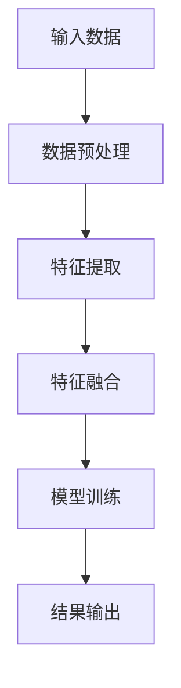

                 


# 多模态输入处理：文本、图像、音频的综合理解

> 关键词：多模态输入处理，文本处理，图像处理，音频处理，多模态融合，深度学习

> 摘要：多模态输入处理是现代人工智能系统中的核心任务之一，涉及文本、图像和音频等多种数据类型的综合理解和处理。本文将从基础概念出发，详细探讨文本、图像和音频的处理方法，分析多模态数据融合的原理与实现，最后通过实际案例展示多模态输入处理的应用与挑战。

---

## 第一部分: 多模态输入处理基础

### 第1章: 多模态输入处理概述

#### 1.1 多模态数据的定义与特点

多模态数据指的是由多种感官数据类型组成的复杂数据形式，常见的包括文本、图像、音频、视频等。与单模态数据相比，多模态数据具有以下特点：

- **异构性**：不同模态的数据具有不同的特征和表达方式。
- **互补性**：多种模态数据可以相互补充，提供更全面的信息。
- **复杂性**：多模态数据的处理需要结合多种算法和模型。

| 模态类型 | 特征 | 示例 |
|----------|------|------|
| 文本 | 离散性、语义丰富 | 书籍、文章 |
| 图像 | 高维性、空间性 | 照片、图形 |
| 音频 | 时间序列性、情感表达 | 音乐、语音 |

#### 1.2 多模态输入处理的应用场景

多模态数据在多个领域有广泛应用，例如：

- **自然语言处理**：文本与图像的联合分析（如图像描述生成）。
- **计算机视觉**：图像与音频的联合分析（如视频内容理解）。
- **语音识别**：音频与文本的联合分析（如语音辅助输入）。

#### 1.3 本章小结

本章介绍了多模态数据的基本概念和特点，并通过对比分析展示了多模态数据在不同领域的应用潜力。

---

### 第2章: 文本处理基础

#### 2.1 文本预处理

文本预处理是文本处理的第一步，主要包括：

- **文本清洗**：去除无用字符、填充缺失值。
- **分词**：将文本分割成词语或短语。
- **词干提取**：将词语还原为基本词干。

#### 2.2 文本特征提取

文本特征提取是将文本转换为可计算形式的关键步骤，常用方法包括：

- **TF-IDF**：基于词频的加权方法。
- **词嵌入**：如Word2Vec、GloVe，将词语映射为低维向量。
- **预训练模型**：如BERT，用于捕捉上下文语义。

#### 2.3 文本分类与情感分析

文本分类是根据文本内容将其归类到预定义类别中的任务，情感分析是其典型应用。

- **文本分类**：基于机器学习（如SVM）或深度学习（如CNN、RNN）模型实现。
- **情感分析**：通过分析文本的情感倾向（正面、负面、中性）进行分类。

---

### 第3章: 图像处理基础

#### 3.1 图像预处理

图像预处理是图像处理的基础，包括：

- **图像增强**：调整图像亮度、对比度等。
- **归一化**：将图像标准化以适应模型输入要求。
- **边缘检测**：提取图像边缘特征。

#### 3.2 图像特征提取

图像特征提取是通过算法提取图像中对分类或识别有用的特征，常用方法包括：

- **SIFT**：基于兴趣点的特征提取。
- **HOG**：基于方向梯度的特征提取。
- **CNN**：基于深度学习的特征提取。

#### 3.3 图像分类与目标检测

图像分类是根据图像内容将其归类到预定义类别中的任务，目标检测是在图像中定位和识别目标物体。

- **图像分类**：基于CNN（如ResNet）实现。
- **目标检测**：基于R-CNN、YOLO等算法实现。

---

### 第4章: 音频处理基础

#### 4.1 音频预处理

音频预处理包括：

- **降噪处理**：去除背景噪声。
- **格式转换**：将音频转换为统一格式（如WAV、MP3）。
- **归一化**：将音频信号归一化到特定范围。

#### 4.2 音频特征提取

音频特征提取是通过算法提取音频信号中的有用特征，常用方法包括：

- **MFCC**：基于频率域的特征提取。
- **ZCR**：基于时间域的特征提取。

#### 4.3 音频分类与语音识别

音频分类是根据音频内容将其归类到预定义类别中的任务，语音识别是将语音信号转换为文本的任务。

- **语音识别**：基于HMM、CTC、Transformer等算法实现。

---

### 第5章: 多模态数据融合方法

#### 5.1 多模态数据融合的定义与分类

多模态数据融合是将多种模态的数据进行综合处理，以提高系统的性能。常见的融合方法包括：

- **特征级融合**：将不同模态的特征向量进行融合。
- **决策级融合**：将不同模态的分类结果进行融合。
- **模型级融合**：将不同模态的模型进行联合训练。

#### 5.2 多模态数据融合的实现方法

多模态数据融合的具体实现方法包括：

- **早期融合**：在特征提取阶段进行融合。
- **晚期融合**：在分类或决策阶段进行融合。

---

### 第6章: 多模态输入处理的算法原理

#### 6.1 多模态输入处理的算法流程

多模态输入处理的算法流程包括：

1. **数据预处理**：对文本、图像、音频进行预处理。
2. **特征提取**：分别提取文本、图像、音频的特征。
3. **特征融合**：将不同模态的特征进行融合。
4. **模型训练**：基于融合的特征进行模型训练。
5. **结果输出**：输出最终的处理结果。

#### 6.2 多模态输入处理的数学模型

多模态输入处理的数学模型可以用以下公式表示：

$$
P(y|x) = \sum_{i=1}^{n} P(y|x_i) P(x_i|x_{-i})
$$

其中，$x$ 表示输入数据，$y$ 表示输出类别，$x_i$ 表示某一模态的特征，$x_{-i}$ 表示其他模态的特征。

---

### 第7章: 多模态输入处理的系统架构设计

#### 7.1 系统功能设计

多模态输入处理系统的主要功能包括：

- **数据输入**：接收文本、图像、音频等多种数据类型。
- **数据处理**：对输入数据进行预处理和特征提取。
- **数据融合**：将不同模态的特征进行融合。
- **模型训练**：基于融合的特征进行模型训练。
- **结果输出**：输出最终的处理结果。

#### 7.2 系统架构设计

多模态输入处理系统的架构设计如下：



---

### 第8章: 多模态输入处理的项目实战

#### 8.1 项目环境安装

安装必要的库：

```bash
pip install numpy pandas scikit-learn tensorflow keras
```

#### 8.2 核心代码实现

文本、图像、音频处理的核心代码示例：

```python
import numpy as np
from tensorflow.keras.models import Model
from tensorflow.keras.layers import Input, Dense, LSTM, Conv2D

# 文本处理
text_input = Input(shape=(max_length,))
x = LSTM(64)(text_input)
text_output = Dense(32, activation='relu')(x)

# 图像处理
image_input = Input(shape=(height, width, channels))
x = Conv2D(32, (3,3), activation='relu')(image_input)
image_output = Dense(32, activation='relu')(x)

# 音频处理
audio_input = Input(shape=(timesteps, features))
x = LSTM(64)(audio_input)
audio_output = Dense(32, activation='relu')(x)

# 特征融合
merged = concatenate([text_output, image_output, audio_output])
final_output = Dense(1, activation='sigmoid')(merged)

model = Model(inputs=[text_input, image_input, audio_input], outputs=final_output)
model.compile(optimizer='adam', loss='binary_crossentropy', metrics=['accuracy'])
```

#### 8.3 项目小结

本章通过一个具体的案例展示了多模态输入处理的实现过程，从数据预处理到特征提取，再到模型训练和结果输出，详细介绍了每一步的具体实现。

---

## 结论

多模态输入处理是现代人工智能系统中的重要任务，通过对文本、图像和音频等多种数据类型的综合理解和处理，可以显著提高系统的性能和用户体验。本文从基础概念出发，详细探讨了多模态数据的处理方法，并通过实际案例展示了多模态输入处理的应用与挑战。

---

## 作者

作者：AI天才研究院/AI Genius Institute & 禅与计算机程序设计艺术 /Zen And The Art of Computer Programming

---

