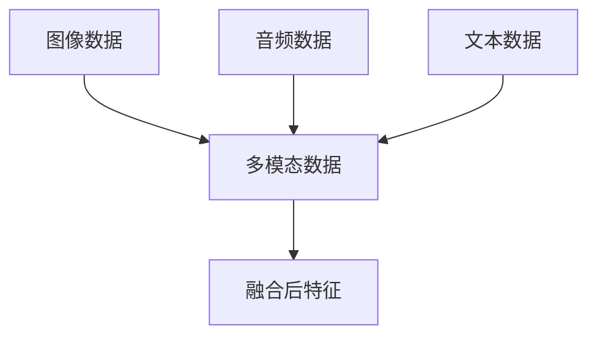
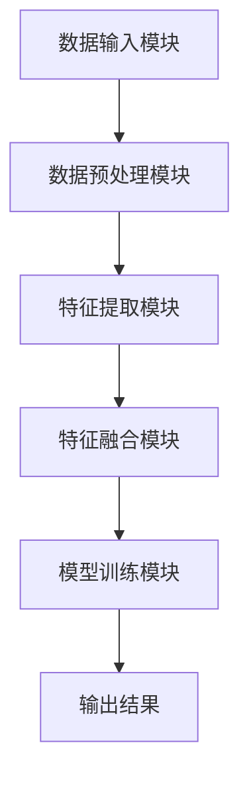
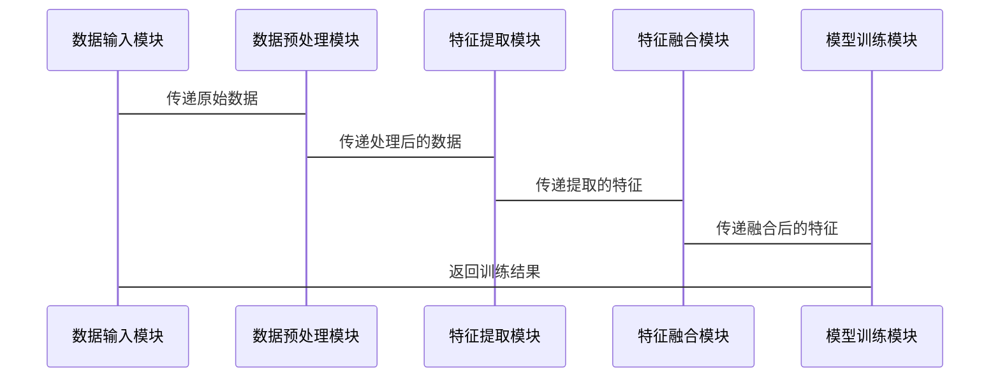

                 


---

# 多模态输入处理：让AI Agent理解图像和音频

> **关键词：** 多模态输入、AI Agent、图像处理、音频处理、数据融合、机器学习

> **摘要：** 本文深入探讨了多模态输入处理的核心概念、算法原理和系统架构，通过实际案例展示了如何让AI Agent同时理解和处理图像和音频数据。文章从背景介绍出发，详细讲解了多模态数据的特征、融合方法，并通过系统设计和项目实战，帮助读者掌握多模态输入处理的实现技巧。最后，结合实际应用，总结了多模态输入处理的关键点和未来发展方向。

---

### # 第一部分: 多模态输入处理的背景与概念

#### ## 第1章: 多模态输入处理的背景与重要性

##### ### 1.1 多模态数据的基本概念

多模态数据指的是多种类型的数据输入形式，如图像、音频、文本等。与单一模态数据相比，多模态数据能够提供更多维度的信息，使AI Agent能够更全面地理解和处理问题。例如，当AI Agent需要识别一张图片中的物体时，结合音频数据（如物体发出的声音）可以显著提高识别的准确率。

##### ### 1.2 AI Agent的理解能力

AI Agent的核心能力在于能够理解和处理多种输入形式。传统的AI系统往往只能处理单一模态的数据，如文本或图像，而多模态输入处理能力的引入，使得AI Agent能够更接近人类的感知方式，从而在实际应用中表现出更强的智能性。

##### ### 1.3 多模态输入处理的现状与未来

当前，多模态输入处理技术已经在多个领域取得了显著进展，如计算机视觉、语音识别和自然语言处理。然而，如何高效地融合不同模态的数据，并从中提取有用的信息，仍然是一个具有挑战性的研究方向。未来，随着深度学习和神经网络技术的不断发展，多模态输入处理将变得更加高效和智能。

---

### # 第二部分: 多模态数据处理的核心概念与联系

#### ## 第2章: 多模态数据的类型与特征

##### ### 2.1 图像数据

图像数据是多模态输入处理中的重要组成部分。图像的结构可以通过像素矩阵表示，每个像素包含颜色和亮度信息。图像数据的预处理方法包括归一化、数据增强等。

##### ### 2.2 音频数据

音频数据是另一种重要的多模态数据类型。音频的特征可以通过波形图和频谱图表示，预处理方法包括降噪、分割等。

##### ### 2.3 文本数据

文本数据可以通过字符、词或句子的结构表示。预处理方法包括分词、去除停用词等。

##### ### 2.4 多模态数据的融合方式

多模态数据的融合方式包括并行融合和串行融合。并行融合是将不同模态的数据同时输入到模型中，串行融合则是按顺序处理不同模态的数据。此外，基于注意力机制的融合方法近年来也得到了广泛应用。

##### ### 2.5 多模态数据的实体关系图



---

### # 第三部分: 多模态数据处理的算法原理

#### ## 第3章: 多模态数据融合的算法原理

##### ### 3.1 多模态数据融合的基本方法

多模态数据融合的基本方法包括基于特征的融合和基于决策的融合。基于特征的融合是将不同模态的数据特征直接融合，而基于决策的融合则是先分别处理每种模态数据，再将结果进行融合。

##### ### 3.2 多模态数据融合的算法流程

多模态数据融合的算法流程通常包括以下几个步骤：

1. 数据预处理：对不同模态的数据进行归一化、降维等处理。
2. 特征提取：使用深度学习模型提取每种模态的特征。
3. 特征融合：将不同模态的特征进行融合，得到最终的表示。
4. 模型训练：使用融合后的特征训练分类器或其他任务模型。

##### ### 3.3 多模态数据融合的数学模型

多模态数据融合的数学模型可以通过以下公式表示：

$$
y = f(x_1, x_2, \ldots, x_n)
$$

其中，\( x_1, x_2, \ldots, x_n \) 表示不同模态的输入数据，\( y \) 是融合后的输出。

##### ### 3.4 多模态数据融合的实现代码

以下是一个简单的多模态数据融合的代码示例：

```python
import numpy as np

def fuse_modalities(image_features, audio_features):
    # 将图像和音频特征进行拼接
    fused_features = np.concatenate([image_features, audio_features], axis=-1)
    return fused_features

# 示例使用
image_features = np.random.randn(10, 64)
audio_features = np.random.randn(10, 32)
fused_features = fuse_modalities(image_features, audio_features)
print(fused_features.shape)  # 输出：(10, 96)
```

---

### # 第四部分: 多模态数据处理的系统架构设计

#### ## 第4章: 系统架构与功能设计

##### ### 4.1 系统功能模块设计

多模态数据处理系统的功能模块包括：

1. 数据输入模块：接收图像、音频等多模态数据。
2. 数据预处理模块：对输入数据进行归一化、降维等处理。
3. 特征提取模块：使用深度学习模型提取特征。
4. 特征融合模块：将不同模态的特征进行融合。
5. 模型训练模块：训练融合后的特征进行分类或其他任务。

##### ### 4.2 系统架构设计



##### ### 4.3 系统接口设计

系统接口设计需要考虑不同模块之间的数据传递方式。例如，数据预处理模块将处理后的数据传递给特征提取模块，特征提取模块将提取的特征传递给融合模块，以此类推。

##### ### 4.4 系统交互设计

系统交互设计可以通过序列图来展示不同模块之间的交互过程：



---

### # 第五部分: 多模态数据处理的项目实战

#### ## 第5章: 项目实战与案例分析

##### ### 5.1 项目环境安装

项目实战需要安装以下依赖库：

```bash
pip install numpy matplotlib tensorflow.keras
```

##### ### 5.2 项目核心代码实现

以下是一个多模态数据处理的Python代码示例：

```python
import numpy as np
import tensorflow as tf
from tensorflow.keras import layers

# 定义特征提取模型
def get_feature_extractor(input_shape):
    model = tf.keras.Sequential()
    model.add(layers.Conv2D(32, (3, 3), activation='relu', input_shape=input_shape))
    model.add(layers.MaxPooling2D((2, 2)))
    model.add(layers.Flatten())
    model.add(layers.Dense(64, activation='relu'))
    return model

# 定义特征融合模型
def get_fusion_model(image_features, audio_features):
    input_image = layers.Input(shape=image_features.shape[1:])
    input_audio = layers.Input(shape=audio_features.shape[1:])
    
    feature_image = get_feature_extractor((image_features.shape[1], image_features.shape[2], image_features.shape[3]))(input_image)
    feature_audio = get_feature_extractor((audio_features.shape[1], audio_features.shape[2], audio_features.shape[3]))(input_audio)
    
    concatenated = layers.Concatenate()([feature_image, feature_audio])
    output = layers.Dense(1, activation='sigmoid')(concatenated)
    
    model = tf.keras.Model(inputs=[input_image, input_audio], outputs=output)
    model.compile(optimizer='adam', loss='binary_crossentropy', metrics=['accuracy'])
    return model

# 示例使用
image_features = np.random.randn(10, 128, 128, 3)
audio_features = np.random.randn(10, 64, 64, 1)
model = get_fusion_model(image_features, audio_features)
model.summary()
```

##### ### 5.3 项目实现解读与分析

上述代码实现了多模态数据的特征提取和融合。图像数据和音频数据分别通过卷积神经网络提取特征，然后通过拼接的方式进行融合，最后通过全连接层进行分类。

##### ### 5.4 项目小结

通过上述项目实战，我们可以看到多模态数据处理的实现过程，包括数据预处理、特征提取、融合和模型训练等步骤。实际应用中，需要根据具体任务选择合适的算法和模型。

---

### # 第六部分: 多模态数据处理的最佳实践与总结

#### ## 第6章: 最佳实践与注意事项

##### ### 6.1 关键点总结

1. 多模态数据处理的核心在于如何有效地融合不同模态的数据。
2. 特征提取和融合方法的选择对最终的性能有重要影响。
3. 在实际应用中，需要根据具体任务选择合适的算法和模型。

##### ### 6.2 注意事项

1. 数据预处理是关键，不同模态的数据需要统一归一化。
2. 特征提取模型的选择需要考虑数据的特性和任务需求。
3. 融合方法的选择需要根据实验结果进行调整。

##### ### 6.3 拓展阅读

1. "Deep Learning" by Ian Goodfellow
2. "Pattern Recognition and Machine Learning" by Christopher M. Bishop
3. "Multi-modal Data Fusion: A Survey" by Z. Zhou et al.

---

### # 结语

多模态输入处理是AI Agent理解复杂场景的关键技术。通过本文的介绍，我们详细探讨了多模态数据处理的核心概念、算法原理和系统架构，并通过实际案例展示了如何实现多模态数据的融合。未来，随着技术的不断发展，多模态输入处理将在更多领域展现出强大的应用潜力。

---

**作者：AI天才研究院/AI Genius Institute & 禅与计算机程序设计艺术 /Zen And The Art of Computer Programming**

