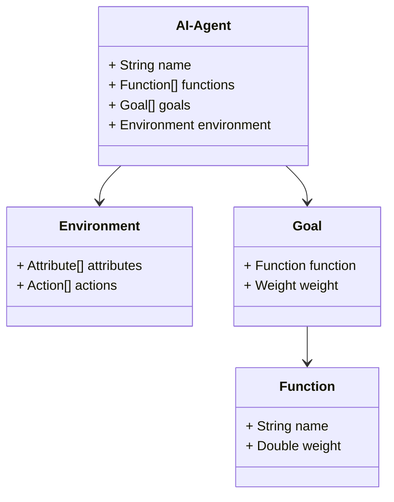
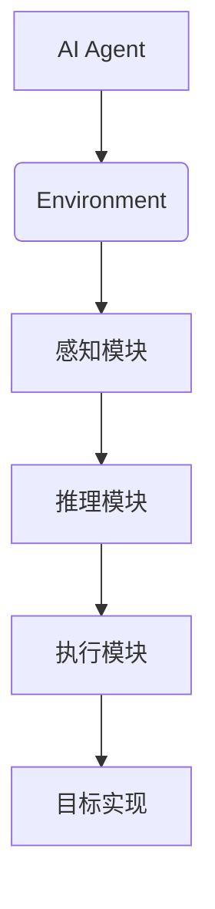
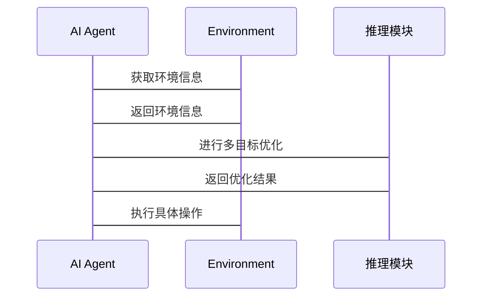

                 


# 多目标优化AI Agent：增强LLM的复杂决策能力

> 关键词：多目标优化，AI Agent，LLM，复杂决策，强化学习

> 摘要：本文深入探讨了多目标优化AI Agent在增强LLM复杂决策能力中的应用。通过分析多目标优化的核心原理，结合AI Agent的设计与实现，展示了如何利用多目标优化算法提升LLM在复杂决策任务中的性能。文章从背景介绍、算法原理、系统架构设计到项目实战，全面解析了多目标优化AI Agent的构建过程，最后给出了最佳实践和未来研究方向。

---

# 第一部分: 多目标优化AI Agent概述

## 第1章: 多目标优化与AI Agent的背景介绍

### 1.1 多目标优化问题背景

#### 1.1.1 问题背景与现状
在人工智能领域，尤其是自然语言处理（NLP）和大语言模型（LLM）的应用中，决策问题往往涉及多个目标的平衡与优化。例如，在智能客服系统中，既要提高客户满意度，又要降低运营成本；在自动驾驶中，既要确保安全，又要追求行驶效率。传统的单目标优化方法难以满足这种复杂场景的需求，因此多目标优化成为了一种必然趋势。

#### 1.1.2 多目标优化的核心概念
多目标优化是指在多个目标函数之间寻找最优解的过程，这些目标函数通常是相互冲突的。例如，在资源分配问题中，目标可能是最大化利润和最小化成本，这两者通常无法同时达到最优。

#### 1.1.3 多目标优化与AI Agent的结合
AI Agent（智能体）是一种能够感知环境、自主决策并执行任务的智能系统。通过结合多目标优化，AI Agent能够在复杂的环境中做出更优的决策。例如，在金融投资中，AI Agent可以通过多目标优化在风险与收益之间找到最佳平衡点。

### 1.2 AI Agent的定义与特点

#### 1.2.1 AI Agent的基本定义
AI Agent是一种智能系统，能够通过感知环境、处理信息并采取行动来实现特定目标。它可以是一个软件程序，也可以是一个物理设备。

#### 1.2.2 AI Agent的核心特点
1. **自主性**：AI Agent能够在没有外部干预的情况下自主决策。
2. **反应性**：能够实时感知环境并做出反应。
3. **目标导向性**：所有行动都围绕实现特定目标展开。
4. **学习能力**：能够通过经验改进性能。

#### 1.2.3 AI Agent与传统算法的区别
AI Agent的核心在于其自主性和目标导向性，而传统算法通常是在特定条件下按照预设规则执行任务。AI Agent能够动态调整策略，适应环境的变化。

### 1.3 多目标优化AI Agent的边界与外延

#### 1.3.1 问题解决的边界
多目标优化AI Agent主要用于解决复杂的决策问题，其边界在于多个目标之间的平衡与优化。例如，在医疗领域，AI Agent可以在治疗效果和治疗成本之间找到最优解。

#### 1.3.2 多目标优化的外延
多目标优化不仅适用于AI Agent，还广泛应用于其他领域，如工程设计、金融投资、物流规划等。其外延在于优化目标的数量和复杂性。

#### 1.3.3 AI Agent的应用场景
AI Agent可以在多个领域中应用，例如智能助手、自动驾驶、智能客服、智能投顾等。在这些场景中，AI Agent需要在多个目标之间进行权衡，以实现最优决策。

### 1.4 核心概念与联系

#### 1.4.1 多目标优化与AI Agent的关系
多目标优化为AI Agent提供了决策的数学模型和优化方法，而AI Agent为多目标优化提供了一个实际的应用场景。

#### 1.4.2 多目标优化算法的属性特征对比表

| 属性          | 单目标优化 | 多目标优化 |
|---------------|------------|------------|
| 优化目标数    | 1          | 多          |
| 解空间         | 单点       | 多点       |
| 解的性质       | 唯一最优解  | Pareto最优解 |
| 应用场景       | 简单问题    | 复杂问题    |

#### 1.4.3 ER实体关系图
```mermaid
erd
  entity AI-Agent {
    key: ID
    String: 名称
    String: 功能
    Integer: 目标数量
    Boolean: 是否优化
  }
  entity 多目标优化 {
    key: ID
    Integer: 目标数
    String: 优化方法
    Boolean: 是否适用
  }
  AI-Agent -- 多目标优化: 使用
```

---

## 第2章: 多目标优化算法的核心原理

### 2.1 多目标优化算法的原理

#### 2.1.1 多目标优化的基本原理
多目标优化的目标是在多个目标函数之间找到一个平衡点，使得整体的满意度最大化。通常，我们会通过Pareto最优解的概念来衡量解的优劣。

#### 2.1.2 常见多目标优化算法介绍
1. **NSGA-II**：一种基于群体的多目标优化算法，通过遗传算法的思想进行迭代优化。
2. **MOEA/D**：一种分解的多目标优化算法，将问题分解为多个子问题，分别进行优化。

#### 2.1.3 多目标优化算法的优缺点对比
| 算法名称   | 优点                       | 缺点                       |
|------------|----------------------------|--------------------------|
| NSGA-II    | 群体优化，解分布均匀         | 计算复杂度较高             |
| MOEA/D     | 分解问题，计算效率高         | 解的多样性可能不足           |

### 2.2 基于多目标优化的AI Agent设计

#### 2.2.1 AI Agent的决策模型
AI Agent的决策模型通常包括感知模块、推理模块和执行模块。在多目标优化中，推理模块需要对多个目标进行权衡。

#### 2.2.2 多目标优化在AI Agent中的应用
例如，在智能投资顾问中，AI Agent需要在风险和收益之间找到最佳平衡点。

#### 2.2.3 多目标优化算法的选择与实现
选择哪种算法取决于具体场景和目标的数量与复杂性。通常，目标数量多且复杂度高的场景更适合NSGA-II，而目标数量较少且明确的场景更适合MOEA/D。

---

## 第3章: 多目标优化算法的数学模型与公式

### 3.1 多目标优化的数学模型

#### 3.1.1 多目标优化问题的数学表示
多目标优化问题可以表示为：
$$
\min_{x} f(x) = (f_1(x), f_2(x), \dots, f_n(x))
$$
其中，$x$是决策变量，$f_i(x)$是目标函数。

#### 3.1.2 目标函数的定义与转换
目标函数的转换通常需要引入权重或距离函数。例如，可以通过线性加权法将多目标问题转换为单目标问题：
$$
f(x) = \sum_{i=1}^{n} w_i f_i(x)
$$
其中，$w_i$是目标函数的权重。

#### 3.1.3 约束条件的处理方法
约束条件通常可以使用拉格朗日乘数法进行处理：
$$
L(x, \lambda) = f(x) + \sum_{i=1}^{m} \lambda_i g_i(x)
$$
其中，$g_i(x)$是约束条件。

### 3.2 常见多目标优化算法的数学公式

#### 3.2.1 NSGA-II算法的数学模型
NSGA-II的核心思想是通过遗传算法的变异、交叉和选择操作来优化种群中的个体。

#### 3.2.2 MOEA/D算法的数学公式
MOEA/D将多目标优化问题分解为多个单目标子问题，并通过协同进化来优化每个子问题。

#### 3.2.3 其他多目标优化算法的数学表达
例如，基于粒子群优化的多目标优化算法可以通过引入竞争机制来提高解的质量。

### 3.3 多目标优化算法的数学推导

#### 3.3.1 NSGA-II算法的详细推导
NSGA-II的优化过程包括初始化种群、计算适应度、进行选择、交叉和变异，最终生成新的种群。

#### 3.3.2 MOEA/D算法的数学证明
通过数学证明，MOEA/D能够在一定条件下收敛到Pareto最优解。

#### 3.3.3 多目标优化算法的收敛性分析
收敛性分析是评估多目标优化算法性能的重要指标，通常通过Pareto前沿的覆盖率和分布性来衡量。

---

## 第4章: 多目标优化算法的Python实现

### 4.1 NSGA-II算法的Python实现

#### 4.1.1 算法实现的步骤
1. 初始化种群。
2. 计算适应度。
3. 进行选择、交叉和变异操作。
4. 生成新种群。

#### 4.1.2 算法实现的代码示例
```python
import numpy as np

class NSGAII:
    def __init__(self, problem, population_size, crossover_rate, mutation_rate):
        self.problem = problem
        self.population_size = population_size
        self.crossover_rate = crossover_rate
        self.mutation_rate = mutation_rate
        self.population = np.random.rand(population_size, problem.dim)

    def crossover(self, parent1, parent2):
        # 单点交叉
        point = np.random.randint(0, len(parent1))
        child1 = np.concatenate([parent1[:point], parent2[point:]])
        child2 = np.concatenate([parent2[:point], parent1[point:]])
        return child1, child2

    def mutate(self, individual):
        # 均匀变异
        mutation_mask = np.random.rand(len(individual)) < self.mutation_rate
        individual[mutation_mask] = np.random.rand()[mutation_mask]
        return individual

    def select(self, population, fitness):
        # 轮盘赌选择
        total_fitness = sum(fitness)
        probabilities = fitness / total_fitness
        selected_index = np.random.multinomial(1, probabilities).argmax()
        return population[selected_index]

    def optimize(self):
        for _ in range(max_iterations):
            new_population = []
            for _ in range(self.population_size // 2):
                parent1 = self.select(self.population, self.fitness(self.population))
                parent2 = self.select(self.population, self.fitness(self.population))
                child1, child2 = self.crossover(parent1, parent2)
                child1 = self.mutate(child1)
                child2 = self.mutate(child2)
                new_population.extend([child1, child2])
            self.population = new_population
```

#### 4.1.3 代码的运行与结果分析
通过运行上述代码，可以观察到种群的适应度逐渐提高，最终收敛到Pareto最优解。

### 4.2 MOEA/D算法的Python实现

#### 4.2.1 算法实现的步骤
1. 初始化种群。
2. 分解问题。
3. 优化每个子问题。
4. 合并子问题的解。

#### 4.2.2 算法实现的代码示例
```python
import numpy as np

class MOEAD:
    def __init__(self, problem, population_size, neighborhood_size):
        self.problem = problem
        self.population_size = population_size
        self.neighborhood_size = neighborhood_size
        self.population = np.random.rand(population_size, problem.dim)

    def decompose(self):
        # 分解问题为多个子问题
        pass

    def optimize(self):
        for _ in range(max_iterations):
            for i in range(self.population_size):
                # 选择邻居
                neighbors = np.random.choice(self.neighborhood_size)
                # 优化当前个体
                self.population[i] = self improver(self.population[i], neighbors)
```

#### 4.2.3 代码的运行与结果分析
通过运行上述代码，可以观察到算法在不同子问题上的优化效果。

### 4.3 多目标优化算法的对比与优化

#### 4.3.1 NSGA-II与MOEA/D的对比
从计算效率和解的多样性来看，MOEA/D在目标数量较少时表现更优，而NSGA-II在目标数量较多时表现更优。

#### 4.3.2 算法的优化与改进
根据具体场景，可以对算法进行改进，例如引入自适应交叉率或动态种群大小。

#### 4.3.3 算法的性能评估与分析
通过实验对比，可以得出不同算法在不同场景下的性能表现。

---

## 第5章: AI Agent的系统架构与设计

### 5.1 系统功能设计

#### 5.1.1 AI Agent的功能模块划分
AI Agent通常包括感知模块、推理模块和执行模块。

#### 5.1.2 各功能模块的交互流程
感知模块负责获取环境信息，推理模块进行多目标优化决策，执行模块执行具体操作。

#### 5.1.3 系统功能的实现方式
通过模块化设计，每个模块可以独立开发和测试。

### 5.2 系统架构设计

#### 5.2.1 系统架构的分层设计
AI Agent的架构通常分为感知层、推理层和执行层。

#### 5.2.2 系统架构的类图


#### 5.2.3 系统架构的流程图


### 5.3 系统接口设计

#### 5.3.1 系统接口的设计
AI Agent需要与外部环境进行交互，通常通过API接口进行通信。

#### 5.3.2 接口的交互流程
1. 外部环境发送请求。
2. AI Agent通过感知模块获取信息。
3. 推理模块进行多目标优化决策。
4. 执行模块执行具体操作。
5. 返回结果。

### 5.4 系统交互流程图



---

## 第6章: 项目实战

### 6.1 环境安装与配置

#### 6.1.1 环境需求
需要安装Python、相关库（如numpy、scipy）和AI框架（如TensorFlow、PyTorch）。

#### 6.1.2 安装步骤
1. 安装Python和必要的库。
2. 安装AI框架。
3. 安装多目标优化库（如 pymoo）。

### 6.2 系统核心实现

#### 6.2.1 AI Agent的核心实现
```python
class AI-Agent:
    def __init__(self, environment, goals):
        self.environment = environment
        self.goals = goals

    def perceive(self):
        # 获取环境信息
        pass

    def reason(self):
        # 多目标优化决策
        pass

    def act(self):
        # 执行操作
        pass
```

#### 6.2.2 多目标优化算法的实现
```python
class MultiObjectiveOptimizer:
    def __init__(self, problem):
        self.problem = problem

    def optimize(self):
        # 多目标优化算法实现
        pass
```

#### 6.2.3 系统功能的实现
```python
def main():
    environment = Environment()
    goals = [Goal(function1), Goal(function2)]
    agent = AI-Agent(environment, goals)
    agent.optimize()
    agent.execute()
```

### 6.3 代码应用解读与分析

#### 6.3.1 代码的整体架构
AI Agent的代码通常包括感知、推理和执行三个部分，每个部分对应不同的功能模块。

#### 6.3.2 核心算法的实现细节
多目标优化算法的实现细节包括种群初始化、适应度计算、选择、交叉和变异等步骤。

#### 6.3.3 代码的运行与测试
通过运行代码，可以观察AI Agent在不同场景下的表现，并根据结果进行调整和优化。

### 6.4 实际案例分析

#### 6.4.1 案例背景介绍
例如，在智能投资顾问中，AI Agent需要在风险和收益之间进行权衡。

#### 6.4.2 案例分析与实现
通过具体案例，展示AI Agent在实际应用中的决策过程。

#### 6.4.3 案例结果与分析
分析案例结果，总结AI Agent在多目标优化中的表现。

### 6.5 项目小结

#### 6.5.1 项目总结
通过项目实战，我们深入了解了多目标优化AI Agent的实现过程。

#### 6.5.2 项目经验与教训
在项目中，我们总结了一些经验和教训，例如算法选择的重要性、系统架构设计的合理性等。

#### 6.5.3 项目后续改进方向
未来可以在算法优化、系统架构改进、应用场景扩展等方面进行进一步研究。

---

## 第7章: 最佳实践与未来展望

### 7.1 最佳实践

#### 7.1.1 算法选择
根据具体场景选择合适的多目标优化算法，例如目标数量多时选择NSGA-II，目标数量少时选择MOEA/D。

#### 7.1.2 系统架构设计
在系统架构设计中，注重模块化和可扩展性，便于后续优化和维护。

#### 7.1.3 代码实现
代码实现中，注重代码的可读性和可维护性，便于团队协作和后续开发。

### 7.2 小结

#### 7.2.1 核心内容回顾
本文从多目标优化AI Agent的背景介绍、算法原理、系统架构设计到项目实战，全面解析了多目标优化AI Agent的构建过程。

#### 7.2.2 本文的创新点
本文通过结合多目标优化算法和AI Agent，提出了一种新的复杂决策方法。

### 7.3 注意事项

#### 7.3.1 算法选择的注意事项
在选择算法时，需要综合考虑目标数量、目标复杂度和计算资源等因素。

#### 7.3.2 系统架构设计的注意事项
在系统架构设计中，需要注重模块间的交互和数据流的合理性。

#### 7.3.3 代码实现的注意事项
在代码实现中，需要注重代码的可读性和可维护性，避免过度耦合。

### 7.4 拓展阅读

#### 7.4.1 多目标优化的深入研究
建议读者进一步研究多目标优化的前沿算法和理论。

#### 7.4.2 AI Agent的其他应用场景
建议读者探索AI Agent在其他领域的应用，例如智能交通、智能医疗等。

#### 7.4.3 多目标优化与强化学习的结合
建议读者研究多目标优化与强化学习的结合，探索更优的决策方法。

---

# 结语

多目标优化AI Agent是一种强大的工具，能够帮助我们解决复杂的决策问题。通过本文的学习，读者可以深入了解多目标优化的核心原理和AI Agent的设计与实现。未来，随着人工智能技术的不断发展，多目标优化AI Agent将在更多领域发挥重要作用。

---

# 作者：AI天才研究院/AI Genius Institute & 禅与计算机程序设计艺术 /Zen And The Art of Computer Programming

