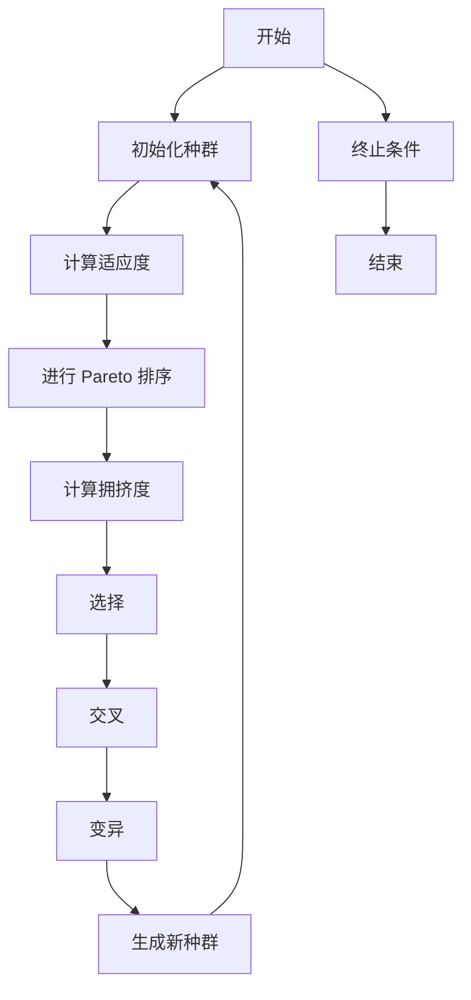
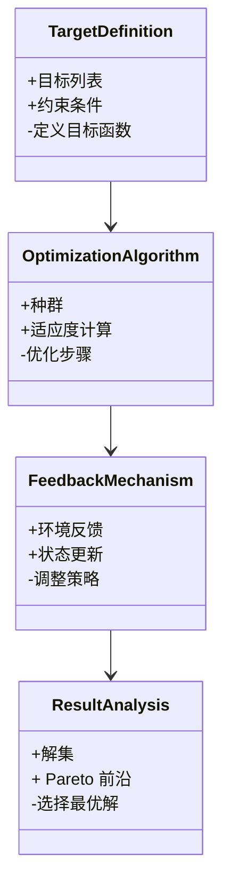
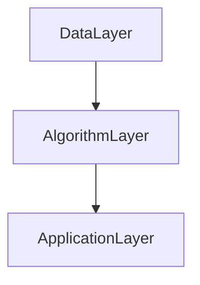

                 


# 多目标优化在AI Agent训练中的实践

> **关键词**：多目标优化，AI Agent，强化学习，优化算法，应用场景，挑战，解决方案

> **摘要**：  
> 多目标优化在AI Agent训练中具有重要意义，本文系统探讨了多目标优化的基本概念、算法原理、系统设计及实际应用。通过分析多目标优化的核心概念与AI Agent训练的结合，深入讲解了NSGA-II等算法的原理和实现，结合实际案例展示了系统设计与优化实践，最后总结了多目标优化在AI Agent训练中的最佳实践和未来发展方向。

---

## 目录

1. **背景介绍**  
   - 1.1 多目标优化的基本概念  
   - 1.2 AI Agent的基本概念  
   - 1.3 多目标优化在AI Agent训练中的应用背景  

2. **多目标优化的核心概念与联系**  
   - 2.1 多目标优化的数学模型  
   - 2.2 多目标优化与AI Agent训练的联系  
   - 2.3 多目标优化的挑战与解决方案  

3. **算法原理**  
   - 3.1 常见的多目标优化算法  
   - 3.2 NSGA-II算法的详细实现  
   - 3.3 算法的数学模型与公式推导  

4. **系统分析与架构设计**  
   - 4.1 系统功能模块设计  
   - 4.2 系统架构图  
   - 4.3 模块间交互关系  

5. **项目实战：多目标优化的AI Agent训练案例**  
   - 5.1 环境安装与数据准备  
   - 5.2 算法实现与代码解读  
   - 5.3 实验结果与分析  

6. **最佳实践与总结**  
   - 6.1 实践中的注意事项  
   - 6.2 小结与展望  
   - 6.3 拓展阅读与学习资源  

---

## 正文

### 第1章 背景介绍

#### 1.1 多目标优化的基本概念
多目标优化（Multi-Objective Optimization, MOO）是指在多个相互冲突的目标下寻找最优解的过程。与单目标优化不同，MOO需要在多个目标之间找到平衡点，得到 Pareto 有效解集。

- **优化问题的基本概念**  
  优化问题通常涉及目标函数、决策变量和约束条件。单目标优化追求单一目标的最优解，而多目标优化则需要在多个目标之间进行权衡。

- **多目标优化的核心特点**  
  - 多目标性：多个目标函数可能冲突，无法同时达到最优。
  - Pareto 有效性： Pareto 有效解是指无法在不恶化某个目标的情况下改善另一个目标的解。
  - 曲面性： Pareto 有效解形成一个连续的曲面，而非单一的点。

- **多目标优化与单目标优化的区别**  
  单目标优化追求全局最优，而多目标优化追求 Pareto 有效解集，强调在多个目标之间的平衡。

#### 1.2 AI Agent的基本概念
AI Agent 是指具有感知环境、做出决策并执行行动的智能体。它可以自主或基于外部指令完成任务，广泛应用于游戏、机器人、自动驾驶等领域。

- **AI Agent的核心功能**  
  - 感知环境：通过传感器获取信息。
  - 制定策略：基于当前状态和目标，选择最优行动。
  - 执行行动：在环境中执行决策。

- **AI Agent的分类与应用场景**  
  - 分类：简单反射型、基于模型的反应型、目标驱动型、效用驱动型。
  - 应用场景：游戏AI、机器人控制、自动驾驶、资源分配等。

#### 1.3 多目标优化在AI Agent训练中的应用背景
在AI Agent训练中，往往需要在多个目标之间进行权衡，例如在自动驾驶中，既要考虑安全，又要考虑效率。多目标优化能够帮助AI Agent在这些目标之间找到最佳平衡点。

- **多目标优化在AI Agent训练中的重要性**  
  - 多目标优化能够处理复杂的决策问题。
  - 提高AI Agent的适应性和鲁棒性。
  - 适用于复杂的现实场景。

- **多目标优化在AI Agent训练中的具体表现**  
  - 在强化学习中，多目标优化用于同时优化多个奖励函数。
  - 在决策过程中，多目标优化帮助AI Agent权衡不同的优先级。

- **多目标优化在AI Agent训练中的挑战**  
  - 目标冲突难以协调。
  - 解空间复杂，计算量大。
  - 如何选择合适的优化算法。

---

### 第2章 多目标优化的核心概念与联系

#### 2.1 多目标优化的数学模型
多目标优化的数学模型通常包括目标函数、决策变量和约束条件。我们可以表示为：

$$ \min \, f_1(x), f_2(x), \ldots, f_k(x) $$
$$ \text{subject to} \, g_1(x) \leq 0, \ldots, g_m(x) \leq 0 $$

其中，$f_i$ 是目标函数，$g_j$ 是约束条件，$x$ 是决策变量。

#### 2.2 多目标优化与AI Agent训练的联系
多目标优化在AI Agent训练中的应用主要体现在以下几个方面：

- **强化学习中的应用**：在强化学习中，AI Agent需要同时优化多个奖励函数，例如在机器人控制中，同时优化路径长度和能耗。
- **决策过程中的应用**：在决策过程中，AI Agent需要在多个目标之间进行权衡，例如在自动驾驶中，同时考虑安全性和舒适性。

#### 2.3 多目标优化的挑战与解决方案
多目标优化在AI Agent训练中面临的主要挑战包括目标冲突、解空间复杂以及算法选择困难。

- **目标冲突**：不同目标之间的冲突难以协调，例如在资源分配中，既要最大化利润，又要最小化成本。
- **解空间复杂**：多目标优化的解空间通常是高维且复杂的，难以直接处理。
- **算法选择困难**：不同的算法适用于不同的场景，选择合适的算法需要考虑问题的特性。

解决方案包括使用 Pareto 优化算法（如NSGA-II）、基于权重分配的算法（如加权和方法）和基于分解的算法（如MOEA/D）。

---

### 第3章 算法原理

#### 3.1 常见的多目标优化算法
多目标优化算法可以分为三类：基于 Pareto 优化的算法、基于权重分配的算法和基于分解的算法。

- **基于 Pareto 优化的算法**：NSGA-II 是最常用的算法之一，通过 Pareto 排序和拥挤度计算选择解。
- **基于权重分配的算法**：通过为每个目标分配权重，将多目标问题转化为单目标问题。
- **基于分解的算法**：将多目标问题分解为多个单目标子问题，分别优化。

#### 3.2 NSGA-II算法的详细实现
NSGA-II 算法的步骤如下：

1. 初始化种群。
2. 计算每个个体的适应度。
3. 根据适应度进行 Pareto 排序。
4. 计算拥挤度。
5. 进行选择、交叉和变异操作。
6. 重复上述步骤，直到满足终止条件。

**NSGA-II 算法流程图（使用 Mermaid）**：



**NSGA-II 算法的 Python 实现代码**：

```python
import numpy as np

def nsgaII(population):
    # 计算适应度
    fitness = [evaluate(individual) for individual in population]
    # 进行 Pareto 排序
    pareto_front = get_pareto_front(population, fitness)
    # 计算拥挤度
    crowding_distance = compute_crowding_distance(pareto_front)
    # 选择
    selected = selection(pareto_front, crowding_distance)
    # 交叉
    crossed = crossover(selected)
    # 变异
    mutated = mutation(crossed)
    # 更新种群
    new_population = mutated
    return new_population
```

#### 3.3 算法的数学模型与公式推导
以 NSGA-II 算法为例，其适应度函数可以表示为：

$$ f_i(x) = \text{目标函数} $$

Pareto 排序的计算涉及到比较两个解是否在 Pareto 前沿：

$$ x \text{在 Pareto 前沿} \iff \exists y \in P, y \text{不被任何其他解支配} $$

---

### 第4章 系统分析与架构设计

#### 4.1 系统功能模块设计
系统功能模块包括目标定义模块、优化算法模块、反馈机制模块和结果分析模块。

**系统功能模块类图（使用 Mermaid）**：



#### 4.2 系统架构图
系统架构包括数据层、算法层和应用层。

**系统架构图（使用 Mermaid）**：



---

### 第5章 项目实战：多目标优化的AI Agent训练案例

#### 5.1 环境安装与数据准备
- **环境安装**：安装Python、NumPy、Scikit-learn等库。
- **数据准备**：准备训练数据和测试数据。

#### 5.2 算法实现与代码解读
以下是一个简单的多目标优化AI Agent训练代码示例：

```python
import numpy as np
from nsga import NSGAII

# 定义目标函数
def evaluate(individual):
    return np.sum(individual), np.max(individual)

# 初始化种群
population = np.random.randint(0, 2, (10, 5))

# 进行优化
opt = NSGAII(evaluate)
opt_population = opt.run(population)

# 获取最优解
best = opt_population[0]
print("最优解为:", best)
print("最优目标值为:", evaluate(best))
```

#### 5.3 实验结果与分析
通过实验可以发现，多目标优化能够有效平衡多个目标，但在实际应用中需要注意算法的效率和解的适用性。

---

### 第6章 最佳实践与总结

#### 6.1 实践中的注意事项
- **算法选择**：根据具体问题选择合适的算法。
- **参数设置**：合理设置算法参数，避免过优化或欠优化。
- **性能评估**：使用适当的指标评估解的质量，例如帕累托前沿的覆盖范围。

#### 6.2 小结与展望
多目标优化在AI Agent训练中具有重要意义，未来可以进一步研究如何提高算法效率，降低计算复杂度，并探索新的应用场景。

#### 6.3 拓展阅读与学习资源
- 推荐阅读相关论文和书籍，如《多目标优化算法及其应用》。
- 关注领域内的最新研究进展。

---

**作者**：AI天才研究院/AI Genius Institute & 禅与计算机程序设计艺术 /Zen And The Art of Computer Programming

