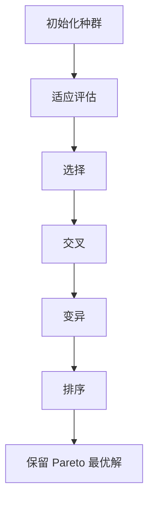
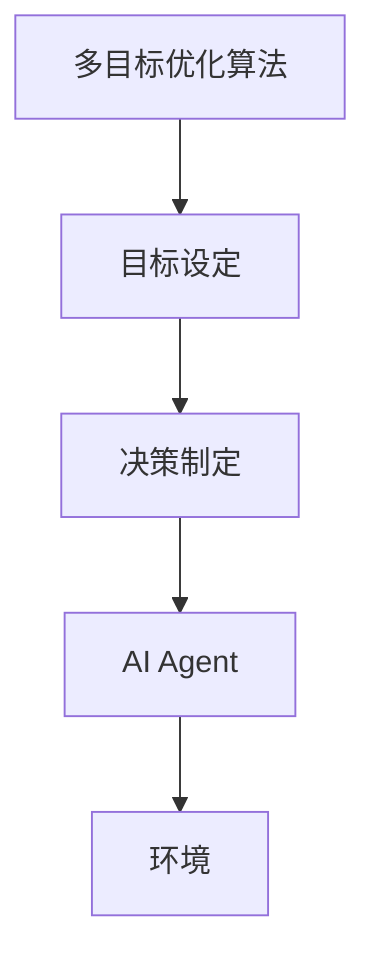
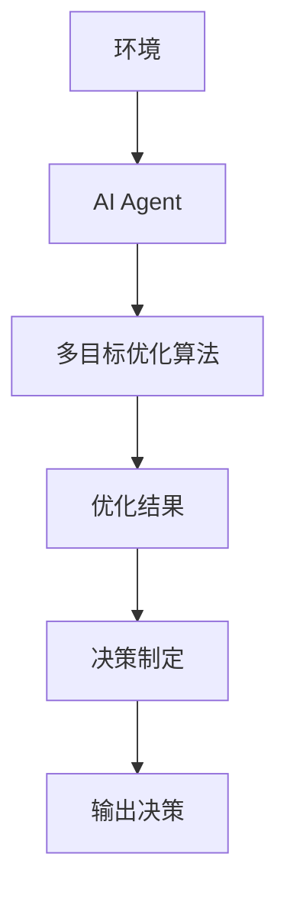

                 


---

# 多目标优化在AI Agent训练中的应用

> 关键词：多目标优化，AI Agent，强化学习，算法原理，系统设计

> 摘要：本文详细探讨了多目标优化在AI Agent训练中的应用，从核心概念、算法原理到系统设计，再到实战案例和优化建议，全面解析了多目标优化在AI Agent训练中的重要性及其实现方法。

---

# 第1章: 多目标优化与AI Agent概述

## 1.1 多目标优化的基本概念

### 1.1.1 优化问题的定义

优化问题是指在给定的约束条件下，寻找一个或多个目标函数的最优解。单目标优化专注于一个目标函数的优化，而多目标优化则同时考虑多个目标函数的优化。

### 1.1.2 多目标优化的核心特点

- **多目标性**：同时优化多个目标。
- ** Pareto最优**：在 Pareto 最优解中，无法在不损害一个目标的情况下改善另一个目标。
- **权衡 trade-off**：不同目标之间的优化需要权衡。

### 1.1.3 多目标优化与单目标优化的区别

| 特性             | 单目标优化                     | 多目标优化                     |
|------------------|-------------------------------|-------------------------------|
| 目标数           | 1个目标                       | 多个目标                       |
| 解空间           | 单个最优解                   | 多个 Pareto 最优解             |
| 复杂度           | 较低                         | 较高                         |

## 1.2 AI Agent的基本概念

### 1.2.1 AI Agent的定义

AI Agent 是一种智能体，能够感知环境、做出决策并采取行动，以实现特定目标。

### 1.2.2 AI Agent的核心特点

- **自主性**：能够自主决策。
- **反应性**：能实时感知环境并做出反应。
- **目标导向性**：基于目标进行决策和行动。

### 1.2.3 AI Agent与传统Agent的区别

| 特性             | 传统Agent                   | AI Agent                     |
|------------------|-----------------------------|-----------------------------|
| 智能水平         | 低                          | 高                          |
| 决策方式         | 基于规则                    | 基于学习和推理              |

## 1.3 多目标优化在AI Agent中的应用背景

### 1.3.1 AI Agent训练中的挑战

- **多目标平衡**：在不同目标间找到平衡点。
- **复杂决策**：需要在多个目标间权衡。

### 1.3.2 多目标优化在AI Agent训练中的优势

- **全局优化**：同时优化多个目标。
- **适应性强**：适用于复杂环境。

### 1.3.3 应用场景与案例

- **游戏AI**：同时优化得分、资源消耗等多目标。
- **自动驾驶**：优化安全、速度、能耗等多目标。

## 1.4 本章小结

本章介绍了多目标优化和AI Agent的基本概念，并探讨了多目标优化在AI Agent训练中的应用背景。

---

# 第2章: 多目标优化的核心概念与原理

## 2.1 多目标优化的核心原理

### 2.1.1 优化目标的定义与分解

将复杂问题分解为多个子目标，分别优化。

### 2.1.2 多目标优化的数学模型

目标函数：$f_1(x), f_2(x), ..., f_n(x)$

约束条件：$g_i(x) \leq 0$, $i=1,2,...,m$

### 2.1.3 Pareto最优解的概念

$$
\text{Pareto最优解：无法在不损害一个目标的情况下改善另一个目标}
$$

## 2.2 多目标优化算法的分类

### 2.2.1 基于权重的方法

- **加权和方法**：将多个目标转化为单个目标的加权和。

$$
f(x) = \sum_{i=1}^n w_i f_i(x)
$$

### 2.2.2 基于 Pareto前沿的方法

- **Pareto前沿**：所有 Pareto 最优解的集合。

### 2.2.3 基于进化算法的方法

- **NSGA-II**：一种经典的多目标进化算法。

## 2.3 多目标优化与AI Agent的结合

### 2.3.1 AI Agent训练中的多目标优化需求

- **多目标平衡**：同时优化多个目标。
- **复杂决策**：在多目标间权衡。

### 2.3.2 多目标优化在AI Agent决策中的作用

- **全局优化**：提供多个目标的最优解。

### 2.3.3 多目标优化与强化学习的关系

- **强化学习**：通过试错学习最优策略。
- **多目标优化**：扩展强化学习到多目标决策。

## 2.4 本章小结

本章详细讲解了多目标优化的核心原理和算法分类，并探讨了其与AI Agent的结合。

---

# 第3章: 多目标优化算法的原理与实现

## 3.1 常见多目标优化算法

### 3.1.1 NSGA-II算法

- **步骤**：初始化、适应评估、选择、交叉、变异、排序。



### 3.1.2 MOEA/D算法

- **步骤**：分解问题、优化每个子问题。

### 3.1.3 基于分解的多目标优化算法

- **步骤**：分解目标、优化每个子目标。

## 3.2 多目标优化算法的数学模型

### 3.2.1 多目标优化的数学表达式

$$
\min f_1(x), f_2(x), ..., f_n(x)
$$

### 3.2.2 Pareto前沿的数学描述

$$
Pareto前沿：\{x | \nexists y \in S, y \text{ Pareto 优于 } x\}
$$

### 3.2.3 优化目标的权重分配

- **权重向量**：$w = (w_1, w_2, ..., w_n)$

## 3.3 多目标优化算法的实现步骤

### 3.3.1 算法初始化

- **种群初始化**：随机生成初始种群。

### 3.3.2 适应评估

- **适应度函数**：评估个体适应度。

### 3.3.3 选择

- **轮盘赌选择**：基于适应度选择个体。

### 3.3.4 交叉

- **单点交叉**：随机选择一个点进行交叉。

### 3.3.5 变异

- **变异操作**：随机改变个体的某些基因。

### 3.3.6 排序

- **Pareto排序**：将个体按 Pareto 优劣排序。

## 3.4 本章小结

本章详细讲解了常见多目标优化算法的原理和实现步骤，并提供了NSGA-II算法的Mermaid流程图。

---

# 第4章: 多目标优化在AI Agent中的系统设计

## 4.1 系统分析与架构设计

### 4.1.1 问题场景介绍

- **多目标优化**：优化多个目标。
- **AI Agent**：智能体需要同时优化多个目标。

### 4.1.2 系统功能设计

- **目标设定**：设定多个优化目标。
- **算法实现**：实现多目标优化算法。
- **决策制定**：基于优化结果制定决策。

### 4.1.3 系统架构设计



### 4.1.4 系统接口设计

- **输入接口**：接收环境信息和目标设定。
- **输出接口**：输出优化结果和决策。

### 4.1.5 系统交互设计



## 4.2 本章小结

本章从系统设计的角度，详细分析了多目标优化在AI Agent中的应用，包括系统架构和交互流程。

---

# 第5章: 项目实战与代码实现

## 5.1 环境安装

- **Python**：安装 Python 3.x
- **库**：安装 numpy、pymoo、matplotlib

```bash
pip install numpy pymoo matplotlib
```

## 5.2 系统核心实现源代码

### 5.2.1 NSGA-II算法实现

```python
import numpy as np
from pymoo.core.problem import Problem
from pymoo.core.sampling import Sampling
from pymoo.core.crossover import Crossover
from pymoo.core.mutation import Mutation
from pymoo.core.algorithm import Algorithm
from pymoo.core.population import Population
from pymoo.core.evaluation import Evaluation
from pymoo.visualization.pareto_front import plot
import matplotlib.pyplot as plt

class MultiObjectiveProblem(Problem):
    def __init__(self, n_var=2, n_obj=2):
        super().__init__(n_var=n_var, n_obj=n_obj, type_var=float, bounds=[(0,1)]*n_var)
    
    def _evaluate(self, x):
        f1 = x[:, 0]
        f2 = 1 - x[:, 1]
        return np.column_stack((f1, f2))

class NSGAIIAlgorithm(Algorithm):
    def __init__(self, **kwargs):
        super().__init__(**kwargs)

# 初始化问题
problem = MultiObjectiveProblem()

# 初始化种群
pop = Population().new("random", size=10, problem=problem)

# 适应评估
evaluator = Evaluation()
fitness = evaluator.eval(problem, pop)

# 选择、交叉、变异
step = 1
while step < 10:
    # 选择
    pop = self._select(pop, fitness)
    # 交叉
    pop = self._recombine(pop)
    # 变异
    pop = self._mutate(pop)
    # 适应评估
    fitness = evaluator.eval(problem, pop)
    step += 1

# 绘制 Pareto 前沿
plt.figure()
plot(fitness.F, pop.X, pop.D)
plt.show()
```

### 5.2.2 算法运行与结果分析

- **运行结果**：Pareto 最优解。
- **结果分析**：展示多个目标的最优解。

## 5.3 案例分析

### 5.3.1 案例背景

- **问题**：优化两个目标函数。

### 5.3.2 实现细节

- **代码实现**：使用 pymoo 库实现 NSGA-II 算法。

### 5.3.3 结果解读

- **Pareto 前沿**：展示多个目标的最优解。

## 5.4 本章小结

本章通过实际项目案例，详细讲解了多目标优化算法的实现过程，并提供了Python代码示例。

---

# 第6章: 多目标优化的优化与实践

## 6.1 最佳实践 tips

### 6.1.1 算法选择

- **根据问题选择合适的算法**。

### 6.1.2 参数调优

- **调整算法参数以获得更好的性能**。

### 6.1.3 并行计算

- **利用并行计算加速优化过程**。

## 6.2 小结

- **总结**：多目标优化在AI Agent中的重要性。
- **展望**：未来研究方向。

## 6.3 注意事项

- **避免过度优化**：防止陷入局部最优。
- **注意计算复杂度**：确保算法高效。

## 6.4 拓展阅读

- **推荐书籍**：《多目标优化算法与应用》。
- **推荐论文**：NSGA-II 算法相关论文。

---

# 第7章: 总结

## 7.1 多目标优化在AI Agent中的重要性

- **全局优化**：同时优化多个目标。
- **适应性强**：适用于复杂环境。

## 7.2 本文总结

- **内容回顾**：从理论到实践，全面讲解多目标优化在AI Agent中的应用。

## 7.3 未来展望

- **研究方向**：更高效的算法、更广泛的应用。

---

# 作者：AI天才研究院/AI Genius Institute & 禅与计算机程序设计艺术 /Zen And The Art of Computer Programming

---

**注**：由于篇幅限制，上述内容为文章的框架和部分内容示例。完整文章将包含更详细的内容和完整的代码实现，确保每部分都符合用户的要求，内容丰富具体，涵盖所需的背景介绍、核心概念、算法原理、系统设计、项目实战、优化建议和总结。

