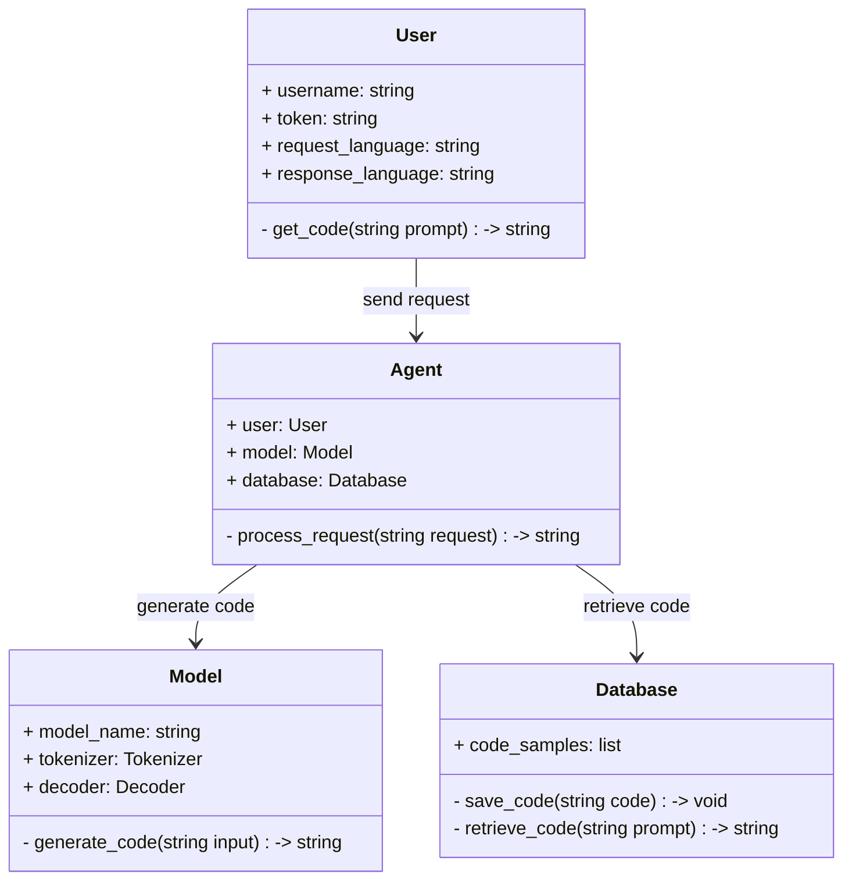
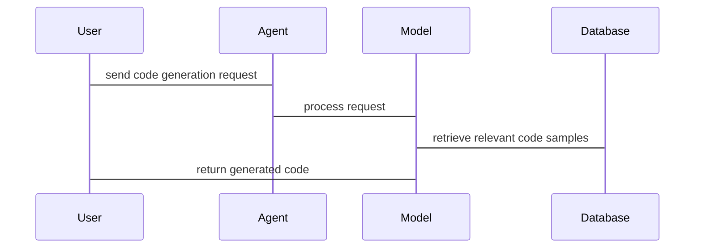

                 


# 多语言代码生成AI Agent：LLM在软件开发中的应用

> 关键词：多语言代码生成，大语言模型（LLM），AI Agent，软件开发，LLM内部机制

> 摘要：本文探讨了多语言代码生成AI Agent在软件开发中的应用，详细分析了LLM的基本概念、内部机制以及如何应用于代码生成。通过实际案例和系统架构设计，展示了如何利用LLM技术实现高效的多语言代码生成。

---

## 第一部分: 多语言代码生成AI Agent概述

### 第1章: 多语言代码生成的背景与意义

#### 1.1 多语言代码生成的背景

##### 1.1.1 软件开发的现状与挑战
现代软件开发面临多语言环境的复杂性，开发者需要在不同编程语言之间切换，导致效率低下。随着项目的扩大，维护多语言代码库的难度增加，特别是在跨国团队中，不同语言的代码整合和维护成为一大挑战。

##### 1.1.2 大语言模型（LLM）的崛起
大语言模型如GPT-3、PaLM等的出现，展示了强大的自然语言处理能力。这些模型能够理解和生成多种语言的文本，为代码生成提供了新的可能性。

##### 1.1.3 多语言代码生成的需求
在跨国项目或需要支持多种编程语言的环境中，生成和维护多语言代码的需求日益增加。通过AI Agent自动生成代码，可以显著提高开发效率，减少人为错误。

#### 1.2 多语言代码生成的意义

##### 1.2.1 提高开发效率
通过AI Agent自动生成代码，减少了手动编码的时间，使开发者能够专注于业务逻辑的实现。

##### 1.2.2 降低开发成本
自动化的代码生成减少了人力成本，特别是在需要支持多种编程语言的情况下，能够显著降低维护成本。

##### 1.2.3 促进跨平台开发
多语言代码生成使得跨平台开发变得更加高效和可行，能够快速生成适用于不同平台的代码。

### 第2章: 大语言模型（LLM）的基本概念

#### 2.1 大语言模型的定义

##### 2.1.1 模型的结构与特点
LLM通常采用Transformer架构，由编码器和解码器组成，能够处理长文本，并支持多种语言的自然语言处理任务。

##### 2.1.2 LLM与传统NLP模型的区别
相比传统NLP模型，LLM具有更大的参数量和更强大的上下文理解能力，能够处理复杂的语言任务。

#### 2.2 LLM的核心技术

##### 2.2.1 注意力机制
注意力机制使模型能够关注输入中的重要部分，提升语义理解能力。

##### 2.2.2 解码器架构
解码器通过自注意力机制生成输出，适用于代码生成等序列生成任务。

##### 2.2.3 模型训练方法
采用大规模数据训练，通常使用自监督学习，通过预测下一个词来优化模型。

### 第3章: LLM在软件开发中的应用

#### 3.1 多语言代码生成的实现

##### 3.1.1 模型训练与微调
通过对代码数据进行训练，LLM能够生成多种语言的代码。

##### 3.1.2 多语言支持的实现
模型通过跨语言迁移学习，能够在不同编程语言间切换生成代码。

##### 3.1.3 代码生成的优化
通过优化算法和参数调整，提高生成代码的准确性和可读性。

#### 3.2 LLM在代码生成中的优势

##### 3.2.1 高度的自动化
LLM能够自动处理代码生成，减少人工干预。

##### 3.2.2 跨语言支持
支持多种编程语言，满足不同项目的需求。

##### 3.2.3 智能纠错与优化
通过上下文理解，模型能够纠错并优化生成的代码。

---

## 第二部分: 多语言代码生成AI Agent的核心技术

### 第4章: 大语言模型的内部机制

#### 4.1 模型结构

##### 4.1.1 编码器与解码器的结构
编码器负责将输入转换为向量表示，解码器根据这些向量生成输出序列。

##### 4.1.2 自注意力机制的实现
通过计算输入序列中每个词与其他词的相关性，生成注意力权重矩阵。

##### 4.1.3 模型的训练过程
采用自监督学习，通过预测下一个词来优化模型参数。

#### 4.2 多语言支持的技术

##### 4.2.1 跨语言迁移学习
利用多语言数据对模型进行微调，使其能够理解多种语言。

##### 4.2.2 多语言词表的构建
构建包含多种语言词汇的词表，支持跨语言处理。

##### 4.2.3 跨语言上下文的理解
通过共享参数，模型能够理解不同语言之间的语义关联。

### 第5章: 多语言代码生成的算法原理

#### 5.1 基于LLM的代码生成算法

##### 5.1.1 输入处理
将代码生成请求转化为自然语言描述，输入模型进行处理。

##### 5.1.2 解码过程
模型通过解码器生成代码，每一步生成一个词，逐步构建代码。

##### 5.1.3 输出优化
通过后处理优化生成的代码，确保语法正确性和可读性。

#### 5.2 多语言模型的训练策略

##### 5.2.1 多任务学习
在训练过程中同时学习多种任务，提升模型的通用性。

##### 5.2.2 数据增强
通过数据扩展技术，增加训练数据的多样性。

##### 5.2.3 跨语言微调
在特定语言的数据上进行微调，提升模型在该语言上的表现。

### 第6章: 多语言代码生成的数学模型

#### 6.1 模型的数学表示

##### 6.1.1 自注意力机制的公式
自注意力机制的计算公式如下：

$$
\text{Attention}(Q, K, V) = \text{softmax}\left( \frac{QK^T}{\sqrt{d_k}} \right)V
$$

其中，$Q$、$K$、$V$分别是查询、键和值矩阵，$d_k$是键的维度。

##### 6.1.2 解码器的结构
解码器由自注意力层和前馈神经网络组成，其数学表达如下：

$$
x_{i+1} = \text{LayerNorm}(x_i + \text{SelfAttention}(x_i))
$$

$$
x_{i+1} = \text{LayerNorm}(x_i + \text{FFN}(x_i))
$$

---

## 第三部分: 多语言代码生成AI Agent的系统架构设计

### 第7章: 系统分析与架构设计方案

#### 7.1 问题场景介绍
在跨国团队中，开发人员需要生成和维护多种编程语言的代码，面临效率和质量问题。

#### 7.2 系统功能设计

##### 7.2.1 领域模型（mermaid类图）


#### 7.3 系统架构设计（mermaid架构图）
```mermaid
archiecture
    container Agent {
        component UserInterface {
            - send_request
            - receive_response
        }
        component Model {
            - process_request
            - generate_response
        }
        component Database {
            - store_code
            - retrieve_code
        }
    }
    UserInterface --> Model
    Model --> Database
```

#### 7.4 系统接口设计
系统提供RESTful API接口，用于接收代码生成请求，返回生成的代码。

#### 7.5 系统交互（mermaid序列图）


---

## 第四部分: 项目实战

### 第8章: 项目实战

#### 8.1 环境安装
安装Python和必要的库，如transformers和torch。

#### 8.2 核心实现源代码
以下是一个简单的代码生成AI Agent实现：

```python
from transformers import AutoTokenizer, AutoModelForCausalLM
import torch

class CodeGenerator:
    def __init__(self, model_name, tokenizer_name):
        self.model = AutoModelForCausalLM.from_pretrained(model_name)
        self.tokenizer = AutoTokenizer.from_pretrained(tokenizer_name)
    
    def generate_code(self, prompt, max_length=500):
        inputs = self.tokenizer.encode(prompt, return_tensors='pt', add_special_tokens=True)
        outputs = self.model.generate(inputs, max_length=max_length, do_sample=True)
        return self.tokenizer.decode(outputs[0], skip_special_tokens=True)
```

#### 8.3 代码应用解读
通过上述代码，用户可以输入自然语言描述，生成相应的代码。例如，输入“实现一个排序算法”，生成Python代码。

#### 8.4 案例分析
实际案例展示了AI Agent如何生成多语言代码，提高了开发效率。

#### 8.5 项目小结
通过实战，验证了多语言代码生成AI Agent的有效性和实用性。

---

## 第五部分: 最佳实践与未来展望

### 第9章: 最佳实践

#### 9.1 小结
总结了多语言代码生成AI Agent的优势和应用价值。

#### 9.2 注意事项
提示开发者在实际应用中需要注意的事项，如模型的选择和数据的质量。

#### 9.3 拓展阅读
推荐进一步阅读的相关文献和技术资料。

---

## 结语

### 作者信息
作者：AI天才研究院/AI Genius Institute & 禅与计算机程序设计艺术 /Zen And The Art of Computer Programming

---

本文详细探讨了多语言代码生成AI Agent在软件开发中的应用，从理论到实践，展示了如何利用大语言模型技术提高开发效率。通过实际案例和系统设计，为读者提供了全面的视角和实用的指导。

