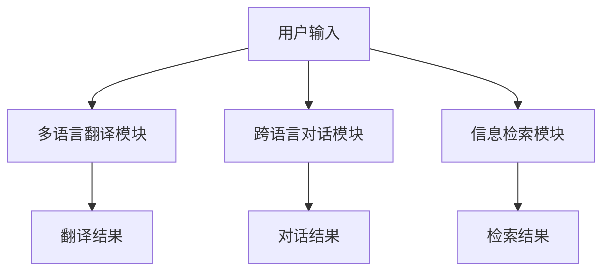

                 


# 多语言翻译：构建跨语言AI Agent

> 关键词：多语言翻译，AI Agent，跨语言理解，神经机器翻译，多语言模型

> 摘要：本文将详细介绍多语言翻译技术与AI Agent的结合，探讨跨语言翻译的核心概念、算法原理、系统架构及实际应用。通过分析多语言翻译的挑战与解决方案，结合AI Agent的设计与实现，为读者提供一个系统性的视角，帮助理解如何构建跨语言AI Agent。

---

# 第1章: 多语言翻译与AI Agent的背景介绍

## 1.1 多语言翻译的定义与问题背景

### 1.1.1 多语言翻译的核心概念

多语言翻译是指将一种语言的文本或语音转换为另一种或多种语言的过程。其核心在于理解源语言的语义，并准确地将其表达为目标语言的自然语言文本。随着全球化的深入，多语言翻译在跨文化交流、国际商务、技术交流等领域发挥着越来越重要的作用。

### 1.1.2 当前多语言翻译技术的挑战

1. **语义理解的困难**：不同语言之间存在语法结构、文化背景和语义差异，这使得直接翻译变得复杂。
2. **数据稀疏性**：某些语言的数据量较少，导致模型训练效果不佳。
3. **实时性要求**：在一些应用场景中，如实时对话翻译，对翻译的实时性要求较高。

### 1.1.3 AI Agent在多语言翻译中的作用

AI Agent作为一种智能代理，能够通过多语言翻译技术实现跨语言的交互与理解。它不仅可以提供翻译服务，还能根据上下文理解用户的意图，并在多语言环境中执行任务。

---

## 1.2 跨语言AI Agent的定义与特点

### 1.2.1 跨语言AI Agent的定义

跨语言AI Agent是指能够理解并处理多种语言的智能代理。它不仅能够将一种语言翻译成另一种语言，还能在多语言环境中进行复杂的任务处理，如对话、信息检索和决策支持。

### 1.2.2 跨语言AI Agent的核心特点

1. **多语言处理能力**：支持多种语言的输入与输出。
2. **上下文理解**：能够基于上下文理解用户的意图。
3. **实时性**：能够在较短的时间内完成翻译和任务处理。
4. **自适应性**：能够根据用户反馈优化翻译质量。

### 1.2.3 跨语言AI Agent与传统翻译工具的对比

| 特性                | 跨语言AI Agent            | 传统翻译工具            |
|---------------------|---------------------------|--------------------------|
| 多语言支持          | 支持多种语言              | 通常支持有限的语言组合  |
| 上下文理解          | 具备上下文理解能力        | 通常不具备上下文理解    |
| 实时性              | 高实时性                  | 通常实时性较低          |
| 自适应性            | 能够自适应用户需求        | 通常无法自适应用户需求  |

---

## 1.3 多语言翻译与AI Agent的技术基础

### 1.3.1 自然语言处理（NLP）的基础知识

自然语言处理（NLP）是研究如何让计算机理解、处理和生成人类语言的学科。它涵盖了文本分类、实体识别、句法分析、语义理解等多个领域。

### 1.3.2 大语言模型（LLM）在多语言翻译中的应用

大语言模型（如GPT、BERT）通过大量的多语言数据训练，能够理解多种语言的语义，并生成自然流畅的翻译结果。

### 1.3.3 AI Agent的多模态能力

AI Agent不仅能够处理文本，还可以结合语音、图像等多种模态信息，实现更全面的多语言交互。

---

## 1.4 跨语言AI Agent的应用场景与挑战

### 1.4.1 跨语言AI Agent的典型应用场景

1. **跨语言对话**：在国际会议、跨国团队协作中，AI Agent可以实时翻译对话内容。
2. **多语言信息检索**：帮助用户在多语言环境中查找信息。
3. **跨语言内容生成**：生成多种语言的文本内容，如新闻报道、广告文案。

### 1.4.2 跨语言翻译中的语境理解难题

翻译不仅仅是语言的转换，还需要理解上下文中的语境、语气和文化背景。

### 1.4.3 跨语言数据的获取与处理挑战

多语言数据的获取和处理需要解决数据不平衡、数据清洗等问题。

---

## 1.5 本章小结

本章介绍了多语言翻译的核心概念和AI Agent的基本特点，分析了多语言翻译技术的挑战，并探讨了AI Agent在多语言环境中的应用潜力。

---

# 第2章: 多语言翻译的模型与方法

## 2.1 多语言翻译模型的分类

### 2.1.1 基于统计的多语言翻译模型

基于统计的翻译模型通过统计语言学的方法，分析源语言和目标语言之间的概率关系，生成翻译结果。

### 2.1.2 基于神经网络的多语言翻译模型

基于神经网络的翻译模型（如神经机器翻译）通过深度学习技术，直接从源语言到目标语言进行翻译。

### 2.1.3 多模态多语言翻译模型

多模态多语言翻译模型结合了文本、语音、图像等多种模态信息，进一步提高了翻译的准确性和多样性。

---

## 2.2 跨语言理解与生成的原理

### 2.2.1 跨语言表示学习

跨语言表示学习旨在将不同语言的文本映射到相同的语义空间，以便跨语言理解和生成。

### 2.2.2 跨语言注意力机制

跨语言注意力机制通过关注源语言和目标语言之间的相关性，提高翻译的准确性。

### 2.2.3 跨语言生成模型

跨语言生成模型在目标语言中生成翻译结果，同时考虑源语言的语义信息。

---

## 2.3 跨语言翻译中的对齐技术

### 2.3.1 词汇对齐与句法对齐

词汇对齐是指将源语言和目标语言的词汇进行对应，句法对齐是指将句子的语法结构进行对齐。

### 2.3.2 跨语言句法分析

跨语言句法分析通过分析源语言和目标语言的句法结构，帮助理解句子的语义关系。

### 2.3.3 跨语言语义对齐

跨语言语义对齐旨在将源语言和目标语言的语义信息进行对齐，以便更准确的翻译。

---

## 2.4 跨语言翻译的评估指标与方法

### 2.4.1 基于BLEU的评估方法

BLEU（Bilingual Evaluation Understudy）是一种常用的机器翻译评估指标，通过计算生成文本与参考文本的相似度来评估翻译质量。

### 2.4.2 基于ROUGE的评估方法

ROUGE（Recall-Oriented Understudy for GEMEVAL’96 Metrics）是一种基于召回率的评估指标，常用于文本摘要和翻译的评估。

### 2.4.3 跨语言翻译的主观评估

主观评估通过人工评估生成文本的质量，考虑翻译的准确性和自然度。

---

## 2.5 本章小结

本章详细介绍了多语言翻译模型的分类和跨语言理解与生成的原理，探讨了跨语言翻译中的对齐技术和评估方法。

---

# 第3章: 跨语言翻译模型的算法原理

## 3.1 神经机器翻译的数学模型

### 3.1.1 编码器-解码器结构

编码器将源语言的文本编码为一个语义向量，解码器将该向量解码为目标语言的文本。

### 3.1.2 注意力机制的数学表达

注意力机制通过计算源语言和目标语言之间的相关性权重，生成更准确的翻译结果。

### 3.1.3 多层感知机（MLP）的实现

多层感知机通过多层非线性变换，进一步提高模型的表达能力。

---

## 3.2 跨语言翻译的训练流程

### 3.2.1 数据预处理与特征提取

对多语言数据进行清洗、分词和特征提取，为模型训练做好准备。

### 3.2.2 模型训练与优化

使用神经网络模型对多语言数据进行训练，并通过反向传播优化模型参数。

### 3.2.3 模型调参与评估

通过调整模型参数和评估指标，优化翻译质量。

---

## 3.3 跨语言翻译的推理过程

### 3.3.1 解码器的生成策略

解码器根据编码器生成的语义向量，逐步生成目标语言的文本。

### 3.3.2 贝叶斯推断在翻译中的应用

贝叶斯推断通过概率推理，提高翻译的准确性和自然度。

### 3.3.3 动态规划在翻译优化中的作用

动态规划通过优化解码过程中的决策，提高翻译效率和质量。

---

## 3.4 跨语言翻译的优化方法

### 3.4.1 增量式训练

通过逐步增加语言对，优化模型的多语言翻译能力。

### 3.4.2 对抗训练

通过对抗训练，提高模型的鲁棒性和多语言适应能力。

### 3.4.3 知识蒸馏

通过知识蒸馏技术，将大型模型的知识迁移到更小的模型中，提高模型的效率。

---

## 3.5 本章小结

本章详细介绍了神经机器翻译的数学模型和训练流程，探讨了跨语言翻译的推理过程和优化方法。

---

# 第4章: 跨语言AI Agent的系统架构与实现

## 4.1 系统功能设计

### 4.1.1 多语言翻译模块

实现多种语言的文本翻译功能。

### 4.1.2 跨语言对话模块

支持多语言的实时对话翻译。

### 4.1.3 信息检索模块

实现多语言环境下的信息检索功能。

---

## 4.2 系统架构设计

### 4.2.1 系统架构图



### 4.2.2 系统组件交互

系统组件包括用户输入、多语言翻译模块、跨语言对话模块和信息检索模块，各模块之间通过接口进行交互。

---

## 4.3 系统接口设计

### 4.3.1 翻译接口

```python
def translate(source_text, target_language):
    # 实现翻译功能
    pass
```

### 4.3.2 对话接口

```python
def chat对话(input_text, target_language):
    # 实现对话翻译功能
    pass
```

---

## 4.4 系统交互流程

### 4.4.1 多语言翻译流程

1. 用户输入源语言文本。
2. 系统调用翻译模块生成目标语言文本。
3. 返回翻译结果。

### 4.4.2 跨语言对话流程

1. 用户输入源语言文本。
2. 系统调用对话模块生成目标语言的对话回复。
3. 返回对话结果。

---

## 4.5 本章小结

本章详细介绍了跨语言AI Agent的系统架构与实现，包括功能设计、架构图和接口设计。

---

# 第5章: 跨语言AI Agent的项目实战

## 5.1 环境安装与配置

### 5.1.1 安装Python和必要的库

```bash
pip install numpy
pip install torch
pip install transformers
```

### 5.1.2 安装多语言翻译模型

```bash
pip install googletrans==3.0.0
```

---

## 5.2 系统核心实现源代码

### 5.2.1 翻译模块实现

```python
from googletrans import Translator

def translate_text(text, target_lang):
    translator = Translator()
    translated = translator.translate(text, dest=target_lang)
    return translated.text
```

### 5.2.2 跨语言对话模块实现

```python
class ChatTranslator:
    def __init__(self, translator):
        self.translator = translator

    def translate_chat(self, text, target_lang):
        return self.translator.translate(text, dest=target_lang).text
```

---

## 5.3 实际案例分析

### 5.3.1 翻译案例

```python
print(translate_text("Hello, how are you?", "zh"))  # 输出：你好，你怎么样？
```

### 5.3.2 对话案例

```python
chat_translator = ChatTranslator(Translator())
print(chat_translator.translate_chat("I am fine, thank you.", "es"))  # 输出：Estoy bien, gracias.
```

---

## 5.4 项目小结

本章通过实际案例展示了跨语言AI Agent的实现过程，包括环境配置、代码实现和案例分析。

---

# 第6章: 跨语言AI Agent的最佳实践与注意事项

## 6.1 最佳实践

### 6.1.1 数据清洗与预处理

确保多语言数据的清洗和预处理，提高模型的训练效果。

### 6.1.2 模型调优

通过参数调优和模型优化，提高翻译质量和效率。

### 6.1.3 多语言模型的持续学习

通过持续学习和更新，保持模型的多语言翻译能力。

---

## 6.2 注意事项

### 6.2.1 数据隐私与安全

确保多语言数据的隐私和安全，避免数据泄露。

### 6.2.2 模型的可解释性

提高模型的可解释性，方便调试和优化。

### 6.2.3 多语言环境的适应性

确保系统在不同语言环境下的适应性和稳定性。

---

## 6.3 拓展阅读

### 6.3.1 多语言翻译的最新研究

阅读最新的学术论文，了解多语言翻译的前沿技术。

### 6.3.2 AI Agent的未来发展

探索AI Agent在多语言翻译和其他领域的应用前景。

---

# 作者：AI天才研究院/AI Genius Institute & 禅与计算机程序设计艺术 /Zen And The Art of Computer Programming

---

这篇文章详细介绍了多语言翻译与AI Agent的结合，从理论到实践，为读者提供了全面的视角。通过系统的分析和实际案例的展示，帮助读者理解如何构建跨语言AI Agent。希望本文能为相关领域的研究和应用提供有价值的参考。

