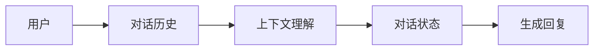
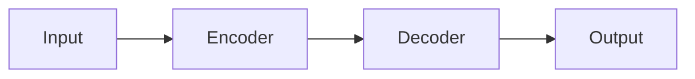
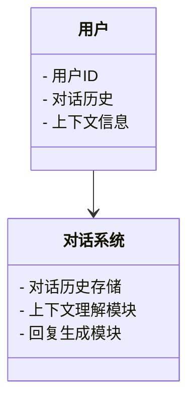
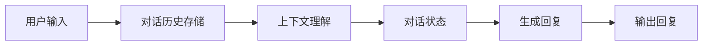
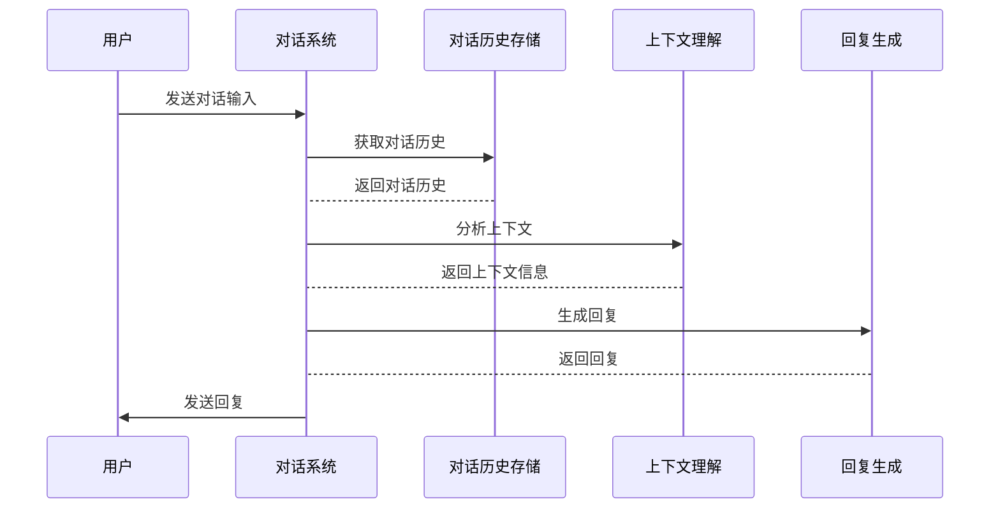

                 


# 多轮对话 AI Agent：提升 LLM 的上下文理解能力

## 关键词：多轮对话，AI Agent，上下文理解，LLM，自然语言处理，深度学习，对话系统

## 摘要：
在自然语言处理领域，多轮对话 AI Agent 的核心能力在于理解并维护对话的上下文信息，从而实现更自然、更智能的交互。本文将详细探讨如何通过多轮对话 AI Agent 提升大语言模型（LLM）的上下文理解能力，包括背景介绍、核心概念、算法原理、系统架构设计以及项目实战等内容，帮助读者全面掌握多轮对话 AI Agent 的设计与实现。

---

# 第1章：多轮对话 AI Agent 背景与概念

## 1.1 多轮对话 AI Agent 的问题背景

### 1.1.1 当前对话系统的主要挑战
- **信息碎片化**：单轮对话无法维护对话历史，导致信息丢失。
- **上下文理解不足**：缺乏对上下文的深度理解，影响对话的连贯性。
- **用户需求多样性**：用户可能在对话中提出复杂或模糊的需求，需要系统具备更强的理解能力。

### 1.1.2 多轮对话的核心问题
- 如何维护对话历史并利用其信息？
- 如何理解上下文中的隐含信息？
- 如何根据上下文生成连贯的回复？

### 1.1.3 上下文理解的重要性
- 上下文理解是实现自然对话的基础。
- 上下文信息可以提升对话的准确性和智能性。
- 上下文理解是多轮对话系统的核心竞争力。

## 1.2 多轮对话 AI Agent 的定义与特点

### 1.2.1 多轮对话的定义
多轮对话是指在对话过程中，系统能够根据对话历史和当前输入，生成符合上下文的回复。

### 1.2.2 AI Agent 的核心特点
- **主动性**：AI Agent 可以主动发起对话或调整对话流程。
- **上下文理解**：能够维护对话历史并理解上下文信息。
- **自适应性**：根据对话进展动态调整回复策略。

### 1.2.3 多轮对话与单轮对话的对比

| 特性              | 单轮对话                | 多轮对话                |
|-------------------|-------------------------|-------------------------|
| 对话历史          | 无                     | 维护对话历史            |
| 上下文理解        | 无                     | 理解上下文              |
| 对话连贯性        | 低                     | 高                     |
| 用户体验          | 单一                   | 更自然、更智能          |

## 1.3 多轮对话 AI Agent 的应用场景

### 1.3.1 客服系统
- 提供智能客服，理解用户的问题并提供解决方案。

### 1.3.2 智能助手
- 如 Siri、Alexa 等智能助手，能够进行多轮对话。

### 1.3.3 教育与医疗领域
- 在教育领域，AI Agent 可以作为智能辅导系统；在医疗领域，可以辅助医生进行诊断。

## 1.4 本章小结
本章介绍了多轮对话 AI Agent 的背景、定义、特点及其应用场景，为后续章节奠定了基础。

---

# 第2章：多轮对话 AI Agent 的核心概念与联系

## 2.1 多轮对话的核心概念

### 2.1.1 对话历史的处理
- 对话历史的存储与检索。
- 对话历史的上下文信息提取。

### 2.1.2 上下文的理解与记忆
- 上下文的理解：基于对话历史的语义分析。
- 上下文的记忆：通过记忆网络或状态表示维护上下文信息。

### 2.1.3 对话状态的表示
- 对话状态的定义与表示方法。
- 对话状态的更新与维护。

## 2.2 多轮对话 AI Agent 的实体关系图



## 2.3 多轮对话的核心算法原理

### 2.3.1 序列到序列模型
- 基于 Transformer 的序列到序列模型。
- 对话历史的编码与解码。

### 2.3.2 注意力机制
- 注意力机制在多轮对话中的应用。
- 基于上下文的注意力权重计算。

### 2.3.3 上下文融合方法
- 基于记忆网络的上下文融合。
- 基于注意力机制的上下文融合。

---

# 第3章：多轮对话 AI Agent 的算法原理

## 3.1 序列到序列模型的原理

### 3.1.1 模型结构


### 3.1.2 编码器与解码器
- 编码器：将对话历史编码为固定长度的向量。
- 解码器：根据编码向量生成回复。

### 3.1.3 上下文的融合
- 对话历史的编码与当前输入的融合。

## 3.2 注意力机制的实现

### 3.2.1 注意力计算公式
$$\text{Attention}(Q, K, V) = \text{softmax}\left(\frac{QK^T}{\sqrt{d_k}}\right)V$$

### 3.2.2 注意力权重的解释
- 注意力权重反映了输入序列中每个位置的重要性。

## 3.3 上下文融合的算法实现

### 3.3.1 基于Transformer的上下文融合
- Transformer模型在多轮对话中的应用。
- 多头注意力机制的实现。

### 3.3.2 基于LSTM的上下文融合
- LSTM模型在多轮对话中的应用。
- 长期依赖关系的处理。

---

# 第4章：多轮对话 AI Agent 的系统分析与架构设计

## 4.1 系统功能设计

### 4.1.1 领域模型设计


### 4.1.2 系统架构设计


## 4.2 系统接口设计

### 4.2.1 用户输入接口
- 文本输入接口。
- 对话历史接口。

### 4.2.2 回复生成接口
- 回复生成接口。
- 对话状态更新接口。

## 4.3 系统交互流程图



---

# 第5章：多轮对话 AI Agent 的项目实战

## 5.1 环境安装

### 5.1.1 安装 Python
```bash
python --version
```

### 5.1.2 安装依赖库
```bash
pip install transformers torch
```

## 5.2 系统核心实现

### 5.2.1 对话历史存储
```python
class DialogHistory:
    def __init__(self):
        self.history = []
    
    def add(self, text):
        self.history.append(text)
    
    def get(self):
        return self.history
```

### 5.2.2 上下文理解模块
```python
class ContextUnderstanding:
    def __init__(self):
        pass
    
    def understand(self, dialog_history):
        # 实现上下文理解逻辑
        pass
```

### 5.2.3 回复生成模块
```python
class ResponseGeneration:
    def __init__(self, model):
        self.model = model
    
    def generate(self, context):
        # 调用模型生成回复
        pass
```

## 5.3 实际案例分析

### 5.3.1 案例描述
- 用户输入：我需要帮助。
- 系统回复：您需要什么帮助？

### 5.3.2 对话历史分析
- 对话历史：["我需要帮助", "您需要什么帮助？"]

### 5.3.3 上下文理解
- 理解用户意图：寻求帮助。

## 5.4 项目小结
本章通过实际案例展示了多轮对话 AI Agent 的实现过程，包括环境安装、核心模块实现以及案例分析。

---

# 第6章：多轮对话 AI Agent 的最佳实践

## 6.1 小结
- 多轮对话 AI Agent 的核心在于上下文理解。
- 系统设计需要考虑对话历史的存储与处理。

## 6.2 注意事项
- 对话历史的存储与检索需要高效。
- 上下文理解需要准确且实时。

## 6.3 拓展阅读
- 《Attention Is All You Need》
- 《Transformers Are All You Need》

---

# 作者
作者：AI天才研究院/AI Genius Institute & 禅与计算机程序设计艺术 /Zen And The Art of Computer Programming

---

希望这篇文章能够为读者提供一个多轮对话 AI Agent 的全面视角，帮助大家更好地理解其设计与实现。

