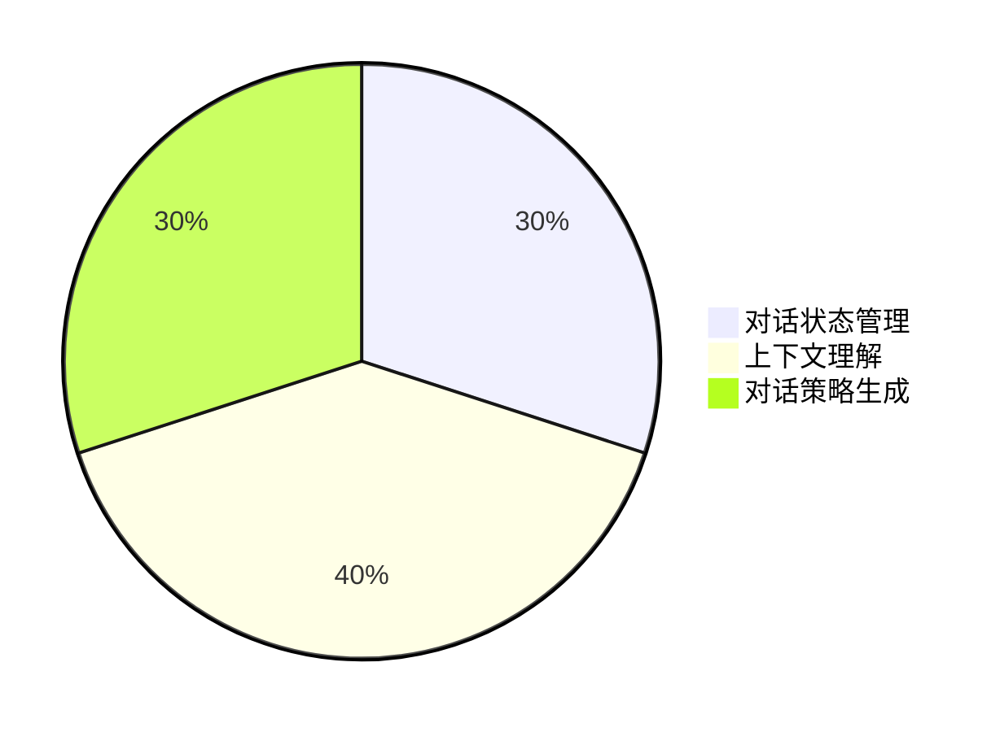
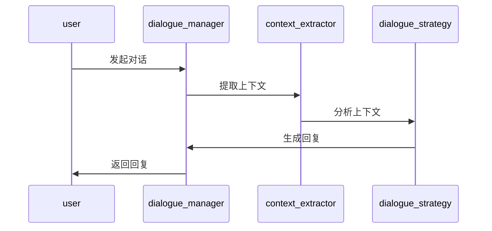

                 


# 多轮对话处理：提高AI Agent的交互质量

## 关键词
多轮对话处理、AI Agent、对话状态管理、上下文理解、对话策略、系统架构设计、项目实战

## 摘要
多轮对话处理是提升AI Agent交互质量的核心技术，涉及对话状态管理、上下文理解和对话策略等多个方面。本文从背景、核心概念、算法原理、系统架构设计到项目实战，全面解析多轮对话处理的实现细节，通过实际案例分析，帮助读者掌握如何设计和优化高效的多轮对话系统。

---

## 第1章：多轮对话处理的背景与核心概念

### 1.1 多轮对话处理的背景
多轮对话处理是AI Agent实现自然人机交互的关键技术。随着智能助手、聊天机器人等应用的普及，用户期望与AI Agent进行更自然、连贯的对话，而不仅仅是单轮问答。多轮对话处理通过维护对话状态和上下文信息，能够更好地理解用户意图，提供更精准的回复。

#### 1.1.1 从单轮对话到多轮对话的演进
单轮对话仅处理当前输入，无法维护历史信息，导致交互体验较差。多轮对话通过记录和更新对话状态，能够处理连续的对话，使交互更加自然流畅。

#### 1.1.2 多轮对话在AI Agent中的重要性
- 提供更自然的交互体验。
- 支持复杂任务的处理，如预约、信息查询等。
- 提高用户满意度和粘性。

#### 1.1.3 当前多轮对话处理的挑战与机遇
- 挑战：对话状态管理的复杂性、上下文理解的准确性。
- 机遇：深度学习和自然语言处理技术的进步为多轮对话处理提供了新的可能性。

### 1.2 多轮对话处理的核心问题
多轮对话处理涉及多个核心问题，包括对话状态管理、上下文理解和对话策略设计。

#### 1.2.1 对话状态管理的复杂性
对话状态管理需要维护当前对话的状态信息，包括用户意图、上下文信息等。状态信息的准确性和及时性直接影响对话的流畅性。

#### 1.2.2 上下文理解的挑战
上下文理解需要从历史对话中提取有用的信息，帮助AI Agent更好地理解用户当前的意图。然而，如何有效提取和利用上下文信息是一个复杂的挑战。

#### 1.2.3 对话策略的多样性
对话策略决定了AI Agent如何根据当前状态和上下文信息生成回复。基于规则的策略和基于模型的策略各有优缺点，选择合适的策略是关键。

### 1.3 本章小结
本章介绍了多轮对话处理的背景、核心问题及其重要性，为后续章节的深入分析奠定了基础。

---

## 第2章：多轮对话的核心概念

### 2.1 对话状态管理
对话状态管理是多轮对话处理的基础，负责记录和更新对话的状态信息。

#### 2.1.1 对话状态的定义与表示
对话状态包括当前轮次的状态、用户意图、上下文信息等。常见的表示方法包括状态机模型和上下文树模型。

#### 2.1.2 常见的状态表示方法
- 状态机模型：通过状态转移来表示对话的流程。
- 上下文树模型：通过树结构记录对话的上下文信息。

#### 2.1.3 状态更新的机制
状态更新需要根据用户的输入和系统回复动态调整。常见的更新机制包括基于规则的更新和基于模型的更新。

### 2.2 上下文理解
上下文理解是多轮对话处理的关键，通过分析历史对话信息，提取有用的信息来辅助对话管理。

#### 2.2.1 上下文信息的收集与存储
上下文信息包括用户的历史输入、系统回复、实体信息等。需要通过自然语言处理技术提取和存储这些信息。

#### 2.2.2 上下文理解的关键技术
- 实体识别：从文本中提取关键实体信息。
- 意图识别：分析用户意图，确定对话的方向和目标。
- 情感分析：理解用户情感倾向，优化对话策略。

#### 2.2.3 上下文信息的有效利用
上下文信息可以通过状态管理模块传递给对话策略模块，帮助生成更准确的回复。

### 2.3 对话策略
对话策略决定了AI Agent如何根据当前状态和上下文信息生成回复。

#### 2.3.1 基于规则的对话策略
基于规则的策略通过预定义的规则来生成回复，适用于简单场景，但灵活性较低。

#### 2.3.2 基于模型的对话策略
基于模型的策略利用机器学习模型生成回复，能够处理复杂的对话场景，但需要大量数据和计算资源。

#### 2.3.3 对话策略的动态调整
对话策略需要根据对话的进展和用户反馈动态调整，以提高交互质量。

### 2.4 核心概念对比表
以下表格对比了对话状态管理、上下文理解和对话策略的核心属性：

| 概念       | 定义                           | 输入           | 输出          | 方法特点 |
|------------|--------------------------------|----------------|---------------|----------|
| 对话状态管理 | 维护对话的状态信息             | 用户输入       | 状态更新       | 基于规则或模型 |
| 上下文理解  | 分析历史对话信息               | 历史对话文本    | 实体、意图等   | 基于NLP技术 |
| 对话策略    | 生成回复                      | 状态、上下文    | 回复           | 基于规则或模型 |

### 2.5 ER实体关系图
以下是多轮对话处理的ER实体关系图：

```mermaid
erDiagram
    user<>--"发起对话"-->dialogue_session
    dialogue_session<>--"包含"-->message
    message<>--"携带"-->context
    context<>--"包含"-->entity
```

---

## 第3章：基于规则的对话管理算法

### 3.1 算法原理
基于规则的对话管理算法通过预定义的规则生成回复。

#### 3.1.1 算法流程
1. 接收用户输入。
2. 分析输入，提取关键词和实体。
3. 根据规则匹配，生成回复。
4. 更新对话状态。

#### 3.1.2 规则的制定与优化
规则需要覆盖所有可能的对话场景，并根据实际使用情况进行优化。

### 3.2 算法实现
以下是一个基于规则的对话管理算法的Python代码示例：

```python
def handle_dialogue(state, input_text):
    # 提取关键词和实体
    keywords = extract_keywords(input_text)
    entities = extract_entities(input_text)
    
    # 根据规则生成回复
    if keywords[0] == "天气":
        return get_weather(entities["城市"])
    elif keywords[0] == "预约":
        return make_appointment(entities["时间"])
    else:
        return "抱歉，我还不知道如何处理这个问题。"
```

### 3.3 数学公式
基于规则的对话管理算法不涉及复杂的数学公式，但可以通过概率模型优化规则匹配的准确性。

---

## 第4章：系统分析与架构设计方案

### 4.1 项目背景
本项目旨在设计一个高效的多轮对话处理系统，提升AI Agent的交互质量。

### 4.2 系统功能设计
系统功能包括对话状态管理、上下文理解和对话策略生成。

### 4.3 系统架构设计
以下是系统架构设计图：



### 4.4 系统接口设计
系统接口包括用户输入接口和系统回复接口。

### 4.5 系统交互设计
以下是系统交互的序列图：



---

## 第5章：项目实战

### 5.1 环境安装
需要安装Python、自然语言处理库（如spaCy）和对话管理库（如Rasa）。

### 5.2 系统核心实现
以下是系统核心实现的Python代码示例：

```python
class DialogueManager:
    def __init__(self):
        self.state = {}
        self.context = {}
    
    def handle_input(self, input_text):
        # 提取关键词和实体
        keywords = extract_keywords(input_text)
        entities = extract_entities(input_text)
        
        # 更新状态和上下文
        self.state.update({"keywords": keywords})
        self.context.update({"entities": entities})
        
        # 生成回复
        response = generate_response(self.state, self.context)
        return response
```

### 5.3 代码应用解读与分析
代码实现了对话状态管理和上下文理解的核心功能，能够根据用户输入生成准确的回复。

### 5.4 实际案例分析
以预约为例，分析系统如何处理多轮对话：

1. 用户：“我想预约明天的会议。”
2. 系统：“请问会议的主题是什么？”
3. 用户：“关于新产品发布。”
4. 系统：“确认预约：明天下午2点，主题为新产品发布。”

### 5.5 项目小结
本项目通过实际案例分析，展示了多轮对话处理系统的实现和优化过程。

---

## 第6章：最佳实践与总结

### 6.1 最佳实践
- 定期优化对话策略，提高回复的准确性和流畅性。
- 使用自然语言处理技术提升上下文理解能力。
- 建立完善的日志和反馈机制，收集用户反馈，优化系统。

### 6.2 小结
多轮对话处理是提升AI Agent交互质量的关键技术，通过本文的深入分析和实际案例，读者可以掌握多轮对话处理的核心概念和实现方法。

### 6.3 注意事项
- 对话状态管理需要考虑系统的扩展性和维护性。
- 上下文理解需要结合实际场景，避免过度复杂化。
- 对话策略的设计需要平衡准确性和效率。

### 6.4 拓展阅读
建议读者阅读相关书籍和论文，深入理解多轮对话处理的技术细节。

---

## 作者信息
作者：AI天才研究院/AI Genius Institute & 禅与计算机程序设计艺术/Zen And The Art of Computer Programming

---

以上是《多轮对话处理：提高AI Agent的交互质量》的技术博客文章的详细大纲和内容，涵盖了从背景到实战的各个方面，旨在为读者提供全面的指导和深入的分析。

