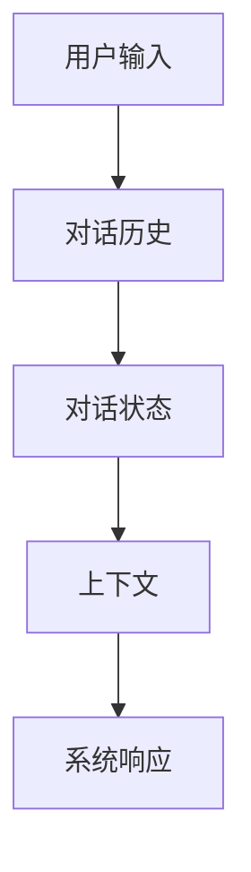
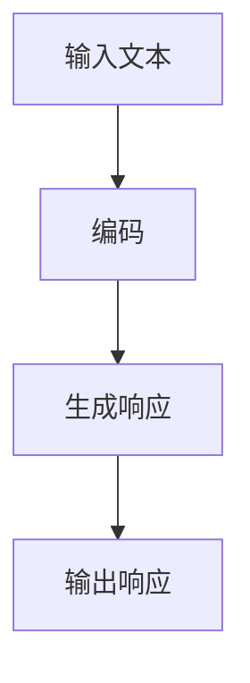

                 

# 多轮对话管理：提升AI Agent的交互体验

## 关键词：
多轮对话管理, AI Agent, 对话状态, 对话历史, 上下文理解, 强化学习, 生成模型

## 摘要：
多轮对话管理是实现自然人机交互的核心技术，通过有效跟踪对话状态、管理和利用对话历史与上下文信息，可以显著提升AI Agent的交互体验。本文系统地探讨了多轮对话管理的背景、核心概念、算法原理、系统架构设计、项目实战以及最佳实践，帮助读者全面理解和应用这一技术。

---

# 第一部分: 多轮对话管理基础

## 第1章: 多轮对话管理的背景与概念

### 1.1 多轮对话管理的定义
#### 1.1.1 对话管理的基本概念
对话管理是实现人机交互的核心技术，通过理解和生成对话内容，确保对话的连贯性和有效性。多轮对话管理是指在多个交互回合中，持续跟踪对话状态、理解和生成对话内容的过程。

#### 1.1.2 多轮对话的特点
- **连续性**：对话在多个回合中逐步展开，每一轮的输入和输出都与前一轮相关联。
- **上下文依赖性**：对话内容依赖于历史信息和当前的上下文。
- **目标导向性**：对话通常以完成特定任务或达成目标为导向。

#### 1.1.3 多轮对话管理的重要性
- 提高用户体验：通过理解和记忆对话历史，AI Agent能够提供更个性化的服务。
- 支持复杂任务：多轮对话管理能够处理需要多步推理和信息整合的任务。
- 实现自然交互：通过连续的对话，用户可以以更自然的方式与AI Agent交互。

### 1.2 多轮对话管理的背景
#### 1.2.1 人工智能的发展与对话交互
随着自然语言处理技术的发展，对话系统逐渐从单轮问答模式向多轮对话模式转变，以更好地模拟人类对话的复杂性。

#### 1.2.2 当前对话系统的挑战
- 对话历史的管理复杂性
- 对话状态的动态变化
- 上下文信息的有效利用

#### 1.2.3 多轮对话管理的应用场景
- 智能客服：通过多轮对话帮助用户解决问题。
- 智能助手：如Siri、Alexa等，通过多轮对话为用户提供服务。
- 智能教育：通过多轮对话为学生提供个性化的学习支持。

### 1.3 多轮对话管理的核心问题
#### 1.3.1 对话状态的跟踪
对话状态是指当前对话的语义信息，通常包括用户的目标、意图和对话的主题。

#### 1.3.2 对话历史的管理
对话历史是指所有之前交互的内容，用于帮助理解当前对话的上下文。

#### 1.3.3 上下文的理解与应用
上下文理解是通过分析对话历史，提取与当前对话相关的背景信息。

---

## 第2章: 多轮对话管理的核心概念与联系

### 2.1 对话状态管理的原理
#### 2.1.1 对话状态的表示方法
对话状态通常通过状态表示（State）、动作（Action）和奖励（Reward）的三元组来表示。

#### 2.1.2 对话状态的更新机制
对话状态的更新依赖于用户的输入和当前的对话上下文。

#### 2.1.3 对话状态的验证与纠错
通过对话历史和上下文信息，对当前对话状态进行验证和纠错。

### 2.2 对话历史与上下文的关系
#### 2.2.1 对话历史的存储与检索
对话历史可以通过数据库或缓存技术进行存储和检索。

#### 2.2.2 上下文信息的提取与应用
上下文信息可以通过自然语言处理技术从对话历史中提取。

#### 2.2.3 对话历史与当前对话的关系
对话历史是当前对话的背景信息，用于帮助理解当前对话的语境。

### 2.3 多轮对话管理的实体关系图

---

## 第3章: 多轮对话管理的算法原理

### 3.1 基于强化学习的对话管理
#### 3.1.1 强化学习的基本原理
强化学习是一种通过试错机制学习策略的方法，通过最大化累积奖励来优化决策。

#### 3.1.2 DQN算法在对话管理中的应用
DQN（Deep Q-Network）算法通过深度神经网络近似Q值函数，用于对话管理中的决策优化。

#### 3.1.3 DQN算法的数学模型
$$ Q(s, a) = \max_{a'} Q(s', a') + r $$

### 3.2 基于生成模型的对话管理
#### 3.2.1 生成模型的基本原理
生成模型通过概率生成模型生成对话内容，能够处理复杂的对话场景。

#### 3.2.2 BERT模型在对话管理中的应用
BERT模型通过预训练语言模型生成对话内容，能够处理复杂的对话场景。

#### 3.2.3 生成模型的对话流程图

---

## 第4章: 多轮对话管理的系统分析与架构设计

### 4.1 问题场景介绍
多轮对话管理系统的应用场景包括智能客服、智能助手和智能教育等。

### 4.2 系统功能设计
#### 4.2.1 领域模型
通过领域模型描述对话管理系统的功能模块和交互流程。

#### 4.2.2 系统架构设计
通过架构图展示系统的模块划分和交互流程。

#### 4.2.3 系统接口设计
通过接口设计描述系统与其他模块的交互接口。

#### 4.2.4 系统交互序列图
通过序列图展示系统的交互流程。

---

## 第5章: 多轮对话管理的项目实战

### 5.1 环境安装
安装必要的开发环境和工具，如Python、TensorFlow等。

### 5.2 系统核心实现源代码
展示对话管理系统的核心代码实现。

### 5.3 代码应用解读与分析
通过代码解读和分析，展示对话管理系统的实现细节。

### 5.4 实际案例分析
通过具体案例分析，展示对话管理系统的实际应用。

### 5.5 项目小结
总结项目实现的经验和教训。

---

## 第6章: 多轮对话管理的高级主题与最佳实践

### 6.1 高级主题
#### 6.1.1 对话管理的优化方法
通过优化算法和模型结构提高对话管理系统的性能。

#### 6.1.2 对话管理的性能评估
通过评估指标和方法，优化对话管理系统的性能。

#### 6.1.3 对话管理的伦理问题
探讨对话管理中的伦理问题，如隐私保护和数据安全。

### 6.2 最佳实践 tips
- 确保对话历史的有效管理和应用。
- 使用合适的算法和模型提高对话管理的性能。
- 注重用户体验，优化对话的自然性和流畅性。

### 6.3 小结
总结全文，强调多轮对话管理的重要性和应用前景。

### 6.4 注意事项
- 确保对话历史的有效管理和应用。
- 使用合适的算法和模型提高对话管理的性能。
- 注重用户体验，优化对话的自然性和流畅性。

### 6.5 拓展阅读
推荐相关的书籍和论文，供读者进一步学习和研究。

---

## 参考文献

---

## 附录

### 附录A: 工具与库
- Python
- TensorFlow
- PyTorch
- BERT模型

### 附录B: 代码示例

---

## 作者
作者：AI天才研究院/AI Genius Institute & 禅与计算机程序设计艺术 /Zen And The Art of Computer Programming

