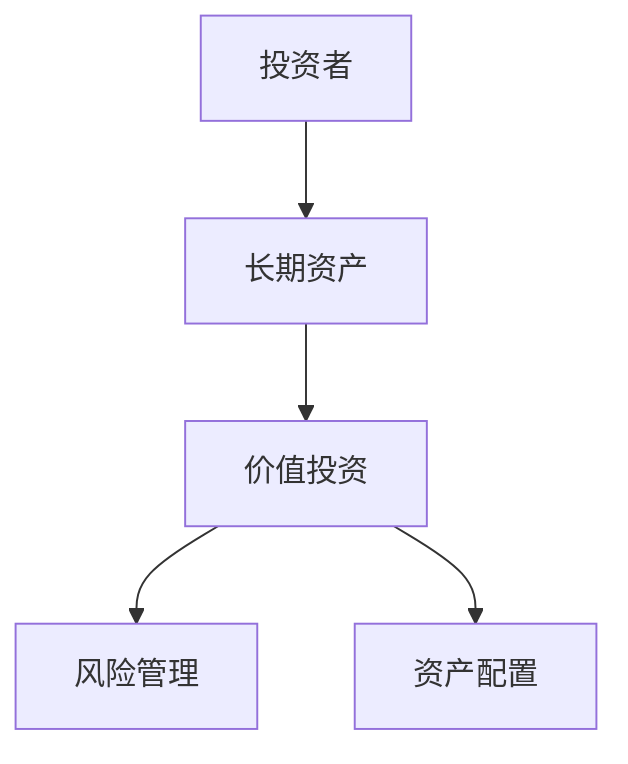
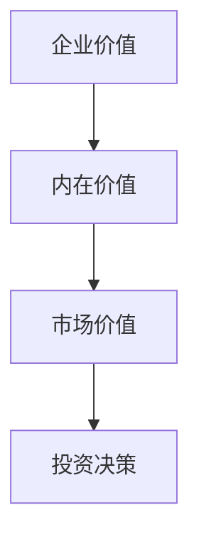
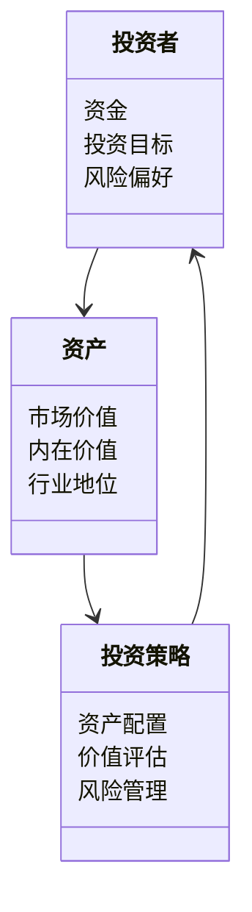
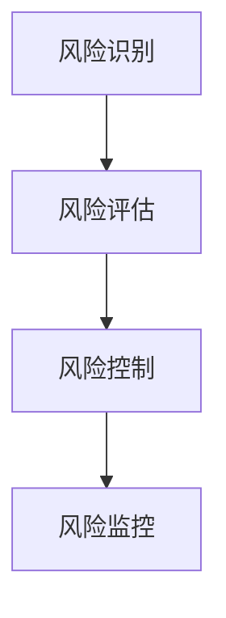
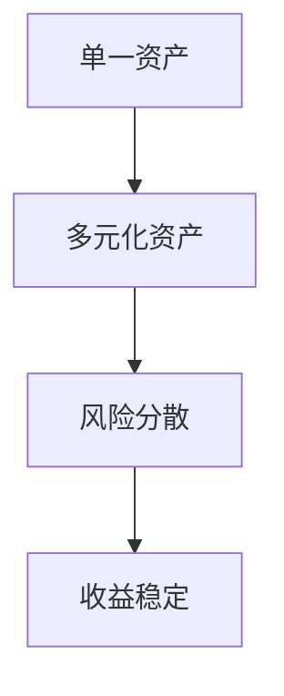
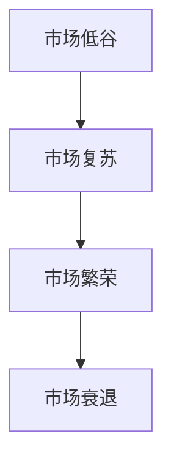
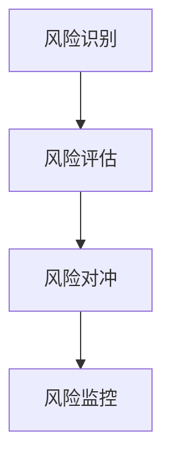

                 


# 《大卫·斯文森的耐心资本：长期投资的艺术》

---

## 关键词

- 耐心资本 (Patient Capital)
- 长期投资 (Long-term Investment)
- 资产配置 (Asset Allocation)
- 价值投资 (Value Investment)
- 风险管理 (Risk Management)
- 资本运作 (Capital Operation)
- 投资策略 (Investment Strategy)

---

## 摘要

《大卫·斯文森的耐心资本：长期投资的艺术》这本书深入探讨了耐心资本的理论与实践，结合大卫·斯文森的投资哲学，系统地分析了长期投资的核心策略、资产配置原则、风险管理方法以及价值投资的精要。文章通过详细的案例分析和系统设计，揭示了耐心资本在实际投资中的应用价值，为投资者提供了从理论到实践的全方位指导。

---

## 正文

### 第1章：耐心资本的基本概念

#### 1.1 背景介绍

耐心资本是一种以长期视角看待投资的策略，强调对优质资产的长期持有和持续投入。大卫·斯文森作为耶鲁大学捐赠基金的首席投资官，通过耐心资本的理念，将耶鲁大学的捐赠基金从20世纪80年代的不足1亿美元，管理到了今天的数十亿美元规模。

#### 1.2 核心概念与联系

##### 1.2.1 耐心资本的核心属性

| 属性 | 描述 |
|------|------|
| 长期性 | 投资本质上是长期的，而非短期的投机 |
| 稳定性 | 通过分散投资降低波动性风险 |
| 价值导向 | 以企业内在价值为投资依据，而非市场情绪 |

##### 1.2.2 耐心资本的实体关系图



#### 1.3 算法原理

##### 1.3.1 耐心资本的数学模型

$$
\text{投资收益} = \text{资产价值} \times \text{持有时间} \times \text{复利因子}
$$

##### 1.3.2 价值评估算法



#### 1.4 系统分析

##### 1.4.1 领域模型



### 第2章：长期投资的策略与实践

#### 2.1 资产配置与投资组合管理

##### 2.1.1 资产配置的数学模型

$$
\text{最优资产配置} = \arg \max_{w} \left( \mu \cdot w - \frac{1}{2} \sigma^2 \cdot w \cdot w^T \right)
$$

##### 2.1.2 资产配置的实现代码

```python
import numpy as np

def optimal_asset_allocation(returns, covariance):
    # 计算最优权重
    n = returns.shape[1]
    inv_cov = np.linalg.inv(covariance)
    weights = inv_cov @ returns.mean(axis=0)
    weights = weights / np.sum(weights)
    return weights
```

#### 2.2 风险管理与投资纪律

##### 2.2.1 风险管理的流程图



### 第3章：耐心资本的核心原则

#### 3.1 价值投资与长期持有

##### 3.1.1 价值投资的数学模型

$$
\text{内在价值} = \sum_{t=1}^{n} \frac{CF_t}{(1 + r)^t}
$$

##### 3.1.2 长期持有的实现代码

```python
import pandas as pd

def calculate_intrinsic_value(cash_flows, discount_rate):
    n = len(cash_flows)
    present_value = 0
    for t in range(n):
        present_value += cash_flows[t] / (1 + discount_rate) ** t
    return present_value
```

#### 3.2 分散投资与组合优化

##### 3.2.1 分散投资的流程图



### 第4章：市场分析与投资机会

#### 4.1 市场周期与投资机会

##### 4.1.1 市场周期的分析图



#### 4.2 行业趋势与长期投资

##### 4.2.1 行业趋势的数学模型

$$
\text{行业增长潜力} = \beta \times \text{行业增长率} + (1 - \beta) \times \text{市场增长率}
$$

### 第5章：投资组合管理与风险管理

#### 5.1 投资组合的构建与优化

##### 5.1.1 投资组合优化的代码

```python
import numpy as np

def portfolio_optimization(returns, risk_aversion):
    n = returns.shape[1]
    cov = returns.cov()
    inv_cov = np.linalg.inv(cov)
    weights = inv_cov @ returns.mean()
    weights = weights / np.sum(weights)
    return weights
```

#### 5.2 风险管理策略与执行

##### 5.2.1 风险管理策略的流程图



### 第6章：总结与启示

#### 6.1 总结

耐心资本的核心在于长期视角和价值投资，通过合理的资产配置和严格的风险管理，投资者可以在长期实现稳定的收益。

#### 6.2 启示

长期投资需要耐心、纪律和对市场的深刻理解。通过系统化的投资策略和科学的管理方法，耐心资本为投资者提供了一种可持续的财富增长路径。

---

## 作者

作者：AI天才研究院/AI Genius Institute & 禅与计算机程序设计艺术 /Zen And The Art of Computer Programming

---

# 《大卫·斯文森的耐心资本：长期投资的艺术》

---

以上是《大卫·斯文森的耐心资本：长期投资的艺术》的完整目录大纲和部分内容概览，涵盖了从理论到实践的全方位分析。

