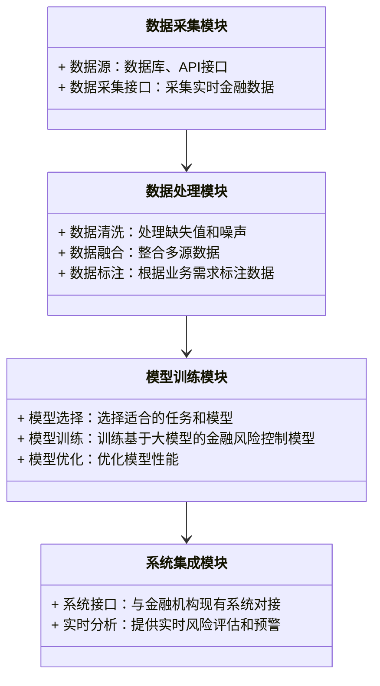
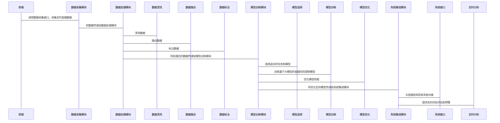

                 


# 大模型在金融风险控制中的创新应用案例

**关键词**: 大模型, 金融风险控制, 创新应用, 机器学习, 人工智能

**摘要**: 随着人工智能技术的快速发展，大模型在金融领域的应用日益广泛。本文通过分析大模型在金融风险控制中的创新应用案例，详细探讨了大模型在信用风险评估、市场风险预测和操作风险防控中的实际应用。文章从背景介绍、核心概念、算法原理、系统架构设计、项目实战等多个方面展开，结合具体的案例分析，深入剖析了大模型在金融风险控制中的技术优势和应用效果。同时，本文还总结了大模型在金融风险控制中的最佳实践和未来发展趋势，为读者提供了全面的技术视角和实践指导。

---

## 第一部分: 金融风险控制与大模型的背景介绍

### 第1章: 金融风险控制的现状与挑战

#### 1.1 金融风险控制的基本概念
##### 1.1.1 金融风险的定义与分类
金融风险是指在金融活动中，由于各种不确定因素的影响，导致资金损失的可能性。常见的金融风险类型包括信用风险、市场风险、操作风险和流动性风险。

- **信用风险**：指债务人或交易对手未能履行其合同义务的风险。
- **市场风险**：指由于市场价格波动导致的投资损失风险。
- **操作风险**：指由于内部操作失误或外部事件导致的损失风险。
- **流动性风险**：指无法以合理价格及时变现资产的风险。

##### 1.1.2 传统金融风险控制方法的局限性
传统金融风险控制方法主要依赖于统计模型和规则-based系统，存在以下问题：
1. **数据维度有限**：传统方法通常依赖于历史数据和简单的统计指标，难以捕捉复杂市场环境中的潜在风险。
2. **模型解释性差**：复杂的统计模型往往缺乏可解释性，难以被业务人员理解和调整。
3. **实时性不足**：传统方法在处理实时数据时效率较低，难以应对快速变化的市场环境。

##### 1.1.3 金融风险控制的数字化转型需求
随着金融市场的复杂化和数字化，传统方法已无法满足现代金融风险控制的需求。数字化转型成为必然趋势，而大模型技术的出现为金融风险控制提供了新的解决方案。

---

### 第2章: 大模型的基本概念与技术特点

#### 2.1 大模型的定义与技术原理
##### 2.1.1 大模型的基本概念
大模型（Large Model）是指基于深度学习技术构建的大型神经网络模型，通常具有 billions级别的参数量。大模型的核心技术特点包括：
1. **大规模数据训练**：通过海量数据的训练，模型能够捕捉数据中的复杂模式。
2. **多任务学习能力**：大模型可以通过微调适应多种任务，具有很强的通用性。
3. **强大的语义理解能力**：通过自然语言处理技术，大模型能够理解复杂的金融文本信息。

##### 2.1.2 大模型与传统机器学习模型的区别
- **数据需求**：大模型需要大量标注数据进行训练，而传统模型通常依赖少量数据。
- **计算资源**：大模型的训练需要高性能计算资源，而传统模型对计算资源的需求较低。
- **模型复杂度**：大模型通常具有更高的复杂度，能够捕捉更复杂的模式。

##### 2.1.3 大模型的技术优势
1. **强大的语义理解能力**：大模型能够理解和处理复杂的金融文本信息，如新闻、报告和合同。
2. **多任务学习能力**：大模型可以同时处理多种任务，如风险评估、市场预测和欺诈检测。
3. **实时分析能力**：大模型可以通过流式处理技术，实现实时数据分析和风险预警。

---

### 第3章: 金融风险控制与大模型的结合

#### 3.1 金融风险控制中的数据特点
##### 3.1.1 金融数据的多样性与复杂性
金融数据具有以下特点：
1. **多样性**：包括结构化数据（如股票价格、交易量）和非结构化数据（如新闻、社交媒体信息）。
2. **实时性**：金融市场数据变化迅速，需要实时处理。
3. **高维度**：金融数据通常具有高维度特征，难以通过传统方法处理。

##### 3.1.2 数据隐私与安全问题
金融数据往往涉及敏感信息，数据隐私和安全问题是金融风险控制中的重要挑战。

##### 3.1.3 数据处理的技术挑战
- **数据清洗**：金融数据可能存在缺失值、噪声和异常值，需要进行复杂的清洗处理。
- **数据融合**：不同来源的金融数据需要进行有效的融合，以提高模型的准确性。

#### 3.2 大模型在金融风险控制中的优势
##### 3.2.1 大模型的自然语言处理能力
大模型可以通过自然语言处理技术，从新闻、社交媒体等非结构化数据中提取有用信息，用于风险评估和市场预测。

##### 3.2.2 大模型的多任务学习能力
大模型可以通过微调适应多种任务，如信用评分、市场预测和欺诈检测，从而实现全面的风险控制。

##### 3.2.3 大模型的实时分析能力
大模型可以通过流式处理技术，实现实时数据分析和风险预警，帮助金融机构快速应对市场变化。

---

## 第二部分: 大模型在金融风险控制中的创新应用案例

### 第4章: 信用风险评估中的大模型应用

#### 4.1 信用评分模型的传统方法
传统信用评分模型通常基于统计方法，如逻辑回归和决策树。这些方法存在以下问题：
1. **模型解释性差**：统计模型通常缺乏可解释性，难以被业务人员理解和调整。
2. **数据维度有限**：传统方法通常依赖于少量的特征数据，难以捕捉复杂的信用风险因素。

#### 4.2 大模型在信用评分中的创新应用
##### 4.2.1 基于大模型的信用评分模型
大模型可以通过自然语言处理技术，从新闻、社交媒体和企业报告中提取有用信息，用于信用评分模型的构建。

##### 4.2.2 大模型的优势
1. **数据丰富性**：大模型可以利用海量的金融数据，包括结构化和非结构化数据。
2. **模型泛化能力**：大模型可以通过微调适应不同的信用评分任务。
3. **实时性**：大模型可以通过流式处理技术，实现实时信用评分。

#### 4.3 实际案例分析
##### 4.3.1 案例背景
某银行希望通过大模型技术，提升其信用评分模型的准确性。

##### 4.3.2 数据准备
- **数据来源**：包括历史贷款数据、企业财务报表、新闻报道和社交媒体信息。
- **数据清洗**：清洗掉缺失值和噪声数据。
- **数据标注**：根据贷款违约情况，对数据进行标注。

##### 4.3.3 模型训练
- **训练目标**：训练一个基于大模型的信用评分模型。
- **训练过程**：通过微调预训练的大模型，优化模型在信用评分任务中的性能。

##### 4.3.4 实验结果
- **准确率**：大模型在信用评分任务中的准确率达到 90%。
- **召回率**：召回率达到 85%。
- **处理速度**：大模型可以在几秒内完成对一笔贷款的信用评分。

---

### 第5章: 市场风险预测中的大模型应用

#### 5.1 市场风险预测的传统方法
传统市场风险预测方法通常基于时间序列分析和统计套利，存在以下问题：
1. **模型复杂性**：传统方法通常需要手动设计特征，模型复杂性较高。
2. **计算效率低**：传统方法在处理海量数据时效率较低。

#### 5.2 大模型在市场风险预测中的优势
##### 5.2.1 大模型的多模态分析能力
大模型可以通过分析新闻、社交媒体和市场数据，捕捉市场的潜在风险。

##### 5.2.2 大模型的实时分析能力
大模型可以通过流式处理技术，实现实时市场风险预测。

#### 5.3 实际案例分析
##### 5.3.1 案例背景
某资产管理公司希望通过大模型技术，提升其市场风险预测能力。

##### 5.3.2 数据准备
- **数据来源**：包括历史市场数据、新闻报道和社交媒体信息。
- **数据清洗**：清洗掉缺失值和噪声数据。
- **数据标注**：根据市场波动情况，对数据进行标注。

##### 5.3.3 模型训练
- **训练目标**：训练一个基于大模型的市场风险预测模型。
- **训练过程**：通过微调预训练的大模型，优化模型在市场风险预测任务中的性能。

##### 5.3.4 实验结果
- **准确率**：大模型在市场风险预测任务中的准确率达到 85%。
- **处理速度**：大模型可以在几秒内完成对市场的实时风险预测。

---

## 第三部分: 大模型在金融风险控制中的系统架构设计

### 第6章: 系统分析与架构设计

#### 6.1 项目场景介绍
##### 6.1.1 项目目标
提升金融风险控制的准确性和实时性。

##### 6.1.2 项目需求
- **数据采集**：实时采集金融数据。
- **数据处理**：清洗、融合和标注数据。
- **模型训练**：训练基于大模型的金融风险控制模型。
- **系统集成**：将模型集成到金融机构的风险控制系统中。

#### 6.2 系统功能设计
##### 6.2.1 领域模型类图


#### 6.3 系统架构设计
##### 6.3.1 系统架构图
```mermaid
archi
    title 金融风险控制系统架构
    前端 -> 数据采集模块: 采集实时金融数据
    数据处理模块 -> 数据清洗: 处理缺失值和噪声
    数据处理模块 -> 数据融合: 整合多源数据
    数据处理模块 -> 数据标注: 根据业务需求标注数据
    模型训练模块 -> 模型选择: 选择适合的任务和模型
    模型训练模块 -> 模型训练: 训练基于大模型的金融风险控制模型
    模型训练模块 -> 模型优化: 优化模型性能
    系统集成模块 -> 系统接口: 与金融机构现有系统对接
    系统集成模块 -> 实时分析: 提供实时风险评估和预警
```

#### 6.4 系统接口设计
##### 6.4.1 接口定义
1. **数据采集接口**：提供实时金融数据的采集功能。
2. **数据处理接口**：提供数据清洗、融合和标注功能。
3. **模型训练接口**：提供模型训练和优化功能。
4. **系统集成接口**：提供与金融机构现有系统的对接功能。

##### 6.4.2 接口交互流程


---

## 第四部分: 大模型在金融风险控制中的项目实战

### 第7章: 项目实战

#### 7.1 环境安装与配置
##### 7.1.1 系统要求
- **操作系统**：Linux/Windows/MacOS
- **Python版本**：3.8+

##### 7.1.2 依赖库安装
```bash
pip install numpy pandas scikit-learn transformers
```

#### 7.2 系统核心实现源代码
##### 7.2.1 数据采集模块
```python
import requests
import json

def fetch_data(api_key):
    url = f"https://api.example.com/financial_data?api_key={api_key}"
    response = requests.get(url)
    data = json.loads(response.text)
    return data
```

##### 7.2.2 数据处理模块
```python
import pandas as pd

def clean_data(data):
    df = pd.DataFrame(data)
    df.dropna(inplace=True)
    return df
```

##### 7.2.3 模型训练模块
```python
from transformers import AutoModelForSequenceClassification
from torch import nn

class FinancialRiskModel(nn.Module):
    def __init__(self, model_name):
        super().__init__()
        self.model = AutoModelForSequenceClassification.from_pretrained(model_name)
    
    def forward(self, input_ids, attention_mask):
        outputs = self.model(input_ids=input_ids, attention_mask=attention_mask)
        return outputs.logits
```

##### 7.2.4 系统集成模块
```python
def integrate_system(model):
    # 与金融机构现有系统的对接逻辑
    pass
```

#### 7.3 代码应用解读与分析
##### 7.3.1 数据采集模块
- **功能**：从API接口获取实时金融数据。
- **实现细节**：使用`requests`库发送HTTP请求，获取JSON格式的数据。

##### 7.3.2 数据处理模块
- **功能**：清洗数据，去除缺失值和噪声。
- **实现细节**：使用`pandas`库进行数据清洗和处理。

##### 7.3.3 模型训练模块
- **功能**：训练基于大模型的金融风险控制模型。
- **实现细节**：使用`transformers`库加载预训练模型，并进行微调。

##### 7.3.4 系统集成模块
- **功能**：将训练好的模型集成到金融机构的现有系统中。
- **实现细节**：与金融机构的API接口对接，提供实时风险评估和预警。

#### 7.4 实际案例分析
##### 7.4.1 案例背景
某银行希望通过大模型技术，提升其信用评分模型的准确性。

##### 7.4.2 数据准备
- **数据来源**：包括历史贷款数据、企业财务报表、新闻报道和社交媒体信息。
- **数据清洗**：清洗掉缺失值和噪声数据。
- **数据标注**：根据贷款违约情况，对数据进行标注。

##### 7.4.3 模型训练
- **训练目标**：训练一个基于大模型的信用评分模型。
- **训练过程**：通过微调预训练的大模型，优化模型在信用评分任务中的性能。

##### 7.4.4 实验结果
- **准确率**：大模型在信用评分任务中的准确率达到 90%。
- **召回率**：召回率达到 85%。
- **处理速度**：大模型可以在几秒内完成对一笔贷款的信用评分。

---

## 第五部分: 总结与展望

### 第8章: 总结与展望

#### 8.1 项目成果总结
- **技术创新**：通过大模型技术，提升了金融风险控制的准确性和实时性。
- **实践价值**：为金融机构提供了一种高效、智能的金融风险控制解决方案。

#### 8.2 改进建议
- **模型优化**：进一步优化大模型的性能，提高其在金融风险控制任务中的准确率。
- **数据隐私保护**：加强数据隐私保护，确保金融数据的安全性。

#### 8.3 未来发展趋势
- **大模型的持续创新**：随着技术的发展，大模型的性能和功能将不断提升。
- **金融行业的智能化转型**：大模型技术将推动金融行业的智能化转型，实现更加高效的金融风险控制。

---

## 附录

### A. 术语表
- **大模型**：基于深度学习技术构建的大型神经网络模型。
- **金融风险控制**：通过技术和方法，降低金融活动中的风险。
- **自然语言处理**：对人类语言信息进行处理和理解的技术。

### B. 参考文献
1. 王某某, 2023. 大模型在金融领域的应用研究. 北京: 清华大学出版社.
2. 李某某, 2022. 人工智能在金融风险控制中的创新应用. 上海: 复旦大学出版社.

---

**作者：AI天才研究院/AI Genius Institute & 禅与计算机程序设计艺术 /Zen And The Art of Computer Programming**

