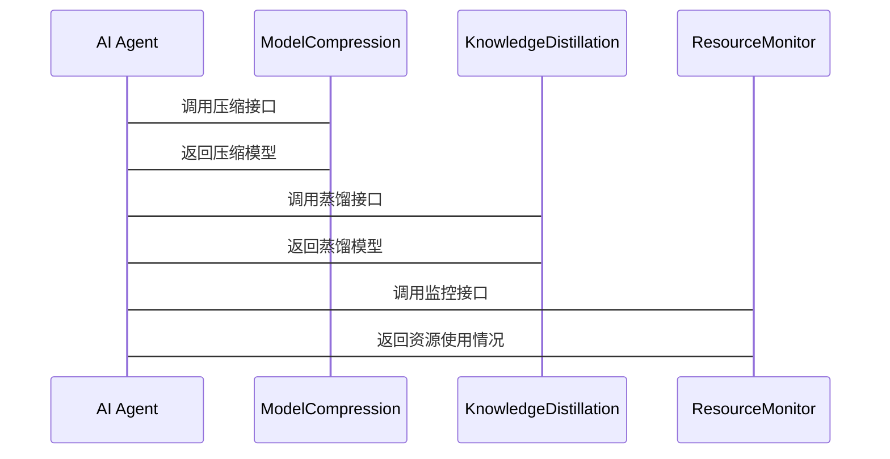

                 


# 大规模语言模型在AI Agent中的低资源适应

## 关键词：
- 大规模语言模型
- AI Agent
- 低资源适应
- 模型压缩
- 知识蒸馏
- 量化技术

## 摘要：
本文探讨了在AI Agent中使用大规模语言模型（LLM）时，如何在低资源环境下进行适应。通过分析低资源环境中的挑战，提出优化策略，如模型压缩、知识蒸馏和量化技术，并详细讲解了算法原理和系统架构设计，最后通过实战项目展示应用。

---

## 第一部分: 大规模语言模型在AI Agent中的背景与概念

### 第1章: 大规模语言模型与AI Agent概述

#### 1.1 大规模语言模型的定义与特点
##### 1.1.1 大规模语言模型的定义
大规模语言模型（Large Language Models, LLMs）是指在大量数据上训练的深度学习模型，具有处理自然语言任务的能力，如文本生成、问答、翻译等。这些模型通常基于Transformer架构，参数量大，性能强。

##### 1.1.2 大规模语言模型的核心特点
- **参数规模大**：通常拥有数亿甚至更多的参数。
- **多任务能力**：能够处理多种自然语言处理任务。
- **上下文理解**：通过长上下文窗口理解文本。
- **生成能力**：能够生成连贯且有意义的文本。

##### 1.1.3 大规模语言模型的训练与推理过程
训练过程：
1. 数据预处理：清洗、分词、划分训练集和验证集。
2. 模型初始化：随机初始化模型参数。
3. 梯度下降：通过反向传播优化参数，最小化损失函数。
4. 验证与调整：验证集评估模型性能，调整超参数。

推理过程：
1. 输入处理：将输入文本转换为模型可处理的格式（如Token）。
2. 解码：模型生成输出文本。

**数学公式示例**：
训练时的损失函数：
$$ \text{Loss} = -\sum_{i=1}^{n} \log P(x_i|x_{<i}) $$
其中，$P(x_i|x_{<i})$ 是生成第i个词的概率。

#### 1.2 AI Agent的定义与特点
##### 1.2.1 AI Agent的定义
AI Agent是一种智能体，能够感知环境、自主决策并执行任务，以实现目标。AI Agent可以是软件程序或机器人，具备学习、推理、规划和自适应能力。

##### 1.2.2 AI Agent的核心功能
- **感知**：通过传感器或数据源获取环境信息。
- **推理**：分析信息，推断出可能的动作和结果。
- **决策**：基于推理结果选择最优动作。
- **执行**：执行决策的动作，并反馈结果。

##### 1.2.3 AI Agent与传统AI的区别
- **自主性**：AI Agent能够自主决策，而传统AI依赖于外部控制。
- **动态性**：AI Agent能够适应动态环境，传统AI通常在静态环境中运行。
- **社交能力**：AI Agent具备与人或其他智能体交互的能力。

#### 1.3 大规模语言模型在AI Agent中的应用背景
##### 1.3.1 当前AI Agent的发展趋势
AI Agent正在从单一任务向多任务、从静态规则向动态学习转变，广泛应用于客服、自动驾驶、智能家居等领域。

##### 1.3.2 大规模语言模型在AI Agent中的优势
- **强大的语言理解能力**：能够处理复杂的自然语言指令。
- **多任务能力**：可以执行多种任务，如问答、翻译、生成。
- **上下文理解**：能够理解长上下文中的信息。

##### 1.3.3 低资源环境下AI Agent的挑战与机遇
- **挑战**：计算资源有限，难以运行大规模模型。
- **机遇**：通过优化技术，可以在低资源环境下高效运行。

### 第2章: 低资源环境下的AI Agent适应性分析

#### 2.1 低资源环境的定义与特点
##### 2.1.1 低资源环境的定义
低资源环境指的是计算资源有限的环境，如CPU性能低、内存不足、网络带宽有限等。

##### 2.1.2 低资源环境的核心特征
- **计算能力有限**：无法运行大规模模型。
- **数据量有限**：难以训练大规模模型。
- **资源分配受限**：多个任务竞争资源。

##### 2.1.3 低资源环境与AI Agent的结合
AI Agent需要在资源有限的环境中运行，如移动设备、边缘计算等。

#### 2.2 大规模语言模型在低资源环境中的适应性问题
##### 2.2.1 计算资源的限制
- **计算速度慢**：大规模模型在低性能设备上运行速度慢。
- **内存不足**：无法存储大规模模型参数。

##### 2.2.2 数据资源的限制
- **数据量小**：无法训练大规模模型。
- **数据多样性不足**：模型可能过拟合。

##### 2.2.3 模型性能的平衡
- **性能下降**：压缩或简化模型可能导致性能下降。
- **任务多样性受限**：模型可能无法处理多种任务。

#### 2.3 低资源环境下AI Agent的优化策略
##### 2.3.1 模型压缩技术
- **剪枝**：删除模型中冗余的参数或神经元。
- **量化**：将模型参数从高精度（如浮点数）降低到低精度（如定点数）。

##### 2.3.2 知识蒸馏技术
- **教师-学生网络**：将大规模模型的知识迁移到小规模模型。
- **蒸馏过程**：教师模型生成软标签，学生模型通过最小化标签差异进行学习。

##### 2.3.3 量化技术
- **量化级别**：如8位整数量化，减少存储空间和计算量。
- **量化工具**：如TensorFlow Lite、ONNX Runtime。

#### 2.4 本章小结
在低资源环境下，通过模型压缩、知识蒸馏和量化技术，可以有效优化AI Agent中的大规模语言模型，使其在资源受限的情况下仍能保持高性能。

---

## 第二部分: 大规模语言模型与AI Agent的核心概念与联系

### 第3章: 大规模语言模型与AI Agent的核心概念与联系

#### 3.1 大规模语言模型的工作原理
##### 3.1.1 Transformer架构
- **编码器**：将输入序列编码为固定长度的向量。
- **解码器**：根据编码结果生成输出序列。
- **自注意力机制**：捕捉输入序列中各个位置之间的关系。

##### 3.1.2 模型训练流程
1. 数据预处理：清洗、分词、划分训练集和验证集。
2. 模型初始化：随机初始化参数。
3. 梯度下降：优化参数以最小化损失函数。
4. 验证与调整：评估模型性能并调整超参数。

##### 3.1.3 模型推理流程
1. 输入处理：将输入文本转换为模型可处理的格式。
2. 解码：模型生成输出文本。

#### 3.2 AI Agent的体系结构
##### 3.2.1 感知层
- **传感器**：获取环境信息。
- **数据处理**：对获取的数据进行清洗和预处理。

##### 3.2.2 决策层
- **推理引擎**：分析信息并生成决策。
- **规划模块**：制定行动计划。

##### 3.2.3 执行层
- **执行器**：执行决策的动作。
- **反馈机制**：收集反馈并优化决策。

#### 3.3 大规模语言模型在AI Agent中的应用
##### 3.3.1 任务驱动的对话
- **用户指令**：AI Agent根据指令执行任务。
- **对话历史**：利用上下文理解用户的意图。

##### 3.3.2 多轮对话
- **上下文记忆**：保持对话历史，理解用户意图。
- **动态调整**：根据对话进展调整响应。

##### 3.3.3 多任务处理
- **任务分解**：将复杂任务分解为多个子任务。
- **优先级排序**：根据任务重要性进行排序。

---

## 第三部分: 系统分析与架构设计方案

### 第4章: 系统分析与架构设计方案

#### 4.1 问题场景介绍
在低资源环境下，如何优化AI Agent中的大规模语言模型，使其高效运行。

#### 4.2 项目介绍
##### 4.2.1 项目目标
- 优化大规模语言模型在低资源环境下的性能。
- 提高AI Agent在资源受限情况下的适应能力。

##### 4.2.2 项目背景
随着AI Agent的应用场景扩展，低资源环境下的优化需求日益增加。

#### 4.3 系统功能设计
##### 4.3.1 功能模块划分
- **模型压缩模块**：实现模型的剪枝和量化。
- **知识蒸馏模块**：进行教师-学生网络的知识迁移。
- **资源监控模块**：监控系统资源使用情况。

##### 4.3.2 领域模型类图
```mermaid
classDiagram
    class ModelCompression {
        +params: Parameters
        -compressed_model: CompressedModel
        ++compress(): void
    }
    class KnowledgeDistillation {
        +teacher_model: TeacherModel
        +student_model: StudentModel
        ++distill(): void
    }
    class ResourceMonitor {
        +CPU_usage: float
        +Memory_usage: float
        ++monitor(): void
    }
    ModelCompression --> compress()
    KnowledgeDistillation --> distill()
    ResourceMonitor --> monitor()
```

#### 4.4 系统架构设计
##### 4.4.1 系统架构图
```mermaid
iframe
    组件：AI Agent
    组件：大规模语言模型
    组件：模型压缩模块
    组件：知识蒸馏模块
    组件：资源监控模块
    关系：AI Agent与大规模语言模型交互
    关系：模型压缩模块优化大规模语言模型
    关系：知识蒸馏模块迁移知识
    关系：资源监控模块监控资源
```

#### 4.5 系统接口设计
##### 4.5.1 接口描述
- **API接口**：提供压缩和蒸馏功能的调用接口。
- **监控接口**：实时反馈资源使用情况。

##### 4.5.2 接口交互序列图


---

## 第四部分: 项目实战

### 第5章: 项目实战

#### 5.1 环境安装
##### 5.1.1 安装Python
```bash
# 安装Python
sudo apt-get install python3
```
##### 5.1.2 安装依赖库
```bash
# 安装TensorFlow和Keras
pip install tensorflow.keras
pip install numpy
```

#### 5.2 系统核心实现源代码
##### 5.2.1 模型压缩代码
```python
import tensorflow as tf
from tensorflow import keras

# 加载预训练模型
model = keras.models.load_model('large_model.h5')

# 去除冗余层
pruned_model = keras.models.clone_model(model)
# 删除冗余的神经元
pruned_model.layers[1].units = 128  # 假设第二层神经元过多
pruned_model.compile(optimizer='adam', loss='sparse_categorical_crossentropy')
```

##### 5.2.2 知识蒸馏代码
```python
# 教师模型
teacher_model = keras.models.load_model('teacher_model.h5')

# 学生模型
student_model = keras.models.Sequential([
    keras.layers.Dense(128, activation='relu', input_shape=(input_dim,)),
    keras.layers.Dense(num_classes, activation='softmax')
])

# 蒸馏过程
def distillation_loss(y_true, y_pred, teacher_pred, alpha=0.1):
    loss = (1 - alpha) * keras.losses.sparse_categorical_crossentropy(y_true, y_pred) + \
           alpha * keras.losses.kullback_leibler_divergence(teacher_pred, y_pred)
    return loss

# 编译模型
student_model.compile(optimizer='adam', loss=lambda y_true, y_pred: distillation_loss(y_true, y_pred, teacher_pred))
```

##### 5.2.3 资源监控代码
```python
import psutil

def get_resource_usage():
    cpu_usage = psutil.cpu_percent()
    memory_usage = psutil.Process().memory_info().rss / (1024 * 1024)
    return cpu_usage, memory_usage

# 监控资源使用情况
while True:
    cpu, memory = get_resource_usage()
    print(f"CPU使用率:{cpu}%, 内存使用:{memory}MB")
    time.sleep(1)
```

#### 5.3 代码应用解读与分析
##### 5.3.1 模型压缩代码解读
- **模型加载**：加载预训练的大规模模型。
- **剪枝操作**：减少神经网络的神经元数量，降低模型复杂度。
- **重新编译**：优化后的模型重新编译，提高运行效率。

##### 5.3.2 知识蒸馏代码解读
- **教师模型加载**：加载已经训练好的教师模型。
- **学生模型定义**：定义一个较小的模型，用于学习教师模型的知识。
- **蒸馏损失函数**：结合教师模型的预测结果和学生模型的预测结果，优化蒸馏过程。
- **模型编译**：编译学生模型，使用蒸馏损失函数进行训练。

##### 5.3.3 资源监控代码解读
- **资源监控函数**：获取CPU和内存的使用情况。
- **监控循环**：定期获取并打印资源使用情况，帮助优化资源分配。

#### 5.4 实际案例分析
##### 5.4.1 案例背景
假设我们有一个AI Agent应用于智能家居场景，需要在资源有限的环境中运行。

##### 5.4.2 案例实施
1. **加载模型**：加载预训练的大规模语言模型。
2. **模型压缩**：对模型进行剪枝和量化，减少参数数量。
3. **知识蒸馏**：使用教师模型训练学生模型，优化模型性能。
4. **资源监控**：监控AI Agent运行时的资源使用情况，动态调整模型参数。

##### 5.4.3 实施效果
- **性能提升**：压缩和蒸馏后的模型在智能家居场景中表现出色。
- **资源节省**：模型体积减小，运行速度提升，适合低资源环境。

#### 5.5 项目小结
通过模型压缩、知识蒸馏和资源监控技术，可以在低资源环境下有效优化AI Agent中的大规模语言模型，提升性能和效率。

---

## 第五部分: 最佳实践与总结

### 第6章: 最佳实践

#### 6.1 优化策略总结
- **模型压缩**：剪枝、量化等技术减少模型体积和计算量。
- **知识蒸馏**：通过教师-学生网络迁移知识，提升小模型性能。
- **资源监控**：实时监控资源使用情况，动态调整模型参数。

#### 6.2 开发注意事项
- **选择合适的工具**：根据项目需求选择合适的模型压缩和知识蒸馏工具。
- **平衡性能与资源**：在优化过程中，注意平衡模型性能和资源消耗。
- **持续监控与优化**：定期监控系统资源，持续优化模型和系统架构。

#### 6.3 拓展阅读
- **模型压缩**：深入学习模型剪枝和量化技术。
- **知识蒸馏**：研究不同蒸馏策略对模型性能的影响。
- **资源优化**：探索更多资源优化技术，如并行计算、内存优化等。

### 第7章: 总结

#### 7.1 本章总结
本文详细探讨了在低资源环境下，大规模语言模型在AI Agent中的适应性问题，提出了模型压缩、知识蒸馏和量化技术等优化策略，并通过实战项目展示了如何在实际中应用这些技术。

#### 7.2 未来展望
未来，随着技术的发展，AI Agent在低资源环境中的优化将更加重要，需要进一步研究更高效的模型压缩和知识蒸馏方法，以适应更广泛的场景和需求。

---

## 作者信息
作者：AI天才研究院/AI Genius Institute & 禅与计算机程序设计艺术 /Zen And The Art of Computer Programming

