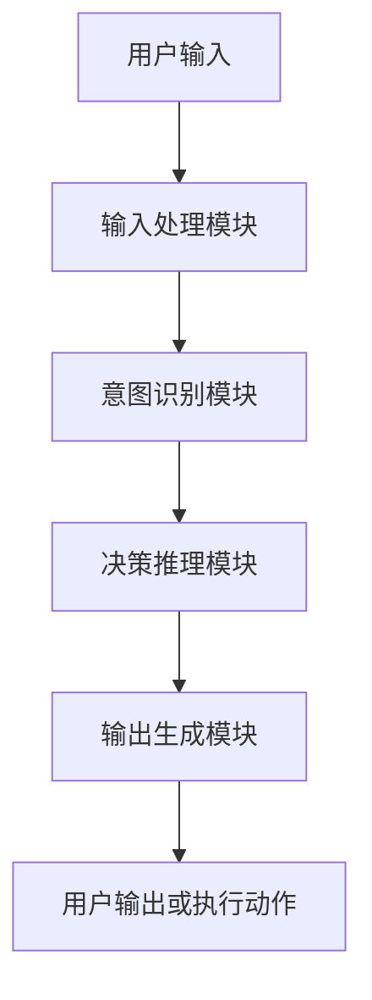
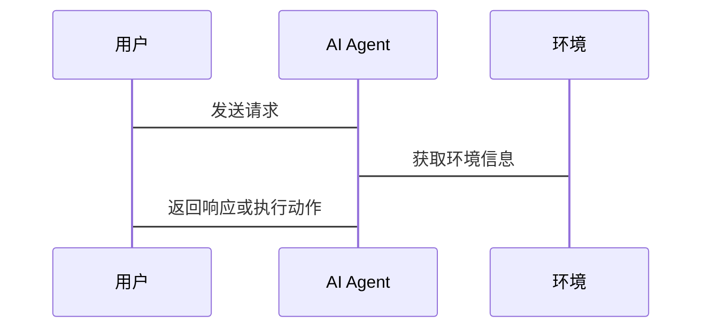

                 


# 大规模语言模型在AI Agent中的微调技巧

> 关键词：大规模语言模型，AI Agent，微调技巧，Transformer，注意力机制，系统架构

> 摘要：本文深入探讨了大规模语言模型在AI Agent中的微调技巧，从理论基础到实际应用，系统性地分析了微调技术的核心原理、算法实现、系统架构设计以及项目实战。文章结合实际案例，详细解读了大规模语言模型如何赋能AI Agent，并通过Mermaid流程图和Python代码示例，帮助读者更好地理解和应用这些技术。

---

## 第1章: 大规模语言模型与AI Agent的背景介绍

### 1.1 大规模语言模型的概述
大规模语言模型（Large Language Models, LLMs）是指在海量数据上训练的深度学习模型，旨在理解和生成人类语言。这些模型通常基于Transformer架构，具有强大的上下文理解和生成能力。

#### 1.1.1 什么是大规模语言模型
大规模语言模型是一种基于深度学习的自然语言处理模型，通过监督学习在大量文本数据上进行预训练，能够理解和生成自然语言文本。

#### 1.1.2 大规模语言模型的特点
- **大规模参数量**：通常包含数亿甚至数十亿的参数。
- **预训练+微调模式**：通过在通用数据集上预训练，再针对特定任务进行微调。
- **强大的上下文理解**：基于Transformer的注意力机制，能够捕捉长距离依赖关系。

#### 1.1.3 大规模语言模型的应用场景
- **文本生成**：如自动写作、对话生成。
- **问答系统**：如智能客服、知识问答。
- **代码生成与补全**：如IDE中的代码补全功能。
- **多语言支持**：能够处理多种语言的文本。

### 1.2 AI Agent的基本概念
AI Agent（人工智能代理）是指能够感知环境、执行任务并做出决策的智能体。AI Agent的核心目标是通过与环境的交互，完成特定任务。

#### 1.2.1 什么是AI Agent
AI Agent是一种智能系统，能够感知环境、执行动作并做出决策。它可以是一个独立的实体，也可以是嵌入在其他系统中的模块。

#### 1.2.2 AI Agent的核心功能
- **感知环境**：通过传感器或API获取环境信息。
- **决策与推理**：基于感知的信息，进行推理和决策。
- **执行动作**：根据决策结果执行动作，影响环境状态。

#### 1.2.3 AI Agent的分类与特点
- **基于规则的AI Agent**：通过预定义的规则进行决策。
- **基于模型的AI Agent**：使用强化学习或深度学习模型进行决策。
- **基于知识的AI Agent**：依赖于知识库进行推理和决策。

### 1.3 大规模语言模型在AI Agent中的作用
大规模语言模型为AI Agent提供了强大的语言理解和生成能力，使其能够更好地与人类交互、处理复杂任务。

#### 1.3.1 大规模语言模型如何赋能AI Agent
- **自然语言处理**：帮助AI Agent理解和生成人类语言。
- **知识表示**：通过语言模型的上下文理解能力，辅助AI Agent进行知识推理。
- **对话生成**：使AI Agent能够进行自然的对话交互。

#### 1.3.2 微调技术在AI Agent中的重要性
微调技术是将大规模语言模型适应特定任务的关键步骤，能够显著提升AI Agent的性能。

#### 1.3.3 大规模语言模型与AI Agent的结合优势
- **强大的语言能力**：大规模语言模型提供了强大的自然语言处理能力。
- **可扩展性**：通过微调技术，可以将大规模语言模型应用于多种AI Agent任务。
- **快速迭代**：微调技术能够在较短的时间内适应新的任务需求。

### 1.4 当前大规模语言模型在AI Agent中的应用现状
当前，大规模语言模型在AI Agent中的应用已经取得了显著成果，但仍面临一些挑战。

#### 1.4.1 企业级应用中的现状
- **智能客服**：通过大规模语言模型实现自动问答和对话生成。
- **企业自动化**：AI Agent通过自然语言处理能力，实现企业流程自动化。

#### 1.4.2 学术研究中的应用
- **人机对话研究**：研究如何通过大规模语言模型优化人机对话体验。
- **复杂任务决策**：探索大规模语言模型在复杂决策任务中的应用。

#### 1.4.3 未来发展趋势
- **多模态集成**：将大规模语言模型与视觉、听觉等模态信息结合。
- **实时推理**：提升AI Agent的实时推理能力，使其能够更快地响应用户需求。
- **可解释性增强**：提高AI Agent决策的可解释性，增强用户信任。

## 1.5 本章小结
本章介绍了大规模语言模型和AI Agent的基本概念，分析了它们在AI Agent中的作用，并探讨了当前的应用现状和未来发展趋势。

---

## 第2章: 大规模语言模型与AI Agent的核心概念与联系

### 2.1 大规模语言模型的原理
大规模语言模型基于Transformer架构，通过自注意力机制实现强大的上下文理解能力。

#### 2.1.1 Transformer架构的核心思想
- **位置编码**：将位置信息编码到输入中，使模型能够理解词的位置关系。
- **自注意力机制**：通过计算输入序列中每个词与其他词的相关性，生成注意力权重。

#### 2.1.2 注意力机制的实现原理
$$ \text{注意力权重} = \text{softmax}(\frac{QK^T}{\sqrt{d_k}}) $$
其中，$Q$是查询向量，$K$是键向量，$d_k$是向量的维度。

#### 2.1.3 大规模语言模型的训练过程
大规模语言模型的训练通常包括两个阶段：预训练和微调。预训练阶段在通用数据集上训练模型，微调阶段在特定任务数据上进行优化。

### 2.2 AI Agent的原理
AI Agent通过感知环境、推理和决策，执行特定任务。

#### 2.2.1 AI Agent的感知与决策机制
- **感知**：通过传感器或API获取环境信息。
- **推理**：基于感知信息进行逻辑推理，生成决策方案。
- **决策**：选择最优动作，并执行。

#### 2.2.2 AI Agent的交互流程
1. **输入处理**：接收用户输入或环境信息。
2. **意图识别**：分析输入内容，识别用户意图。
3. **决策推理**：基于意图，生成响应或执行动作。
4. **输出生成**：生成自然语言文本或执行动作。

#### 2.2.3 AI Agent的自主学习能力
通过强化学习或监督学习，AI Agent能够从经验中学习，优化自身的决策策略。

### 2.3 大规模语言模型与AI Agent的联系
大规模语言模型为AI Agent提供了强大的语言理解和生成能力，使其能够更好地与人类交互、处理复杂任务。

#### 2.3.1 大规模语言模型作为AI Agent的核心模块
- **自然语言处理**：帮助AI Agent理解和生成人类语言。
- **知识表示**：通过语言模型的上下文理解能力，辅助AI Agent进行知识推理。
- **对话生成**：使AI Agent能够进行自然的对话交互。

#### 2.3.2 微调技术在AI Agent中的应用
通过微调技术，可以将大规模语言模型适应特定任务，提升AI Agent的性能。

#### 2.3.3 大规模语言模型与AI Agent的协同优化
- **联合优化**：通过协同优化，提升AI Agent的决策能力和语言处理能力。
- **实时推理**：利用大规模语言模型的实时推理能力，优化AI Agent的响应速度。

### 2.4 核心概念对比分析
#### 2.4.1 大规模语言模型与传统NLP模型的对比
| 对比维度 | 大规模语言模型 | 传统NLP模型 |
|----------|-----------------|--------------|
| 参数量    | 十亿级别        | 几百万级别   |
| 上下文理解 | 强大            | 较弱          |
| 任务适用性 | 多任务通用       | 单任务专用     |

#### 2.4.2 AI Agent与传统AI系统的对比
| 对比维度 | AI Agent         | 传统AI系统     |
|----------|------------------|---------------|
| 自主性    | 高               | 低             |
| 适应性    | 强               | 较弱           |
| 交互方式  | 多模态            | 单一           |

#### 2.4.3 微调技术与其他模型优化方法的对比
| 对比维度 | 微调技术          | 其他优化方法    |
|----------|------------------|----------------|
| 适用性    | 特定任务优化      | 全局优化        |
| 训练数据  | 少量特定数据      | 大量通用数据    |

### 2.5 本章小结
本章分析了大规模语言模型和AI Agent的核心概念，探讨了它们之间的联系，并通过对比分析，帮助读者更好地理解两者的区别与联系。

---

## 第3章: 大规模语言模型在AI Agent中的微调算法原理

### 3.1 微调技术的基本原理
微调技术是在预训练模型的基础上，针对特定任务进行优化。

#### 3.1.1 微调的定义与目的
微调技术是指在预训练模型的基础上，针对特定任务进行数据微调，以提升模型在特定任务上的性能。

#### 3.1.2 微调的核心步骤
1. **数据准备**：收集特定任务的训练数据。
2. **模型加载**：加载预训练好的大规模语言模型。
3. **参数微调**：在特定任务数据上进行微调，优化模型参数。

#### 3.1.3 微调与其他模型优化方法的区别
- **微调**：基于预训练模型，通过特定任务数据优化模型。
- **从头训练**：从头开始训练模型，通常需要大量数据和计算资源。
- **迁移学习**：将一个领域的知识迁移到另一个领域，通常需要少量数据。

### 3.2 基于Transformer的微调算法
基于Transformer的微调算法是目前最常用的微调方法。

#### 3.2.1 Transformer模型的结构分析
- **编码器**：通过自注意力机制编码输入序列。
- **解码器**：通过自注意力机制解码输出序列。

#### 3.2.2 微调过程中的参数调整
在微调过程中，通常只调整模型的输出层和部分中间层的参数。

#### 3.2.3 微调算法的数学模型
微调过程中的损失函数通常采用交叉熵损失：
$$ \mathcal{L} = -\sum_{i=1}^{n} y_i \log p(y_i) $$
其中，$y_i$是真实标签，$p(y_i)$是模型预测的概率。

### 3.3 微调算法的实现步骤
1. **环境安装**：安装必要的依赖库，如TensorFlow或PyTorch。
2. **数据准备**：准备特定任务的训练数据和验证数据。
3. **模型加载**：加载预训练好的大规模语言模型。
4. **模型微调**：在特定任务数据上进行微调，优化模型参数。
5. **模型评估**：通过验证集评估模型性能。

### 3.4 微调算法的Python实现
```python
import torch
from torch import nn
from torch.utils.data import DataLoader
import transformers

class MicroTuner:
    def __init__(self, model, tokenizer, device):
        self.model = model.to(device)
        self.tokenizer = tokenizer
        self.device = device
        self.optimizer = torch.optim.AdamW(self.model.parameters(), lr=1e-5)
        self.criterion = nn.CrossEntropyLoss()

    def train_step(self, batch):
        inputs = self.tokenizer(batch['input'], return_tensors='pt', padding=True, truncation=True).to(self.device)
        outputs = self.model(**inputs)
        loss = self.criterion(outputs.logits, batch['label'].to(self.device))
        loss.backward()
        self.optimizer.step()
        self.optimizer.zero_grad()
        return loss.item()

    def evaluate(self, dataloader):
        self.model.eval()
        total_loss = 0
        total_correct = 0
        with torch.no_grad():
            for batch in dataloader:
                inputs = self.tokenizer(batch['input'], return_tensors='pt', padding=True, truncation=True).to(self.device)
                outputs = self.model(**inputs)
                loss = self.criterion(outputs.logits, batch['label'].to(self.device))
                total_loss += loss.item()
                predicted = torch.argmax(outputs.logits, dim=-1)
                total_correct += (predicted == batch['label'].to(self.device)).sum().item()
        return total_loss / len(dataloader.dataset), total_correct / len(dataloader.dataset)

# 使用示例
tokenizer = transformers.AutoTokenizer.from_pretrained('bert-base-uncased')
model = transformers.AutoModelForMaskedLM.from_pretrained('bert-base-uncased')
micro_tuner = MicroTuner(model, tokenizer, device='cuda')
```

### 3.5 本章小结
本章详细介绍了大规模语言模型在AI Agent中的微调算法原理，包括微调技术的基本原理、基于Transformer的微调算法以及具体的实现步骤。

---

## 第4章: 大规模语言模型在AI Agent中的系统分析与架构设计

### 4.1 系统分析
AI Agent系统通常包括感知层、推理层和执行层。

#### 4.1.1 问题场景介绍
AI Agent需要能够理解用户的意图，生成自然语言文本，并执行相应的动作。

#### 4.1.2 系统功能设计
- **输入处理**：接收用户输入或环境信息。
- **意图识别**：分析输入内容，识别用户意图。
- **决策推理**：基于意图，生成响应或执行动作。
- **输出生成**：生成自然语言文本或执行动作。

#### 4.1.3 系统功能对比分析
| 功能模块 | 输入处理 | 意图识别 | 决策推理 | 输出生成 |
|----------|----------|----------|----------|----------|
| 输入类型 | 文本/数据 | 文本      | 文本/数据 | 文本/动作 |

### 4.2 系统架构设计
AI Agent系统通常采用分层架构，包括感知层、推理层和执行层。

#### 4.2.1 领域模型设计
- **用户输入**：用户输入的文本或数据。
- **意图识别模块**：负责识别用户的意图。
- **决策推理模块**：负责生成响应或执行动作。
- **输出生成模块**：负责生成自然语言文本或执行动作。

#### 4.2.2 系统架构图


#### 4.2.3 系统接口设计
- **输入接口**：接收用户输入或环境信息。
- **输出接口**：生成自然语言文本或执行动作。

#### 4.2.4 系统交互流程图


### 4.3 本章小结
本章分析了AI Agent系统的架构设计，包括系统功能设计、系统架构设计以及系统接口设计。

---

## 第5章: 大规模语言模型在AI Agent中的项目实战

### 5.1 项目介绍
本项目旨在通过微调技术，将大规模语言模型应用于AI Agent的对话生成任务。

#### 5.1.1 项目目标
- 实现一个能够进行自然语言对话的AI Agent。
- 验证微调技术在AI Agent中的有效性。

#### 5.1.2 项目需求
- 支持自然语言对话。
- 具备意图识别和决策推理能力。
- 提供友好的用户交互界面。

### 5.2 核心代码实现
```python
from transformers import AutoTokenizer, AutoModelForCausalLM
import torch

class AIAssistant:
    def __init__(self, model_name='gpt2'):
        self.tokenizer = AutoTokenizer.from_pretrained(model_name)
        self.model = AutoModelForCausalLM.from_pretrained(model_name)
        self.model.to('cuda')

    def respond(self, input_text):
        inputs = self.tokenizer(input_text, return_tensors='pt').to('cuda')
        outputs = self.model.generate(inputs.input_ids, max_length=500, do_sample=True)
        return self.tokenizer.decode(outputs[0], skip_special_tokens=True)
```

#### 5.2.1 环境安装
```bash
pip install transformers torch
```

#### 5.2.2 代码解读与分析
- **AIAssistant类**：封装了AI Agent的核心功能，包括模型加载和响应生成。
- **respond方法**：接收输入文本，生成响应文本。
- **tokenizer和model**：分别用于文本编码和模型推理。

#### 5.2.3 案例分析
```python
assistant = AIAssistant()
response = assistant.respond("今天天气如何？")
print(response)
```

### 5.3 项目小结
本章通过具体的项目实战，展示了大规模语言模型在AI Agent中的应用，详细解读了核心代码的实现细节。

---

## 第6章: 大规模语言模型在AI Agent中的最佳实践、小结与注意事项

### 6.1 最佳实践
- **数据质量**：确保训练数据的质量和多样性。
- **模型选择**：根据任务需求选择合适的模型。
- **性能优化**：通过参数调整和优化算法提升模型性能。
- **可解释性**：增强AI Agent决策的可解释性，提升用户体验。

### 6.2 小结
本文详细探讨了大规模语言模型在AI Agent中的微调技巧，从理论基础到实际应用，系统性地分析了微调技术的核心原理、算法实现、系统架构设计以及项目实战。

### 6.3 注意事项
- **数据隐私**：在实际应用中，需要注意数据隐私和安全问题。
- **模型性能**：在实际应用中，需要根据任务需求进行模型优化。
- **用户体验**：在实际应用中，需要注重用户体验，提升交互的自然性。

### 6.4 未来展望
随着技术的发展，大规模语言模型在AI Agent中的应用将更加广泛，未来的研究方向包括多模态集成、实时推理和可解释性增强。

---

## 第7章: 参考文献

1. [1] Vaswani, A., et al. "Attention Is All You Need." Advances in Neural Information Processing Systems, 2017.
2. [2] Brown, T., et al. "Language Models Are Few-Shot Learners." arXiv preprint arXiv:1909.08891, 2019.
3. [3] Devlin, J., et al. "BERT: Pre-training of Deep Bidirectional Transformers for Natural Language Processing." arXiv preprint arXiv:1810.0469, 2018.

---

## 附录: 索引

- 大规模语言模型：第1章、第2章、第3章、第4章、第5章、第6章
- AI Agent：第1章、第2章、第3章、第4章、第5章、第6章
- 微调技巧：第1章、第2章、第3章、第4章、第5章、第6章
- Transformer：第2章、第3章、第4章、第5章、第6章
- 注意力机制：第2章、第3章、第4章、第5章、第6章
- 系统架构：第4章、第5章、第6章

---

作者：AI天才研究院/AI Genius Institute & 禅与计算机程序设计艺术 /Zen And The Art of Computer Programming

