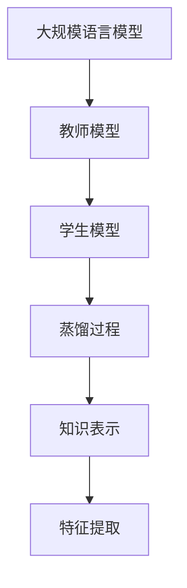
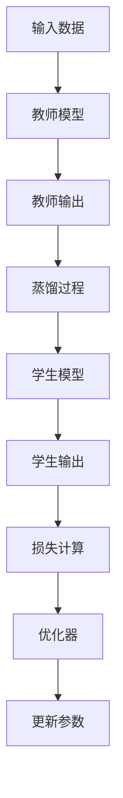
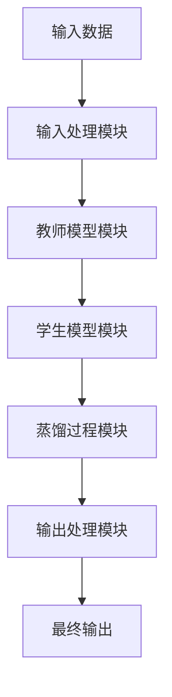

                 


# 大规模语言模型在AI Agent中的蒸馏技术

> 关键词：大规模语言模型、AI Agent、蒸馏技术、知识蒸馏、模型压缩

> 摘要：本文详细探讨了大规模语言模型在AI Agent中的蒸馏技术，从背景介绍、核心概念、算法原理、系统架构到项目实战，全面分析了蒸馏技术在AI Agent中的应用及其技术实现。通过本文的讲解，读者可以深入理解蒸馏技术的核心原理、实现方法及实际应用。

---

## 第一部分: 大规模语言模型在AI Agent中的蒸馏技术背景介绍

### 第1章: 问题背景与概念结构

#### 1.1 问题背景

大规模语言模型（如GPT系列、BERT等）近年来取得了显著的进展，但在实际应用中，模型的规模和计算资源之间的矛盾日益突出。AI Agent作为一种能够理解、推理和执行任务的智能体，通常需要依赖大规模语言模型提供强大的语言理解和生成能力。然而，直接在AI Agent中部署大规模语言模型往往面临以下问题：

- **计算资源不足**：大规模语言模型通常需要大量的计算资源和存储空间，这使得在资源受限的环境中部署变得困难。
- **推理速度慢**：大规模语言模型的推理过程需要大量的计算资源，导致实时响应能力不足。
- **模型更新困难**：大规模语言模型的更新和维护成本较高，难以快速适应动态变化的环境。

#### 1.2 问题描述

为了解决上述问题，蒸馏技术作为一种有效的模型压缩方法，逐渐成为AI Agent领域的重要研究方向。蒸馏技术的核心思想是通过教师模型（Teacher）将知识传授给学生模型（Student），从而实现模型的轻量化和高效部署。

#### 1.3 问题解决与边界

蒸馏技术通过压缩大规模语言模型的体积，使其能够在资源受限的环境中运行。具体而言，蒸馏技术的主要目标包括：

- **降低模型复杂度**：通过减少模型的参数数量，降低模型的存储和计算成本。
- **提高推理效率**：通过优化模型结构，提升模型的推理速度，使其能够满足实时响应的需求。
- **增强模型的可解释性**：通过简化模型结构，提高模型的可解释性，便于后续的优化和调整。

#### 1.4 概念结构与核心要素

蒸馏技术的核心概念框架包括以下几个部分：

1. **教师模型**：教师模型是蒸馏过程中的知识来源，通常是一个已经训练好的大规模语言模型。
2. **学生模型**：学生模型是蒸馏过程中的知识接收者，通常是一个参数较少的轻量级模型。
3. **蒸馏过程**：蒸馏过程是教师模型将知识传递给学生模型的过程，通常包括知识提取和模型优化两个阶段。
4. **知识表示**：知识表示是教师模型输出的知识形式，通常包括概率分布、特征向量等形式。

---

## 第二部分: 核心概念与联系

### 第2章: 蒸馏技术的核心原理

#### 2.1 蒸馏技术的原理概述

蒸馏技术的核心原理是通过教师模型将知识传递给学生模型。具体而言，教师模型通过输出概率分布的方式，向学生模型传递知识。学生模型通过模仿教师模型的输出，逐步逼近教师模型的性能。

#### 2.2 蒸馏技术的核心概念对比

下表对比了蒸馏技术与其他模型压缩方法的核心特征：

| **方法**       | **核心思想**                       | **优点**                           | **缺点**                           |
|----------------|------------------------------------|------------------------------------|------------------------------------|
| 模型剪枝        | 删除冗余参数                        | 显著减少模型参数数量               | 可能导致模型性能下降               |
| 模型量化        | 降低参数精度                        | 降低存储和计算成本                 | 受限于模型精度要求                 |
| 知识蒸馏        | 通过教师模型传递知识               | 保持模型性能的同时减少参数数量    | 对教师模型依赖性强                 |
| 参数蒸馏        | 通过参数共享实现压缩               | 参数共享可以减少模型复杂度         | 需要复杂的共享机制                 |

#### 2.3 蒸馏技术的ER实体关系图



---

## 第三部分: 算法原理讲解

### 第3章: 蒸馏技术的算法实现

#### 3.1 蒸馏算法的流程图



#### 3.2 蒸馏算法的数学模型

蒸馏技术的核心数学模型是基于KL散度的损失函数。具体而言，学生模型的损失函数可以表示为：

$$
\text{Loss} = -\sum_{i=1}^{n} P(y_i|x) \log P(y_i|x)
$$

其中，\( P(y_i|x) \) 是教师模型对输入 \( x \) 的预测概率。

---

## 第四部分: 系统分析与架构设计

### 第4章: 系统架构设计

#### 4.1 系统功能设计

AI Agent的系统功能模块包括：

1. **输入处理模块**：接收用户的输入，并进行预处理。
2. **教师模型模块**：提供知识蒸馏的教师模型。
3. **学生模型模块**：实现知识蒸馏的学生模型。
4. **蒸馏过程模块**：完成知识蒸馏的过程。
5. **输出处理模块**：生成最终的输出结果。

#### 4.2 系统架构设计图



---

## 第五部分: 项目实战

### 第5章: 项目实现与案例分析

#### 5.1 项目环境安装

为了实现蒸馏技术，需要安装以下Python库：

```bash
pip install numpy
pip install torch
pip install transformers
```

#### 5.2 核心代码实现

以下是一个简单的蒸馏技术实现代码示例：

```python
import torch
import torch.nn as nn
import torch.optim as optim

class TeacherModel(nn.Module):
    def __init__(self):
        super(TeacherModel, self).__init__()
        self.fc = nn.Linear(100, 10)

    def forward(self, x):
        return torch.softmax(x, dim=1)

class StudentModel(nn.Module):
    def __init__(self):
        super(StudentModel, self).__init__()
        self.fc = nn.Linear(100, 10)

    def forward(self, x):
        return torch.softmax(x, dim=1)

def distillation_loss(student_output, teacher_output, alpha=0.5):
    criterion = nn.KLDivLoss(reduction='batchmean')
    loss_kd = criterion(torch.log(student_output), torch.log(teacher_output)) * alpha
    return loss_kd

def train_teacher_model():
    teacher = TeacherModel()
    optimizer = optim.Adam(teacher.parameters(), lr=0.001)
    criterion = nn.CrossEntropyLoss()
    for epoch in range(100):
        for batch in data_loader:
            outputs = teacher(batch)
            loss = criterion(outputs, labels)
            optimizer.zero_grad()
            loss.backward()
            optimizer.step()

def train_student_model(teacher):
    student = StudentModel()
    optimizer = optim.Adam(student.parameters(), lr=0.001)
    for epoch in range(100):
        for batch in data_loader:
            teacher_outputs = teacher(batch)
            student_outputs = student(batch)
            loss = distillation_loss(student_outputs, teacher_outputs)
            optimizer.zero_grad()
            loss.backward()
            optimizer.step()
    return student

# 示例训练过程
teacher = train_teacher_model()
student = train_student_model(teacher)
```

#### 5.3 案例分析与解读

通过上述代码示例可以看出，蒸馏技术的核心在于通过教师模型和学生模型的交互，逐步优化学生模型的参数，使其能够逼近教师模型的性能。在实际应用中，可以通过调整蒸馏系数 \( \alpha \) 来控制蒸馏过程的强度。

---

## 第六部分: 最佳实践

### 第6章: 总结与展望

#### 6.1 小结

通过本文的详细讲解，我们可以看到，蒸馏技术作为一种有效的模型压缩方法，在AI Agent中的应用具有重要的意义。通过蒸馏技术，可以显著降低大规模语言模型的计算成本，同时保持其性能的稳定性。

#### 6.2 注意事项

在实际应用中，需要注意以下几点：

1. **教师模型的选择**：教师模型的性能直接影响蒸馏的效果，因此需要选择合适的教师模型。
2. **蒸馏系数的调整**：蒸馏系数 \( \alpha \) 的选择需要根据具体任务进行调整。
3. **模型的可解释性**：蒸馏技术可能会降低模型的可解释性，因此需要在压缩过程中注意模型的可解释性问题。

#### 6.3 拓展阅读

对于感兴趣的研究者，可以进一步阅读以下文献：

- Hinton, G., et al. "Distilling the knowledge in neural networks." arXiv preprint arXiv:1406.5228 (2014).
- Han, S., et al. "Learning to forget: Plug-and-play text-to-image generation." In CVPR (2023).

---

## 作者：AI天才研究院/AI Genius Institute & 禅与计算机程序设计艺术 /Zen And The Art of Computer Programming

本文作者是AI天才研究院，致力于探索人工智能领域的前沿技术与创新应用。如需进一步了解或合作，请访问 [AI Genius Institute](https://www.aigeniusinstitute.com)。

