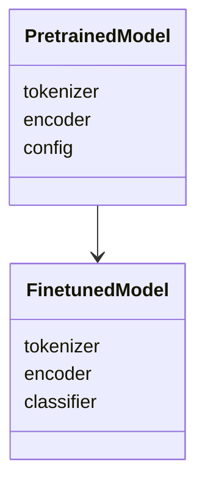
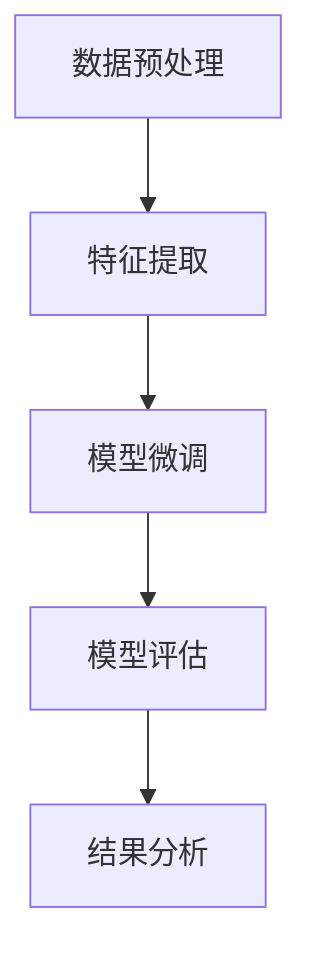

                 


# 大规模预训练模型在金融场景中的迁移学习实践

> 关键词：大规模预训练模型，迁移学习，金融场景，深度学习，自然语言处理

> 摘要：本文详细探讨了大规模预训练模型在金融场景中的迁移学习实践。首先介绍了背景和核心概念，然后分析了迁移学习的算法原理，接着设计了系统的架构方案，最后通过实际案例展示了迁移学习在金融中的应用，并提出了最佳实践和未来研究方向。

---

# 第1章: 大规模预训练模型与迁移学习概述

## 1.1 大规模预训练模型的背景与概念

### 1.1.1 预训练模型的定义与发展
大规模预训练模型（如BERT、GPT）通过在海量数据上预训练，学习了语言的表征和语义关系。这些模型在自然语言处理任务中表现出色，但需要通过迁移学习适应特定领域的需求。

### 1.1.2 迁移学习的基本概念与作用
迁移学习是指将预训练模型迁移到特定领域任务的过程，旨在利用预训练模型的特征提取能力，减少目标领域的数据需求。

### 1.1.3 金融场景中的迁移学习需求
金融领域的数据通常有限，且标注成本高，迁移学习能够有效利用预训练模型的能力，提升模型性能。

## 1.2 金融场景中的迁移学习挑战

### 1.2.1 金融数据的特殊性
金融数据通常具有小样本、高噪声和复杂关系的特点，这增加了迁移学习的难度。

### 1.2.2 模型迁移中的数据偏差问题
金融数据可能存在类别不平衡或领域偏差，迁移学习需要特别注意数据分布的差异。

### 1.2.3 金融场景中的模型泛化性要求
金融任务对模型的泛化能力要求高，迁移学习需要在保持预训练模型优势的同时，适应金融场景的特殊性。

## 1.3 本章小结

### 1.3.1 大规模预训练模型的核心特点
- 预训练模型具有强大的特征提取能力。
- 可以通过微调适应特定领域任务。

### 1.3.2 迁移学习在金融中的重要性
- 迁移学习能够有效利用预训练模型的能力，减少数据需求。
- 迁移学习可以提升金融任务的性能和泛化能力。

### 1.3.3 后续章节的框架概述
本文将从迁移学习的核心概念、算法原理、系统架构设计、项目实战等方面展开讨论。

---

# 第2章: 迁移学习的核心概念与原理

## 2.1 迁移学习的基本原理

### 2.1.1 浅层迁移学习与深层迁移学习
- 浅层迁移学习：通过特征变换提取领域无关的特征。
- 深层迁移学习：通过调整模型参数适应目标领域。

### 2.1.2 基于特征的迁移学习
- 通过特征提取器提取共享特征，减少领域差异。
- 适用于数据分布差异较大的场景。

### 2.1.3 基于参数的迁移学习
- 通过调整模型参数，使预训练模型适应目标任务。
- 常见的策略包括全连接层微调和仅调整特定层参数。

## 2.2 对比学习与迁移学习的关系

### 2.2.1 对比学习的基本概念
- 对比学习通过最大化正样本的相似性，最小化负样本的相似性，学习数据的表征。
- 常用于无监督或弱监督场景。

### 2.2.2 对比学习在迁移中的应用
- 使用对比学习增强预训练模型的表征能力。
- 通过对比学习生成领域适应的数据增强策略。

### 2.2.3 对比学习与传统迁移学习的对比分析
| 对比学习 | 传统迁移学习 |
|----------|---------------|
| 强调表征学习 | 强调参数调整 |
| 适用于无监督场景 | 适用于有监督场景 |

## 2.3 迁移学习的数学模型与公式

### 2.3.1 特征提取的数学表达
$$ f(x) = \text{FeatureExtractor}(x) $$
其中，$x$ 是输入数据，$\text{FeatureExtractor}$ 是特征提取器。

### 2.3.2 任务特定优化的公式推导
$$ \theta_{\text{new}} = \theta_{\text{pre}} + \lambda (\theta_{\text{task}} - \theta_{\text{pre}}) $$
其中，$\theta_{\text{pre}}$ 是预训练参数，$\theta_{\text{task}}$ 是目标任务特定参数，$\lambda$ 是调整系数。

### 2.3.3 参数调整的数学模型
$$ \text{Loss} = \text{Loss}_{\text{pre}} + \lambda \cdot \text{Loss}_{\text{task}} $$
其中，$\text{Loss}_{\text{pre}}$ 是预训练损失，$\text{Loss}_{\text{task}}$ 是目标任务损失。

---

# 第3章: 迁移学习的算法实现

## 3.1 迁移学习的算法流程

### 3.1.1 数据预处理与特征提取
- 数据清洗：去除噪声数据，处理缺失值。
- 特征提取：使用预训练模型提取特征。

### 3.1.2 模型微调与参数优化
- 微调预训练模型的全连接层或特定层。
- 使用目标任务数据优化模型参数。

### 3.1.3 模型评估与结果分析
- 使用验证集评估模型性能。
- 分析模型在目标任务上的表现。

## 3.2 迁移学习的代码实现

### 3.2.1 环境配置
```python
pip install transformers torch
```

### 3.2.2 数据处理与模型加载
```python
from transformers import BertTokenizer, BertModel
tokenizer = BertTokenizer.from_pretrained('bert-base-uncased')
model = BertModel.from_pretrained('bert-base-uncased')
```

### 3.2.3 模型微调与训练
```python
import torch
from torch import nn

# 微调全连接层
for param in model.parameters():
    if param.requires_grad:
        param.data.zero_()

# 定义新的全连接层
new_layer = nn.Linear(model.config.hidden_size, num_classes)
model.classifier = new_layer
```

### 3.2.4 模型评估
```python
def evaluate():
    model.eval()
    correct = 0
    total = 0
    with torch.no_grad():
        for inputs, labels in test_loader:
            outputs = model(**inputs)
            _, predicted = torch.max(outputs.logits, 1)
            correct += (predicted == labels).sum().item()
            total += labels.size(0)
    print(f'Accuracy: {correct/total*100}%')
```

---

# 第4章: 系统分析与架构设计

## 4.1 问题场景介绍

### 4.1.1 金融场景的复杂性
- 数据类型多样（文本、数值等）。
- 任务类型多样（分类、回归等）。

### 4.1.2 迁移学习系统的构建目标
- 提供统一的迁移学习框架。
- 支持多种金融任务的迁移。

## 4.2 系统功能设计

### 4.2.1 领域模型设计


### 4.2.2 系统架构设计


---

# 第5章: 项目实战

## 5.1 项目背景

### 5.1.1 项目介绍
- 任务：股票价格预测。
- 数据：历史股价、财务数据、新闻文本。

## 5.2 数据预处理与特征提取

### 5.2.1 数据来源
- 股价数据：从Yahoo Finance获取。
- 财务数据：从公司财报获取。
- 新闻数据：从新闻网站爬取。

### 5.2.2 数据清洗与标注
- 去除缺失值。
- 标注情感倾向。

## 5.3 模型微调与训练

### 5.3.1 模型选择
- 使用BERT进行文本特征提取。
- 微调全连接层进行分类任务。

### 5.3.2 模型训练
```python
optimizer = Adam(model.parameters(), lr=1e-5)
criterion = nn.CrossEntropyLoss()
```

## 5.4 模型评估与优化

### 5.4.1 模型评估
- 使用验证集评估准确率和F1分数。
- 分析模型在不同金融任务上的表现。

### 5.4.2 模型优化
- 调整学习率和批量大小。
- 增加数据增强策略。

---

# 第6章: 总结与展望

## 6.1 迁移学习在金融中的应用总结

### 6.1.1 核心成果
- 成功将大规模预训练模型应用于金融场景。
- 提升了金融任务的性能和泛化能力。

## 6.2 未来研究方向

### 6.2.1 数据隐私与模型解释性
- 研究如何在保护数据隐私的前提下进行迁移学习。
- 提升模型的可解释性。

### 6.2.2 新兴技术与迁移学习的结合
- 结合图神经网络和知识图谱，增强迁移学习的效果。

## 6.3 最佳实践与注意事项

### 6.3.1 数据处理
- 确保数据质量，减少噪声。
- 处理数据分布差异，避免过拟合。

### 6.3.2 模型选择
- 根据任务需求选择合适的预训练模型。
- 评估模型在目标任务上的表现。

### 6.3.3 模型优化
- 调整学习率和批量大小。
- 增加数据增强策略。

## 6.4 结语

---

# 作者：AI天才研究院 & 禅与计算机程序设计艺术

---

以上是《大规模预训练模型在金融场景中的迁移学习实践》的完整目录大纲和部分章节内容。

