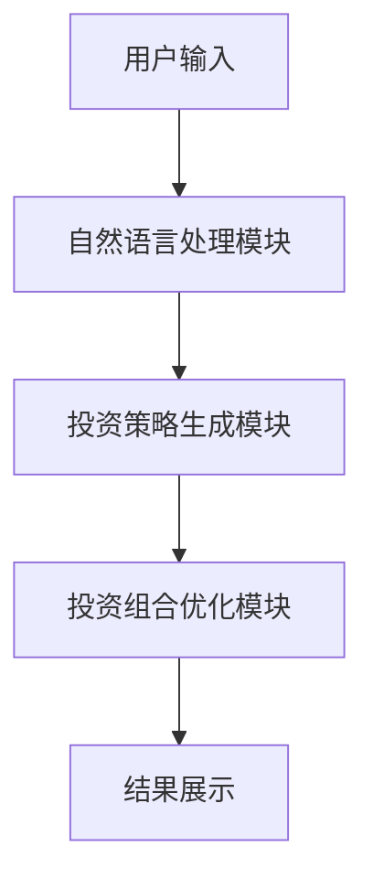
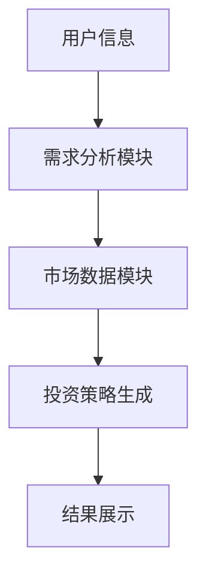

                 


# 大语言模型在金融领域的应用

## 关键词：大语言模型、金融领域、自然语言处理、机器学习、量化交易、风险管理

## 摘要：大语言模型（Large Language Models, LLMs）在金融领域的应用正变得越来越重要。通过自然语言处理（NLP）和机器学习技术，大语言模型能够处理和分析大量的金融数据，从而在金融文本分析、智能投顾、风险管理等领域发挥重要作用。本文将深入探讨大语言模型在金融领域的技术原理、应用场景、系统架构及最佳实践。

---

## 第1章: 大语言模型与金融领域概述

### 1.1 大语言模型的基本概念

#### 1.1.1 大语言模型的定义
大语言模型是一种基于深度学习的自然语言处理模型，通常使用Transformer架构，通过大量数据进行预训练，能够理解和生成人类语言。其核心特点包括：
- **大规模预训练**：使用海量文本数据进行无监督学习。
- **上下文理解**：能够捕捉语言的上下文关系。
- **多任务适应性**：通过微调可以适应多种下游任务。

#### 1.1.2 大语言模型的特点
| 特性 | 描述 |
|------|------|
| 大规模 | 参数量通常在亿级别 |
| 上下文感知 | 能够捕捉语言的语义和情感 |
| 多任务能力 | 可以同时处理多种任务，如翻译、问答、文本生成 |

#### 1.1.3 大语言模型与传统AI的区别
| 对比维度 | 大语言模型 | 传统AI |
|----------|------------|--------|
| 数据需求 | 需要大量数据训练 | 数据需求较低 |
| 柔性 | 高度灵活，可快速适应新任务 | 灵活性较低，需定制化开发 |
| 性能 | 在复杂任务中表现优异 | 在简单任务中表现稳定 |

### 1.2 金融领域的现状与挑战

#### 1.2.1 传统金融分析的痛点
- 数据复杂性：金融市场数据包括结构化数据（如股票价格）和非结构化数据（如新闻、社交媒体）。
- 信息滞后性：传统金融分析依赖于定期报告，难以实时捕捉市场动态。
- 风险管理难度：传统方法难以量化和预测复杂的市场风险。

#### 1.2.2 金融领域的数据特点
| 类别 | 描述 |
|------|------|
| 结构化数据 | 如股票价格、财务报表 |
| 非结构化数据 | 如新闻、社交媒体评论 |
| 高维度性 | 数据维度多，处理复杂 |

#### 1.2.3 金融领域的决策复杂性
- 多因素影响：市场波动受经济指标、政策变化等多方面影响。
- 风险与收益的平衡：投资者需要在风险和收益之间找到平衡点。
- 实时性要求：金融市场的决策需要快速响应。

### 1.3 大语言模型在金融中的应用前景

#### 1.3.1 金融文本分析
- **财务报表分析**：通过自然语言处理技术分析公司财报，提取关键信息。
- **新闻情感分析**：分析新闻和社交媒体情绪，预测市场走势。
- **市场趋势预测**：基于历史数据和当前新闻，预测未来市场趋势。

#### 1.3.2 智能投顾
- **个性化投资建议**：根据用户的财务状况和风险偏好，提供定制化投资建议。
- **风险评估与资产配置**：通过分析市场数据，帮助用户优化资产配置。

#### 1.3.3 风险管理
- **实时风险监控**：通过大语言模型实时监控市场风险，提前预警潜在问题。
- **信用评估**：分析企业财报和新闻，评估企业的信用风险。

#### 1.3.4 量化交易
- **交易策略生成**：基于市场数据和新闻，生成量化交易策略。
- **高频交易优化**：通过模型优化高频交易的执行策略。

### 1.4 本章小结
本章介绍了大语言模型的基本概念、金融领域的现状与挑战，以及大语言模型在金融中的应用前景。通过分析，我们可以看到大语言模型在金融领域的潜力巨大，尤其是在金融文本分析和智能投顾方面。

---

## 第2章: 大语言模型的训练与优化

### 2.1 大语言模型的训练过程

#### 2.1.1 监督微调
- **定义**：在预训练的基础上，使用特定领域的数据进行微调。
- **流程**：通过任务特定的数据集对模型进行微调，使其适应金融领域的任务。
- **优势**：能够提升模型在特定任务上的性能。

#### 2.1.2 强化学习
- **定义**：通过强化学习进一步优化模型的生成能力。
- **流程**：定义奖励函数，模型通过不断尝试生成文本，优化奖励函数以获得更高的奖励。
- **优势**：能够使模型生成更符合人类期望的文本。

#### 2.1.3 适应金融领域的优化策略
- **数据增强**：通过生成更多样化的金融领域数据，提升模型的泛化能力。
- **领域特定的损失函数**：设计适用于金融领域的损失函数，优化模型的性能。

### 2.2 大语言模型的金融领域适应性

#### 2.2.1 金融数据的特点
- **高噪声**：金融市场数据中存在大量噪声，如虚假信息和市场谣言。
- **时间依赖性**：金融数据的时间序列特性，需要模型具备时间感知能力。
- **多模态性**：金融数据通常涉及文本、数值等多种模态的数据。

#### 2.2.2 金融领域的语义理解
- **金融术语**：模型需要理解金融领域的专业术语。
- **上下文理解**：需要捕捉金融文本中的上下文关系，如市场趋势和公司新闻的关系。

#### 2.2.3 金融领域的模型调优
- **参数调整**：根据金融任务的特点调整模型的超参数。
- **模型架构优化**：设计适用于金融任务的模型架构，如引入时间序列处理模块。

### 2.3 大语言模型的局限性

#### 2.3.1 黑箱问题
- **定义**：模型的决策过程难以解释。
- **影响**：在金融领域，解释性是风险管理的重要因素。

#### 2.3.2 数据偏差
- **定义**：训练数据中的偏差可能导致模型预测的偏差。
- **影响**：在金融领域，数据偏差可能导致不公平的交易策略。

#### 2.3.3 稀疏性问题
- **定义**：金融领域数据可能较为稀疏，尤其是小公司或新兴市场的数据。
- **影响**：模型在稀疏数据上的表现可能较差。

### 2.4 本章小结
本章详细探讨了大语言模型的训练与优化过程，分析了其在金融领域的适应性及局限性。通过优化策略和模型调优，可以提升大语言模型在金融领域的性能。

---

## 第3章: 金融文本分析

### 3.1 金融文本分析的定义与目标

#### 3.1.1 金融文本分析的定义
金融文本分析是指利用自然语言处理技术，对金融领域的文本数据进行分析和理解，以提取有用的信息和洞察。

#### 3.1.2 金融文本分析的目标
- **信息提取**：从文本中提取关键信息，如财务数据、市场情绪等。
- **趋势预测**：基于历史文本数据，预测未来的市场趋势。
- **风险预警**：通过分析负面新闻，提前预警潜在风险。

### 3.2 大语言模型在金融文本分析中的应用

#### 3.2.1 财务报表分析
- **收入预测**：通过分析公司财报，预测未来收入。
- **财务健康评估**：通过分析财务指标，评估公司的财务健康状况。

#### 3.2.2 新闻情感分析
- **市场情绪预测**：通过分析新闻的情感倾向，预测市场情绪。
- **事件驱动交易**：根据突发事件（如公司收购）生成交易信号。

#### 3.2.3 市场趋势预测
- **时间序列分析**：通过分析历史市场数据和新闻，预测未来市场趋势。
- **模式识别**：识别市场中的周期性模式，辅助投资决策。

### 3.3 实际案例分析

#### 3.3.1 某公司财务报表分析
- **案例背景**：某公司财务报表数据。
- **模型应用**：使用大语言模型分析财务数据，预测公司未来收入。
- **结果展示**：通过图表展示分析结果。

#### 3.3.2 某行业新闻情感分析
- **案例背景**：某行业新闻数据。
- **模型应用**：使用大语言模型分析新闻情感，预测市场情绪。
- **结果展示**：通过情感分布图展示分析结果。

### 3.4 本章小结
本章详细探讨了大语言模型在金融文本分析中的应用，通过实际案例展示了其在财务报表分析和新闻情感分析中的潜力。

---

## 第4章: 智能投顾

### 4.1 智能投顾的定义与目标

#### 4.1.1 智能投顾的定义
智能投顾是指通过人工智能技术为投资者提供个性化的投资建议和资产配置服务。

#### 4.1.2 智能投顾的目标
- **个性化投资建议**：根据投资者的财务状况和风险偏好，提供定制化投资建议。
- **风险评估与资产配置**：通过分析市场数据，帮助投资者优化资产配置。

### 4.2 大语言模型在智能投顾中的应用

#### 4.2.1 个性化投资建议
- **客户画像**：通过分析客户信息，生成客户画像。
- **投资策略生成**：根据客户画像，生成个性化的投资策略。

#### 4.2.2 风险评估与资产配置
- **风险评估**：通过分析市场数据和客户信息，评估客户的风险承受能力。
- **资产配置**：根据风险评估结果，优化资产配置。

#### 4.2.3 市场动态跟踪
- **市场监控**：实时监控市场动态，提供最新的市场信息。
- **策略调整**：根据市场变化，调整投资策略。

### 4.3 实际案例分析

#### 4.3.1 个性化投资建议案例
- **案例背景**：某投资者的财务状况和风险偏好。
- **模型应用**：使用大语言模型生成个性化的投资建议。
- **结果展示**：通过图表展示投资建议和资产配置方案。

### 4.4 本章小结
本章探讨了大语言模型在智能投顾中的应用，通过实际案例展示了其在个性化投资建议和风险评估中的潜力。

---

## 第5章: 项目实战——智能投顾系统实现

### 5.1 环境配置

#### 5.1.1 安装依赖
```bash
pip install transformers torch datasets
```

#### 5.1.2 下载模型
```bash
wget https://huggingface.co/gpt2/resolve/main/gpt2-large-pytorch/pytorch_model.bin
```

### 5.2 系统架构设计

#### 5.2.1 系统功能模块


#### 5.2.2 数据流图


### 5.3 系统实现

#### 5.3.1 数据预处理
```python
def preprocess(text):
    return text.lower().strip()
```

#### 5.3.2 模型训练
```python
from transformers import AutoTokenizer, AutoModelForCausalLM

tokenizer = AutoTokenizer.from_pretrained("gpt2-large")
model = AutoModelForCausalLM.from_pretrained("gpt2-large")
```

#### 5.3.3 系统接口设计
```python
def generate_recommendation(income, risk_tolerance):
    # 生成投资建议
    pass
```

### 5.4 实际案例分析

#### 5.4.1 环境配置
- **操作系统**：Linux
- **Python版本**：3.8+
- **依赖库**：transformers、torch

#### 5.4.2 系统实现
```python
import torch
from transformers import AutoTokenizer, AutoModelForCausalLM

tokenizer = AutoTokenizer.from_pretrained("gpt2-large")
model = AutoModelForCausalLM.from_pretrained("gpt2-large")

def generate_recommendation(income, risk_tolerance):
    inputs = f"Given an income of {income} and risk tolerance of {risk_tolerance}, provide investment recommendations."
    inputs = tokenizer(inputs, return_tensors="pt")
    outputs = model.generate(**inputs, max_length=100)
    return tokenizer.decode(outputs[0], skip_special_tokens=True)
```

### 5.5 本章小结
本章通过实际案例展示了如何使用大语言模型实现智能投顾系统，详细介绍了环境配置、系统架构设计、系统实现及实际案例分析。

---

## 第6章: 最佳实践与未来展望

### 6.1 最佳实践

#### 6.1.1 数据隐私保护
- **数据加密**：在处理金融数据时，确保数据的隐私和安全。
- **访问控制**：限制对敏感数据的访问权限。

#### 6.1.2 模型调优
- **领域适应性**：在金融领域进行监督微调，提升模型的适应性。
- **模型解释性**：使用可解释性模型，确保决策的透明性。

### 6.2 未来展望

#### 6.2.1 多模态金融分析
- **多模态数据融合**：结合文本、图像等多种模态数据，提升分析能力。
- **跨领域应用**：将大语言模型应用于更多金融领域，如保险和风险管理。

#### 6.2.2 实时交易系统
- **高频交易优化**：通过大语言模型优化高频交易策略。
- **实时监控**：实时监控市场动态，快速响应市场变化。

### 6.3 本章小结
本章总结了大语言模型在金融领域的最佳实践，并展望了其未来的发展方向。

---

## 作者：AI天才研究院/AI Genius Institute & 禅与计算机程序设计艺术 /Zen And The Art of Computer Programming

---

**注意**：以上目录大纲和内容为示例，实际撰写时需要根据具体需求和实际情况进行调整和补充。

