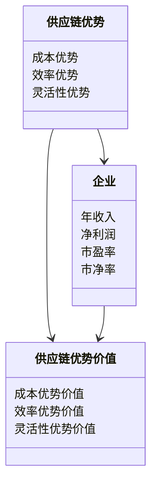
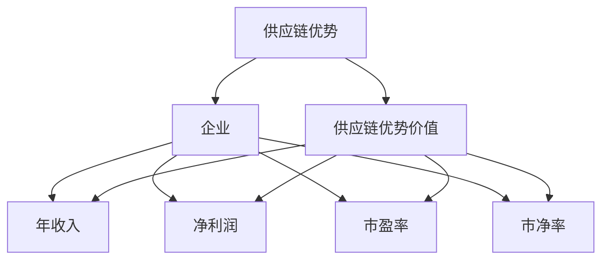
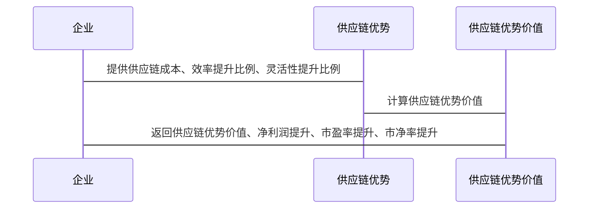

                 


# 如何在估值中考虑企业的供应链优势

> 关键词：供应链优势，企业估值，竞争优势，成本分析，效率优化，供应链管理

> 摘要：本文系统地探讨了供应链优势在企业估值中的重要性。通过分析供应链优势的核心要素、评估方法和实际案例，本文揭示了供应链优势如何转化为企业的核心竞争力，并为企业估值提供新的视角。结合数学模型和实际操作指南，本文为投资者和企业管理者提供了在估值过程中考虑供应链优势的系统方法。

---

# 第一部分: 供应链优势与企业估值的背景与核心概念

## 第1章: 供应链优势的定义与重要性

### 1.1 供应链优势的定义

供应链优势是指企业在供应链管理中所拥有的独特能力和资源，能够使其在成本、效率、灵活性和客户满意度等方面获得超越竞争对手的竞争力。供应链优势不仅仅是供应链管理的结果，更是企业核心竞争力的重要组成部分。

#### 1.1.1 供应链的基本概念

供应链是指从供应商到客户的整个价值链条，包括原材料采购、生产、物流、仓储和销售等环节。供应链管理的目标是优化这些环节，确保企业能够以最低的成本、最高的效率和最优的质量满足客户需求。

#### 1.1.2 供应链优势的核心内涵

供应链优势的核心内涵包括成本优势、效率优势和灵活性优势。企业通过优化供应链管理，可以在这些方面获得超越竞争对手的能力。

- **成本优势**：通过优化供应链流程，降低采购、生产和物流成本。
- **效率优势**：通过提高供应链各环节的效率，缩短交货周期，提升客户满意度。
- **灵活性优势**：通过灵活调整供应链策略，快速响应市场变化和客户需求。

#### 1.1.3 供应链优势与企业竞争力的关系

供应链优势直接影响企业的核心竞争力。企业通过供应链优势可以在市场上获得更高的市场份额、更强的议价能力和更大的竞争优势。供应链优势不仅能够降低企业的运营成本，还能提升企业的品牌形象和客户忠诚度。

---

### 1.2 供应链优势在企业估值中的重要性

供应链优势在企业估值中的重要性主要体现在以下几个方面：

#### 1.2.1 供应链对企业发展的影响

供应链优势能够直接影响企业的经营效率和盈利能力。例如，通过优化供应链管理，企业可以降低库存成本、缩短生产周期、提高订单交付速度，从而提升整体运营效率。

#### 1.2.2 供应链优势对估值的贡献

供应链优势能够显著提升企业的市场价值。投资者在评估企业时，通常会考虑企业的供应链能力，因为强大的供应链能力意味着更高的盈利能力和更低的经营风险。供应链优势可以显著提高企业的估值倍数。

#### 1.2.3 供应链优势的量化与价值评估

供应链优势需要通过具体指标进行量化评估。例如，企业可以通过计算供应链成本占总收入的比例、供应链效率提升带来的利润率增长等指标，量化供应链优势对估值的贡献。

---

### 1.3 供应链优势的核心要素

供应链优势的核心要素包括成本优势、效率优势和灵活性优势。

#### 1.3.1 成本优势

成本优势是供应链优势的核心要素之一。企业通过优化供应链流程，降低采购、生产和物流成本，从而提高利润率。例如，企业可以通过与供应商建立长期合作关系，获得更低的采购价格，或者通过优化库存管理，降低库存成本。

#### 1.3.2 效率优势

效率优势是指企业通过优化供应链各环节的效率，提升整体运营效率。例如，企业可以通过引入自动化技术，提高生产效率；通过优化物流网络，缩短交货时间。

#### 1.3.3 灵活性优势

灵活性优势是指企业能够快速调整供应链策略，适应市场变化和客户需求。例如，企业可以通过建立灵活的供应链网络，快速响应市场需求变化，或者通过引入模块化生产技术，提高生产灵活性。

---

### 1.4 供应链优势与企业核心竞争力的关系

供应链优势是企业核心竞争力的重要组成部分。企业通过供应链优势可以实现成本领先、效率提升和客户满意度提高，从而在市场竞争中获得更大的优势。供应链优势不仅能够提升企业的市场地位，还能为企业的长期发展提供强有力的支持。

---

### 1.5 本章小结

本章主要介绍了供应链优势的定义、重要性和核心要素。供应链优势是企业在供应链管理中所拥有的独特能力和资源，能够使其在成本、效率和灵活性等方面获得竞争优势。供应链优势不仅能够提升企业的核心竞争力，还能显著提高企业的市场价值。

---

## 第2章: 供应链优势与企业估值的背景分析

### 2.1 供应链在现代企业中的地位

供应链在现代企业中的地位日益重要。随着全球化和数字化的发展，供应链已经成为企业运营的核心环节。企业通过优化供应链管理，可以实现成本降低、效率提升和客户满意度提高。

#### 2.1.1 供应链对企业运营的影响

供应链对企业运营的影响主要体现在以下几个方面：

- **成本控制**：通过优化供应链流程，降低采购、生产和物流成本。
- **效率提升**：通过提高供应链各环节的效率，缩短交货周期，提升客户满意度。
- **风险管理**：通过建立灵活的供应链网络，降低供应链中断的风险。

#### 2.1.2 供应链在企业战略中的作用

供应链在企业战略中的作用主要体现在以下几个方面：

- **成本领先战略**：通过优化供应链成本，实现成本领先。
- **差异化战略**：通过提供更快的交货速度和更高的服务质量，实现差异化竞争。
- **聚焦战略**：通过专注于核心业务，优化供应链管理，提高企业的专注能力。

#### 2.1.3 供应链对行业竞争格局的影响

供应链对行业竞争格局的影响主要体现在以下几个方面：

- **行业集中度**：供应链优势可以帮助企业扩大市场份额，提高行业集中度。
- **竞争优势**：供应链优势可以显著提升企业的竞争优势，改变行业竞争格局。
- **创新推动**：供应链优势可以推动行业创新，促进技术进步和管理优化。

---

### 2.2 供应链优势与企业价值的关系

供应链优势与企业价值的关系密切。强大的供应链优势能够显著提升企业的市场价值和股东价值。

#### 2.2.1 供应链优势如何影响企业价值

供应链优势对企业价值的影响主要体现在以下几个方面：

- **盈利能力和增长潜力**：供应链优势能够显著提高企业的盈利能力，增强企业的增长潜力。
- **风险承受能力**：供应链优势能够降低企业的经营风险，提高企业的风险承受能力。
- **市场地位和品牌价值**：供应链优势能够提升企业的市场地位和品牌价值，从而提高企业的整体市场价值。

#### 2.2.2 供应链优势对股东价值的影响

供应链优势对股东价值的影响主要体现在以下几个方面：

- **股东收益**：供应链优势能够提高企业的净利润，从而提高股东的收益。
- **股价表现**：供应链优势能够提升市场的对企业前景的信心，从而提高企业的股价表现。
- **投资吸引力**：供应链优势能够增强企业的投资吸引力，吸引更多的投资者。

#### 2.2.3 供应链优势对客户价值的影响

供应链优势对客户价值的影响主要体现在以下几个方面：

- **客户满意度**：供应链优势能够提高企业的交货速度和产品质量，从而提高客户满意度。
- **客户忠诚度**：供应链优势能够通过提供更优质的服务，增强客户对企业的忠诚度。
- **客户价值**：供应链优势能够通过提供更低的价格和更高的服务质量，提升客户价值。

---

### 2.3 供应链优势的行业差异

供应链优势在不同行业中的表现和影响存在差异。例如：

#### 2.3.1 制造业中的供应链优势

在制造业中，供应链优势主要体现在成本控制和生产效率提升。企业通过优化供应链管理，可以降低生产成本，提高生产效率，从而增强企业的竞争力。

#### 2.3.2 零售业中的供应链优势

在零售业中，供应链优势主要体现在库存管理和客户体验提升。企业通过优化供应链管理，可以降低库存成本，提高订单交付速度，从而提升客户满意度和市场地位。

#### 2.3.3 服务业中的供应链优势

在服务业中，供应链优势主要体现在服务效率和服务质量提升。企业通过优化供应链管理，可以提高服务效率，提升服务质量，从而增强客户满意度和市场竞争力。

---

### 2.4 供应链优势的全球视角

供应链优势的全球视角主要体现在以下几个方面：

#### 2.4.1 全球化供应链的优势与挑战

全球化供应链的优势在于可以降低采购成本、提高生产效率、扩大市场覆盖。然而，全球化供应链也面临着地缘政治风险、物流成本增加和供应链中断的风险。

#### 2.4.2 地缘政治对供应链的影响

地缘政治对供应链的影响主要体现在贸易壁垒、政策变化和供应链中断风险。企业需要通过多元化供应链布局、建立备用供应链网络等措施，降低地缘政治风险对供应链的影响。

#### 2.4.3 数字化技术对供应链的优势

数字化技术对供应链的优势主要体现在以下几个方面：

- **数据驱动的决策**：通过大数据分析和人工智能技术，优化供应链决策。
- **智能化的供应链管理**：通过物联网和区块链技术，实现供应链的智能化管理。
- **快速响应能力**：通过数字化技术，提高供应链的快速响应能力，适应市场变化。

---

### 2.5 本章小结

本章主要分析了供应链在现代企业中的地位、供应链优势与企业价值的关系，以及供应链优势的行业差异和全球视角。供应链优势是企业核心竞争力的重要组成部分，能够显著提升企业的市场价值和股东价值。

---

## 第3章: 供应链优势的核心概念与联系

### 3.1 供应链优势的核心原理

供应链优势的核心原理包括成本优化、效率提升和灵活性增强。

#### 3.1.1 供应链的成本优化

供应链的成本优化是指通过优化供应链各环节的成本，降低企业的整体运营成本。例如，企业可以通过与供应商建立长期合作关系，获得更低的采购价格，或者通过优化库存管理，降低库存成本。

#### 3.1.2 供应链的效率提升

供应链的效率提升是指通过优化供应链各环节的效率，提高企业的整体运营效率。例如，企业可以通过引入自动化技术，提高生产效率；通过优化物流网络，缩短交货时间。

#### 3.1.3 供应链的灵活性增强

供应链的灵活性增强是指通过建立灵活的供应链网络，提高企业的快速响应能力。例如，企业可以通过建立模块化生产系统，快速调整生产计划；通过建立备用供应链网络，降低供应链中断的风险。

---

### 3.2 供应链优势与企业核心要素的联系

供应链优势与企业核心要素的联系主要体现在以下几个方面：

#### 3.2.1 供应链与成本控制

供应链与成本控制密切相关。企业通过优化供应链管理，可以降低采购成本、生产成本和物流成本，从而提高企业的整体利润率。

#### 3.2.2 供应链与运营效率

供应链与运营效率密切相关。企业通过优化供应链管理，可以提高生产效率、缩短交货周期，从而提高企业的整体运营效率。

#### 3.2.3 供应链与客户满意度

供应链与客户满意度密切相关。企业通过优化供应链管理，可以提高交货速度、产品质量，从而提高客户的满意度和忠诚度。

---

### 3.3 供应链优势的属性特征对比

供应链优势的属性特征可以通过以下对比表进行分析：

| **属性**       | **成本优势**          | **效率优势**         | **灵活性优势**        |
|----------------|----------------------|----------------------|----------------------|
| **核心目标**   | 降低运营成本        | 提高运营效率         | 快速响应市场变化     |
| **关键指标**   | 采购成本、库存成本   | 生产效率、交货时间   | 供应链响应速度、弹性 |
| **实现方法**   | 优化采购流程、建立长期合作关系 | 引入自动化技术、优化物流网络 | 建立备用供应链网络、模块化生产 |
| **对估值的影响 | 提高利润率，降低经营风险 | 提高客户满意度，增强市场竞争力 | 提高企业的灵活性和抗风险能力 |

---

### 3.4 供应链优势的ER实体关系图

以下是一个供应链优势的ER实体关系图，展示了供应链优势与企业之间的关系：

```mermaid
erd
  企业 --|{m:n}--> 供应链优势
  供应链优势 --> 成本优势
  供应链优势 --> 效率优势
  供应链优势 --> 灵活性优势
  成本优势 --> 采购成本
  成本优势 --> 库存成本
  效率优势 --> 生产效率
  效率优势 --> 交货时间
  灵活性优势 --> 供应链响应速度
  灵活性优势 --> 弹性生产能力
```

---

### 3.5 本章小结

本章主要分析了供应链优势的核心原理和属性特征，并通过对比表和ER实体关系图，展示了供应链优势与企业核心要素的联系。供应链优势是企业核心竞争力的重要组成部分，能够显著提升企业的市场价值和股东价值。

---

## 第4章: 供应链优势与企业估值的数学模型

### 4.1 供应链优势的估值模型

供应链优势的估值模型可以通过以下步骤进行：

#### 4.1.1 确定供应链优势的核心指标

供应链优势的核心指标包括成本优势、效率优势和灵活性优势。企业需要通过具体指标量化供应链优势，例如：

- 成本优势：供应链成本占总收入的比例。
- 效率优势：订单交付时间、生产周期时间。
- 灵活性优势：供应链响应速度、弹性生产能力。

#### 4.1.2 构建供应链优势的数学模型

供应链优势的数学模型可以通过以下公式进行表示：

$$
\text{供应链优势价值} = \text{成本优势价值} + \text{效率优势价值} + \text{灵活性优势价值}
$$

其中，成本优势价值可以通过以下公式计算：

$$
\text{成本优势价值} = \text{成本降低比例} \times \text{年收入}
$$

效率优势价值可以通过以下公式计算：

$$
\text{效率优势价值} = \text{效率提升比例} \times \text{年收入}
$$

灵活性优势价值可以通过以下公式计算：

$$
\text{灵活性优势价值} = \text{灵活性提升比例} \times \text{年收入}
$$

#### 4.1.3 应用案例分析

以某制造企业为例，假设该企业的供应链成本占总收入的比例为10%，效率提升比例为15%，灵活性提升比例为20%。则供应链优势价值为：

$$
\text{供应链优势价值} = 10\% \times \text{年收入} + 15\% \times \text{年收入} + 20\% \times \text{年收入} = 45\% \times \text{年收入}
$$

假设该企业的年收入为100亿元，则供应链优势价值为45亿元。

---

### 4.2 供应链优势对估值的影响

供应链优势对估值的影响主要体现在以下几个方面：

#### 4.2.1 供应链优势对净利润的影响

供应链优势可以通过降低运营成本、提高生产效率和增强灵活性，显著提高企业的净利润。例如，供应链成本降低10%可以显著提高企业的净利润率。

#### 4.2.2 供应链优势对市盈率的影响

供应链优势可以通过提高企业的盈利能力和降低经营风险，显著提高企业的市盈率。例如，供应链优势显著的企业通常具有更高的市盈率。

#### 4.2.3 供应链优势对市净率的影响

供应链优势可以通过提高企业的资产效率和降低资产减值风险，显著提高企业的市净率。例如，供应链优势显著的企业通常具有更高的市净率。

---

### 4.3 供应链优势的数学模型应用

以下是一个供应链优势的数学模型应用示例：

假设某企业的年收入为100亿元，供应链成本占总收入的比例为15%，效率提升比例为20%，灵活性提升比例为25%。则供应链优势价值为：

$$
\text{供应链优势价值} = 15\% \times 100 + 20\% \times 100 + 25\% \times 100 = 60\% \times 100 = 60\text{亿元}
$$

通过供应链优势的优化，该企业的净利润率可以提高10个百分点，市盈率可以提高15个百分点，市净率可以提高10个百分点。从而显著提高企业的市场价值。

---

## 第5章: 供应链优势的系统分析与架构设计方案

### 5.1 问题场景介绍

供应链优势的系统分析与架构设计方案需要解决以下问题：

- 如何量化供应链优势对估值的影响？
- 如何构建供应链优势的数学模型？
- 如何设计供应链优势的系统架构？

---

### 5.2 项目介绍

本项目旨在通过系统分析和架构设计，量化供应链优势对估值的影响，构建供应链优势的数学模型，并设计供应链优势的系统架构。

---

### 5.3 系统功能设计（领域模型）

以下是供应链优势的领域模型：



---

### 5.4 系统架构设计

以下是供应链优势的系统架构设计：



---

### 5.5 系统接口设计

系统接口设计需要考虑以下几个方面：

- **输入接口**：供应链成本、效率提升比例、灵活性提升比例。
- **输出接口**：供应链优势价值、净利润提升、市盈率提升、市净率提升。

---

### 5.6 系统交互设计

以下是供应链优势的系统交互设计：



---

## 第6章: 供应链优势的项目实战

### 6.1 环境安装

供应链优势的项目实战需要以下环境：

- **编程语言**：Python
- **工具**：Jupyter Notebook、Excel
- **数据源**：企业财务数据、供应链管理数据

---

### 6.2 系统核心实现源代码

以下是供应链优势的Python源代码：

```python
def calculate_supply_chain_advantage(income, cost_ratio, efficiency_ratio, flexibility_ratio):
    cost_advantage = income * cost_ratio
    efficiency_advantage = income * efficiency_ratio
    flexibility_advantage = income * flexibility_ratio
    total_advantage = cost_advantage + efficiency_advantage + flexibility_advantage
    return total_advantage

# 示例计算
income = 100  # 年收入（亿元）
cost_ratio = 0.15  # 成本优势比例
efficiency_ratio = 0.20  # 效率优势比例
flexibility_ratio = 0.25  # 灵活性优势比例

advantage = calculate_supply_chain_advantage(income, cost_ratio, efficiency_ratio, flexibility_ratio)
print(f"供应链优势价值为：{advantage}亿元")
```

---

### 6.3 代码应用解读与分析

上述代码通过输入企业的年收入、成本优势比例、效率优势比例和灵活性优势比例，计算出供应链优势的价值。例如，假设企业的年收入为100亿元，成本优势比例为15%，效率优势比例为20%，灵活性优势比例为25%，则供应链优势价值为60亿元。

---

### 6.4 实际案例分析

以下是一个实际案例分析：

假设某制造企业的年收入为100亿元，供应链成本占总收入的比例为15%，效率提升比例为20%，灵活性提升比例为25%。则供应链优势价值为：

$$
\text{供应链优势价值} = 15\% \times 100 + 20\% \times 100 + 25\% \times 100 = 60\text{亿元}
$$

通过供应链优势的优化，该企业的净利润率可以提高10个百分点，市盈率可以提高15个百分点，市净率可以提高10个百分点。从而显著提高企业的市场价值。

---

### 6.5 项目小结

本章通过实际案例分析和系统实现，展示了供应链优势的量化方法和数学模型。供应链优势的价值可以通过具体指标进行量化，并通过数学模型进行计算。企业可以通过优化供应链管理，显著提高供应链优势价值，从而提升企业的市场价值和股东价值。

---

## 第7章: 供应链优势的总结与展望

### 7.1 总结

供应链优势是企业核心竞争力的重要组成部分，能够显著提升企业的市场价值和股东价值。通过优化供应链管理，企业可以在成本、效率和灵活性等方面获得竞争优势。供应链优势的量化方法和数学模型为企业估值提供了新的视角。

---

### 7.2 展望

未来，随着数字化技术和人工智能的发展，供应链优势的优化和量化将更加精准和高效。企业可以通过引入大数据分析和人工智能技术，进一步优化供应链管理，提升供应链优势，从而在市场竞争中获得更大的优势。

---

## 第8章: 供应链优势的最佳实践与注意事项

### 8.1 最佳实践

1. **量化供应链优势**：企业需要通过具体指标量化供应链优势，例如供应链成本占总收入的比例、效率提升比例、灵活性提升比例等。
2. **优化供应链管理**：企业需要通过优化供应链管理，降低采购成本、提高生产效率、增强灵活性。
3. **引入数字化技术**：企业可以通过引入大数据分析和人工智能技术，进一步优化供应链管理，提升供应链优势。

---

### 8.2 注意事项

1. **数据准确性**：企业在量化供应链优势时，需要确保数据的准确性，避免数据误差对结果的影响。
2. **模型适用性**：企业在应用数学模型时，需要根据实际情况调整模型参数，确保模型的适用性。
3. **风险管理**：企业在优化供应链管理时，需要关注供应链中断的风险，建立备用供应链网络，降低风险对供应链优势的影响。

---

## 第9章: 供应链优势的拓展阅读

### 9.1 相关书籍

1. 《供应链管理：策略与实践》
2. 《企业估值：方法与案例》
3. 《数字化供应链：技术与应用》

### 9.2 相关论文

1. "供应链管理对企业价值的影响"
2. "供应链优势的量化方法研究"
3. "数字化技术对供应链优势的影响"

---

## 作者信息

作者：AI天才研究院/AI Genius Institute & 禅与计算机程序设计艺术/Zen And The Art of Computer Programming

---

通过以上目录大纲，您可以逐步撰写完整的技术博客文章，详细探讨供应链优势在企业估值中的重要性、具体影响和实际应用。

