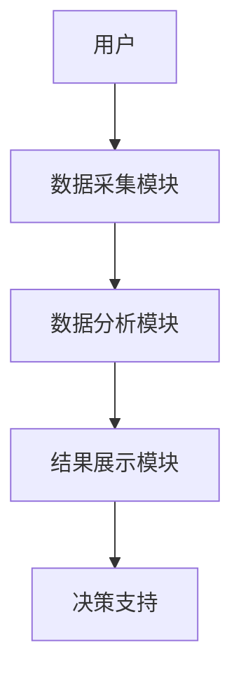

                 


# 如何评估企业的品牌忠诚度价值

> 关键词：品牌忠诚度，客户价值，市场分析，品牌管理，数据分析，客户忠诚度

> 摘要：本文将深入探讨如何评估企业的品牌忠诚度价值，从理论基础到实际操作，从模型构建到案例分析，为企业提供一套系统的方法论，帮助企业在数字化时代更好地管理和提升品牌忠诚度。

---

# 第一部分：企业品牌忠诚度价值评估的背景与概念

## 第1章：品牌忠诚度的定义与内涵

### 1.1 品牌忠诚度的定义
品牌忠诚度是指客户对企业品牌或产品的偏好程度，表现为客户在面对竞争对手时仍然选择该品牌，并在长期消费中持续支持该品牌。这种忠诚不仅基于产品的功能特性，还包括情感、体验和品牌认知等因素。

### 1.2 品牌忠诚度的类型
1. **情感忠诚**：客户因为对品牌的情感认同而产生的忠诚。
2. **理性忠诚**：客户因为品牌提供的性价比和实际价值而产生的忠诚。
3. **习惯忠诚**：客户因为长期使用某一品牌而形成的消费习惯。

### 1.3 品牌忠诚度的核心维度
1. **客户保留率**：客户持续购买同一品牌产品的比例。
2. **客户推荐率**：客户愿意推荐品牌给他人。
3. **客户满意度**：客户对品牌或产品的满意程度。
4. **市场份额变化**：品牌在市场中的份额变化情况。

---

## 第2章：品牌忠诚度的价值与意义

### 2.1 品牌忠诚度对企业价值的影响
1. **降低客户获取成本**： loyal customers减少了企业获取新客户的成本。
2. **提高客户生命周期价值**： loyal customers会持续购买，为企业创造长期价值。
3. **增强品牌竞争力**： 高忠诚度客户是品牌在市场中竞争的核心优势。

### 2.2 忠诚客户对企业发展的意义
1. **客户忠诚度与企业收入增长的正相关性**。
2. **忠诚客户是品牌口碑传播的核心力量**。
3. **忠诚客户为企业提供持续的市场反馈**。

---

## 第3章：品牌忠诚度评估的核心概念

### 3.1 品牌忠诚度的测量指标
1. **客户满意度（CSAT）**：衡量客户对产品或服务的满意程度。
2. **净推荐值（NPS）**：客户推荐产品的意愿。
3. **客户保留率**：客户在一定时间内持续购买的比例。

### 3.2 品牌忠诚度的评估模型
1. **KANO模型**：分析客户对品牌的需求和期望。
2. **RFM模型**：通过客户的购买频率、购买金额和购买时间来评估忠诚度。
3. **CLV模型**：计算客户生命周期价值，评估长期忠诚度。

---

## 第4章：品牌忠诚度的评估方法

### 4.1 定性评估方法
1. **客户调研**：通过问卷、访谈等方式收集客户反馈。
2. **情感分析**：利用自然语言处理技术分析客户评论中的情感倾向。

### 4.2 定量评估方法
1. **数据分析法**：通过CRM数据、销售数据等定量分析客户行为。
2. **聚类分析法**：将客户分为忠诚客户、潜在流失客户等群体。
3. **回归分析法**：找出影响忠诚度的关键因素。

---

# 第二部分：企业品牌忠诚度价值评估的系统设计

## 第5章：品牌忠诚度评估的系统架构

### 5.1 系统功能设计
1. **数据采集模块**：整合来自CRM、社交媒体等多源数据。
2. **数据分析模块**：应用机器学习算法对数据进行建模和分析。
3. **结果展示模块**：以可视化方式呈现忠诚度评估结果。

### 5.2 系统架构设计


---

## 第6章：品牌忠诚度评估的算法与模型

### 6.1 基于聚类分析的客户细分
1. **步骤**：数据预处理、特征选择、聚类分析、结果解读。
2. **代码示例**：
    ```python
    from sklearn.cluster import KMeans
    import pandas as pd
    data = pd.read_csv('customer_data.csv')
    features = data[['purchase_frequency', 'recency', ' Monetary_value']]
    model = KMeans(n_clusters=3).fit(features)
    clusters = model.labels_
    ```

### 6.2 基于线性回归的忠诚度预测
1. **模型公式**：$$y = \beta_0 + \beta_1x_1 + \beta_2x_2 + \epsilon$$
2. **代码示例**：
    ```python
    import statsmodels.api as sm
    model = sm.OLS(y, X).fit()
    print(model.summary())
    ```

---

## 第7章：品牌忠诚度评估的实战案例

### 7.1 案例背景
某电商平台希望通过数据分析识别忠诚客户，并制定针对性的营销策略。

### 7.2 数据分析与建模
1. **数据预处理**：清洗和标准化数据。
2. **模型选择**：采用RFM模型进行客户细分。

### 7.3 实验结果
- **忠诚客户占比**：20%
- **潜在流失客户占比**：15%
- **普通客户占比**：65%

### 7.4 案例总结
通过数据分析，企业能够精准识别忠诚客户，并制定针对性的营销策略，提升客户留存率和品牌忠诚度。

---

# 第三部分：总结与展望

## 第8章：总结与优化建议

### 8.1 本章总结
品牌忠诚度是企业在数字化时代的核心竞争力，通过科学的评估方法和系统化的管理，企业能够更好地挖掘客户价值，提升品牌影响力。

### 8.2 优化建议
1. **持续优化评估模型**：结合新兴技术（如AI和大数据）提升评估精度。
2. **加强客户体验管理**：通过个性化服务提升客户忠诚度。
3. **建立反馈机制**：及时响应客户反馈，持续改进产品和服务。

---

## 附录

### 附录A：常用品牌忠诚度评估工具
1. **SurveyMonkey**：在线调查工具。
2. **Tableau**：数据可视化工具。
3. **Python（Pandas、Scikit-learn）**：数据分析与建模工具。

### 附录B：品牌忠诚度评估的数学公式
1. **净推荐值（NPS）**：$$NPS = (\text{推荐客户比例} - \text{贬损客户比例}) \times 100$$
2. **客户生命周期价值（CLV）**：$$CLV = \text{客户年收入} \times \text{客户生命周期} \times \text{利润率}$$

---

## 作者

作者：AI天才研究院/AI Genius Institute & 禅与计算机程序设计艺术 /Zen And The Art of Computer Programming

