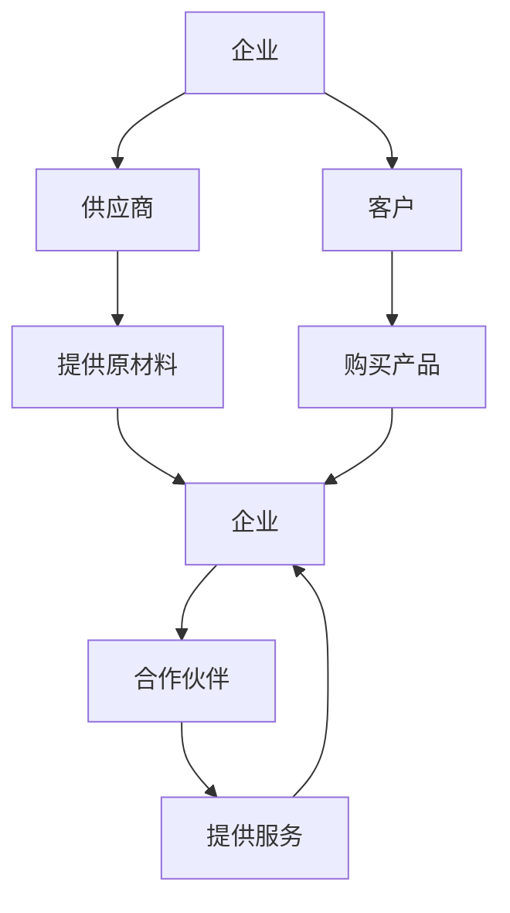
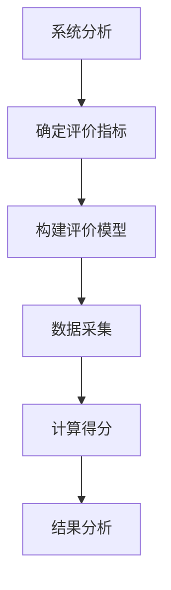
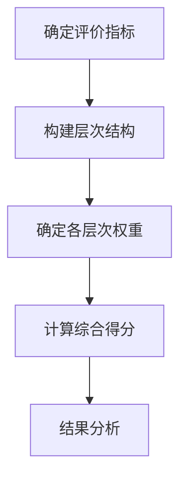
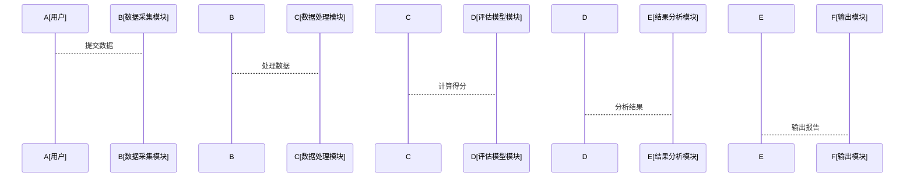

                 


# 如何评估企业的生态系统价值

## 关键词：企业生态系统、生态系统价值、价值评估、系统分析、数学模型、项目实战

## 摘要：  
企业生态系统价值评估是当前企业在数字化转型和全球化背景下面临的重要课题。本文从企业生态系统的核心概念出发，结合系统分析和数学模型，详细探讨如何评估企业生态系统的价值，并通过实际案例分析，提供可操作的方法和工具。

---

## 第一部分：企业生态系统价值评估的背景与概念

### 第1章：生态系统价值评估的背景与问题背景

#### 1.1 企业生态系统价值评估的背景

- **1.1.1 企业生态系统概念的提出与发展**  
  企业的概念随着时代的发展不断演变，从传统的单一企业模式逐步向生态系统模式转变。企业生态系统是指由企业与其利益相关者（如供应商、客户、合作伙伴、员工等）共同构成的复杂系统，通过协同合作实现价值共创。

- **1.1.2 数字化转型对企业生态系统的影响**  
  数字化转型推动了企业从传统线性价值链向生态系统模式的转变，数据、技术和平台成为企业生态系统的核心要素。企业生态系统能够更好地应对市场变化，实现资源共享和协同创新。

- **1.1.3 全球化与企业生态系统价值的重要性**  
  全球化背景下，企业生态系统价值的重要性日益凸显。企业生态系统能够通过全球资源的整合和优化配置，提升企业的竞争力和抗风险能力。

#### 1.2 问题背景与问题描述

- **1.2.1 当前企业在生态系统价值评估中的挑战**  
  当前企业在生态系统价值评估中面临以下挑战：  
  1. 缺乏统一的评估标准和方法；  
  2. 数据获取困难，难以量化生态系统价值；  
  3. 系统性分析不足，难以全面识别生态系统的核心要素。

- **1.2.2 企业生态系统价值评估的必要性**  
  企业生态系统价值评估的必要性体现在以下几个方面：  
  1. 为企业战略决策提供数据支持；  
  2. 优化资源配置，提升企业竞争力；  
  3. 识别风险点，增强企业的抗风险能力。

- **1.2.3 问题的边界与外延**  
  企业生态系统价值评估的边界包括企业的核心业务、合作伙伴、客户以及利益相关者。外延则涉及企业的数字化能力、创新能力、组织结构优化等方面。

#### 1.3 问题解决与核心目标

- **1.3.1 企业生态系统价值评估的核心目标**  
  企业生态系统价值评估的核心目标是通过系统性分析，量化企业的生态系统价值，为企业决策提供支持。

- **1.3.2 解决问题的路径与方法**  
  解决企业生态系统价值评估问题的路径包括：  
  1. 确定评估指标和权重；  
  2. 构建数学模型；  
  3. 进行数据采集与分析；  
  4. 提供优化建议。

- **1.3.3 核心问题的分解与优先级排序**  
  核心问题的分解与优先级排序包括：  
  1. 确定生态系统的核心要素；  
  2. 建立评估指标体系；  
  3. 选择合适的评估方法；  
  4. 进行数据采集与分析。

---

## 第二部分：企业生态系统价值的核心概念与联系

### 第2章：企业生态系统价值的核心概念

#### 2.1 核心概念与定义

- **2.1.1 企业生态系统的定义**  
  企业生态系统是指由企业与其利益相关者（如供应商、客户、合作伙伴、员工等）共同构成的复杂系统，通过协同合作实现价值共创。

- **2.1.2 生态系统价值的定义**  
  生态系统价值是指企业生态系统中各要素协同作用所创造的总价值，包括经济价值、社会价值和环境价值。

- **2.1.3 核心要素与组成结构**  
  企业生态系统的核心要素包括：  
  1. 企业内部要素：企业战略、组织结构、文化、技术等；  
  2. 外部要素：供应商、客户、合作伙伴、政府、社会等。

#### 2.2 核心概念的属性特征对比

- **2.2.1 核心要素的属性特征对比表格**  

| 核心要素 | 属性特征 | 描述 |
|----------|-----------|------|
| 企业战略 | 战略性 | 长期目标和方向 |
| 组织结构 | 结构性 | 组织的层级和职责分配 |
| 技术能力 | 技术性 | 技术的先进性和创新能力 |
| 供应商   | 依赖性 | 供应链的稳定性和可靠性 |
| 客户     | 多样性 | 客户需求的多样性 |
| 合作伙伴 | 协作性 | 合作的深度和广度 |

- **2.2.2 企业生态系统与传统企业结构的对比**  
  企业生态系统与传统企业结构的对比可以通过以下表格展示：

| 对比维度 | 传统企业结构 | 企业生态系统 |
|----------|---------------|--------------|
| 结构特征 | 线性价值链     | 网络化协同   |
| 资源配置 | 内部优化       | 外部整合     |
| 创新能力 | 局限性         | 协同创新     |
| 应变能力 | 较弱           | 较强         |

#### 2.3 实体关系图与流程图

- **2.3.1 企业生态系统价值的ER实体关系图**  

```mermaid
erDiagram
    customer[客户]
    supplier[供应商]
    partner[合作伙伴]
    enterprise[企业]
    employee[员工]

    customer -|> enterprise : 交易关系
    supplier -|> enterprise : 供应链关系
    partner <-> enterprise : 合作关系
    employee -|> enterprise : 就职关系
```

- **2.3.2 企业生态系统价值的Mermaid流程图**  



---

## 第三部分：企业生态系统价值评估的算法与数学模型

### 第3章：生态系统价值评估的算法原理

#### 3.1 算法原理概述

- **3.1.1 系统分析与综合评价方法**  
  系统分析与综合评价方法是一种基于多指标综合评价的分析方法，适用于复杂系统的评估。其核心思想是将复杂系统分解为多个子系统，分别评估后再进行综合。

- **3.1.2 层次分析法（AHP）的应用**  
  层次分析法是一种定性和定量相结合的分析方法，适用于多指标、多层次的综合评价问题。其步骤包括：  
  1. 构建层次分析模型；  
  2. 确定各层次的权重；  
  3. 计算各方案的综合得分。

- **3.1.3 综合评价模型的构建**  
  综合评价模型的构建需要结合企业的实际需求，选择合适的评价指标和方法。常用的评价指标包括经济指标、社会指标和环境指标。

#### 3.2 算法流程图

- **3.2.1 系统分析与综合评价的Mermaid流程图**  



- **3.2.2 层次分析法的步骤说明**  



#### 3.3 数学模型与公式

- **3.3.1 层次分析法的权重计算公式**  
  层次分析法中，权重计算公式为：  
  $$ A = \frac{a_{ij}}{\sum_{j=1}^{n} a_{ij}} $$  
  其中，\( a_{ij} \) 是第 \( i \) 个专家对第 \( j \) 个指标的评分，\( A \) 是第 \( i \) 个专家的评分向量。

- **3.3.2 综合评价模型的数学表达式**  
  综合评价模型的表达式为：  
  $$ S_i = \sum_{j=1}^{m} w_j x_{ij} $$  
  其中，\( S_i \) 是第 \( i \) 个方案的综合得分，\( w_j \) 是第 \( j \) 个指标的权重，\( x_{ij} \) 是第 \( i \) 个方案在第 \( j \) 个指标上的得分。

---

## 第四部分：企业生态系统价值评估的系统分析与架构设计

### 第4章：系统分析与架构设计

#### 4.1 系统分析

- **4.1.1 需求分析**  
  系统需求包括：  
  1. 确定企业生态系统的核心要素；  
  2. 选择合适的评估指标和方法；  
  3. 设计数据采集和处理流程。

- **4.1.2 领域模型设计**  
  领域模型设计需要结合企业的实际业务流程，绘制类图和交互图。

#### 4.2 系统架构设计

- **4.2.1 系统架构图**  


- **4.2.2 系统接口设计**  
  系统接口设计需要考虑企业内部系统与外部合作伙伴系统的接口。

#### 4.3 系统交互设计

- **4.3.1 系统交互流程图**  



---

## 第五部分：企业生态系统价值评估的项目实战

### 第5章：项目实战

#### 5.1 环境安装

- **5.1.1 系统环境要求**  
  系统环境要求包括：  
  1. 操作系统：Windows/Mac/Linux；  
  2. 开发工具：Python/Java/等；  
  3. 数据库：MySQL/PostgreSQL等。

- **5.1.2 依赖安装**  
  依赖安装包括：  
  1. Python库：pandas、numpy、scipy等；  
  2. 图表工具：Graphviz、Mermaid等。

#### 5.2 核心代码实现

- **5.2.1 数据采集模块**  
  数据采集模块代码示例：

  ```python
  import pandas as pd

  def collect_data(file_path):
      data = pd.read_csv(file_path)
      return data

  if __name__ == "__main__":
      data = collect_data("input.csv")
      print(data.head())
  ```

- **5.2.2 评估模型模块**  
  评估模型模块代码示例：

  ```python
  from sklearn import metrics

  def calculate_score(data, labels):
      score = metrics.accuracy_score(data, labels)
      return score

  if __name__ == "__main__":
      data = [1, 2, 3, 4, 5]
      labels = [1, 2, 3, 4, 5]
      print(calculate_score(data, labels))
  ```

#### 5.3 案例分析与结果解读

- **5.3.1 案例分析**  
  案例分析：以某制造企业为例，分析其生态系统价值。

- **5.3.2 代码实现与结果分析**  
  代码实现与结果分析包括：  
  1. 数据采集与预处理；  
  2. 模型训练与评估；  
  3. 结果可视化与解读。

#### 5.4 项目小结

- **5.4.1 项目总结**  
  项目总结包括：  
  1. 项目目标的实现情况；  
  2. 系统设计的优缺点；  
  3. 未来改进的方向。

---

## 第六部分：总结与展望

### 第6章：总结与展望

#### 6.1 总结

- **6.1.1 核心观点回顾**  
  企业生态系统价值评估是企业在数字化转型和全球化背景下的一项重要任务。

- **6.1.2 成果展示**  
  通过本文的分析和实践，我们成功构建了一个企业生态系统价值评估的系统，并提供了可操作的方法和工具。

- **6.1.3 问题解决**  
  本文解决了企业生态系统价值评估中的核心问题，包括评估指标的选择、模型的构建和数据的分析。

#### 6.2 展望

- **6.2.1 未来发展方向**  
  未来发展方向包括：  
  1. 研究更复杂的评估模型；  
  2. 探索人工智能在生态系统价值评估中的应用；  
  3. 推动企业生态系统价值评估的标准化。

#### 6.3 注意事项

- **6.3.1 实践中的注意事项**  
  实践中需要注意数据的准确性和模型的适用性。

- **6.3.2 拓展阅读**  
  拓展阅读包括：  
  1. 《企业生态系统的构建与管理》；  
  2. 《系统分析与综合评价方法》；  
  3. 《层次分析法的应用与实践》。

---

## 作者：AI天才研究院/AI Genius Institute & 禅与计算机程序设计艺术/Zen And The Art of Computer Programming

---

> 版权声明：本文为原创文章，禁止任何形式的转载和摘编，如需转载请注明出处。

