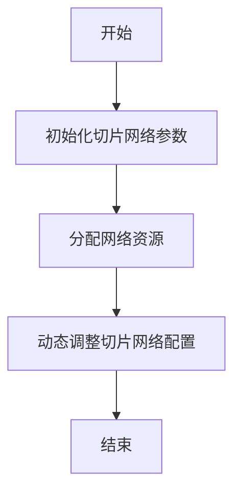
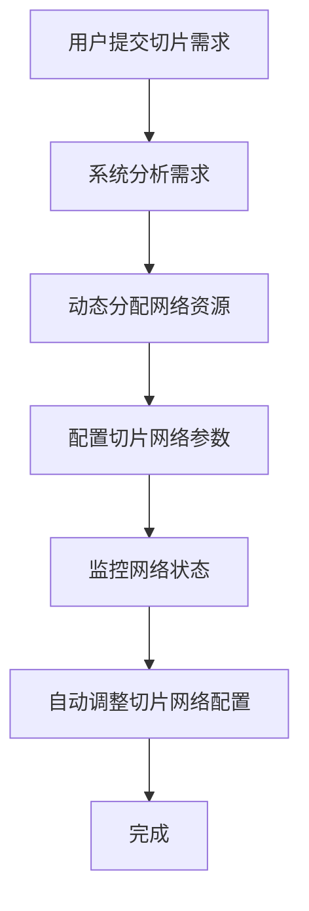
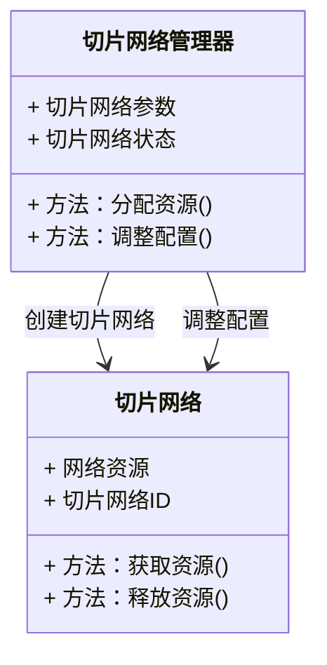
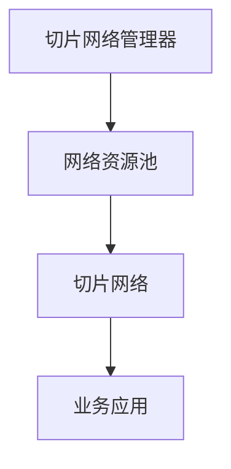

                 


# 如何评估企业的网络切片技术应用

**关键词：** 网络切片，企业网络，技术评估，性能优化，安全性，可扩展性

**摘要：**  
本文详细探讨了如何评估企业在网络切片技术中的应用。通过分析网络切片的核心概念、技术原理、系统架构、项目实战和最佳实践，本文为读者提供了全面的评估方法和实践指南。从背景介绍到具体实施，文章详细阐述了网络切片技术的各个方面，帮助企业在实际应用中做出明智的决策。

---

## 目录

### 第1章: 网络切片技术的背景与核心概念

1.1 网络切片技术的背景介绍  
1.2 网络切片技术的核心概念  
1.3 网络切片技术与其他技术的对比  

### 第2章: 网络切片技术的算法原理

2.1 网络切片技术的算法原理  
2.2 网络切片技术的数学模型  
2.3 网络切片技术的实现流程  

### 第3章: 网络切片技术的系统架构与实现

3.1 网络切片技术的系统架构设计  
3.2 网络切片技术的接口设计  
3.3 网络切片技术的交互流程  

### 第4章: 网络切片技术的项目实战

4.1 网络切片技术的环境搭建  
4.2 网络切片技术的核心代码实现  
4.3 网络切片技术的案例分析  

### 第5章: 网络切片技术的最佳实践与未来展望

5.1 网络切片技术的最佳实践  
5.2 网络切片技术的未来发展趋势  
5.3 网络切片技术的注意事项与扩展阅读  

---

## 第1章: 网络切片技术的背景与核心概念

### 1.1 网络切片技术的背景介绍

#### 1.1.1 网络切片技术的定义与问题背景
网络切片是一种将物理网络划分为多个逻辑网络的技术，每个逻辑网络（切片）可以独立配置和优化，以满足不同的业务需求。随着企业对高效、可靠、安全网络的需求不断增加，传统的网络架构已无法满足多样化的业务场景，网络切片技术应运而生。

#### 1.1.2 网络切片技术的应用背景
企业网络环境日益复杂，业务需求多样化，网络切片技术能够有效解决以下问题：
- **资源利用率低**：通过按需分配网络资源，提高资源利用率。
- **业务隔离性差**：通过逻辑网络隔离不同业务，确保业务之间的独立性和安全性。
- **动态调整能力不足**：通过动态调整网络切片的配置，适应业务需求的变化。

#### 1.1.3 网络切片技术的核心问题与挑战
- 网络切片的动态分配与调整。
- 切片网络的安全隔离与互不影响。
- 切片网络的性能优化与资源分配。

### 1.2 网络切片技术的核心概念

#### 1.2.1 网络切片的定义与特点
网络切片是将物理网络划分为多个逻辑网络的技术，每个切片网络可以独立配置带宽、延迟、可靠性等参数，以满足不同的业务需求。

**特点：**
- **独立性**：每个切片网络独立运行，互不影响。
- **灵活性**：可以根据业务需求动态调整切片网络的配置。
- **高效性**：通过按需分配资源，提高网络资源利用率。

#### 1.2.2 网络切片与传统网络的区别
| 特性                | 传统网络                   | 网络切片                 |
|---------------------|---------------------------|--------------------------|
| 资源分配             | 固定分配                   | 动态分配                 |
| 业务隔离             | 业务共享                   | 业务隔离                 |
| 灵活性               | 较低                      | 较高                     |
| 适用场景             | 单一业务                   | 多种业务                 |

#### 1.2.3 网络切片的实现机制与优势
- **实现机制：**  
  网络切片通过虚拟化技术将物理网络分割为多个逻辑网络，每个切片网络可以独立配置和管理。

- **优势：**  
  - 提高网络资源利用率。
  - 实现业务隔离，确保网络安全性。
  - 支持动态调整网络配置，适应业务需求变化。

---

## 第2章: 网络切片技术的算法原理

### 2.1 网络切片技术的算法原理

网络切片技术的核心算法包括资源分配算法、切片网络动态调整算法等。以下是具体的算法流程：



### 2.2 网络切片技术的数学模型

网络切片的资源分配模型可以用以下数学公式表示：

$$ R_i = \sum_{j=1}^{n} w_j \times C_j $$

其中：
- \( R_i \) 表示第i个切片网络的资源需求。
- \( w_j \) 表示第j个资源的权重。
- \( C_j \) 表示第j个资源的容量。

### 2.3 网络切片技术的实现流程



---

## 第3章: 网络切片技术的系统架构与实现

### 3.1 网络切片技术的系统架构设计

#### 3.1.1 切片网络的分层架构
以下是切片网络的分层架构图：



#### 3.1.2 切片网络的资源分配架构
以下是资源分配架构图：



---

## 第4章: 网络切片技术的项目实战

### 4.1 网络切片技术的环境搭建

#### 4.1.1 环境需求
- 操作系统：Linux（推荐 CentOS 或 Ubuntu）
- 网络设备：支持网络切片技术的路由器或交换机
- 开发工具：Python、Java 或其他编程语言

#### 4.1.2 网络切片技术的代码实现

以下是核心代码实现示例：

```python
class SliceNetworkManager:
    def __init__(self):
        self.slices = []
        self.resources = []

    def create_slice(self, slice_id, resource_requirements):
        # 分配资源
        allocated_resources = self.allocate_resources(resource_requirements)
        # 创建切片网络
        new_slice = Slice(slice_id, allocated_resources)
        self.slices.append(new_slice)
        return new_slice

    def allocate_resources(self, requirements):
        # 根据需求分配资源
        resources = []
        for req in requirements:
            resources.append(self.resources.pop())
        return resources

class Slice:
    def __init__(self, slice_id, resources):
        self.slice_id = slice_id
        self.resources = resources
        self.active = True

    def adjust_config(self, new_requirements):
        # 动态调整配置
        self.resources = self.manager.allocate_resources(new_requirements)
```

---

## 第5章: 网络切片技术的最佳实践与未来展望

### 5.1 网络切片技术的最佳实践

1. **合理规划切片网络的资源分配，确保资源利用率最大化。**
2. **定期监控切片网络的状态，及时调整配置。**
3. **确保切片网络的安全隔离，防止业务之间的互相影响。**

### 5.2 网络切片技术的未来发展趋势

随着5G、物联网等技术的发展，网络切片技术将更加普及，切片网络的动态调整和智能化管理将成为未来的主要发展方向。

### 5.3 网络切片技术的注意事项与扩展阅读

1. **注意切片网络的安全隔离性，防止数据泄露。**
2. **动态调整切片网络时，需确保业务的连续性。**
3. **建议深入学习网络切片相关的技术文献和最佳实践。**

---

**作者：AI天才研究院/AI Genius Institute & 禅与计算机程序设计艺术 /Zen And The Art of Computer Programming**

---

本文通过详细的背景介绍、技术原理、系统架构、项目实战和最佳实践，全面阐述了如何评估企业的网络切片技术应用。希望本文能够为读者提供有价值的参考，帮助企业在实际应用中更好地利用网络切片技术。

