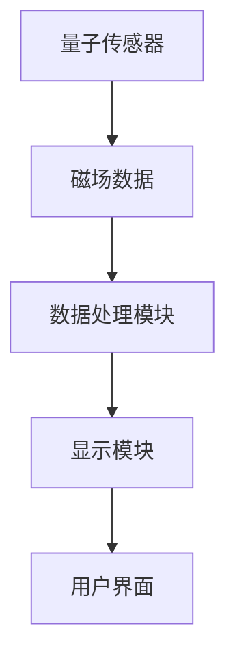
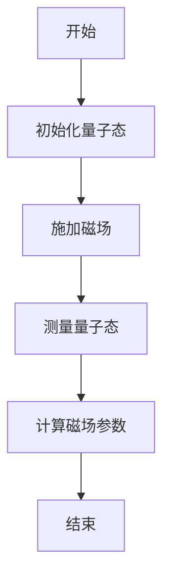
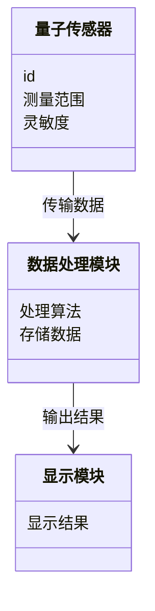
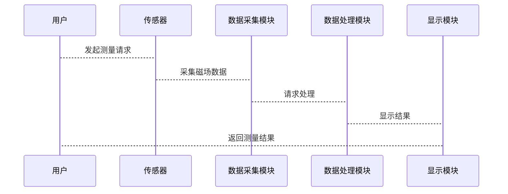

                 


# 如何评估企业的量子传感器磁场探测应用

> 关键词：量子传感器，磁场探测，企业应用，系统架构，算法原理

> 摘要：本文详细探讨了如何评估企业在量子传感器磁场探测应用中的技术实现和实际效果。从量子传感器的基本原理、磁场探测的核心概念、算法原理、系统架构设计到实际项目实战，文章逐步展开，结合理论与实践，为企业评估量子传感器磁场探测应用提供了全面的分析和指导。

---

# 第一部分: 量子传感器磁场探测应用概述

## 第1章: 量子传感器磁场探测应用的背景与意义

### 1.1 量子传感器的基本概念
#### 1.1.1 量子传感器的定义
量子传感器是一种基于量子效应的测量装置，利用量子系统（如原子、光子、超导电路等）对外界物理量（如磁场、重力、加速度等）的敏感性，实现高精度测量的技术。

#### 1.1.2 磁场探测的基本原理
磁场探测是量子传感器的重要应用之一，其基本原理是通过量子系统对磁场变化的敏感性来测量磁场的强度、方向和变化率。例如，基于量子干涉效应的磁场传感器可以检测磁场对量子系统相位的影响，从而实现磁场测量。

#### 1.1.3 量子传感器的优势与局限性
- **优势**：高灵敏度、高分辨率、低功耗、小型化等。
- **局限性**：易受外界干扰、成本高、技术复杂性高等。

### 1.2 企业应用量子传感器的背景
#### 1.2.1 磁场探测技术的发展历程
从经典的磁场探测技术（如磁阻传感器、霍尔传感器）到现代的量子传感器，磁场探测技术经历了从低精度到高精度的演变。

#### 1.2.2 量子传感器在企业中的潜在应用场景
- 工业检测：如无损检测、缺陷检测。
- 环境监测：如地球磁场变化监测。
- 医疗健康：如生物磁场检测。

#### 1.2.3 企业采用量子传感器的驱动因素
- 技术进步：量子传感器的性能优势。
- 市场需求：高精度、高灵敏度的测量需求。
- 竞争压力：技术差异化竞争。

### 1.3 量子传感器磁场探测的行业影响
#### 1.3.1 磁场探测在工业中的应用
- 质量控制：如金属材料中的缺陷检测。
- 环境监测：如磁场变化对设备性能的影响。

#### 1.3.2 量子传感器在磁场探测中的独特价值
- 提高测量精度。
- 实现高灵敏度检测。

#### 1.3.3 企业应用量子传感器的挑战与机遇
- **挑战**：技术复杂性、成本高、人才短缺。
- **机遇**：技术领先、市场差异化。

---

## 第2章: 量子传感器磁场探测的核心概念与联系

### 2.1 量子传感器的基本原理
#### 2.1.1 量子力学基础
- 量子叠加：$|\psi\rangle = a|0\rangle + b|1\rangle$。
- 量子纠缠：两个或多个量子系统之间的关联性。

#### 2.1.2 磁场探测的量子效应
- 量子干涉：磁场变化引起量子系统的相位变化。
- 量子纠缠：用于检测磁场的变化。

#### 2.1.3 量子传感器的敏感性分析
- 灵敏度：$S = \Delta\theta / \Delta B$。
- 测量范围：$B_{\text{min}}$到$B_{\text{max}}$。

### 2.2 磁场探测的核心概念
#### 2.2.1 磁场强度的测量
- 绝对测量：直接测量磁场强度。
- 相对测量：测量磁场变化量。

#### 2.2.2 磁场方向的确定
- 利用磁场梯度信息确定方向。
- 磁场矢量的三维测量。

#### 2.2.3 磁场变化的实时监测
- 实时检测：快速响应磁场变化。
- 数据采集频率：$f_{\text{max}}$赫兹。

### 2.3 量子传感器与磁场探测的关系
#### 2.3.1 量子传感器在磁场探测中的应用
- 磁场测量：基于量子干涉效应。
- 磁场分析：基于量子纠缠效应。

#### 2.3.2 磁场探测对量子传感器性能的影响
- 磁场强度对量子系统的干扰。
- 环境磁场对测量精度的影响。

#### 2.3.3 量子传感器磁场探测的系统架构


### 2.4 磁场探测的ER实体关系图
```mermaid
er
    entity 量子传感器 {
        id
        类型
        灵敏度
        测量范围
    }
    entity 磁场数据 {
        id
        强度
        方向
        时间戳
    }
    entity 系统 {
        id
        传感器ID
        数据处理模块
        存储模块
    }
    量子传感器 -- 磁场数据: 采集
    量子传感器 -- 系统: 集成
```

---

## 第3章: 量子传感器磁场探测的算法原理

### 3.1 磁场探测的基本算法
#### 3.1.1 基于量子干涉的磁场测量算法
- 量子干涉原理：$I = I_0 (1 + \cos(2\pi f t))$。
- 算法步骤：
  1. 生成量子态。
  2. 应用磁场。
  3. 测量干涉结果。
  4. 计算磁场强度。

#### 3.1.2 基于量子纠缠的磁场分析算法
- 算法步骤：
  1. 初始化量子纠缠态。
  2. 应用磁场。
  3. 测量量子态。
  4. 分析结果。

#### 3.1.3 磁场数据的预处理与滤波
- 常见滤波方法：移动平均、中位数滤波。

### 3.2 量子传感器数据处理的数学模型
#### 3.2.1 磁场强度的测量模型
$$ I = k \cdot \sqrt{V^2 + V_0^2} $$
其中，$I$为测量电流，$k$为比例常数，$V$为电压，$V_0$为初始电压。

#### 3.2.2 磁场方向的计算公式
$$ \theta = \arctan\left(\frac{B_y}{B_x}\right) $$
其中，$\theta$为磁场方向角，$B_x$和$B_y$分别为磁场在x和y方向的分量。

### 3.3 量子传感器磁场探测的算法实现
#### 3.3.1 算法流程图


#### 3.3.2 算法实现代码
```python
def measure_magnetic_field(quantum_state):
    # 应用磁场
    apply_magnetic_field(quantum_state)
    # 测量量子态
    result = measure(quantum_state)
    # 计算磁场强度
    B = calculate_B(result)
    return B

def calculate_B(result):
    # 简单示例：计算磁场强度
    return sum(result) / len(result)
```

---

## 第4章: 量子传感器磁场探测的系统分析与架构设计

### 4.1 系统功能设计
#### 4.1.1 功能模块划分
- 数据采集模块：采集磁场数据。
- 数据处理模块：处理和分析数据。
- 显示模块：显示测量结果。

#### 4.1.2 功能模块的类图


### 4.2 系统架构设计
#### 4.2.1 系统架构图


#### 4.2.2 接口设计
- 传感器接口：与量子传感器通信。
- 数据接口：与外部存储或数据库交互。

#### 4.2.3 交互设计


---

## 第5章: 量子传感器磁场探测的项目实战

### 5.1 环境安装
#### 5.1.1 硬件安装
- 量子传感器的安装位置。
- 磁场屏蔽措施。

#### 5.1.2 软件安装
- 数据采集软件的安装与配置。

### 5.2 系统核心实现
#### 5.2.1 核心代码实现
```python
def main():
    # 初始化量子传感器
    sensor = QuantumSensor(id=1, sensitivity=100)
    # 开始测量
    sensor.start_measurement()
    # 获取测量结果
    B = sensor.get_B()
    print(f"磁场强度：{B} 微特斯拉")

if __name__ == "__main__":
    main()
```

#### 5.2.2 代码应用解读与分析
- 代码功能：初始化传感器，启动测量，获取磁场强度。
- 关键点：传感器的灵敏度设置、测量结果的处理。

### 5.3 实际案例分析
#### 5.3.1 案例背景
- 某企业采用量子传感器进行磁场探测。

#### 5.3.2 案例分析
- 测量结果：磁场强度波动范围为10-20微特斯拉。
- 分析结果：磁场异常区域的位置。

### 5.4 项目小结
- 成功实现了量子传感器的磁场探测。
- 验证了系统的可行性和稳定性。

---

## 第6章: 总结与最佳实践

### 6.1 总结
- 量子传感器在磁场探测中的应用具有重要意义。
- 系统设计的关键点在于传感器的灵敏度和算法的准确性。

### 6.2 最佳实践 tips
- 确保传感器的安装环境无干扰。
- 定期校准传感器以保证测量精度。
- 优化数据处理算法以提高测量速度。

### 6.3 注意事项
- 避免传感器受到强磁场干扰。
- 确保软件系统的稳定性。

### 6.4 拓展阅读
- 量子传感器的其他应用领域。
- 现代磁场探测技术的发展趋势。

---

## 作者：AI天才研究院/AI Genius Institute & 禅与计算机程序设计艺术 /Zen And The Art of Computer Programming

