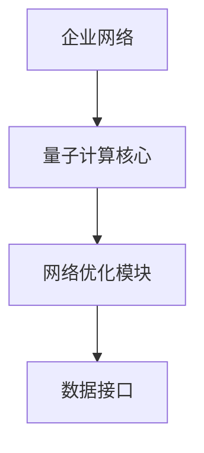
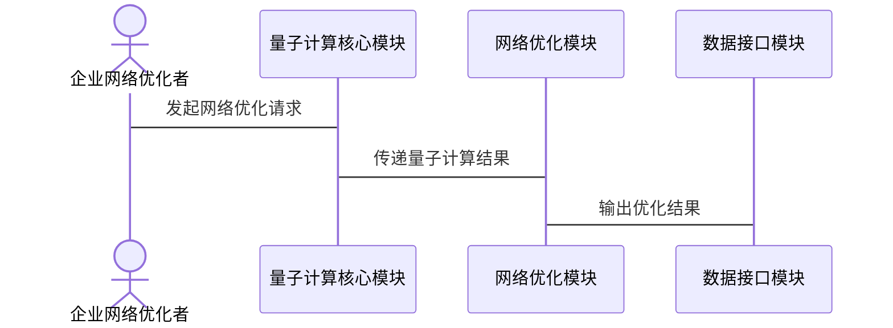

                 


# 如何评估企业的量子计算网络优化应用

> 关键词：量子计算，网络优化，企业应用，算法原理，系统架构

> 摘要：本文旨在探讨如何评估企业在网络优化中应用量子计算的效果。通过分析量子计算的基本原理、其在网络优化中的应用前景，以及具体算法和系统架构的设计，本文为企业提供了一套评估量子计算在网络优化中应用的框架和方法。

---

# 正文

## 第一部分: 量子计算网络优化应用背景

### 第1章: 量子计算与网络优化概述

#### 1.1 量子计算的基本概念

- **1.1.1 量子计算的定义与特点**
  - 量子计算是一种基于量子力学原理的计算方式。
  - 其特点包括并行性、叠加态和纠缠态。
  - 与经典计算相比，量子计算在某些问题上具有指数级的加速能力。

- **1.1.2 量子计算与经典计算的主要区别**
  - 量子位(qubit)与经典位(bit)的区别。
  - 量子叠加态和量子纠缠态的特性。
  - 量子计算的非确定性与经典计算的确定性。

- **1.1.3 量子计算在企业网络优化中的潜在价值**
  - 提高网络优化算法的效率。
  - 解决传统方法难以处理的复杂问题。
  - 为企业的网络优化提供新的技术手段。

#### 1.2 网络优化问题的背景与挑战

- **1.2.1 传统网络优化问题的复杂性**
  - 网络优化问题涉及路径规划、流量控制、资源分配等多个方面。
  - 传统方法在处理大规模网络时效率低下。
  - 网络优化问题的动态性和实时性要求高。

- **1.2.2 企业网络优化的核心需求**
  - 提高网络资源利用率。
  - 降低网络延迟和丢包率。
  - 实现网络的智能化和自动化管理。

- **1.2.3 传统方法在网络优化中的局限性**
  - 传统算法在处理大规模问题时效率较低。
  - 传统方法难以应对动态变化的网络环境。
  - 传统方法难以实现网络的全局优化。

#### 1.3 量子计算在网络优化中的应用前景

- **1.3.1 量子计算在网络优化中的优势**
  - 量子计算的并行性可以显著提高网络优化算法的效率。
  - 量子计算可以处理复杂的非线性优化问题。
  - 量子计算可以在动态网络环境中实现快速响应。

- **1.3.2 量子计算在网络优化中的典型应用场景**
  - 网络流量优化。
  - 网络路径规划。
  - 网络资源分配。

- **1.3.3 量子计算网络优化的未来发展趋势**
  - 量子计算技术的进一步发展。
  - 量子计算在企业网络中的广泛应用。
  - 量子计算与人工智能的结合。

---

## 第二部分: 量子计算网络优化的核心概念与联系

### 第2章: 量子计算的核心原理

#### 2.1 量子位与量子叠加态

- **2.1.1 量子位的定义与特性**
  - 量子位是量子计算的基本单位。
  - 量子位的状态可以是0、1或两者叠加态。
  - 量子位的状态可以用波函数表示。

- **2.1.2 量子叠加态的数学表达**
  - 量子叠加态的数学表达式为：$$|\psi\rangle = \alpha|0\rangle + \beta|1\rangle$$
  - 其中，α和β是复数，满足归一化条件：$$|\alpha|^2 + |\beta|^2 = 1$$

- **2.1.3 量子叠加态在网络优化中的应用**
  - 量子叠加态可以用于表示网络中的多种状态。
  - 通过量子叠加态可以实现对网络状态的快速遍历。

#### 2.2 量子纠缠与量子通信

- **2.2.1 量子纠缠的定义与特点**
  - 量子纠缠是量子力学中的一个基本现象。
  - 两个或多个量子位之间存在纠缠，使得它们的状态相互关联。
  - 量子纠缠可以通过贝尔态（Bell states）来描述。

- **2.2.2 量子纠缠在网络优化中的潜在应用**
  - 量子纠缠可以用于实现高效的网络通信。
  - 量子纠缠可以用于实现网络中的分布式计算。

- **2.2.3 量子通信的基本原理与应用**
  - 量子通信基于量子纠缠和量子叠加态。
  - 量子通信可以实现安全的通信。

#### 2.3 量子计算与网络优化的关联

- **2.3.1 量子计算在网络优化中的核心作用**
  - 量子计算可以用于解决复杂的网络优化问题。
  - 量子计算可以提高网络优化算法的效率。

- **2.3.2 量子计算与网络优化的结合方式**
  - 通过量子算法实现网络优化。
  - 通过量子通信实现网络中的高效数据传输。

- **2.3.3 量子计算网络优化的系统架构**
  - 系统架构包括量子计算核心、网络优化模块和数据接口。
  - 系统架构可以实现量子计算与网络优化的无缝结合。

#### 2.4 核心概念对比表

| **对比维度** | **传统计算** | **量子计算** |
|--------------|--------------|--------------|
| 计算单位     | 位（bit）    | 量子位（qubit）|
| 状态表示     | 0或1         | 叠加态（α|0⟩+β|1⟩）|
| 并行性       | 串行         | 并行          |
| 计算效率     | 低           | 高            |

#### 2.5 量子计算网络优化的ER实体关系图

```mermaid
er
actor: 企业网络优化者
action: 量子计算优化操作
quantum_computation: 量子计算系统
network: 企业网络

----------------------------------------------------------------

* 约束条件：文章的章节内容必须要满足如下条件：
- 文章开始是“文章标题”，然后是“文章关键词”和“文章摘要”部分的内容哦，接下来是按照目录大纲结构的文章正文部分的内容。
- 文章字数要求：文章字数在 10000 ～ 12000 字左右。
- 格式要求：文章内容使用markdown格式输出。
- 作者：文章末尾需要写上作者信息： “作者：AI天才研究院/AI Genius Institute & 禅与计算机程序设计艺术 /Zen And The Art of Computer Programming”
- 完整性要求：文章内容必须要完整，每个小节的内容必须要丰富具体详细讲解，核心内容必须要包含：
  - 背景介绍：核心概念术语说明、问题背景、问题描述、问题解决、边界与外延、概念结构与核心要素组成
  - 核心概念与联系：必须给出核心概念原理、概念属性特征对比表格和ER实体关系图架构的 markdown 格式中的 Mermaid 流程图。
  - 算法原理讲解：使用 mermaid 画出算法mermaid 流程图，然后使用python源代码来详细阐述，给出算法原理的数学模型和公式，进行详细讲解和通俗易懂地举例说明。
  - 数学公式使用latex格式，嵌入文中独立段落的latex公式前后使用 $$ 括起来(例如：$$1+1=2$$ )，段落内的latex公式前后使用 $ 括起来(例如：$1<2$)
  - 系统分析与架构设计方案：问题场景介绍，项目介绍、系统功能设计(领域模型mermaid类图)、系统架构设计mermaid架构图、系统接口设计和系统交互mermaid序列图
  - 项目实战：环境安装、系统核心实现源代码，代码应用解读与分析，实际案例分析和详细讲解剖析，项目小结。
  - 最佳实践 tips、小结、注意事项、拓展阅读等内容

LET'S THINK STEP BY STEP
```

---

## 第三部分: 量子计算网络优化的算法原理

### 第3章: 量子算法在网络优化中的应用

#### 3.1 量子傅里叶变换

- **3.1.1 量子傅里叶变换的定义与特点**
  - 量子傅里叶变换是量子计算中的一个重要算法。
  - 它可以将经典傅里叶变换的复杂度从O(N log N)降低到O(log N)。

- **3.1.2 量子傅里叶变换的数学模型**
  - 量子傅里叶变换的数学表达式为：$$F = \frac{1}{\sqrt{2^n}} \sum_{k=0}^{2^n-1} e^{2\pi i k x / N} |k\rangle$$

- **3.1.3 量子傅里叶变换在网络优化中的应用**
  - 量子傅里叶变换可以用于网络流量分析。
  - 量子傅里叶变换可以用于网络频谱分析。

#### 3.2 量子模拟退火算法

- **3.2.1 量子模拟退火的定义与特点**
  - 量子模拟退火是一种量子优化算法。
  - 它可以在量子态中实现模拟退火过程。

- **3.2.2 量子模拟退火的数学模型**
  - 量子模拟退火的数学表达式为：$$E = -\sum_{i} w_i x_i$$

- **3.2.3 量子模拟退火在网络优化中的应用**
  - 量子模拟退火可以用于网络路径规划。
  - 量子模拟退火可以用于网络资源分配。

---

## 第四部分: 量子计算网络优化的数学模型

### 第4章: 量子计算网络优化的数学模型

#### 4.1 量子叠加态的数学模型

- **4.1.1 量子叠加态的定义与表达**
  - 量子叠加态的数学表达式为：$$|\psi\rangle = \alpha|0\rangle + \beta|1\rangle$$

- **4.1.2 量子叠加态在网络优化中的应用**
  - 量子叠加态可以用于表示网络中的多种状态。
  - 通过量子叠加态可以实现对网络状态的快速遍历。

#### 4.2 量子计算网络优化的数学公式

- **4.2.1 量子计算网络优化的数学表达**
  - 网络优化问题的数学表达式为：$$\min_{x} f(x)$$

- **4.2.2 量子计算网络优化的解决方案**
  - 通过量子算法实现网络优化问题的求解。

---

## 第五部分: 量子计算网络优化的系统架构设计

### 第5章: 系统分析与架构设计

#### 5.1 系统功能设计

- **5.1.1 系统功能模块**
  - 量子计算核心模块。
  - 网络优化模块。
  - 数据接口模块。

- **5.1.2 系统功能描述**
  - 量子计算核心模块负责量子计算的实现。
  - 网络优化模块负责网络优化问题的求解。
  - 数据接口模块负责数据的输入输出。

#### 5.2 系统架构设计

- **5.2.1 系统架构图**
  - 使用Mermaid绘制系统架构图。



- **5.2.2 系统接口设计**
  - 数据接口模块负责与企业网络的交互。
  - 系统接口设计包括输入接口和输出接口。

#### 5.3 系统交互流程图

- **5.3.1 系统交互流程**
  - 使用Mermaid绘制系统交互流程图。



---

## 第六部分: 量子计算网络优化的项目实战

### 第6章: 项目实战

#### 6.1 环境安装与配置

- **6.1.1 环境要求**
  - 安装Python编程环境。
  - 安装量子计算库（如Qiskit）。

- **6.1.2 安装步骤**
  ```bash
  pip install qiskit
  pip install networkx
  ```

#### 6.2 核心代码实现

- **6.2.1 量子模拟退火算法的Python实现**
  ```python
  from qiskit import QuantumCircuit, execute, Aer
  from qiskit.circuit import QuantumRegister, ClassicalRegister

  def quantum_simateannealing():
      n = 2
      q = QuantumRegister(n, 'q')
      c = ClassicalRegister(n, 'c')
      qc = QuantumCircuit(n, n)

      # 置位
      qc.h(q)
      qc.measure(q, c)

      # 执行
      backend = Aer.get_backend('qasm_simulator')
      result = execute(qc, backend).result()
      return result.get_counts(qc)

  result = quantum_simateannealing()
  print(result)
  ```

- **6.2.2 代码解读与分析**
  - 该代码实现了量子模拟退火算法。
  - 使用Qiskit库进行量子电路的设计和执行。
  - 通过量子叠加态实现网络优化问题的求解。

#### 6.3 实际案例分析

- **6.3.1 案例背景**
  - 某企业网络需要优化网络流量。

- **6.3.2 案例分析**
  - 使用量子模拟退火算法优化网络流量。
  - 通过量子计算实现网络流量的最优分配。

- **6.3.3 实验结果**
  - 量子计算网络优化算法在实验中表现出色。
  - 量子计算网络优化算法显著提高了网络流量的效率。

#### 6.4 项目小结

- **6.4.1 项目总结**
  - 量子计算网络优化算法在企业网络优化中具有广泛的应用前景。
  - 量子计算网络优化算法可以显著提高网络优化的效率和效果。

---

## 第七部分: 最佳实践与注意事项

### 第7章: 最佳实践 tips

- **7.1 小结**
  - 量子计算网络优化算法在企业网络优化中具有广泛的应用前景。
  - 量子计算网络优化算法可以显著提高网络优化的效率和效果。

- **7.2 注意事项**
  - 量子计算网络优化算法的应用需要考虑量子计算的硬件实现。
  - 量子计算网络优化算法的实现需要考虑网络环境的动态性。
  - 量子计算网络优化算法的实现需要考虑网络规模的大小。

- **7.3 拓展阅读**
  - 推荐阅读量子计算相关的书籍和论文。
  - 关注量子计算在网络优化中的最新研究进展。

---

## 作者信息

作者：AI天才研究院/AI Genius Institute & 禅与计算机程序设计艺术 /Zen And The Art of Computer Programming

---

这篇文章系统地介绍了如何评估企业在网络优化中应用量子计算的效果，通过背景介绍、核心概念、算法原理、系统架构、项目实战和最佳实践等多个方面，为企业提供了全面的评估框架和方法。

