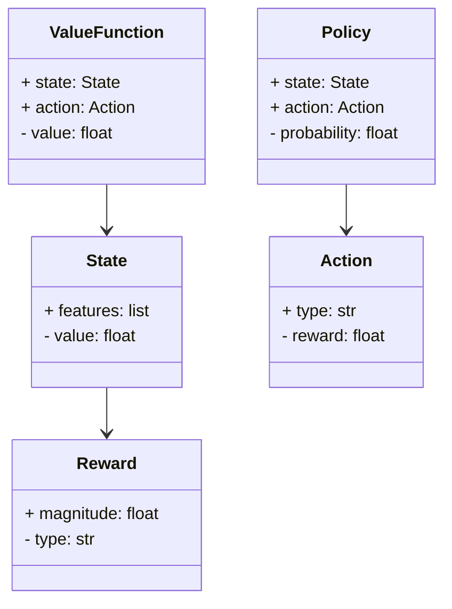
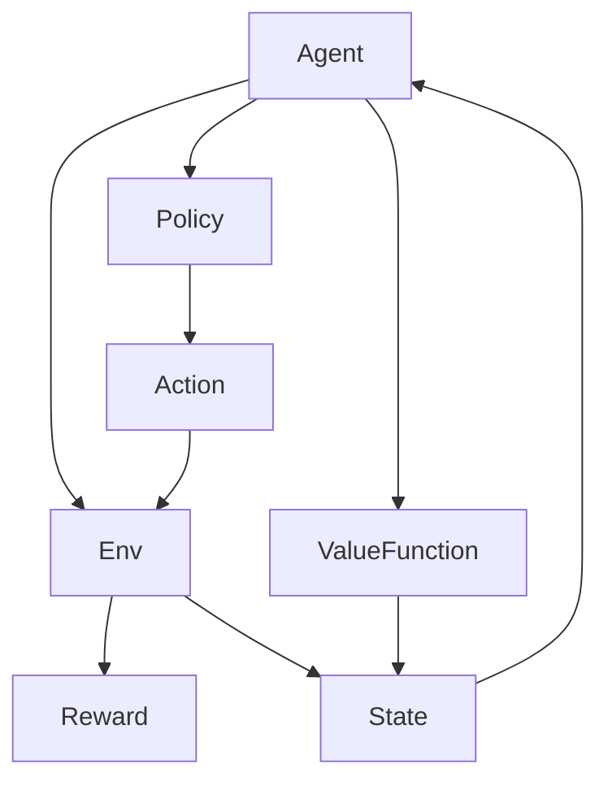

                 


# 如何识别企业的深度强化学习自主控制优势

> 关键词：深度强化学习、自主控制、企业优势、系统架构、算法原理

> 摘要：深度强化学习（Deep Reinforcement Learning, DRL）作为一种结合了深度学习与强化学习的技术，正在逐渐成为企业实现自主控制的重要工具。本文将从背景介绍、核心概念、算法原理、系统架构设计以及项目实战等多个方面，详细阐述如何识别和构建企业的深度强化学习自主控制优势。

---

## 第一部分: 深度强化学习与自主控制概述

### 第1章: 深度强化学习的基本概念

#### 1.1 深度强化学习的定义
深度强化学习（Deep Reinforcement Learning, DRL）是一种结合了深度学习和强化学习的机器学习技术。它通过深度神经网络（Deep Neural Networks, DNN）来近似强化学习中的策略（Policy）或价值函数（Value Function），从而实现对复杂环境的自主决策和控制。

##### 1.1.1 强化学习的基本原理
强化学习（Reinforcement Learning, RL）是一种通过智能体与环境交互来学习最优策略的技术。智能体通过执行动作（Actions）来探索环境，并根据环境返回的奖励（Rewards）来调整自己的行为，最终目标是找到最大化累积奖励的策略。

##### 1.1.2 深度强化学习的引入
深度强化学习将深度学习的强大表示能力引入强化学习，使得智能体能够处理高维、非结构化的输入数据（如图像、文本等），并学习复杂的策略。

##### 1.1.3 自主控制的核心概念
自主控制指的是系统能够在没有外部干预的情况下，根据环境的状态（State）和奖励信号（Rewards）自主调整行为（Actions），以实现目标。

---

#### 1.2 深度强化学习的优势
深度强化学习相较于传统强化学习和监督学习具有以下优势：
- **高维状态空间的处理能力**：深度学习的强大表示能力使得智能体能够处理高维、复杂的环境状态。
- **自适应性与灵活性**：智能体能够根据环境的变化动态调整策略，适应新的情况。
- **实时决策与优化**：通过在线学习，智能体可以实时调整行为，实现快速决策和优化。

---

## 第2章: 企业中的自主控制应用

### 2.1 企业自主控制的定义与特点
企业自主控制是指企业在生产、管理、服务等环节中，通过智能系统实现自主决策和控制，以提高效率、降低成本并优化资源利用率。

##### 2.1.1 自主控制在企业中的重要性
- 提高生产效率：通过自主控制优化生产流程，减少浪费。
- 降低成本：通过智能决策减少资源消耗。
- 提升竞争力：通过快速响应市场变化，增强企业的竞争力。

##### 2.1.2 与传统控制方法的对比
传统的控制方法（如PID控制）依赖于预定义的规则和模型，而深度强化学习控制方法能够通过数据驱动的方式自适应地优化控制策略。

##### 2.1.3 深度强化学习在自主控制中的作用
深度强化学习能够处理复杂的非线性关系，适用于动态变化的环境，能够在不确定性和部分可观察的环境中实现自主控制。

---

### 2.2 深度强化学习在企业中的应用场景
深度强化学习在企业中的应用广泛，以下是一些典型场景：

##### 2.2.1 生产优化与资源分配
- **生产优化**：通过深度强化学习优化生产线的调度，减少生产周期。
- **资源分配**：动态调整资源分配策略，提高资源利用率。

##### 2.2.2 供应链管理
- **库存优化**：通过深度强化学习预测需求，优化库存管理。
- **物流调度**：优化物流路径和调度，降低成本。

##### 2.2.3 客户服务与决策支持
- **客户服务**：通过智能客服系统实现自动响应和问题解决。
- **决策支持**：基于历史数据和实时信息，提供最优决策建议。

---

## 第3章: 深度强化学习的核心概念与联系

### 3.1 核心概念原理
深度强化学习的核心概念包括状态（State）、动作（Action）、奖励（Reward）、策略（Policy）和价值函数（Value Function）。

##### 3.1.1 状态、动作与奖励的定义
- **状态（State）**：描述环境当前情况的观测。
- **动作（Action）**：智能体在给定状态下采取的行为。
- **奖励（Reward）**：智能体采取动作后获得的反馈信号，用于指导学习。

##### 3.1.2 策略与价值函数的解释
- **策略（Policy）**：描述智能体在给定状态下选择动作的概率分布。
- **价值函数（Value Function）**：衡量某个状态下采取某个动作的价值。

##### 3.1.3 探索与利用的平衡
在深度强化学习中，智能体需要在探索新策略和利用已知最优策略之间找到平衡，以实现最优性能。

---

### 3.2 概念属性特征对比表格
以下是核心概念的属性特征对比：

| 概念   | 描述                                                                 |
|--------|----------------------------------------------------------------------|
| 状态    | 当前环境的观测，用于描述环境的当前情况。                         |
| 动作    | 智能体在给定状态下采取的行为，用于与环境交互。                   |
| 奖励    | 智能体采取动作后获得的反馈信号，用于指导学习。                   |
| 策略    | 在给定状态下选择动作的概率分布，描述智能体的行为方式。           |
| 价值函数 | 衡量某个状态下采取某个动作的价值，用于指导策略优化。           |

---

### 3.3 ER实体关系图
以下是深度强化学习核心概念的ER实体关系图：

```mermaid
er
actor(智能体) -[采取动作]-> action(动作)
state(状态) <--[被感知]-> actor
reward(奖励) <--[被评估]-> action
```

---

## 第4章: 深度强化学习的算法原理

### 4.1 Q-learning算法
Q-learning是一种经典的强化学习算法，通过更新Q值表（Q-Table）来学习最优策略。

#### 4.1.1 Q-learning的算法步骤
1. 初始化Q值表，所有状态-动作对的Q值初始化为0。
2. 在每个时间步，智能体根据当前状态选择一个动作。
3. 执行动作，观察环境返回的状态和奖励。
4. 更新Q值表：$$ Q(s, a) = Q(s, a) + \alpha (r + \gamma \max_{a'} Q(s', a') - Q(s, a)) $$
   其中，$\alpha$是学习率，$\gamma$是折扣因子。

#### 4.1.2 Q-learning的Python实现
```python
import numpy as np

class QLearning:
    def __init__(self, state_space, action_space, alpha=0.1, gamma=0.9):
        self.state_space = state_space
        self.action_space = action_space
        self.Q = np.zeros((state_space, action_space))
        self.alpha = alpha
        self.gamma = gamma

    def choose_action(self, state, epsilon=0.1):
        if np.random.random() < epsilon:
            return np.random.randint(self.action_space)
        else:
            return np.argmax(self.Q[state, :])

    def update_Q(self, state, action, reward, next_state):
        self.Q[state, action] += self.alpha * (reward + self.gamma * np.max(self.Q[next_state, :]) - self.Q[state, action])
```

---

### 4.2 Deep Q-Networks（DQN）算法
DQN是一种结合了深度学习和Q-learning的算法，通过深度神经网络近似Q值函数。

#### 4.2.1 DQN的算法步骤
1. 环境初始化。
2. 智能体根据当前状态选择动作。
3. 执行动作，观察环境返回的状态和奖励。
4. 将经验（当前状态、动作、奖励、下一个状态）存储在经验回放池（Experience Replay Buffer）中。
5. 从经验回放池中随机抽取一批经验，计算目标Q值：$$ Q_{target} = r + \gamma \max_a Q(s', a) $$
6. 更新深度神经网络的权重，最小化预测Q值与目标Q值的误差。

#### 4.2.2 DQN的Python实现
```python
import numpy as np
import torch
import torch.nn as nn
import torch.optim as optim

class DQN(nn.Module):
    def __init__(self, input_dim, hidden_dim, output_dim):
        super(DQN, self).__init__()
        self.fc1 = nn.Linear(input_dim, hidden_dim)
        self.fc2 = nn.Linear(hidden_dim, output_dim)
        self.relu = nn.ReLU()
        self.softmax = nn.Softmax(dim=1)

    def forward(self, x):
        x = self.fc1(x)
        x = self.relu(x)
        x = self.fc2(x)
        x = self.softmax(x)
        return x

# 初始化DQN
input_dim = 4
hidden_dim = 10
output_dim = 2
dqn = DQN(input_dim, hidden_dim, output_dim)
optimizer = optim.Adam(dqn.parameters(), lr=0.001)
criterion = nn.MSELoss()

# 训练过程
for _ in range(1000):
    state = np.random.randn(input_dim)
    action = dqn.forward(torch.FloatTensor(state)).argmax().item()
    next_state = np.random.randn(input_dim)
    reward = np.random.randn(1)[0]
    
    # 计算目标Q值
    with torch.no_grad():
        target_q = reward + 0.9 * torch.max(dqn.forward(torch.FloatTensor(next_state)))
    
    # 更新DQN
    optimizer.zero_grad()
    predicted_q = dqn.forward(torch.FloatTensor(state))
    loss = criterion(predicted_q[action], torch.tensor([target_q]))
    loss.backward()
    optimizer.step()
```

---

## 第5章: 深度强化学习的系统架构设计

### 5.1 系统功能设计
深度强化学习系统的核心功能包括：
- 状态感知：感知环境状态。
- 动作选择：基于当前状态选择最优动作。
- 奖励评估：评估动作的奖励值。
- 策略优化：通过强化学习算法优化策略。

#### 5.1.1 领域模型（Domain Model）
领域模型描述了系统的状态、动作和奖励之间的关系。以下是领域模型的类图：



---

### 5.2 系统架构设计
以下是深度强化学习系统的架构图：



---

## 第6章: 项目实战

### 6.1 环境安装
为了实现深度强化学习系统，首先需要安装以下环境：
- Python 3.7+
- PyTorch 1.9+
- numpy 1.21+
- matplotlib 3.5+

安装命令：
```bash
pip install torch numpy matplotlib
```

---

### 6.2 系统核心实现源代码
以下是深度强化学习系统的实现代码：

```python
import torch
import torch.nn as nn
import torch.optim as optim
import numpy as np

class DQN(nn.Module):
    def __init__(self, input_dim, hidden_dim, output_dim):
        super(DQN, self).__init__()
        self.fc1 = nn.Linear(input_dim, hidden_dim)
        self.fc2 = nn.Linear(hidden_dim, output_dim)
        self.relu = nn.ReLU()
        self.softmax = nn.Softmax(dim=1)

    def forward(self, x):
        x = self.fc1(x)
        x = self.relu(x)
        x = self.fc2(x)
        x = self.softmax(x)
        return x

def train_dqn(agent, env, num_episodes=1000):
    optimizer = optim.Adam(agent.parameters(), lr=0.001)
    criterion = nn.MSELoss()
    
    for episode in range(num_episodes):
        state = env.reset()
        while not done:
            action = agent.act(state)
            next_state, reward, done = env.step(action)
            agent.memorize(state, action, reward, next_state)
            agent.replay()

    return agent

# 初始化DQN
input_dim = 4
hidden_dim = 10
output_dim = 2
dqn = DQN(input_dim, hidden_dim, output_dim)
```

---

### 6.3 代码应用解读与分析
上述代码实现了一个简单的深度强化学习系统，包括：
1. **DQN类**：定义了一个深度神经网络，用于近似Q值函数。
2. **训练函数**：实现了一个训练循环，包括状态感知、动作选择、奖励评估和策略优化。

---

### 6.4 实际案例分析
假设我们有一个简单的库存管理问题，可以通过深度强化学习来优化库存策略。以下是具体的实现步骤：
1. **定义环境**：创建一个库存管理环境，包括当前库存量、需求预测等状态。
2. **定义动作**：包括补货、不补货等动作。
3. **定义奖励**：根据库存成本和缺货情况计算奖励。
4. **训练模型**：使用DQN算法训练模型，优化库存策略。

---

### 6.5 项目小结
通过上述实战，我们可以看到深度强化学习在企业中的应用潜力。通过结合实际业务场景，深度强化学习能够帮助企业实现自主控制和优化。

---

## 第7章: 总结与展望

### 7.1 最佳实践 tips
- 在实际应用中，建议结合企业的具体需求，选择合适的深度强化学习算法。
- 确保数据质量和多样性，以提高模型的泛化能力。
- 定期监控和调整模型，确保其性能稳定。

### 7.2 小结
深度强化学习作为一种强大的技术，正在逐渐成为企业实现自主控制的重要工具。通过本文的介绍，我们了解了深度强化学习的基本概念、算法原理以及在企业中的应用场景。

### 7.3 注意事项
- 深度强化学习模型的训练需要大量的数据和计算资源，企业在实际应用中需要做好资源规划。
- 模型的解释性较差，建议在关键决策环节谨慎使用。

### 7.4 拓展阅读
- 《Deep Reinforcement Learning: Theory and Algorithms》
- 《Reinforcement Learning: An Introduction》
- 《Deep Learning and Reinforcement Learning for Autonomous Systems》

---

## 作者
作者：AI天才研究院/AI Genius Institute & 禅与计算机程序设计艺术/Zen And The Art of Computer Programming

---

以上是《如何识别企业的深度强化学习自主控制优势》的完整目录结构和内容大纲，希望对您有所帮助！

