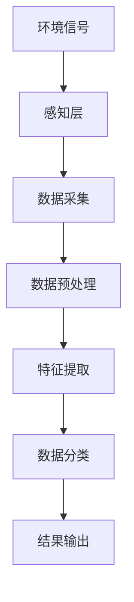
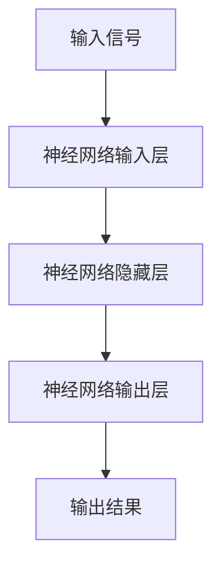
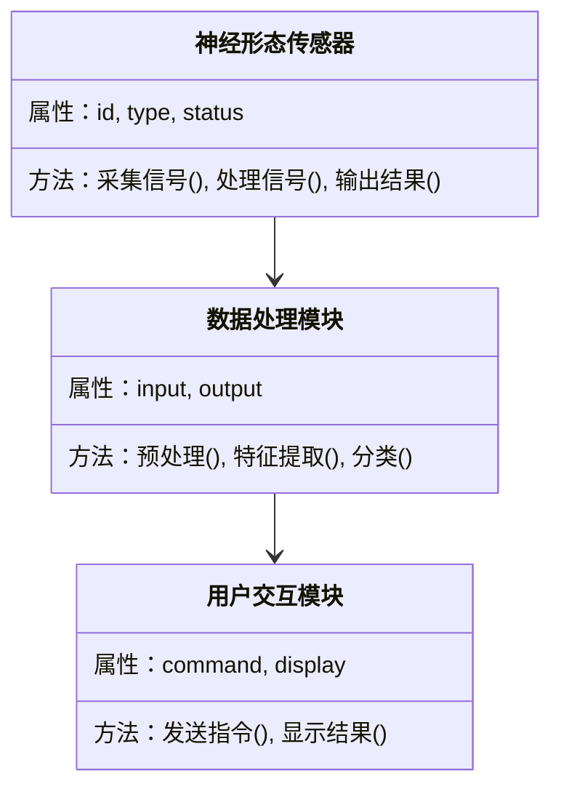
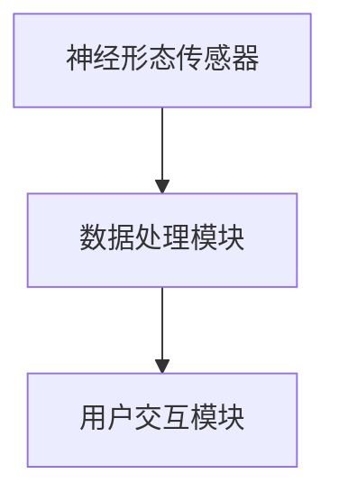

                 


# 如何识别企业的神经形态传感器优势

## 关键词：神经形态传感器、企业优势、传感器技术、人工智能、数字化转型

## 摘要：神经形态传感器是一种结合了神经科学和传感器技术的创新设备，能够为企业在工业自动化、智能安防、医疗健康等领域带来显著优势。本文将从核心概念、算法原理、系统架构等多个维度详细分析神经形态传感器的优势，并通过实际案例展示其在企业中的应用场景，帮助企业在数字化转型中识别并利用神经形态传感器的优势。

---

# 第一部分：神经形态传感器与企业优势

## 第1章：神经形态传感器概述

### 1.1 神经形态传感器的基本概念

#### 1.1.1 神经形态传感器的定义
神经形态传感器是一种模拟人脑神经元工作原理的传感器，能够实时感知环境中的多种信号（如光、温度、压力等），并通过类似生物神经系统的机制对信号进行处理和分析。与传统传感器相比，神经形态传感器具有更高的感知能力、更强的环境适应能力和更低的功耗。

#### 1.1.2 神经形态传感器的核心特点
- **实时感知与处理**：神经形态传感器能够实时采集并处理环境信号，无需依赖外部计算设备。
- **自适应能力**：通过类似生物神经系统的可塑性，神经形态传感器能够自适应环境变化。
- **低功耗**：神经形态传感器的能耗远低于传统传感器，适合在电池供电的设备中使用。

#### 1.1.3 神经形态传感器与传统传感器的对比
| 对比维度 | 传统传感器 | 神经形态传感器 |
|----------|------------|----------------|
| 数据处理 | 单一信号采集，依赖外部计算设备 | 内置处理逻辑，实时分析 |
| 环境适应 | 固定功能，难以适应复杂环境 | 具备自适应能力，适用于多种场景 |
| 功耗 | 高功耗，需要外部电源支持 | 低功耗，适合电池供电 |

---

### 1.2 神经形态传感器在企业中的应用背景

#### 1.2.1 企业数字化转型的挑战
随着企业数字化转型的推进，传统的传感器技术在数据处理能力和实时性方面已无法满足需求。企业需要更高效的传感器技术来支持工业自动化、智能安防、健康监测等场景。

#### 1.2.2 神经形态传感器的出现与企业需求的契合
神经形态传感器的出现正好解决了传统传感器的痛点。其内置的数据处理能力、低功耗特性和自适应能力使其成为企业数字化转型的理想选择。

#### 1.2.3 神经形态传感器的优势与潜力
- **提升效率**：神经形态传感器能够实时处理数据，减少数据传输和处理的时间。
- **降低成本**：通过低功耗设计，神经形态传感器能够降低企业的能源成本。
- **扩展应用**：神经形态传感器的应用范围广泛，能够满足企业多个场景的需求。

---

### 1.3 神经形态传感器的应用前景

#### 1.3.1 神经形态传感器在工业领域的应用
- **工业自动化**：神经形态传感器可以实时监测生产线上的设备状态，提前预测故障，减少停机时间。
- **质量控制**：通过实时感知和分析，神经形态传感器能够提高产品质量。

#### 1.3.2 神经形态传感器在消费电子领域的应用
- **智能设备**：如智能手机、可穿戴设备等，神经形态传感器可以实现更智能的环境感知和用户交互。
- **健康监测**：神经形态传感器可以实时监测用户的健康数据，提供个性化的健康建议。

#### 1.3.3 神经形态传感器在医疗健康领域的应用
- **患者监测**：神经形态传感器可以实时监测患者的生理指标，如心率、体温等，帮助医生进行诊断。
- **康复治疗**：神经形态传感器可以用于康复设备，帮助患者恢复身体功能。

---

## 第2章：神经形态传感器的核心概念与原理

### 2.1 神经形态传感器的核心概念

#### 2.1.1 神经形态传感器的结构与功能
神经形态传感器通常由感知层、处理层和通信层组成。感知层负责采集环境信号，处理层对信号进行分析和处理，通信层负责将数据传输到其他设备或系统。

#### 2.1.2 神经形态传感器的工作原理
神经形态传感器的工作原理类似于生物神经系统，感知层相当于感受器，处理层相当于神经中枢，通信层相当于传出神经。传感器通过类似生物神经系统的机制，实现对环境信号的实时感知和处理。

#### 2.1.3 神经形态传感器的信号处理流程
以下是神经形态传感器的信号处理流程图：



---

### 2.2 神经形态传感器与传统传感器的对比

#### 2.2.1 信号采集方式的对比
| 对比维度 | 传统传感器 | 神经形态传感器 |
|----------|------------|----------------|
| 信号采集 | 单一信号采集 | 多维信号采集 |
| 数据处理 | 依赖外部设备 | 内置处理逻辑 |

#### 2.2.2 数据处理方式的对比
| 对比维度 | 传统传感器 | 神经形态传感器 |
|----------|------------|----------------|
| 数据处理 | 离线处理 | 实时处理 |
| 算法复杂度 | 低复杂度 | 高复杂度 |

#### 2.2.3 性能指标的对比
| 对比维度 | 传统传感器 | 神经形态传感器 |
|----------|------------|----------------|
| 响应时间 | 较长 | 极短 |
| 功耗 | 高 | 低 |

---

### 2.3 神经形态传感器的优势与局限性

#### 2.3.1 神经形态传感器的主要优势
- **实时性**：神经形态传感器能够实时处理数据，减少延迟。
- **低功耗**：神经形态传感器的能耗远低于传统传感器。
- **自适应性**：神经形态传感器能够自适应环境变化，提升性能。

#### 2.3.2 神经形态传感器的局限性
- **成本高**：神经形态传感器的制造成本较高。
- **技术复杂性**：神经形态传感器的设计和实现技术较为复杂。
- **应用场景有限**：目前神经形态传感器的应用场景较为有限，尚未大规模普及。

#### 2.3.3 神经形态传感器的未来发展方向
- **降低成本**：通过技术创新和规模化生产，降低神经形态传感器的成本。
- **提升性能**：进一步优化神经形态传感器的感知和处理能力。
- **拓展应用**：探索更多应用场景，如智能城市、智能农业等。

---

## 第3章：神经形态传感器的算法原理与实现

### 3.1 神经形态传感器的数据处理流程

#### 3.1.1 数据采集阶段
神经形态传感器通过感知层采集环境信号，如光、温度、压力等。

#### 3.1.2 数据预处理阶段
数据预处理包括去噪、滤波等操作，以提高数据的质量。

#### 3.1.3 数据特征提取阶段
特征提取是通过提取数据中的关键特征，如频率、幅度等，以便后续分类。

#### 3.1.4 数据分类与识别阶段
数据分类通过机器学习算法，如支持向量机（SVM）、神经网络等，对数据进行分类和识别。

---

### 3.2 神经形态传感器的信号处理算法

#### 3.2.1 基于神经网络的信号处理算法
以下是基于神经网络的信号处理算法流程图：



#### 3.2.2 基于传统算法的信号处理方法
传统的信号处理方法包括傅里叶变换、小波变换等。

#### 3.2.3 算法的优缺点对比
| 对比维度 | 神经网络算法 | 传统算法 |
|----------|--------------|----------|
| 算法复杂度 | 高 | 低 |
| 精度 | 高 | 中等 |
| 适应性 | 强 | 弱 |

---

### 3.3 神经形态传感器的数学模型与公式

#### 3.3.1 神经网络模型的数学表示
神经网络模型可以用以下公式表示：

$$
y = f(Wx + b)
$$

其中，\( y \) 是输出，\( W \) 是权重矩阵，\( x \) 是输入向量，\( b \) 是偏置，\( f \) 是激活函数。

#### 3.3.2 信号处理算法的数学推导
例如，傅里叶变换的公式为：

$$
X(k) = \sum_{n=0}^{N-1} x(n) e^{-j2\pi kn/N}
$$

---

## 第4章：神经形态传感器的系统分析与架构设计

### 4.1 系统应用场景分析

#### 4.1.1 工业自动化场景
在工业自动化中，神经形态传感器可以用于实时监测生产线上的设备状态。

#### 4.1.2 智能安防场景
在智能安防中，神经形态传感器可以用于实时监测环境中的异常情况。

#### 4.1.3 智慧医疗场景
在智慧医疗中，神经形态传感器可以用于实时监测患者的生理指标。

---

### 4.2 系统功能设计

#### 4.2.1 数据采集模块
数据采集模块负责采集环境信号，如光、温度、压力等。

#### 4.2.2 数据处理模块
数据处理模块对采集到的数据进行预处理、特征提取和分类。

#### 4.2.3 数据分析模块
数据分析模块对处理后的数据进行分析，生成结果并输出。

#### 4.2.4 用户交互模块
用户交互模块负责与用户进行交互，显示结果并接收用户的指令。

---

### 4.3 系统架构设计

#### 4.3.1 领域模型类图
以下是领域模型类图：



#### 4.3.2 系统架构图
以下是系统架构图：



---

## 第5章：神经形态传感器的项目实战

### 5.1 环境安装

#### 5.1.1 系统需求
- 操作系统：Linux/Windows/MacOS
- 硬件需求：神经形态传感器、开发板、连接线等
- 软件需求：Python编程语言、神经网络库（如TensorFlow、PyTorch）

#### 5.1.2 安装步骤
1. 安装Python和必要的库。
2. 下载神经形态传感器的驱动程序。
3. 配置开发环境。

---

### 5.2 系统核心实现源代码

#### 5.2.1 数据采集模块
以下是数据采集模块的Python代码示例：

```python
import numpy as np

def采集信号():
    # 采集环境信号
    signal = np.random.normal(0, 1, 100)
    return signal

print(采集信号())
```

#### 5.2.2 数据处理模块
以下是数据处理模块的Python代码示例：

```python
import numpy as np
from sklearn.svm import SVC

def预处理(signal):
    # 数据预处理
    processed_signal = signal.reshape(-1, 1)
    return processed_signal

def特征提取(processed_signal):
    # 特征提取
    features = np.mean(processed_signal, axis=1)
    return features

def分类(features):
    # 数据分类
    model = SVC()
    model.fit(features, np.random.randint(0, 2, len(features)))
    return model.predict(features)

print(分类(特征提取(预处理(采集信号()))))
```

---

### 5.3 案例分析与详细讲解

#### 5.3.1 案例分析
假设我们正在开发一个智能安防系统，使用神经形态传感器实时监测环境中的异常情况。

#### 5.3.2 详细讲解
通过上述代码，我们可以实现对环境信号的实时采集、预处理、特征提取和分类。神经形态传感器的实时性和低功耗特性使其非常适合应用于智能安防系统。

---

### 5.4 项目总结

#### 5.4.1 项目总结
通过本项目，我们展示了神经形态传感器在智能安防中的应用，证明了其在实时性和低功耗方面的优势。

#### 5.4.2 项目小结
神经形态传感器的应用前景广阔，随着技术的不断发展，其在企业中的应用将更加广泛。

---

## 第六部分：总结与展望

### 6.1 总结

神经形态传感器是一种结合了神经科学和传感器技术的创新设备，具有实时性、低功耗和自适应性等优势。本文详细分析了神经形态传感器的核心概念、算法原理和系统架构，并通过实际案例展示了其在企业中的应用。

---

### 6.2 展望

随着人工智能技术的不断发展，神经形态传感器的应用前景将更加广阔。未来，神经形态传感器将更加智能化、低成本化，并在更多领域得到应用。

---

## 第七部分：最佳实践与注意事项

### 7.1 最佳实践

- **选择合适的传感器**：根据具体应用场景选择合适的神经形态传感器。
- **优化算法**：通过优化算法提升神经形态传感器的性能。
- **确保数据安全**：在实际应用中，确保数据的安全性和隐私性。

### 7.2 注意事项

- **技术复杂性**：神经形态传感器的设计和实现技术较为复杂，需要专业团队支持。
- **成本问题**：神经形态传感器的制造成本较高，企业需要考虑成本问题。

---

## 参考文献

1. 神经形态传感器相关技术论文
2. 神经网络算法相关书籍
3. 传感器技术相关文献

---

## 作者

作者：AI天才研究院/AI Genius Institute  
& 禅与计算机程序设计艺术/Zen And The Art of Computer Programming

---

通过以上详细的内容，您已经掌握了如何识别企业的神经形态传感器优势。神经形态传感器作为一种创新的技术，将在企业数字化转型中发挥越来越重要的作用。希望本文能够为您提供有价值的见解和指导。

