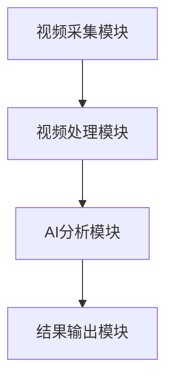

                 


# 如何识别企业的边缘AI视频分析芯片优势

> 关键词：边缘AI，视频分析，AI芯片，企业应用，技术优势

> 摘要：本文将深入探讨如何识别企业在边缘AI视频分析芯片方面的优势。通过分析边缘计算与AI视频分析的基本概念、核心算法、系统架构及应用场景，帮助读者理解如何在企业中有效识别和利用边缘AI视频分析芯片的优势。

---

## 正文

### 第一部分：边缘AI视频分析芯片的背景与概念

#### 第1章：边缘计算与AI视频分析概述

##### 1.1 边缘计算的基本概念
边缘计算是一种分布式计算范式，将计算能力从云端转移到数据产生的边缘端，如物联网设备、传感器和智能终端。边缘计算的优势在于降低延迟、减少带宽消耗和提高数据处理的实时性。

##### 1.2 AI视频分析的定义与特点
AI视频分析利用人工智能技术对视频流进行实时分析，包括目标检测、图像识别和行为分析等。其特点包括高实时性、高准确性、高灵活性和高扩展性。

##### 1.3 边缘AI视频分析芯片的定义与优势
边缘AI视频分析芯片是一种专门设计用于边缘端进行AI视频分析的硬件，具有低功耗、高性能和高集成度的特点。其优势包括高效的数据处理能力、低延迟和高能效。

---

### 第二部分：边缘AI视频分析芯片的核心概念与联系

#### 第2章：边缘AI视频分析芯片的核心概念

##### 2.1 边缘AI视频分析芯片的架构
边缘AI视频分析芯片的架构通常包括计算单元、存储单元和接口单元。计算单元负责执行AI算法，存储单元用于缓存数据，接口单元用于与外部设备通信。

##### 2.2 边缘AI视频分析芯片的算法
边缘AI视频分析芯片支持多种AI算法，如目标检测、图像识别和行为分析。这些算法通过优化设计在芯片上高效运行，确保实时性和准确性。

##### 2.3 边缘AI视频分析芯片的应用场景
边缘AI视频分析芯片广泛应用于智慧城市、工业自动化和智慧交通等领域。例如，在智慧交通中，芯片可以实时检测交通事故和违规行为，提升交通管理效率。

---

### 第三部分：边缘AI视频分析芯片的算法原理

#### 第3章：边缘AI视频分析芯片的算法实现

##### 3.1 目标检测算法
目标检测算法用于识别视频中的目标物体及其位置。YOLO算法是一种常见的目标检测算法，通过卷积神经网络提取特征并预测边界框。

**YOLO算法步骤：**
1. 输入图像经过卷积神经网络提取特征。
2. 特征图经过预测层生成候选边界框和类别概率。
3. 根据置信度筛选出目标物体。

**代码示例：**
```python
import torch
model = torch.hub.load('ultralytics/yolov5', 'yolov5')
result = model(input_image)
```

##### 3.2 图像识别算法
图像识别算法用于识别视频中的图像内容。ResNet网络是一种常用的图像识别模型，通过深层卷积神经网络提取图像特征并进行分类。

**ResNet网络结构：**
1. 输入图像经过多个卷积层提取特征。
2. 特征经过池化层降维。
3. 最后全连接层进行分类。

**代码示例：**
```python
import torch
model = torch.hub.load(' torchvision/models', 'resnet18')
output = model(input_image)
```

##### 3.3 算法优化与加速
为了提高边缘AI视频分析芯片的性能，需要对算法进行优化和加速。常用技术包括模型剪枝、量化和并行计算。

---

### 第四部分：边缘AI视频分析芯片的系统分析与架构设计

#### 第4章：边缘AI视频分析芯片的系统架构设计

##### 4.1 系统功能设计
边缘AI视频分析系统的功能模块包括数据采集、视频处理、AI分析和结果输出。各模块之间通过接口进行通信，确保系统的高效运行。

##### 4.2 系统架构设计
边缘AI视频分析系统的架构通常采用微服务架构，各服务模块独立运行，通过API进行交互。系统架构图如下：



##### 4.3 系统接口设计
系统接口设计包括视频输入接口、算法调用接口和结果输出接口。各接口通过标准协议进行通信，确保系统的兼容性和扩展性。

---

### 第五部分：边缘AI视频分析芯片的项目实战

#### 第5章：边缘AI视频分析芯片的项目实战

##### 5.1 环境安装
在进行边缘AI视频分析芯片的开发前，需要安装必要的开发环境和工具。例如，安装Python、深度学习框架和芯片驱动。

##### 5.2 系统核心实现
核心代码实现包括视频流的采集、AI算法的调用和结果的处理。以下是一个目标检测的Python代码示例：

```python
import cv2
import torch
model = torch.hub.load('ultralytics/yolov5', 'yolov5')
cap = cv2.VideoCapture(0)
while cap.isOpened():
    ret, frame = cap.read()
    if not ret:
        break
    results = model(frame)
    for box in results.xyxy[0]:
        x1, y1, x2, y2 = box
        cv2.rectangle(frame, (x1, y1), (x2, y2), (0, 255, 0), 2)
    cv2.imshow('frame', frame)
    if cv2.waitKey(1) == ord('q'):
        break
cap.release()
cv2.destroyAllWindows()
```

##### 5.3 实际案例分析
以智慧交通为例，边缘AI视频分析芯片可以实时检测交通事故和违规行为，帮助交通管理部门快速响应，提升交通效率。

##### 5.4 项目总结
通过项目实战，可以验证边缘AI视频分析芯片的优势，并积累实际开发经验，为后续项目提供参考。

---

### 第六部分：最佳实践、小结、注意事项

#### 6.1 最佳实践
- 确保算法的高效性和准确性，选择合适的模型和优化技术。
- 在开发过程中注重代码的可维护性和可扩展性。
- 定期更新算法和系统，以应对新的挑战和需求。

#### 6.2 小结
本文详细探讨了如何识别企业在边缘AI视频分析芯片方面的优势，从背景概念、核心算法、系统架构到项目实战，全面分析了芯片的优势和应用场景，为企业提供了宝贵的参考。

#### 6.3 注意事项
- 在选择芯片时，需综合考虑性能、功耗和成本。
- 开发过程中注意数据安全和隐私保护。
- 及时关注技术动态，保持对新技术的敏感性。

---

作者：AI天才研究院/AI Genius Institute & 禅与计算机程序设计艺术 /Zen And The Art of Computer Programming

