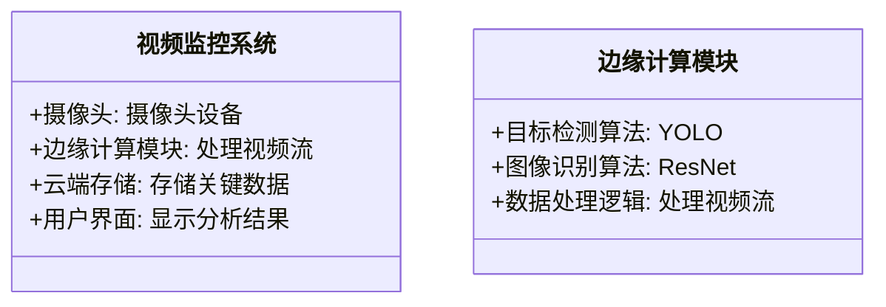
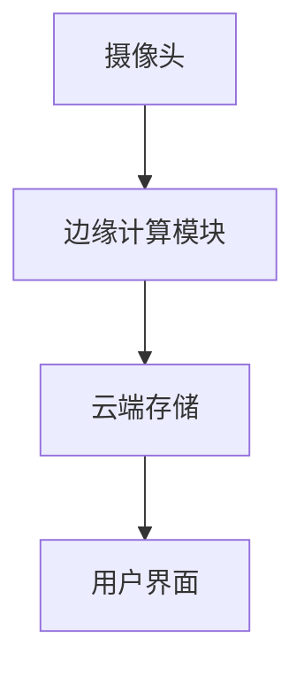
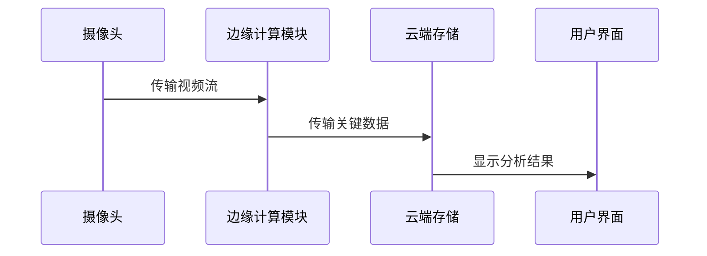

                 


```markdown
# 如何识别企业的边缘计算实时视频分析优势

> 关键词：边缘计算，实时视频分析，企业优势，算法原理，系统架构

> 摘要：边缘计算在实时视频分析中的应用为企业带来了显著的优势，如高效的数据处理能力、低延迟和高实时性。本文将从背景、核心概念、算法原理、系统架构、项目实战等多角度详细分析，帮助企业识别和利用这些优势。

---

## 第1章: 边缘计算与实时视频分析的背景与概念

### 1.1 边缘计算的基本概念

#### 1.1.1 边缘计算的定义
边缘计算是指在数据生成的位置（边缘）进行数据处理和分析，而不是将所有数据传输到云端。这种方式减少了数据传输的延迟和带宽消耗。

#### 1.1.2 边缘计算的核心特点
- **低延迟**：数据在边缘实时处理，减少传输到云端的时间。
- **高实时性**：适用于需要快速响应的场景。
- **带宽优化**：仅传输关键数据，减少网络负载。

#### 1.1.3 边缘计算与云计算的区别
| 特性          | 边缘计算               | 云计算                 |
|---------------|------------------------|------------------------|
| 数据处理位置  | 边缘设备               | 云端                   |
| 延迟           | 低延迟                | 较高延迟               |
| 带宽使用       | 低带宽                | 高带宽                |

### 1.2 实时视频分析的定义与特点

#### 1.2.1 实时视频分析的定义
实时视频分析是指对视频流中的数据进行实时处理和分析，通常用于目标检测、图像识别等领域。

#### 1.2.2 实时视频分析的核心技术
- **目标检测**：识别视频中的物体或人物。
- **图像识别**：识别特定图像内容。
- **行为分析**：分析视频中的人体动作或行为。

#### 1.2.3 实时视频分析的应用场景
- **安全监控**：实时监控视频中的异常行为。
- **交通管理**：实时监测交通流量和异常情况。
- **工业检测**：实时检测生产线上的缺陷。

### 1.3 边缘计算与实时视频分析的结合

#### 1.3.1 边缘计算在实时视频分析中的优势
- **实时性**：边缘计算可以实时处理视频数据，减少延迟。
- **隐私保护**：在边缘设备上处理数据，减少数据外传，保护隐私。
- **成本降低**：减少云端数据传输，降低带宽和存储成本。

#### 1.3.2 边缘计算与实时视频分析的结合方式
- **边缘设备部署**：在视频监控设备上部署边缘计算模块。
- **协同计算**：边缘设备与云端协同，结合两者的优点。

#### 1.3.3 边缘计算在实时视频分析中的应用前景
边缘计算与实时视频分析的结合将推动智能视频监控、智慧城市等领域的发展。

### 1.4 本章小结
本章介绍了边缘计算和实时视频分析的基本概念，分析了它们的结合方式及其优势。

---

## 第2章: 边缘计算实时视频分析的核心概念

### 2.1 边缘计算的核心概念

#### 2.1.1 边缘设备的定义与特点
- **定义**：边缘设备是指部署在数据源附近的设备，如摄像头、传感器等。
- **特点**：计算能力有限，但能够进行本地数据处理。

#### 2.1.2 边缘计算的计算模型
- **模型**：边缘设备上运行轻量级计算模型，如YOLO算法。

#### 2.1.3 边缘计算的通信机制
- **机制**：边缘设备通过本地网络进行数据传输，减少延迟。

### 2.2 实时视频分析的核心概念

#### 2.2.1 视频流处理的基本原理
- **流程**：视频流经过编码、解码、分析等步骤。

#### 2.2.2 视频分析的算法模型
- **模型**：包括目标检测算法（如YOLO）和图像识别算法（如ResNet）。

#### 2.2.3 实时视频分析的性能指标
- **指标**：帧率（FPS）、延迟（Latency）、准确率（Accuracy）。

### 2.3 边缘计算与实时视频分析的结合模型

#### 2.3.1 边缘计算在实时视频分析中的角色
- **角色**：边缘设备作为数据处理节点，云端作为支持节点。

#### 2.3.2 边缘计算与实时视频分析的协同机制
- **机制**：边缘设备处理部分数据，云端处理复杂任务。

#### 2.3.3 边缘计算在实时视频分析中的核心流程
1. 数据采集：摄像头采集视频流。
2. 数据处理：边缘设备进行目标检测和识别。
3. 数据传输：将关键数据传输到云端。
4. 数据分析：云端进行深度分析和决策。

### 2.4 核心概念对比与分析

#### 2.4.1 边缘计算与传统视频分析的对比
| 特性          | 边缘计算               | 传统视频分析           |
|---------------|------------------------|------------------------|
| 数据处理位置  | 边缘设备               | 云端                   |
| 延迟           | 低延迟                | 较高延迟               |
| 资源消耗       | 较低                  | 较高                  |

#### 2.4.2 实时视频分析与非实时视频分析的对比
| 特性          | 实时视频分析            | 非实时视频分析          |
|---------------|-------------------------|-------------------------|
| 延迟           | 实时                   | 非实时                 |
| 带宽使用       | 较低                   | 较高                  |

#### 2.4.3 边缘计算在实时视频分析中的优势
- **优势**：低延迟、高实时性、隐私保护。

### 2.5 本章小结
本章详细讲解了边缘计算和实时视频分析的核心概念，并分析了它们的协同机制和优势。

---

## 第3章: 边缘计算实时视频分析的算法原理

### 3.1 目标检测算法

#### 3.1.1 YOLO算法的原理与流程

##### 3.1.1.1 YOLO算法的原理
YOLO（You Only Look Once）是一种单发检测算法，通过将图像分割成网格，每个网格预测多个边界框和类别概率。

##### 3.1.1.2 YOLO算法的流程
1. **图像输入**：将视频帧输入到YOLO网络。
2. **特征提取**：通过卷积层提取图像特征。
3. **边界框预测**：网络输出每个网格的边界框和类别概率。
4. **非极大值抑制**：去除重叠的边界框，保留置信度高的结果。

##### 3.1.1.3 YOLO算法的数学模型
$$ y = \text{sigmoid}(w \cdot x + b) $$
其中，\( x \) 是输入特征，\( w \) 是权重，\( b \) 是偏置，\( y \) 是输出概率。

##### 3.1.1.4 YOLO算法的实现步骤
1. **预训练模型**：使用预训练的YOLO模型进行目标检测。
2. **图像处理**：将视频帧调整为模型输入大小。
3. **预测输出**：获取边界框和类别概率。
4. **后处理**：去除低概率和重叠的边界框。

##### 3.1.1.5 YOLO算法的优缺点
- **优点**：速度快，适合实时检测。
- **缺点**：检测精度较低。

#### 3.1.2 YOLO算法的数学模型
$$ \text{Loss} = \text{Coordinate Loss} + \text{Size Loss} + \text{Classification Loss} $$

### 3.2 图像识别算法

#### 3.2.1 ResNet网络的结构与特点

##### 3.2.1.1 ResNet网络的结构
ResNet（残差网络）通过引入跳跃连接（skip connection）来解决深层网络中的梯度消失问题。

##### 3.2.1.2 ResNet网络的特点
- **残差块**：通过跳跃连接加速网络的收敛。
- **深层网络**：能够捕捉高层特征。

##### 3.2.1.3 ResNet网络的数学模型
$$ y = f(x) + x $$

##### 3.2.1.4 ResNet网络的优缺点
- **优点**：能够训练深层网络，性能优异。
- **缺点**：计算资源消耗较大。

### 3.3 边缘计算实时视频分析的算法实现

#### 3.3.1 算法流程
1. **数据采集**：获取视频流。
2. **数据预处理**：调整图像大小，归一化等。
3. **模型推理**：运行目标检测和图像识别算法。
4. **结果处理**：输出检测结果并进行后续处理。

#### 3.3.2 算法实现的Python代码示例

##### 3.3.2.1 YOLO算法实现
```python
import cv2
import numpy as np

# 加载预训练模型
model = YOLOv5()

# 读取视频流
cap = cv2.VideoCapture('video.mp4')

while cap.isOpened():
    ret, frame = cap.read()
    if not ret:
        break
    # 预测结果
    results = model(frame)
    # 绘制边界框
    for result in results:
        x1, y1, x2, y2, label, conf = result
        cv2.rectangle(frame, (x1, y1), (x2, y2), (0, 255, 0), 2)
        cv2.putText(frame, f'{label}: {conf}', (x1, y1-5), cv2.FONT_HERSHEY_SIMPLEX, 0.5, (0, 255, 0), 2)
    # 显示结果
    cv2.imshow('frame', frame)
    if cv2.waitKey(1) & 0xFF == ord('q'):
        break

cap.release()
cv2.destroyAllWindows()
```

##### 3.3.2.2 ResNet网络实现
```python
import torch
import torch.nn as nn
import torch.nn.functional as F

class ResBlock(nn.Module):
    def __init__(self, in_channels, out_channels, stride=1):
        super(ResBlock, self).__init__()
        self.conv1 = nn.Conv2d(in_channels, out_channels, kernel_size=3, stride=stride, padding=1, bias=False)
        self.bn1 = nn.BatchNorm2d(out_channels)
        self.conv2 = nn.Conv2d(out_channels, out_channels, kernel_size=3, stride=1, padding=1, bias=False)
        self.bn2 = nn.BatchNorm2d(out_channels)

    def forward(self, x):
        out = F.relu(self.bn1(self.conv1(x)))
        out = self.bn2(self.conv2(out))
        return out + x

class ResNet(nn.Module):
    def __init__(self, block, layers, num_classes=1000):
        super(ResNet, self).__init__()
        self.conv1 = nn.Conv2d(3, 64, kernel_size=7, stride=2, padding=3, bias=False)
        self.bn1 = nn.BatchNorm2d(64)
        self.relu = nn.ReLU(inplace=True)
        self.maxpool = nn.MaxPool2d(kernel_size=3, stride=2, padding=1)
        self.layer1 = self._make_layer(block, 64, layers[0])
        self.layer2 = self._make_layer(block, 128, layers[1])
        self.layer3 = self._make_layer(block, 256, layers[2])
        self.layer4 = self._make_layer(block, 512, layers[3])
        self.avgpool = nn.AdaptiveAvgPool2d((1, 1))
        self.fc = nn.Linear(512, num_classes)

    def _make_layer(self, block, planes, num_blocks):
        layers = []
        for _ in range(num_blocks):
            layers.append(block(self.in_channels, planes))
        return nn.Sequential(*layers)

    def forward(self, x):
        x = self.relu(self.bn1(self.conv1(x)))
        x = self.maxpool(x)
        x = self.layer1(x)
        x = self.layer2(x)
        x = self.layer3(x)
        x = self.layer4(x)
        x = self.avgpool(x)
        x = x.view(x.size(0), -1)
        x = self.fc(x)
        return x

# 创建ResNet模型
model = ResNet(ResBlock, [2, 2, 2, 2])
```

#### 3.3.3 算法实现的性能优化

##### 3.3.3.1 算法优化策略
- **模型轻量化**：减少模型参数，降低计算复杂度。
- **并行计算**：利用GPU加速计算。
- **批次处理**：批量处理视频帧，提高效率。

##### 3.3.3.2 算法优化的Python代码示例
```python
import torch
import torch.nn as nn
import torch.optim as optim

# 定义优化器
optimizer = optim.SGD(model.parameters(), lr=0.001, momentum=0.9)
# 定义损失函数
criterion = nn.CrossEntropyLoss()
# 开始训练
for epoch in range(num_epochs):
    for i, (inputs, labels) in enumerate(train_loader):
        # 前向传播
        outputs = model(inputs)
        # 计算损失
        loss = criterion(outputs, labels)
        # 反向传播
        optimizer.zero_grad()
        loss.backward()
        optimizer.step()
```

### 3.4 本章小结
本章详细讲解了边缘计算实时视频分析中的目标检测和图像识别算法，包括YOLO和ResNet的原理、实现和优化策略。

---

## 第4章: 边缘计算实时视频分析的系统架构设计

### 4.1 问题场景介绍

#### 4.1.1 问题背景
企业在实时视频分析中面临数据量大、延迟高、计算资源不足等问题。

#### 4.1.2 问题描述
- **数据量大**：视频流数据量大，难以实时处理。
- **延迟高**：云端处理延迟较高，影响实时性。
- **计算资源不足**：边缘设备计算能力有限。

### 4.2 项目介绍

#### 4.2.1 项目目标
实现一个基于边缘计算的实时视频分析系统，用于智能监控。

#### 4.2.2 项目需求
- **实时性**：视频分析必须实时完成。
- **低带宽**：减少数据传输到云端的带宽。
- **高准确性**：确保目标检测和识别的准确性。

### 4.3 系统功能设计

#### 4.3.1 领域模型设计


#### 4.3.2 系统架构设计


#### 4.3.3 系统接口设计
- **摄像头接口**：提供视频流输入接口。
- **边缘计算模块接口**：提供目标检测和识别接口。
- **云端存储接口**：提供数据存储和查询接口。
- **用户界面接口**：提供结果显示和交互接口。

#### 4.3.4 系统交互设计


### 4.4 本章小结
本章从问题场景出发，设计了一个基于边缘计算的实时视频分析系统架构，并详细描述了系统的功能模块和交互流程。

---

## 第5章: 边缘计算实时视频分析的项目实战

### 5.1 环境安装与配置

#### 5.1.1 系统要求
- **操作系统**：Linux/Windows/MacOS
- **硬件要求**：支持GPU的设备
- **软件要求**：Python 3.6+, PyTorch, OpenCV

#### 5.1.2 安装依赖
```bash
pip install torch torchvision numpy cv2
```

### 5.2 系统核心实现

#### 5.2.1 边缘计算模块实现
```python
import cv2
import torch
import torch.nn as nn
import torch.nn.functional as F

class EdgeComputingModule:
    def __init__(self):
        self.model = YOLOv5()

    def process_frame(self, frame):
        results = self.model(frame)
        for result in results:
            x1, y1, x2, y2, label, conf = result
            cv2.rectangle(frame, (x1, y1), (x2, y2), (0, 255, 0), 2)
            cv2.putText(frame, f'{label}: {conf}', (x1, y1-5), cv2.FONT_HERSHEY_SIMPLEX, 0.5, (0, 255, 0), 2)
        return frame

# 创建边缘计算模块实例
edge_module = EdgeComputingModule()
```

#### 5.2.2 云端存储模块实现
```python
import torch
import torch.nn as nn
import torch.optim as optim
import numpy as np

class CloudStorageModule:
    def __init__(self):
        self.model = ResNet(ResBlock, [2, 2, 2, 2])
        self.model.load_state_dict(torch.load('resnet.pth'))
        self.model.eval()

    def process_data(self, data):
        with torch.no_grad():
            outputs = self.model(data)
            _, predicted = torch.max(outputs.data, 1)
            return predicted

# 创建云端存储模块实例
cloud_module = CloudStorageModule()
```

#### 5.2.3 用户界面模块实现
```python
import cv2
import numpy as np

class UserInterface:
    def __init__(self):
        self.window_name = '实时视频分析结果'
        cv2.namedWindow(self.window_name, cv2.WINDOW_NORMAL)

    def display_frame(self, frame):
        cv2.imshow(self.window_name, frame)
        cv2.waitKey(1)

# 创建用户界面模块实例
ui = UserInterface()
```

### 5.3 代码应用解读与分析

#### 5.3.1 边缘计算模块解读
- **功能**：实时处理视频流，进行目标检测和识别。
- **代码亮点**：使用YOLO算法实现目标检测，OpenCV绘制边界框和标签。

#### 5.3.2 云端存储模块解读
- **功能**：接收边缘计算模块传输的关键数据，进行深度分析。
- **代码亮点**：使用ResNet网络进行图像识别，PyTorch实现模型推理。

#### 5.3.3 用户界面模块解读
- **功能**：显示实时视频分析结果。
- **代码亮点**：使用OpenCV创建窗口并显示视频帧。

### 5.4 实际案例分析与详细讲解剖析

#### 5.4.1 案例背景
某企业需要实时监控生产线上的产品质量，使用边缘计算实时视频分析技术进行缺陷检测。

#### 5.4.2 案例实现
1. **部署边缘计算模块**：在生产线上的摄像头部署YOLO算法，实时检测产品。
2. **传输关键数据**：将检测到的异常数据传输到云端。
3. **云端分析**：云端使用ResNet网络进行深度分析，确定缺陷类型。
4. **显示结果**：用户界面实时显示检测结果，通知相关人员处理。

### 5.5 项目小结
本章通过实际案例展示了边缘计算实时视频分析技术的实现过程，详细讲解了各模块的功能和代码实现。

---

## 第6章: 边缘计算实时视频分析的最佳实践

### 6.1 小结

#### 6.1.1 核心知识点总结
- **边缘计算**：数据在边缘处理，低延迟、高实时性。
- **实时视频分析**：目标检测、图像识别等技术实现。
- **系统架构**：边缘设备、云端协同工作。

### 6.2 注意事项

#### 6.2.1 算法选择
- **选择合适的算法**：根据具体场景选择合适的检测和识别算法。
- **模型优化**：对模型进行轻量化处理，减少计算资源消耗。

#### 6.2.2 系统优化
- **硬件优化**：选择合适的边缘设备，提升计算能力。
- **网络优化**：优化数据传输协议，减少延迟和带宽消耗。

#### 6.2.3 安全性
- **数据加密**：对传输和存储的数据进行加密，保护隐私。
- **访问控制**：设置严格的访问权限，防止未经授权的访问。

### 6.3 拓展阅读

#### 6.3.1 推荐书籍
- 《Deep Learning》
- 《边缘计算：原理与实践》

#### 6.3.2 推荐在线资源
- [PyTorch官方文档](https://pytorch.org/)
- [OpenCV官方文档](https://opencv.org/)

### 6.4 本章小结
本章总结了边缘计算实时视频分析的核心知识点，提出了实际应用中的注意事项，并推荐了进一步学习的资源。

---

## 作者：AI天才研究院/AI Genius Institute & 禅与计算机程序设计艺术 /Zen And The Art of Computer Programming

---

本文通过系统化的分析，详细讲解了边缘计算在实时视频分析中的优势，从背景、核心概念、算法原理到系统架构和项目实战，帮助读者全面理解并实际应用这些技术。希望本文能为企业的技术决策者和开发人员提供有价值的参考。
```

