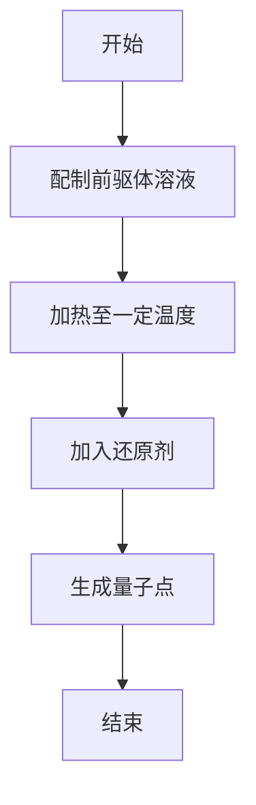
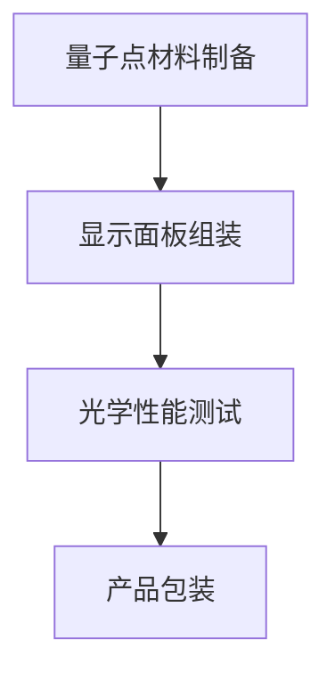
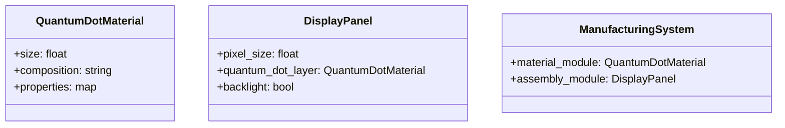

                 


# 如何识别企业的量子点显示器制造技术优势

---

## 关键词：量子点显示器、制造技术、技术优势、材料科学、显示技术

---

## 摘要：  
量子点显示器是一种革命性的显示技术，其核心优势在于高色彩还原度、长寿命和低成本。本文从量子点材料的制备、显示器的制造流程、系统架构设计、项目实战案例等多个方面，详细分析了企业在量子点显示器制造中的技术优势，并通过系统化的技术分析和实际案例，帮助读者识别和优化企业的制造技术。  

---

## 第一部分：量子点显示器制造技术的背景与核心概念

### 第1章：量子点显示器的基本概念与技术优势

#### 1.1 量子点显示器的定义与基本原理  
量子点显示器是一种基于纳米级半导体材料的显示技术。与传统的LCD和OLED相比，量子点显示器通过精确控制量子点材料的尺寸和形状，实现了更高的色彩饱和度和亮度。  

**核心概念：  
- 量子点材料的光谱特性：量子点材料的发光波长可以通过调整其尺寸来控制。  
- 显示器的工作原理：量子点材料在蓝色或紫外光激发下发出特定波长的光，从而实现全色显示。  

#### 1.2 量子点显示器与其他显示技术的对比  

| 技术指标      | LCD               | OLED             | Quantum Dot Display |
|----------------|--------------------|-------------------|---------------------|
| 色彩饱和度    | 较低               | 较高              | 最高                 |
| 响应时间      | 较慢               | 较快              | 中等                 |
| 寿命          | 较短               | 较短              | 较长                 |
| 成本          | 中等               | 较高              | 较低                 |

#### 1.3 量子点材料的特性与应用领域  
量子点材料具有以下特性：  
- **尺寸效应**：量子点的发光波长可以通过调整其直径来精确控制。  
- **光稳定性**：量子点材料在光照下不易退化，具有长寿命。  
- **环境友好**：量子点材料通常基于无毒元素（如Cd、Se、Zn等）。  

---

## 第二部分：量子点显示器制造技术的核心原理

### 第2章：量子点材料的制备与合成  

#### 2.1 量子点材料的制备方法  
- **溶液法合成量子点**：通过化学反应在溶液中生成量子点。  
- **热分解法合成量子点**：在高温下分解金属盐，生成量子点。  

**流程图：量子点材料的制备流程**  



#### 2.2 量子点材料的尺寸控制与性能优化  
- **尺寸控制**：通过调整反应条件（如温度、时间、试剂浓度）来控制量子点的尺寸。  
- **表面修饰**：通过化学修饰改善量子点的表面性能，提高其稳定性和分散性。  

**示例：量子点材料的尺寸对发光性能的影响**  
$$L_{\text{max}} = A \cdot e^{-B \cdot d}$$  
其中，$d$ 是量子点的直径，$A$ 和 $B$ 是常数。

---

## 第三部分：量子点显示器制造技术的系统分析与架构设计

### 第3章：量子点显示器制造系统的架构与流程  

#### 3.1 量子点显示器制造流程的系统分析  
制造流程包括以下步骤：  
1. 量子点材料的制备与表征。  
2. 显示屏的组装与测试。  

**流程图：量子点显示器制造流程**  



#### 3.2 制造系统的模块化设计  
- **前端模块**：量子点材料的合成与表征。  
- **后端模块**：显示面板的组装与测试。  

**类图：量子点显示器制造系统的类图**  



---

## 第四部分：量子点显示器制造技术的项目实战与案例分析

### 第4章：量子点显示器制造项目的实施与管理  

#### 4.1 项目实施的环境与准备  
- **设备准备**：包括量子点合成设备、显示面板组装设备。  
- **人员培训**：确保技术人员熟悉量子点材料的制备和显示器的组装流程。  

#### 4.2 核心制造工艺的实现  
- **量子点材料的合成**：通过溶液法合成CdSe量子点。  
- **显示面板的组装**：将量子点材料集成到显示面板中，测试光学性能。  

**代码示例：量子点材料的合成过程**  

```python
def synthesize_quantum_dots(size):
    # 参数：size 表示量子点的直径（纳米）
    # 返回：量子点材料的光学性能数据
    import numpy as np
    import matplotlib.pyplot as plt

    # 模拟量子点材料的发光强度
    wavelengths = np.arange(400, 700, 10)
    intensities = np.exp(-((wavelengths - 550) ** 2) / (2 * size ** 2))
    plt.plot(wavelengths, intensities)
    plt.xlabel('Wavelength (nm)')
    plt.ylabel('Intensity')
    plt.show()
    return intensities
```

---

## 第五部分：总结与展望  

### 5.1 总结  
本文从量子点显示器的制造技术出发，分析了其核心优势和实现原理。通过系统化的技术分析和实际案例，帮助企业识别和优化其制造技术。  

### 5.2 展望  
未来，随着纳米技术的进步，量子点显示器将朝着更高分辨率、更低成本和更广泛的应用领域发展。  

---

## 作者：AI天才研究院/AI Genius Institute & 禅与计算机程序设计艺术 /Zen And The Art of Computer Programming

