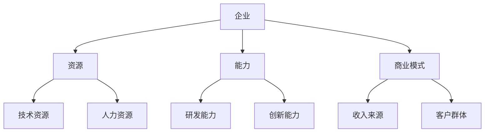

                 


# 如何识别企业的长期竞争优势

> 关键词：企业竞争优势，长期竞争优势，资源分析，能力分析，商业模式分析，竞争优势识别，企业竞争力，商业策略，竞争分析，企业战略，竞争力评估

> 摘要：企业的长期竞争优势是企业在市场中持续发展的核心能力，本文从核心要素、分析框架、识别方法、算法原理、系统分析、项目实战等多个角度，详细分析如何识别企业的长期竞争优势，帮助企业制定有效的竞争策略。

---

## 第1章：企业的长期竞争优势背景

### 1.1 什么是企业的长期竞争优势
企业长期竞争优势是指企业在长期经营中，通过独特的资源、能力和商业模式，能够在市场中持续获得超额收益的能力。这种优势不仅仅依赖于短期的市场波动，而是基于企业的核心竞争力和战略定位。

#### 核心概念：
- **资源**：企业的有形资产和无形资产，如技术、品牌、人力资源等。
- **能力**：企业的核心能力，如研发能力、创新能力、运营能力等。
- **商业模式**：企业如何创造价值、传递价值和获取价值的方式。

### 1.2 为什么企业需要长期竞争优势
在竞争激烈的市场环境中，企业需要通过长期竞争优势来确保自身的生存和发展。长期竞争优势能够帮助企业抵御市场波动，抓住发展机遇，并在竞争中占据领先地位。

#### 关键点：
- **动态竞争环境**：市场需求和技术的变化要求企业不断调整策略。
- **可持续发展**：长期竞争优势是企业实现可持续发展的关键。
- **与短期竞争优势的区别**：短期竞争优势可能因市场变化而迅速消失，而长期竞争优势能够为企业提供持续的竞争能力。

### 1.3 问题解决路径
识别长期竞争优势需要从资源、能力和商业模式三个维度进行综合分析，结合定量和定性方法，构建系统的分析框架。

---

## 第2章：长期竞争优势的核心要素与分析框架

### 2.1 资源分析
资源是企业竞争优势的基础，包括有形资产（如设备、土地）和无形资产（如品牌、技术）。资源的稀缺性、不可模仿性和价值性决定了其对企业竞争优势的贡献。

#### 关键点：
- **资源的分类**：物质资源、人力资源、财务资源、信息资源、技术资源。
- **资源的动态性**：资源的价值会因市场变化而变化，企业需要持续优化资源结构。

#### 分析方法：
- **资源评估矩阵**：通过评分法评估资源的价值和竞争优势。
- **资源-能力匹配分析**：分析资源与能力的匹配程度，确保资源的有效利用。

### 2.2 能力分析
能力是企业将资源转化为竞争优势的关键因素。核心能力包括研发能力、创新能力、运营能力和客户关系管理能力。

#### 关键点：
- **核心能力的识别**：通过企业价值链分析，识别关键能力。
- **能力的动态提升**：通过学习和创新不断提升能力。

#### 分析方法：
- **能力差距分析**：比较企业能力与竞争对手的能力差距。
- **能力发展路径**：制定能力提升的短期和长期计划。

### 2.3 商业模式分析
商业模式是企业创造和传递价值的方式，决定了企业的盈利能力和市场定位。

#### 关键点：
- **商业模式的创新**：通过创新商业模式实现差异化竞争。
- **商业模式的可持续性**：确保商业模式在长期的竞争中依然有效。

#### 分析方法：
- **商业模式画布**：通过画布工具分析商业模式的各个要素。
- **商业模式比较分析**：对比不同商业模式的优缺点，选择最适合企业自身发展的模式。

### 2.4 核心要素对比分析
通过对比分析，明确资源、能力和商业模式对企业竞争优势的不同影响。

#### 对比表格：
| 核心要素 | 资源 | 能力 | 商业模式 |
|----------|------|------|----------|
| 优势     | 物质基础 | 核心竞争力 | 价值传递方式 |
| 动态性   | 易耗性 | 可持续性 | 创新性 |
| 影响范围 | 内部 | 内部与外部 | 整体 |

#### ER实体关系图：
```mermaid
er
  entity 企业 {
    <<持久化实体>>
    String id
    String name
    Double revenue
  }
  entity 资源 {
    <<持久化实体>>
    String id
    String type
    Double value
  }
  entity 能力 {
    <<持久化实体>>
    String id
    String type
    Double level
  }
  entity 商业模式 {
    <<持久化实体>>
    String id
    String type
    Double effectiveness
  }
  relation 企业-资源 {
    企业 -> 资源
    关联关系：拥有
  }
  relation 企业-能力 {
    企业 -> 能力
    关联关系：具备
  }
  relation 企业-商业模式 {
    企业 -> 商业模式
    关联关系：采用
  }
```

---

## 第3章：长期竞争优势的分析框架

### 3.1 分析框架的构建
分析框架基于资源、能力和商业模式三个核心要素，结合定量和定性分析方法，构建一个系统的分析模型。

#### 关键点：
- **系统性**：分析框架需要全面覆盖资源、能力和商业模式。
- **动态性**：框架需要能够适应市场环境的变化。

#### 分析流程：
1. **数据收集**：收集企业的资源、能力和商业模式的相关数据。
2. **数据处理**：对数据进行清洗和整理，确保数据的准确性和完整性。
3. **数据分析**：通过定性和定量分析，识别企业的核心竞争优势。
4. **结果展示**：通过图表和报告展示分析结果。

### 3.2 分析框架的实施步骤

#### 3.2.1 问题场景介绍
假设我们是一家科技公司，需要识别自身的长期竞争优势。我们可以通过分析公司的技术资源、研发能力和创新商业模式来确定竞争优势。

#### 3.2.2 数据收集与处理
- **资源数据**：收集公司的技术专利数量、研发投入等数据。
- **能力数据**：收集员工技能、研发团队效率等数据。
- **商业模式数据**：收集收入来源、客户群体等数据。

#### 3.2.3 数据分析与模型构建
- **资源分析**：通过资源评估矩阵评估资源的价值。
- **能力分析**：通过能力差距分析识别核心能力。
- **商业模式分析**：通过商业模式画布分析商业模式的优缺点。

#### 3.2.4 结果展示与解读
- **资源分析结果**：技术专利数量领先，但研发投入需要增加。
- **能力分析结果**：研发团队效率较高，但创新能力需要提升。
- **商业模式分析结果**：现有商业模式具有一定的竞争优势，但需要进一步创新。

---

## 第4章：长期竞争优势的识别方法与算法原理

### 4.1 竞争优势识别的算法原理
竞争优势识别可以通过数据挖掘和机器学习算法来实现。以下是常见的算法原理：

#### 4.1.1 资源分析算法
- **资源评估矩阵**：通过评分法评估资源的价值。
- **聚类分析**：将资源分为不同类别，识别核心资源。

#### 4.1.2 能力分析算法
- **能力差距分析**：通过对比分析识别核心能力。
- **回归分析**：通过回归模型预测能力对竞争优势的影响。

#### 4.1.3 商业模式分析算法
- **商业模式画布**：通过画布工具分析商业模式的要素。
- **分类算法**：通过分类算法识别商业模式的类型。

### 4.2 数学模型与公式
#### 资源评估矩阵公式：
$$
\text{资源价值} = \sum_{i=1}^{n} (w_i \times v_i)
$$
其中，\( w_i \) 是资源 \( i \) 的权重，\( v_i \) 是资源 \( i \) 的价值。

#### 能力差距分析公式：
$$
\text{能力差距} = \text{竞争对手能力} - \text{自身能力}
$$

---

## 第5章：系统分析与架构设计方案

### 5.1 问题场景介绍
假设我们是一家制造公司，需要识别自身的长期竞争优势。我们可以通过系统分析来确定公司的资源、能力和商业模式。

### 5.2 系统架构设计


### 5.3 系统接口设计
- **输入接口**：接收企业的资源、能力和商业模式数据。
- **输出接口**：输出竞争优势分析报告。

### 5.4 系统交互序列图
```mermaid
sequenceDiagram
    participant 企业
    participant 资源分析模块
    participant 能力分析模块
    participant 商业模式分析模块
    企业 -> 资源分析模块：输入资源数据
    资源分析模块 -> 企业：返回资源分析结果
    企业 -> 能力分析模块：输入能力数据
    能力分析模块 -> 企业：返回能力分析结果
    企业 -> 商业模式分析模块：输入商业模式数据
    商业模式分析模块 -> 企业：返回商业模式分析结果
```

---

## 第6章：项目实战

### 6.1 环境配置
- **工具**：Python、Pandas、Matplotlib、Scikit-learn
- **数据集**：企业资源、能力和商业模式数据

### 6.2 核心实现源代码
```python
import pandas as pd
from sklearn.cluster import KMeans

# 数据收集
data = pd.read_csv('enterprise_data.csv')

# 资源分析
resources = data[['技术专利数量', '研发投入']]
clusters = KMeans(n_clusters=3, random_state=0).fit(resources)
print("资源分析结果：", clusters.labels_)

# 能力分析
abilities = data[['研发团队效率', '创新能力']]
from sklearn.linear_model import LinearRegression
model = LinearRegression().fit(abilities, data['竞争优势'])
print("能力分析结果：", model.coef_)

# 商业模式分析
mode

