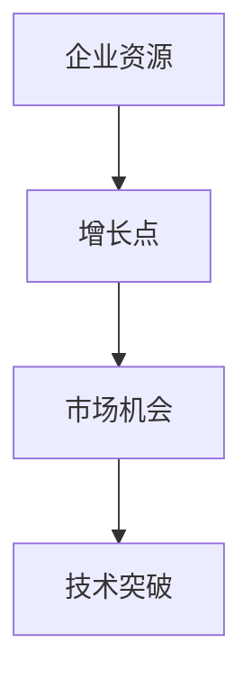
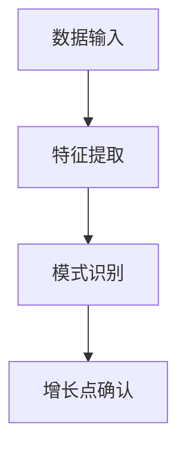
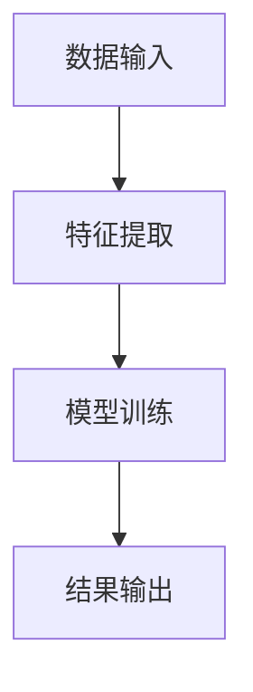
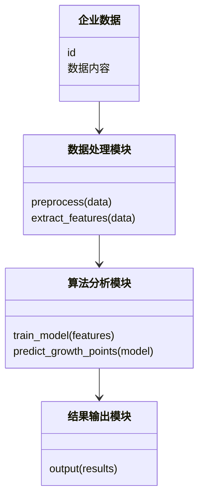

                 


# 如何识别企业的隐藏增长点

## 关键词：企业增长点，数据分析，人工智能算法，系统架构，项目实战

## 摘要：  
本文旨在通过系统化的技术方法，帮助企业识别隐藏的增长点。结合数据分析、人工智能算法和系统架构等技术手段，从问题背景、核心概念、算法原理、系统设计、项目实战等多维度展开，深入探讨如何发现和利用企业潜在的增长机会，为企业制定有效的战略决策提供支持。

---

# 第一部分: 企业隐藏增长点的背景与概述

## 第1章: 企业隐藏增长点的背景与重要性

### 1.1 问题背景

#### 1.1.1 企业绩效与增长点的定义
企业的绩效通常与增长点密切相关。增长点是指那些能够为企业带来额外价值和增长的资源、市场机会或技术突破。然而，许多企业在日常运营中可能忽视了这些隐藏的增长点。

#### 1.1.2 市场变化对企业增长点的影响
市场环境的不断变化（如技术进步、消费者需求变化、政策调整等）为企业带来了新的增长机会。识别这些变化并及时调整战略是企业在竞争中胜出的关键。

#### 1.1.3 资源优化与增长点的关联
企业资源的优化配置可以直接影响增长点的识别。通过数据分析和优化算法，企业可以更高效地利用现有资源，挖掘潜在的增长机会。

### 1.2 问题描述

#### 1.2.1 企业增长点的模糊性
由于企业内部数据的复杂性和外部市场的不确定性，增长点往往不明显，需要通过技术手段进行深入分析。

#### 1.2.2 隐瞒增长点的识别难点
传统方法依赖于经验判断，容易忽视数据中的潜在模式。此外，数据的不完整性和噪声也可能影响识别结果。

#### 1.2.3 传统增长点识别方法的局限性
传统方法通常基于经验或简单数据分析，难以捕捉复杂市场环境中的潜在机会。

### 1.3 问题解决

#### 1.3.1 数据驱动的增长点识别方法
通过大数据分析和机器学习算法，可以从海量数据中提取潜在的增长点。

#### 1.3.2 现代技术在增长点识别中的应用
人工智能技术（如深度学习、自然语言处理）可以辅助识别隐藏的增长机会。

#### 1.3.3 隐藏增长点的挖掘策略
结合数据挖掘、模式识别和知识图谱等技术，构建系统化的增长点识别框架。

### 1.4 问题的边界与外延

#### 1.4.1 隐藏增长点的边界条件
增长点识别需要考虑企业的资源、市场环境和技术能力等因素。

#### 1.4.2 相关概念的对比与区分
与传统增长点相比，隐藏增长点具有更强的隐蔽性和潜在性，需要通过技术手段进行挖掘。

#### 1.4.3 隐藏增长点的系统性特征
隐藏增长点通常存在于企业内部数据、市场动态和组织结构中，需要系统化的技术手段进行识别。

### 1.5 本章小结
本章从背景、问题描述和解决方法三个方面，详细阐述了企业隐藏增长点的重要性及识别的必要性。通过技术手段，企业可以更有效地识别这些潜在的增长机会。

---

# 第二部分: 隐藏增长点的核心概念与联系

## 第2章: 隐藏增长点的核心概念

### 2.1 核心概念的定义与属性

#### 2.1.1 隐藏增长点的定义
隐藏增长点是指企业内部或外部潜在的、尚未被充分挖掘的增长机会。

#### 2.1.2 核心要素的特征对比
| 特征 | 隐藏增长点 | 传统增长点 |
|------|------------|------------|
| 模糊性 | 高         | 低         |
| 数据依赖性 | 高         | 中         |
| 技术门槛 | 高         | 低         |

#### 2.1.3 核心概念的结构化模型
通过构建层次化的概念模型，可以更清晰地理解隐藏增长点的构成。

### 2.2 核心概念的联系与关系

#### 2.2.1 隐藏增长点的实体关系图


#### 2.2.2 核心概念的流程图分析


#### 2.2.3 核心概念的系统架构图


### 2.3 本章小结
本章通过定义和对比，详细分析了隐藏增长点的核心概念，并通过流程图和架构图展示了其内在联系。

---

# 第三部分: 隐藏增长点的算法原理与数学模型

## 第3章: 隐藏增长点的算法原理

### 3.1 数据预处理与特征提取

#### 3.1.1 数据清洗与标准化
数据清洗是确保数据质量的重要步骤，包括去除噪声数据和填充缺失值。

#### 3.1.2 特征选择与降维
通过特征选择算法（如PCA）减少数据维度，提高计算效率。

#### 3.1.3 数据增强与扩展
通过数据增强技术，增加数据多样性，提升模型的泛化能力。

### 3.2 算法实现

#### 3.2.1 算法流程图


#### 3.2.2 算法实现代码
```python
def identify_hidden_growth_points(data):
    # 数据预处理
    processed_data = preprocess(data)
    # 特征提取
    features = extract_features(processed_data)
    # 模型训练
    model = train_model(features)
    # 结果输出
    return predict_growth_points(model, features)
```

### 3.3 数学模型与公式

#### 3.3.1 线性回归模型
$$ y = \beta_0 + \beta_1x_1 + \beta_2x_2 + \cdots + \beta_nx_n $$

#### 3.3.2 支持向量机模型
$$ \text{最大化} \  \min_{w,b} \ \frac{1}{2}||w||^2 $$
$$ \text{约束} \ y_i(w \cdot x_i + b) \geq 1 $$

### 3.4 本章小结
本章通过数据预处理、特征提取和算法实现，详细介绍了隐藏增长点识别的数学模型和算法原理。

---

# 第四部分: 系统分析与架构设计

## 第4章: 系统分析与架构设计

### 4.1 问题场景介绍

#### 4.1.1 项目背景
企业希望通过技术手段识别隐藏的增长点，优化资源配置。

#### 4.1.2 项目目标
构建一个智能化的增长点识别系统，支持企业决策。

### 4.2 系统功能设计

#### 4.2.1 领域模型设计


#### 4.2.2 系统架构设计


### 4.3 系统接口设计

#### 4.3.1 接口描述
- 数据输入接口：接收企业数据
- 数据处理接口：进行数据清洗和特征提取
- 模型训练接口：训练识别模型
- 结果输出接口：返回增长点预测结果

#### 4.3.2 接口交互图


### 4.4 本章小结
本章通过系统分析和架构设计，展示了如何构建一个智能化的增长点识别系统。

---

# 第五部分: 项目实战与案例分析

## 第5章: 项目实战

### 5.1 环境安装

#### 5.1.1 安装依赖
```bash
pip install numpy pandas scikit-learn
```

### 5.2 系统核心实现源代码

#### 5.2.1 数据预处理
```python
import pandas as pd
import numpy as np

def preprocess(data):
    # 删除缺失值
    data = data.dropna()
    # 标准化处理
    from sklearn.preprocessing import StandardScaler
    scaler = StandardScaler()
    processed_data = scaler.fit_transform(data)
    return processed_data
```

#### 5.2.2 模型训练
```python
from sklearn.svm import SVC

def train_model(features):
    model = SVC()
    model.fit(features, labels)
    return model
```

### 5.3 代码应用解读与分析

#### 5.3.1 数据预处理解读
预处理步骤包括数据清洗和标准化，确保数据质量。

#### 5.3.2 模型训练解读
使用支持向量机模型进行训练，提高分类准确率。

### 5.4 案例分析与详细讲解

#### 5.4.1 案例背景
某企业希望通过数据分析识别隐藏的增长点。

#### 5.4.2 数据分析
通过对销售数据和客户反馈进行分析，发现潜在的增长机会。

### 5.5 本章小结
本章通过项目实战，详细展示了如何利用技术手段识别隐藏的增长点。

---

# 第六部分: 总结与展望

## 第6章: 总结与展望

### 6.1 最佳实践 tips
- 数据预处理是关键
- 选择合适的算法模型
- 系统架构设计要合理

### 6.2 小结
通过技术手段，企业可以更高效地识别隐藏的增长点，提升竞争力。

### 6.3 注意事项
- 数据质量和完整性
- 模型的泛化能力
- 系统的可扩展性

### 6.4 拓展阅读
- 《数据挖掘导论》
- 《机器学习实战》
- 《系统架构设计》

### 6.5 本章小结
总结了全文的核心内容，并展望了未来的发展方向。

---

# 作者：AI天才研究院/AI Genius Institute & 禅与计算机程序设计艺术 /Zen And The Art of Computer Programming

