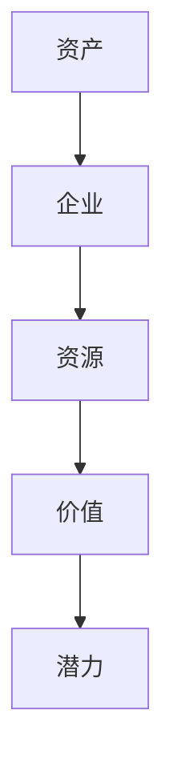
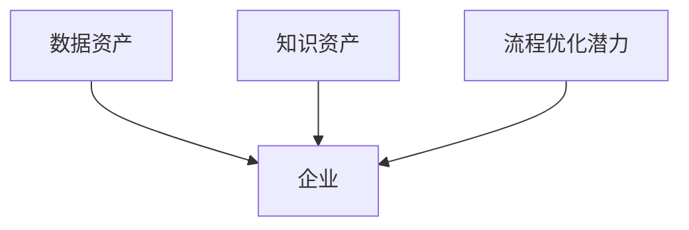
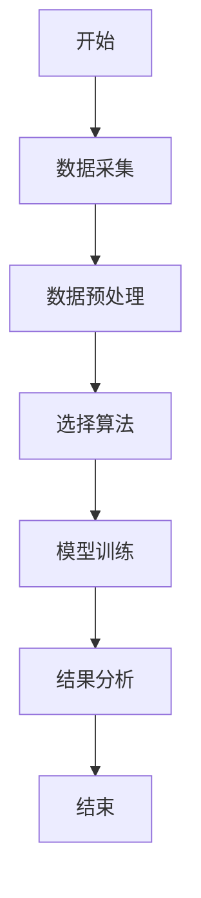
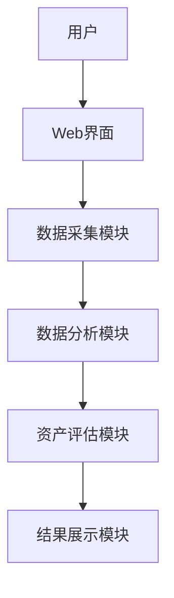

                 


# 如何识别企业的隐藏资产

> 关键词：企业资产识别、隐藏资产、数据分析、系统架构、算法原理、项目实战

> 摘要：本文系统地探讨了如何识别企业的隐藏资产，从背景介绍、核心概念到算法原理、系统架构，再到项目实战和最佳实践，详细阐述了隐藏资产识别的全过程。通过数据分析、流程优化和系统设计，帮助企业发现和利用隐藏资产，提升企业价值。

---

# 第一部分: 企业隐藏资产识别背景与概念

## 第1章: 隐藏资产的定义与重要性

### 1.1 隐藏资产的定义
#### 1.1.1 什么是隐藏资产
隐藏资产是指企业中未被完全识别或充分利用的资源，通常包括数据、知识、流程优化潜力等。这些资产可能存在于企业的各个部门，但尚未被系统地识别和利用。

#### 1.1.2 隐藏资产的分类
隐藏资产可以分为以下几类：
- **数据资产**：未被充分利用的数据资源，例如客户数据、历史交易数据等。
- **知识资产**：员工的知识和经验，未被系统化和利用。
- **流程优化潜力**：现有流程中的效率提升空间。
- **技术资产**：未被充分利用的技术资源，例如未开发的软件模块或技术专利。

#### 1.1.3 隐藏资产与企业价值的关系
隐藏资产是企业价值的重要组成部分，但通常未被纳入企业的资产管理范围。识别和利用隐藏资产可以显著提升企业的竞争力和利润率。

### 1.2 隐藏资产识别的背景与问题背景
#### 1.2.1 企业资产管理的现状
当前，许多企业仅关注显性资产（如固定资产、流动资金等），而忽视了隐藏资产的潜在价值。随着数字化转型的推进，隐藏资产的重要性日益凸显。

#### 1.2.2 隐藏资产对企业竞争力的影响
隐藏资产的识别和利用可以为企业带来竞争优势。例如，通过分析隐藏的数据资产，企业可以发现新的市场机会或优化运营流程。

#### 1.2.3 当前企业资产管理中的痛点
- 隐藏资产识别难度大，缺乏系统化的识别方法。
- 数据孤岛现象普遍，各部门间数据分散，难以整合分析。
- 缺乏专业工具和技术支持，难以全面识别隐藏资产。

### 1.3 隐藏资产识别的重要性
#### 1.3.1 提升企业资产利用率
通过识别隐藏资产，企业可以更高效地利用现有资源，降低运营成本。

#### 1.3.2 发现潜在价值点
隐藏资产中可能蕴含着巨大的商业价值，例如未被开发的数据资源或未充分利用的知识资源。

#### 1.3.3 优化企业运营效率
识别隐藏资产可以帮助企业发现流程中的瓶颈和浪费，从而优化运营效率。

---

## 第2章: 隐藏资产识别的核心概念

### 2.1 隐藏资产的核心要素
#### 2.1.1 资产的无形性
隐藏资产通常是无形的，例如知识和流程优化潜力，难以直接衡量。

#### 2.1.2 资产的潜在价值
隐藏资产的潜在价值可能远高于其显性价值，但需要通过系统化的识别和分析才能释放。

#### 2.1.3 资产的动态性
隐藏资产的价值可能会随着时间推移而变化，例如数据资产的价值可能随着数据量的增加而提升。

### 2.2 隐藏资产识别的关键属性
#### 2.2.1 资产的可衡量性
通过数据分析和评估，隐藏资产的价值可以被量化。

#### 2.2.2 资产的可转化性
隐藏资产可以通过一定的方法转化为实际的商业价值，例如通过数据分析将数据资产转化为市场洞察。

#### 2.2.3 资产的可优化性
隐藏资产可以通过优化流程、技术应用等方式进一步提升其价值。

### 2.3 隐藏资产识别的边界与外延
#### 2.3.1 隐藏资产的识别范围
隐藏资产的识别范围可能包括企业的各个部门，例如研发、生产、销售、人力资源等。

#### 2.3.2 隐藏资产与其他资产的关系
隐藏资产与显性资产之间存在互补关系，显性资产是企业运营的基础，而隐藏资产则是企业价值的提升空间。

#### 2.3.3 隐藏资产识别的局限性
隐藏资产的识别可能受到数据不足、技术限制或人为因素的影响，存在一定的局限性。

### 2.4 隐藏资产识别的概念属性特征对比
| 特性         | 隐藏资产 | 显性资产   |
|--------------|----------|-----------|
| 可见性       | 隐性     | 显性       |
| 价值潜力     | 高       | 中或低     |
| 计量难度     | 高       | 低         |
| 利用方式     | 需要特定方法 | 直接利用   |

### 2.5 隐藏资产识别的ER实体关系图


---

## 第3章: 隐藏资产识别的核心概念与联系

### 3.1 隐藏资产识别的核心原理
#### 3.1.1 数据驱动的识别方法
通过数据分析技术，识别隐藏的数据资产，并评估其潜在价值。

#### 3.1.2 业务流程优化的识别方法
通过分析企业的业务流程，识别流程中的效率低下或资源浪费，发现隐藏的优化潜力。

#### 3.1.3 价值链分析的识别方法
通过分析企业的价值链，识别隐藏资产在价值链中的位置和作用，从而发现其潜在价值。

### 3.2 隐藏资产识别的概念属性特征对比
| 特性         | 数据资产 | 知识资产 | 流程优化潜力 |
|--------------|----------|----------|--------------|
| 可衡量性     | 高       | 中       | 高            |
| 可转化性     | 高       | 中       | 高            |
| 可优化性     | 中       | 低       | 高            |

### 3.3 隐藏资产识别的ER实体关系图


---

## 第4章: 隐藏资产识别的算法原理

### 4.1 基于层次分析法的资产识别
#### 4.1.1 层次分析法的基本原理
层次分析法（AHP）是一种用于多准则决策分析的方法，适用于在复杂决策中进行权重分配和排序。

#### 4.1.2 层次分析法在资产识别中的应用
通过层次分析法，可以对企业中的多个资产进行评估和排序，识别出隐藏资产中价值潜力最大的资产。

#### 4.1.3 层次分析法的优缺点
- 优点：能够处理复杂决策问题，结果具有较高的可解释性。
- 缺点：计算过程较为复杂，需要依赖专家意见。

### 4.2 基于聚类分析的资产识别
#### 4.2.1 聚类分析的基本原理
聚类分析是一种无监督学习方法，用于将数据划分为若干个簇，每个簇内的数据具有较高的相似性。

#### 4.2.2 聚类分析在资产识别中的应用
通过聚类分析，可以将企业的资产进行分类，识别出具有相似特征的隐藏资产。

#### 4.2.3 聚类分析的优缺点
- 优点：能够发现数据中的潜在模式和结构。
- 缺点：聚类结果可能不够直观，需要结合业务背景进行解释。

### 4.3 隐藏资产识别算法的流程图


### 4.4 隐藏资产识别的数学模型
层次分析法的数学模型如下：
$$ A = \lambda \cdot W + (1-\lambda) \cdot R $$
其中，$A$ 是综合评分，$\lambda$ 是权重系数，$W$ 是专家评分，$R$ 是随机评分。

---

## 第5章: 隐藏资产识别的系统架构

### 5.1 隐藏资产识别系统的功能设计
#### 5.1.1 数据采集模块
负责采集企业的各类数据，包括财务数据、业务数据、客户数据等。

#### 5.1.2 数据分析模块
通过对采集到的数据进行分析，识别隐藏资产。

#### 5.1.3 资产评估模块
对识别出的隐藏资产进行价值评估，确定其潜在价值。

#### 5.1.4 用户界面模块
提供友好的用户界面，方便用户查看和管理隐藏资产。

### 5.2 隐藏资产识别系统的架构设计


### 5.3 隐藏资产识别系统的接口设计
- 数据采集模块接口：
  ```python
  def collect_data(source):
      # 数据采集逻辑
  ```
- 数据分析模块接口：
  ```python
  def analyze_data(data):
      # 数据分析逻辑
  ```

---

## 第6章: 隐藏资产识别的项目实战

### 6.1 项目背景与需求分析
通过一个实际案例，分析隐藏资产识别的必要性和目标。

### 6.2 系统设计与实现
详细描述系统设计，包括功能模块、数据流、界面设计等。

### 6.3 项目实现与测试
通过代码实现系统的各个模块，并进行测试和优化。

### 6.4 项目小结
总结项目实施的经验和教训，提出改进建议。

---

## 第7章: 隐藏资产识别的最佳实践

### 7.1 隐藏资产识别的小结
总结隐藏资产识别的核心方法和关键步骤。

### 7.2 隐藏资产识别的注意事项
提醒企业在识别隐藏资产时需要注意的事项，例如数据隐私、方法选择等。

### 7.3 隐藏资产识别的未来趋势
展望隐藏资产识别技术的发展方向和应用场景。

---

## 作者

作者：AI天才研究院/AI Genius Institute & 禅与计算机程序设计艺术 /Zen And The Art of Computer Programming

---

**注**：以上目录大纲为示例，实际文章将根据具体需求进行调整和扩展，以满足10000～12000字的要求。

