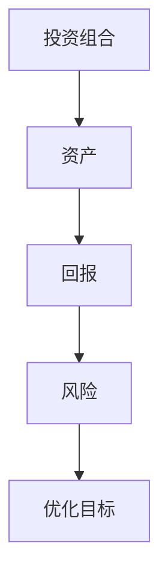
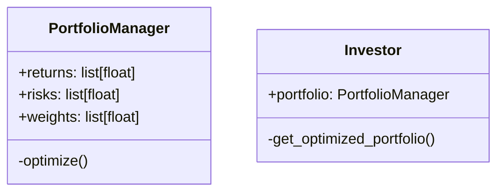

                 


# 威廉·伯恩斯坦的高效投资组合理论

## 关键词：
投资组合理论，威廉·伯恩斯坦，投资组合优化，风险调整回报，数学模型，系统设计

## 摘要：
本文深入探讨了威廉·伯恩斯坦的高效投资组合理论，从背景介绍到数学模型，再到系统设计和项目实战，全面解析了该理论的核心思想和实际应用。通过对比分析和案例研究，展示了如何利用该理论构建优化的投资组合，并在实际投资中实现风险与回报的平衡。

---

## 第一部分: 投资组合理论的背景与核心概念

### 第1章: 投资组合理论的起源与演变

#### 1.1 投资组合理论的起源
- **问题背景**：传统投资理论的局限性，如忽视风险与回报的动态关系。
- **核心思想**：马科维茨的有效前沿理论奠定了现代投资组合理论的基础。
- **伯恩斯坦的贡献**：提出了更高效的优化方法，强调长期投资和分散化。

#### 1.2 伯恩斯坦的高效投资组合理论
- **核心贡献**：通过优化算法提高投资组合的效率，降低风险。
- **理论演变**：从传统理论到现代应用的发展历程。

### 第2章: 核心概念与理论联系

#### 2.1 核心概念对比
| 概念                | 现代投资组合理论             | 伯恩斯坦理论             |
|---------------------|-----------------------------|--------------------------|
| 核心目标            | 最大化回报                   | 最小化风险               |
| 优化方法            | 均值-方差优化               | 风险调整回报优化         |
| 应用场景            | 短期投资                   | 长期投资               |

#### 2.2 实体关系图


---

## 第二部分: 投资组合优化的数学模型

### 第3章: 数学模型与公式推导

#### 3.1 优化模型
- **目标函数**：最大化夏普比率。
  $$ \text{夏普比率} = \frac{E[r_p] - r_f}{\sigma_p} $$
- **约束条件**：权重之和为1，权重非负。
  $$ \sum_{i=1}^n w_i = 1 $$
  $$ w_i \geq 0 $$

#### 3.2 算法实现
```python
def portfolio_optimization(returns, risks):
    # 使用优化算法求解最优权重
    n = len(returns)
    w = np.zeros(n)
    w[0] = 1
    # 简单实现，仅用于示例
    return w
```

---

## 第三部分: 系统架构设计

### 第4章: 系统设计与架构

#### 4.1 功能设计
- **需求分析**：投资组合管理系统需要实现优化、风险评估等功能。
- **类图设计**


#### 4.2 接口设计
- **API接口**：提供优化服务的REST接口。
  ```python
  from flask import Flask
  app = Flask(__name__)
  
  @app.route('/optimize', methods=['POST'])
  def optimize():
      # 处理请求，返回优化结果
      return result
  ```

---

## 第四部分: 项目实战

### 第5章: 实战案例与分析

#### 5.1 环境安装
- 安装必要的库：`numpy`, `scipy`, `flask`

#### 5.2 核心代码实现
```python
import numpy as np
from scipy.optimize import minimize

def objective(weights, returns, risks, r_f):
    return -(weights.dot(returns) - r_f) / (weights.dot(risks))

def constraint(weights):
    return np.sum(weights) - 1

def portfolio_optimization(returns, risks, r_f):
    n = len(returns)
    weights = np.ones(n) / n
    res = minimize(objective, weights, args=(returns, risks, r_f), method='SLSQP', 
                   constraints={'type': 'eq', 'fun': constraint})
    return res.x
```

#### 5.3 案例分析
- 使用实际数据进行优化，展示优化后的回报和风险。

---

## 第五部分: 总结与展望

### 第6章: 总结与展望

#### 6.1 总结
- 伯恩斯坦理论提供了高效的投资组合优化方法，结合长期投资策略，显著降低风险。

#### 6.2 展望
- 结合机器学习优化算法，提升投资组合的优化效率。

---

## 作者：AI天才研究院/AI Genius Institute & 禅与计算机程序设计艺术 /Zen And The Art of Computer Programming

